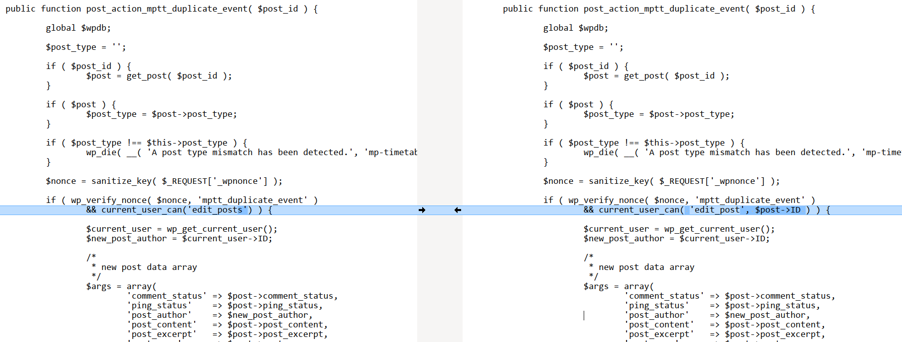

<!--more-->

## CVE & Basic Info
Plugin WordPress **Timetable and Event Schedule by MotoPress** (trước phiên bản **2.4.16**) không kiểm tra liệu người dùng có quyền truy cập vào **event cụ thể** khi thực hiện thao tác duplicate, dẫn đến việc **lộ thông tin event một cách tùy ý** đối với người dùng có vai trò thấp như **Contributor**.

* **CVE ID**: [CVE-2025-12954](https://www.cve.org/CVERecord?id=CVE-2025-12954)
* **Vulnerability Type**: Insecure Direct Object References (IDOR)
* **Affected Versions**: <= 2.4.15
* **Patched Versions**: 2.4.16
* **CVSS severity**: Low (4.3)
* **Required Privilege**: Contributor
* **Product**: [WordPress Timetable and Event Schedule Plugin](https://wordpress.org/plugins/mp-timetable/)

## Requirements
* **Local WordPress & Debugging**
    * [Virtual Machine](https://w41bu1.github.io/posts/2025-08-21-wordpress-local-and-debugging/)
    * [Docker](https://w41bu1.github.io/posts/2025-10-22-wordpress-local-and-debugging-docker/)
* **Plugin Version** - **Timetable and Event Schedule**:  
    * `2.4.15` – **vulnerable**  
    * `2.4.16` – **patched**
* **Diff Tool (diff)** → [**Meld**](https://meldmerge.org/) hoặc bất kỳ công cụ diff nào.

## Analysis 
Plugin đã đăng ký action hook:

```php {title="class-hooks.php v2.4.15" data-open=true hl_lines=[]}
add_action( 'post_action_mptt_duplicate_event', array( $this->get( 'events' ), 'post_action_mptt_duplicate_event' ) );
```

Trong **WordPress**, các hook có tiền tố `post_action_` là hook đặc biệt dùng để xử lý những hành động được truyền qua tham số `action` khi truy cập file `post.php`.
Cụ thể, khi người dùng truy cập vào URL dạng:

```
/wp-admin/post.php?post=post_id&action=mptt_duplicate_event
```

WordPress sẽ gọi đến callback `post_action_mptt_duplicate_event` để xử lý logic **duplicate event**.

Bên cạnh việc đăng ký action hook, plugin còn **chủ động tạo URL kích hoạt action** này thông qua việc thêm một liên kết “Duplicate” vào danh sách hành động của mỗi bài viết trong trang quản trị.

```php {title="class-events.php v2.4.15" data-open=true hl_lines=[]}
public function post_row_actions( $actions, $post ) {
    if ( $post->post_type == $this->post_type && current_user_can('edit_posts') ) {

        $action_url = add_query_arg(
            array(
                'post' => $post->ID,
                'action' => 'mptt_duplicate_event',
                '_wpnonce' => wp_create_nonce( 'mptt_duplicate_event' )
            ),
            admin_url( 'post.php' )
        );

        $actions['duplicate'] = '<a href="' . $action_url . '" aria-label="' .
            __('Duplicate', 'mp-timetable') . '" rel="permalink">' . __('Duplicate', 'mp-timetable') . '</a>';
    }

    return $actions;
}
```

Hàm này dùng hook `post_row_actions` để **thêm link Duplicate** vào danh sách action của mỗi bài viết trong admin.

Link chỉ hiển thị khi bài viết đúng `post_type` và người dùng có quyền `edit_posts` (Contributor+).
URL được tạo trỏ đến `post.php` kèm `post` (ID bài viết), `action` (`mptt_duplicate_event`) và `_wpnonce`.

Khi người dùng click **Duplicate**, WordPress sẽ kích hoạt hook `post_action_mptt_duplicate_event` để xử lý việc nhân bản bài viết.


Callback `post_action_mptt_duplicate_event`: 

```php {title="class-events.php v2.4.15" data-open=true hl_lines=[20]}
public function post_action_mptt_duplicate_event( $post_id ) {
    global $wpdb;

    $post_type = '';

    if ( $post_id ) {
        $post = get_post( $post_id );
    }

    if ( $post ) {
        $post_type = $post->post_type;
    }

    if ( $post_type !== $this->post_type ) {
        wp_die( __( 'A post type mismatch has been detected.', 'mp-timetable' ), __( 'Sorry, you are not allowed to edit this item.', 'mp-timetable' ), 400 );
    }

    $nonce = sanitize_key( $_REQUEST['_wpnonce'] );

    if ( wp_verify_nonce( $nonce, 'mptt_duplicate_event' ) && current_user_can('edit_posts') ) {

        $current_user = wp_get_current_user();
        $new_post_author = $current_user->ID;

        /*
            * new post data array
            */
        $args = array(
            'comment_status' => $post->comment_status,
            'ping_status'    => $post->ping_status,
            'post_author'    => $new_post_author,
            'post_content'   => $post->post_content,
            'post_excerpt'   => $post->post_excerpt,
            'post_name'      => $post->post_name,
            'post_parent'    => $post->post_parent,
            'post_password'  => $post->post_password,
            'post_status'    => 'draft',
            // translators: New post title of the duplicated post
            'post_title'     => sprintf( __('%s - Copy', 'mp-timetable'), $post->post_title ),
            'post_type'      => $post->post_type,
            'to_ping'        => $post->to_ping,
            'menu_order'     => $post->menu_order
        );

        /*
            * insert the post by wp_insert_post() function
            */
        $new_post_id = wp_insert_post( $args );

        if( is_wp_error($new_post_id) ) {
            wp_die( $post_id->get_error_message() );
        }

        /*
            * get all current post terms and set them to the new post draft
            */
        $taxonomies = get_object_taxonomies($post->post_type);
        foreach ($taxonomies as $taxonomy) {
            $post_terms = wp_get_object_terms($post_id, $taxonomy, array('fields' => 'slugs'));
            wp_set_object_terms($new_post_id, $post_terms, $taxonomy, false);
        }

        /*
            * duplicate all post meta
            */
        $post_meta_keys = \get_post_custom_keys( $post_id );

        if ( ! empty( $post_meta_keys ) ) {

            $meta_excludelist = [
                '_edit_lock',
                '_edit_last',
                '_wp_old_slug'
            ];

            $meta_keys = \array_diff( $post_meta_keys, $meta_excludelist );

            foreach ( $meta_keys as $meta_key ) {
                $meta_values = \get_post_custom_values( $meta_key, $post_id );

                // Clear existing meta data
                \delete_post_meta( $new_post_id, $meta_key );

                foreach ( $meta_values as $meta_value ) {
                    $meta_value = \maybe_unserialize( $meta_value );
                    \add_post_meta( $new_post_id, $meta_key, addslashes( $meta_value ) );
                }
            }

        }

        /*
            * duplicate timeslots in custom BD
            */
        $timeslots = $this->wpdb->get_results( 
            $this->wpdb->prepare("SELECT * FROM {$this->table_name} WHERE event_id = %d", $post_id ), 
        OBJECT );

        if ( !empty($timeslots) ) {

            foreach ( $timeslots as $timeslot ) {
                $wpdb->insert(
                    $this->table_name,
                    array(
                        'column_id'   => $timeslot->column_id,
                        'event_id'    => $new_post_id,
                        'event_start' => date( 'H:i', strtotime( $timeslot->event_start ) ),
                        'event_end'   => date( 'H:i', strtotime( $timeslot->event_end ) ),
                        'user_id'     => $timeslot->user_id,
                        'description' => $timeslot->description
                    )
                );
            }
        }

        /*
            * redirect to the edit post screen for the new draft
            */
        wp_safe_redirect( get_edit_post_link( $new_post_id, '' ) );
        exit();

    } else {
        wp_die( __( 'Sorry, you are not allowed to edit this item.' ) );
    }
}
```

Hàm này thực hiện duplicate của post có post id là `$post_id`, tuy nhiên:

```php
if ( wp_verify_nonce( $nonce, 'mptt_duplicate_event' ) && current_user_can('edit_posts') ) {
```

Đây là nguyên nhân chính dẫn tới IDOR (Insecure Direct Object Reference).

* `edit_posts` là quyền **chung**, không gắn với **bài viết cụ thể**
* Contributor trở lên đều có quyền này
* Không có kiểm tra:

  * bài viết có thuộc user hiện tại không
  * user có quyền chỉnh sửa **post_id cụ thể** hay không

```php
$post = get_post( $post_id );
```

Bài viết được lấy trực tiếp từ `$post_id` truyền qua URL mà **không ràng buộc quyền sở hữu**.

```php
post.php?action=mptt_duplicate_event&post=123
```

Chỉ cần đoán hoặc thay đổi `post` ID trong URL, người dùng có `edit_posts` vẫn có thể:

* duplicate bài viết của người khác
* duplicate bài đã publish

Vì WordPress **không tự kiểm tra quyền ở hook `post_action_*`**, toàn bộ việc kiểm soát truy cập phụ thuộc vào đoạn `current_user_can()` trong plugin.

Thay vì sử dụng `edit_posts`, bản vá đã chuyển sang kiểm tra quyền trên từng đối tượng cụ thể bằng meta capability:

```php
current_user_can( 'edit_post', $post_id )
```

Cách kiểm tra này buộc WordPress phải xác minh:
* Người dùng có quyền chỉnh sửa bài viết được tham chiếu bởi `$post_id` hay không
* Bài viết có thuộc về người dùng hiện tại không
* Trạng thái bài viết (draft, pending, published, private)

Nhờ đó, người dùng không còn có thể tự ý thay đổi post ID trong URL để duplicate bài viết của người khác, và lỗ hổng **IDOR** được khắc phục.



## Flow

flowchart TD

A["Authenticated user (Contributor+)"]
--> B["Click Duplicate link or craft URL manually"]
B --> C["Request: /wp-admin/post.php?action=mptt_duplicate_event&post={target_post_id}"]
C --> D["WordPress loads post.php"]
D --> E["do_action('post_action_mptt_duplicate_event', post_id)"]
E --> F["post_action_mptt_duplicate_event(post_id)"]
F --> G["get_post(post_id) without ownership check"]
G --> H["Check nonce + current_user_can('edit_posts')"]
H --> I["Permission granted (generic capability)"]
I --> J["Duplicate target post (content, meta, taxonomy, custom table)"]
J --> K["Create new draft owned by attacker"]
K --> L["Redirect to edit screen of duplicated post"]



## Proof of Concept (PoC)
1. Login bằng Contributor account
2. Truy cập `Timetable` > `Events` và click `Duplicate` của event bất kỳ


## Conclusion
Lỗ hổng xuất phát từ việc plugin chỉ kiểm tra quyền tổng quát `edit_posts` khi duplicate event, thay vì kiểm tra quyền trên **bài viết cụ thể**. Do hook `post_action_*` không được WordPress tự động bảo vệ, người dùng có quyền thấp (Contributor) có thể thay đổi `post` ID trong URL để duplicate event mà họ không sở hữu, dẫn tới IDOR. Bản vá khắc phục bằng cách sử dụng meta capability `edit_post`, buộc WordPress xác minh quyền trên từng post.

## Key Takeaways

* `edit_posts` không phù hợp để bảo vệ thao tác trên post cụ thể
* Nonce không thay thế cho kiểm tra quyền
* ID lấy từ request luôn là user-controlled
* Luôn dùng `current_user_can( 'edit_post', $post_id )` khi thao tác trên post
* Hook `post_action_*` yêu cầu plugin tự kiểm soát authorization

## References
[IDOR](https://book.hacktricks.wiki/en/pentesting-web/idor.html)

[WordPress Timetable and Event Schedule Plugin <= 2.4.15 is vulnerable to Insecure Direct Object References (IDOR)](https://patchstack.com/database/wordpress/plugin/mp-timetable/vulnerability/wordpress-timetable-and-event-schedule-plugin-2-4-16-contributor-event-disclosure-via-idor-vulnerability)  