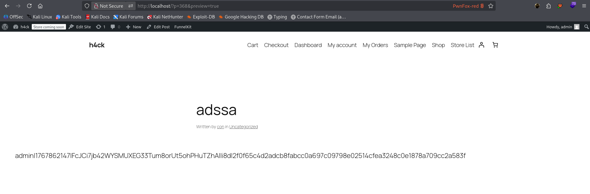
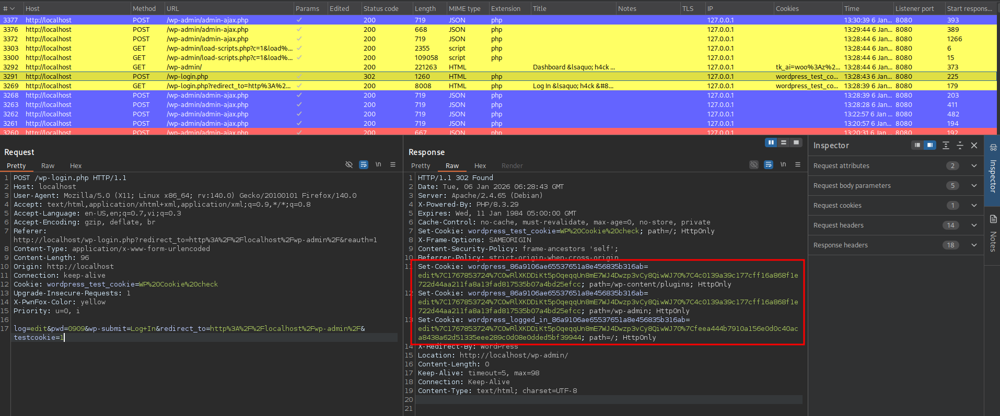
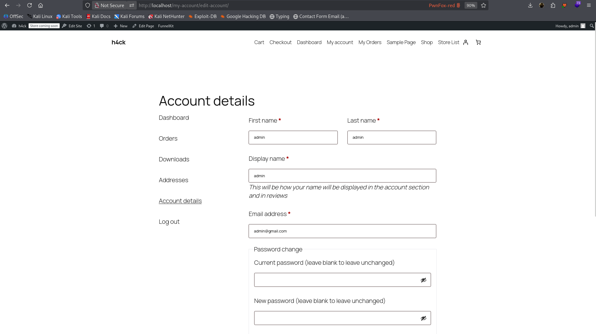

<!--more-->

## CVE & Basic Info
Nhiều plugin của **FunnelKit** trong các phiên bản khác nhau tồn tại lỗ hổng **tiết lộ thông tin nhạy cảm**, có thể dẫn đến **leo thang đặc quyền**, thông qua thư viện **WooFunnels**.
Lỗ hổng này cho phép **người dùng đã đăng nhập với quyền Contributor (Cộng tác viên) trở lên** có thể truy cập và khai thác một chức năng trong thư viện WooFunnels để **lấy các thông tin nhạy cảm**, bao gồm **cookie xác thực** của người dùng khác.

* **CVE ID**: [CVE-2025-7654](https://www.cve.org/CVERecord?id=CVE-2025-7654)
* **Vulnerability Type**: Privilege Escalation
* **Affected Versions**: <= 3.11.0.2
* **Patched Versions**: 3.11.1
* **CVSS severity**: Medium (8.8)
* **Required Privilege**: Contributor
* **Product**: [WordPress Funnel Builder by FunnelKit Plugin](https://wordpress.org/plugins/ultimate-post/)

## Requirements
* **Local WordPress & Debugging**
    * [Virtual Machine](https://w41bu1.github.io/posts/2025-08-21-wordpress-local-and-debugging/)
    * [Docker](https://w41bu1.github.io/posts/2025-10-22-wordpress-local-and-debugging-docker/)
* **Plugin Version** - **Funnel Builder by FunnelKit**:  
    * `3.11.0.2` – **vulnerable**  
    * `3.12.0` – **patched**
* **WooCommerce Plugin** → [**WooCommerce**](https://wordpress.org/plugins/woocommerce/)
* **Diff Tool (diff)** → [**Meld**](https://meldmerge.org/) hoặc bất kỳ công cụ diff nào.

> [!NOTE]
> * Mặc dù CVE được công bố cho rằng lỗ hổng đã được vá trong phiên bản `3.11.1`, nhưng trên thực tế bản vá chỉ thực sự được áp dụng đầy đủ kể từ phiên bản `3.12.0`.
* Plugin **yêu cầu WooCommerce để hoạt động**, do được **tích hợp và phụ thuộc trực tiếp vào WooCommerce**; chỉ có thể được kích hoạt khi **WooCommerce** đã được cài đặt và kích hoạt.

## Analysis 
Plugin đăng ký các shortcode như sau:

```php {title="class-bwf-data-tags.php v3.11.0.2" hl_lines=[2,8] data-open=true}
public $shortcodes = array(
    'get_cookie',
    'get_url_parameter',
);

public function __construct() {
    foreach ( $this->shortcodes as $code ) {
        add_shortcode( 'wf_' . $code, array( $this, $code ) );
    }
}
```

Với cấu hình này, plugin tạo ra hai shortcode tương ứng với hai hàm callback để xử lý:
* Shortcode `wf_get_cookie` → callback `get_cookie`
* Shortcode `wf_get_url_parameter` → callback `get_url_parameter`

Trong đó, shortcode `wf_get_cookie` trực tiếp liên quan đến lỗ hổng bảo mật.

Khi shortcode này được nhúng vào bài viết hoặc trang, callback `get_cookie` sẽ được gọi:

```php {title="class-bwf-data-tags.php v3.11.0.2" hl_lines=[2,8] data-open=true}
public function get_cookie( $attr ) {
    $attr = shortcode_atts( array(
        'key' => '',
    ), $attr );

    if ( empty( $attr['key'] ) ) {
        return '';
    }

    $data = isset( $_COOKIE[ $attr['key'] ] ) ? bwf_clean( $_COOKIE[ $attr['key'] ] ) : '';

    /*** read cookie when drop cookie on page **/
    if ( empty( $data ) ) {
        $key  = str_replace( 'bwf_', '', $attr['key'] );
        $data = isset( $_GET[ $key ] ) ? bwf_clean( $_GET[ $key ] ) : '';
    }

    return $data;
}
```

Hàm `get_cookie` cho phép đọc trực tiếp giá trị cookie từ biến toàn cục `$_COOKIE` và gán vào biến `$data`. **Nếu `$data` không rỗng**, hàm sẽ bỏ qua hoàn toàn nhánh đọc từ `$_GET` và **trả về trực tiếp giá trị cookie đó**.

Ví dụ, khi shortcode sau được nhúng vào một bài viết:

```text
[wf_get_cookie key='wordpress_logged_in_86a9106ae65537651a8e456835b316ab']
```

Khi một người dùng **đã đăng nhập** truy cập bài viết này, shortcode sẽ được xử lý ở phía server và giá trị cookie `wordpress_logged_in_86a9106ae65537651a8e456835b316ab` của **chính người đang xem trang** sẽ được render thẳng vào nội dung bài viết.



Thoạt nhìn, điều này có vẻ “vô hại”, vì mỗi người chỉ thấy cookie của **chính mình**. Tuy nhiên, vấn đề nằm ở chỗ: shortcode không chỉ có thể hiển thị văn bản, mà còn có thể được nhúng vào **các thuộc tính HTML**.

Kẻ tấn công với quyền **Contributor** có thể chèn shortcode vào thuộc tính `src` của một thẻ `` như sau:

```html

```

Khi **quản trị viên (admin)** đăng nhập và mở bài viết này, shortcode sẽ được xử lý, cookie đăng nhập của admin sẽ bị chèn trực tiếp vào URL của ảnh. Trình duyệt sau đó sẽ gửi một request tới server của attacker, vô tình mang theo **cookie xác thực của admin** trong đường dẫn.

👉 Chính tại thời điểm này, cookie không còn “chỉ hiển thị cho người xem” nữa, mà đã bị **rò rỉ ra bên ngoài**, mở đường cho việc chiếm quyền đăng nhập và leo thang đặc quyền.

Tuy nhiên, ta cần phải nắm được cookie nào nguy hiểm để khai thác.



Khi người dùng đăng nhập thành công vào WordPress, hệ thống sẽ thiết lập hai cookie xác thực chính:
* `wordpress_86a9106ae65537651a8e456835b316ab`: áp dụng cho các đường dẫn `/wp-content/plugins` và `/wp-admin`
* `wordpress_logged_in_86a9106ae65537651a8e456835b316ab`: áp dụng cho đường dẫn `/`

Trong đó, chuỗi `86a9106ae65537651a8e456835b316ab` là **giá trị hash được tạo từ URL của website**, cụ thể là `md5('http://localhost')`

---

Theo chuẩn [RFC 6265](https://datatracker.ietf.org/doc/html/rfc6265#section-5.2.4), mục **5.2.4 – Path Attribute**, chuẩn này quy định cách trình duyệt xử lý thuộc tính `Path` của cookie:


Điều này có nghĩa là:

* Thuộc tính `Path` xác định **phạm vi đường dẫn (URL path)** mà cookie sẽ được gửi kèm trong các request HTTP.
* **Nhận diện thuộc tính `Path`**: Nếu tên thuộc tính (không phân biệt chữ hoa/thường) là `Path`, trình duyệt phải xử lý cookie theo các quy tắc bên dưới.

  * **Trường hợp `Path` rỗng hoặc không hợp lệ** (không bắt đầu bằng ký tự `/`):
    Trình duyệt sẽ gán `cookie-path` bằng **default-path**, tức là đường dẫn mặc định được suy ra từ URL đã tạo cookie.

    

    Theo mục **5.1.4 – Paths and Path-Match** của [RFC 6265](https://datatracker.ietf.org/doc/html/rfc6265#section-5.1.4), `default-path` được tính như sau:

    * `uri-path`: Lấy phần **path** của `request-uri` (không bao gồm query string).
    * Nếu `uri-path` rỗng hoặc không bắt đầu bằng `/`, `default-path` là `/`.
    * Nếu `uri-path` chỉ chứa một dấu `/`, `default-path` là `/`.
    * Trong các trường hợp còn lại, `default-path` là phần đường dẫn từ đầu `uri-path` đến trước dấu `/` ngoài cùng bên phải.

  * **Trường hợp `Path` hợp lệ** (bắt đầu bằng `/`):
    Trình duyệt sẽ sử dụng trực tiếp giá trị `Path` này làm phạm vi áp dụng của cookie.
* Sau khi xác định `cookie-path`, trình duyệt sẽ lưu cookie kèm theo thuộc tính `Path` tương ứng và chỉ gửi cookie này trong các request có URL path phù hợp.

--- 

Kịch bản tấn công của lỗ hổng này có thể xảy ra trong hai trường hợp:

* Quản trị viên truy cập bài viết **chưa được publish** thông qua endpoint `/?p=354&preview=true`.
* Quản trị viên truy cập bài viết **đã được publish** thông qua endpoint `/ten-post`.

Trong cả hai trường hợp trên, **chỉ cookie `wordpress_logged_in_86a9106ae65537651a8e456835b316ab` được gửi kèm theo request**, do cookie này được thiết lập với `Path=/` và áp dụng cho toàn bộ website.

Vì vậy ta không có giá trị của cookie `wordpress_86a9106ae65537651a8e456835b316ab` để truy cập trang quản trị (`/wp-admin`). 

Tuy nhiên ta vẫn có thể tấn công theo cách khác bằng cookie `wordpress_logged_in_86a9106ae65537651a8e456835b316ab` để truy cập `/wp-admin` :)))

Khi setup **FunnelKit** cùng **WooCommerce**, endpoint `/my-account/edit-account/` sẽ được sử dụng làm trang frontend cho phép **người dùng đã đăng nhập** chỉnh sửa thông tin tài khoản, và tại đây cookie `wordpress_logged_in_*` luôn được gửi kèm theo request do được thiết lập với `Path=/`.



Điểm đáng chú ý là khi thay đổi email tài khoản, hệ thống **không yêu cầu nhập lại mật khẩu hay xác thực bổ sung**. Điều này có thể bị lợi dụng để **thay đổi email của tài khoản admin sang email do attacker kiểm soát**. Sau đó, attacker chỉ cần sử dụng chức năng **forgot password** để đặt mật khẩu mới và đăng nhập với quyền quản trị viên.

---

Bản vá trong **v3.12.0** đã khắc phục lỗ hổng bằng cách **giới hạn các cookie nhạy cảm không cho phép truy cập thông qua shortcode `wf_get_cookie`**.

Cụ thể, plugin bổ sung một danh sách các mẫu cookie bị chặn thông qua biến:

```php
public $restricted_cookie_pattern = "/^(wordpress_.*|_fk_contact_uid|wp-settings-.*|PHPSESSID|wordpress_logged_in_.*|wp_woocommerce_session_.*)$/";
```

Trong hàm `get_cookie`, trước khi đọc dữ liệu từ `$_COOKIE`, plugin thực hiện kiểm tra:

```php
if (preg_match($this->restricted_cookie_pattern, $attr['key'])) {
    return '';
}
```

Điều này có nghĩa là nếu key của cookie khớp với các pattern nhạy cảm như:

* `wordpress_*`
* `wordpress_logged_in_*`
* `wp-settings-*`
* `PHPSESSID`
* `wp_woocommerce_session_*`

thì hàm sẽ **trả về rỗng** và **không cho phép đọc giá trị cookie**.

Nhờ đó, shortcode `wf_get_cookie` không còn khả năng truy xuất cookie xác thực của WordPress hoặc WooCommerce, qua đó **ngăn chặn hoàn toàn kịch bản rò rỉ cookie và privilege escalation** đã được khai thác ở các phiên bản trước.

## Flow

flowchart TD
A["Attacker (Contributor)"]
--> B["Create / Edit Post"]

B --> C["Insert shortcode wf_get_cookie into HTML attribute (img src)"]
C --> D["Post saved (draft or published)"]

D --> E["Admin visits post (preview or published URL)"]
E --> F["WordPress processes shortcode server-side"]

F --> G["wf_get_cookie reads wordpress_logged_in_* from $_COOKIE"]
G --> H["Cookie value rendered into HTML output"]

H --> I["Browser loads external resource (attacker.com)"]
I --> J["Admin authentication cookie leaked via URL"]

J --> K["Attacker captures wordpress_logged_in_* cookie"]
K --> L["Attacker sets stolen cookie in browser"]

L --> M["Access /my-account/edit-account/ as Admin"]
M --> N["Change admin email without re-authentication"]

N --> O["Trigger forgot password flow"]
O --> P["Reset password via attacker-controlled email"]

P --> Q["Full admin account takeover"]


## Proof of Concept (PoC)
1. Đăng nhập bằng tài khoản **Contributor** và tạo một bài viết mới với nội dung:

   ```
   
   ```

2. Khi quản trị viên truy cập bài viết này, trình duyệt sẽ gửi request tới `attacker.com`, kèm theo giá trị cookie được render trong URL. Attacker thu thập cookie từ request đó.


3. Attacker truy cập endpoint `/my-account/edit-account/` và thay thế cookie `wordpress_logged_in_*` của mình bằng cookie của admin vừa thu được.

4. Thực hiện thay đổi email tài khoản sang địa chỉ email do attacker kiểm soát.

5. Sử dụng chức năng **forgot password** để đặt mật khẩu mới.

6. Đăng nhập lại hệ thống với quyền **admin** bằng mật khẩu vừa tạo.

## Conclusion

CVE-2025-7654 xuất phát từ shortcode `wf_get_cookie` cho phép đọc cookie xác thực mà không kiểm soát quyền, dẫn đến rò rỉ `wordpress_logged_in_*` và mở đường cho leo thang đặc quyền. Việc kết hợp shortcode với HTML attribute biến hành vi hiển thị dữ liệu thành kênh exfiltration. Bản vá v3.12.0 đã khắc phục bằng cách chặn các cookie nhạy cảm theo pattern.

## Key Takeaways

* Shortcode đọc cookie là thiết kế nguy hiểm.
* HTML attribute injection có thể dẫn đến rò rỉ dữ liệu xác thực.
* Contributor vẫn có thể trở thành vector leo thang đặc quyền.
* Cookie `wordpress_logged_in_*` đủ để chiếm quyền gián tiếp.
* Luôn xác minh thực tế bản vá trong mã nguồn.

## References
[Privilege Escalation](https://patchstack.com/academy/wordpress/vulnerabilities/privilege-escalation/)

[WordPress Funnel Builder by FunnelKit Plugin <= 3.11.0.2 is vulnerable to a medium priority Privilege Escalation](https://patchstack.com/database/wordpress/plugin/funnel-builder/vulnerability/wordpress-funnelkit-plugin-3-11-0-2-privilege-escalation-vulnerability) 