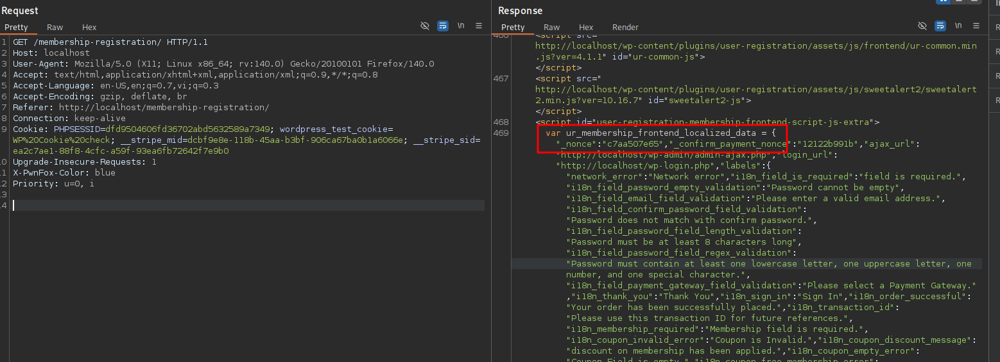

<!--more-->

## CVE & Basic Info
Plugin WordPress **User Registration & Membership** phiên bản **trước 4.1.2** **không ngăn chặn người dùng tự thiết lập vai trò tài khoản** khi **Membership Addon được kích hoạt**, dẫn đến **lỗ hổng leo thang đặc quyền** và cho phép **người dùng chưa xác thực** giành được **quyền quản trị (admin)**.

* **CVE ID**: [CVE-2025-2563](https://www.cve.org/CVERecord?id=CVE-2025-2563)
* **Vulnerability Type**: Privilege Escalation
* **Affected Versions**: <= 4.1.1
* **Patched Versions**: 4.1.2
* **CVSS severity**: High (9.8)
* **Required Privilege**: Unauthenticated
* **Product**: [WordPress User Registration Plugin](https://wordpress.org/plugins/user-registration/)

## Requirements
* **Local WordPress & Debugging**
    * [Virtual Machine](https://w41bu1.github.io/posts/2025-08-21-wordpress-local-and-debugging/)
    * [Docker](https://w41bu1.github.io/posts/2025-10-22-wordpress-local-and-debugging-docker/)
* **Plugin Version** - **User Registration**:  
    * `4.1.1` – **vulnerable**  
    * `4.1.2` – **patched**
* **Diff Tool (diff)** → [**Meld**](https://meldmerge.org/) hoặc bất kỳ công cụ diff nào.

## Analysis 
Plugin đã đăng ký một loạt các action hook:

```php {title="AJAX.php v4.1.1" data-open=true hl_lines=[12,23,26]}
public static function add_ajax_events() {
    $ajax_events = array(
        'create_membership'          => false,
        'update_membership'          => false,
        'delete_memberships'         => false,
        'update_membership_status'   => false,
        'create_member'              => false,
        'update_member'              => false,
        'delete_members'             => false,
        'confirm_payment'            => true,
        'create_stripe_subscription' => true,
        'register_member'            => true,
        'validate_coupon'            => true,
        'cancel_subscription'        => false,
        'get_group_memberships'      => false,
        'create_membership_group'    => false,
        'delete_membership_groups'   => false,
        'verify_pages'               => false,
        'validate_pg'                => false,
    );
    foreach ( $ajax_events as $ajax_event => $nopriv ) {
        add_action( 'wp_ajax_user_registration_membership_' . $ajax_event, array( __CLASS__, $ajax_event ) );
        if ( $nopriv ) {

            add_action(
                'wp_ajax_nopriv_user_registration_membership_' . $ajax_event,
                array(
                    __CLASS__,
                    $ajax_event,
                )
            );
        }
    }
}
```

Trong danh sách `$ajax_events`, action **`register_member`** được đánh dấu `true`:

```php
'register_member' => true,
```

Điều này có nghĩa là plugin đăng ký cả:

```php
wp_ajax_user_registration_membership_register_member
wp_ajax_nopriv_user_registration_membership_register_member
```

* `wp_ajax_*` → cho người dùng đã đăng nhập
* `wp_ajax_nopriv_*` → cho người dùng **chưa đăng nhập (unauthenticated)**

Vì vậy, **bất kỳ ai cũng có thể gửi request tới endpoint này**, kể cả attacker chưa xác thực. 

Khi request được gửi đến endpoint `/wp-admin/admin-ajax.php` với param `action=user_registration_membership_register_member` thì callback `register_member` được gọi:

```php {title="AJAX.php v4.1.1" data-open=true hl_lines=[2,11,22]}
public static function register_member() {
    ur_membership_verify_nonce( 'ur_members_frontend' ); // nonce verification.
    if ( ! isset( $_POST['members_data'] ) ) {
        wp_send_json_error(
            array(
                'message' => __( 'Field members data is required.', 'user-registration' ),
            )
        );
    }

    $data = apply_filters( 'user_registration_membership_before_register_member', isset( $_POST['members_data'] ) ? (array) json_decode( wp_unslash( $_POST['members_data'] ), true ) : array() );

    if ( ! isset( $data['username'] ) ) {
        wp_send_json_error(
            array(
                'message' => __( 'Field username is required.', 'user-registration' ),
            )
        );
    }

    $membership_service      = new MembershipService();
    $response                = $membership_service->create_membership_order_and_subscription( $data );
    ...
}
```

Hàm `register_member()` thực hiện kiểm tra **nonce** bằng cách gọi:

```php
ur_membership_verify_nonce( 'ur_members_frontend' );
```

Khi tìm kiếm với từ khóa `ur_members_frontend`, có thể thấy **nonce được tạo với key `_nonce`** thuộc đối tượng **`ur_membership_frontend_localized_data`**.


Key và value này được thêm vào **response khi truy cập endpoint `/membership-registration/`**.



> [!NOTE]
> Mặc định, endpoint **`/membership-registration/`** chỉ hỗ trợ đăng ký tài khoản và **chưa thể đăng ký membership** nếu module **Membership** chưa được kích hoạt.
> Để sử dụng đầy đủ chức năng, cần truy cập **`/wp-admin/admin.php?page=user-registration-dashboard#/features`** và bật module **Membership**.

Sau khi kiểm tra **nonce**, hàm sẽ lấy dữ liệu từ **`$_POST['members_data']`**, thực hiện **`json_decode`**, chuyển thành **mảng** và gán vào biến **`$data`**:

```php
$data = apply_filters(
    'user_registration_membership_before_register_member',
    isset( $_POST['members_data'] )
        ? (array) json_decode( wp_unslash( $_POST['members_data'] ), true )
        : array()
);
```

Nếu **`$data['username']`** tồn tại, hàm sẽ tiếp tục gọi **`create_membership_order_and_subscription()`** để xử lý đăng ký thành viên.

```php {title="MembershipService.php v4.1.1" data-open=true hl_lines=[4,8]}
public function create_membership_order_and_subscription( $data ) {
    try {
        $this->members_repository->wpdb()->query( 'START TRANSACTION' ); // Start the transaction.
        $members_data = $this->members_service->prepare_members_data( $data );
        $member       = get_user_by( 'login', $data['username'] );

        //update user source and add membership_role
        $this->members_service->update_user_meta( $members_data, $member->ID );
        ...
    } catch ( Exception $e ) {
        ...
    }
}
```

Trong hàm `create_membership_order_and_subscription()`, dữ liệu người dùng được xử lý thông qua `prepare_members_data( $data )`:

```php {title="MembersService.php v4.1.1" data-open=true hl_lines=[7,32]}
public function prepare_members_data( $data ) {
    if ( ! isset( $data['role'] ) ) {
        $membership_details = $this->membership_repository->get_single_membership_by_ID( absint( $data['membership'] ) );
        $membership_meta    = json_decode( $membership_details['meta_value'], true );
        $data['role']       = $membership_meta['role'] ?? 'subscriber';
    }
    $role = $data['role'] ?? 'subscriber';

    $coupon_details = array();
    if ( isset( $data['coupon'] ) && ! empty( $data['coupon'] ) && ur_check_module_activation( 'coupon' ) ) {
        $coupon_details = ur_get_coupon_details( sanitize_text_field( $data['coupon'] ) );
    }

    $user_data = array(
        'user_login'    => !empty( $data['username']) ? sanitize_text_field( $data['username'] ) : '',
        'user_email'    => !empty($data['email']) ?  sanitize_email( $data['email'] ) : '',
        'user_pass'     => !empty($data['password']) ? $data['password'] : '',
        'user_nicename' => (!empty($data['firstname']) && !empty($data['lastname'])) ? sanitize_text_field( $data['firstname'] ) . ' ' . sanitize_text_field( $data['lastname'] ) : '',
        'display_name'  => !empty($data['username']) ? sanitize_text_field( $data['username'] ) : '',
        'first_name'    => !empty($data['firstname']) ? sanitize_text_field( $data['firstname'] ) : '',
        'last_name'     => !empty($data['lastname']) ? sanitize_text_field( $data['lastname'] ) : '',
        'user_status'   => isset( $data['member_status'] ) ? absint( $data['member_status'] ) : 1,
    );

    $membership_data = array(
        'membership'     => absint( $data['membership'] ),
        'start_date'     => date( 'Y-m-d', strtotime( $data['start_date'] ) ),
        'payment_method' => sanitize_text_field( $data['payment_method'] ?? '' ),
    );

    return array(
        'role'            => sanitize_text_field( $role ),
        'membership_data' => $membership_data,
        'coupon_data'     => $coupon_details,
        'user_data'       => $user_data
    );
}
```

Nếu **`$data['role']` không tồn tại**, hệ thống sẽ lấy role từ **metadata của gói membership**:

```php
$data['role'] = $membership_meta['role'] ?? 'subscriber';
```

Ngược lại, nếu **`$data['role']` được truyền từ request**, giá trị này sẽ được sử dụng trực tiếp:

```php
$role = $data['role'] ?? 'subscriber';
```

Sau đó role được đưa vào dữ liệu trả về:

```php
return array(
    'role' => sanitize_text_field( $role ),
    ...
);
```

Điều này đồng nghĩa với việc **người dùng có thể tự truyền tham số `role` trong request** và **ghi đè role mặc định**, dẫn đến khả năng **tự gán quyền cao hơn (ví dụ: administrator)**.

Sau đó hệ thống lấy thông tin user bằng:

```php
$member = get_user_by( 'login', $data['username'] );
```

Tiếp theo, hàm gọi `update_user_meta()` để cập nhật **user meta** và **membership_role** cho người dùng:

```php {title="MembersService.php v4.1.1" data-open=true hl_lines=[4]}
public function update_user_meta( $data, $new_user_id ) {
    $user = new \WP_User( $new_user_id );
    update_user_meta( $new_user_id, 'ur_registration_source', 'membership' );
    $user->set_role( $data['role'] );
    if ( ! empty( $data['coupon_data'] ) ) {
        update_user_meta( $new_user_id, 'ur_coupon_discount_type', $data['coupon_data']['coupon_discount_type'] );
        update_user_meta( $new_user_id, 'ur_coupon_discount', $data['coupon_data']['coupon_discount'] );
    }

    return $user;
}
```

Hàm `update_user_meta` tạo đổi tượng `WP_User` tương ứng với `id=$new_user_id`, Thiết lập role cho user trực tiếp từ dữ liệu đầu vào:

```php
$user->set_role( $data['role'] );
```

Không có bất kỳ bước kiểm tra, giới hạn hoặc whitelist role hợp lệ nào trước khi gán role => **Privilege Escalation** xảy ra.

> [!NOTE]
> Khi thực hiện submit form đăng ký member từ endpoint `/membership-registration/`
> * Request đầu tiên sẽ thực hiện đăng ký user với action `user_registration_user_form_submit`
> * Sau đó request với action `user_registration_membership_register_member` được gọi để đăng ký membership

Bản vá đã **loại bỏ hoàn toàn việc lấy role từ dữ liệu người dùng gửi lên**.

Trong hàm `prepare_members_data()` mới, role được xác định **chỉ từ metadata của membership trong database**:

```php
$membership_details = $this->membership_repository->get_single_membership_by_ID( absint( $data['membership'] ) );
$membership_meta    = json_decode( $membership_details['meta_value'], true );
$role               = isset( $membership_meta['role'] ) ? $membership_meta['role'] : 'subscriber';
```

Không còn sử dụng `$data['role']`, do đó **người dùng không thể tự truyền role để ghi đè**.

Hàm `get_single_membership_by_ID()` truy vấn trực tiếp database để lấy thông tin membership và `meta_value` tương ứng với `meta_key = 'ur_membership'`, đảm bảo role được lấy từ **nguồn dữ liệu tin cậy (server-side)**.

Kết quả: **lỗ hổng leo thang đặc quyền đã được khắc phục**, vì role chỉ có thể được cấu hình bởi quản trị viên khi tạo membership, không còn bị điều khiển bởi request từ client.
 
## Flow

flowchart TD
A["Attacker (Unauthenticated)"]
--> B["Access /membership-registration/ to obtain nonce"]

B --> C["Nonce (_nonce) returned in ur_membership_frontend_localized_data"]

C --> D["Submit registration form"]
D --> E["Request sent to /wp-admin/admin-ajax.php action=user_registration_user_form_submit"]
E --> F["User account created"]

F --> G["Second request sent to /wp-admin/admin-ajax.php action=user_registration_membership_register_member"]

G --> H["Attacker intercepts request and injects role=administrator into members_data"]

H --> I["register_member() verifies nonce only"]

I --> J["prepare_members_data() trusts client-supplied role"]

J --> K["update_user_meta() calls WP_User::set_role(role)"]

K --> L["New account is assigned Administrator role"]

L --> M["Attacker logs in with newly created account"]

M --> N["Full administrative privileges obtained"]


## Proof of Concept (PoC)
1. Truy cập endpoint đăng ký membership (`/membership-registration/`) và tiến hành đăng ký, bật **Burp Intercept** để chặn request.
2. Forward các request cho đến khi gặp request có action **`user_registration_membership_register_member`**, sau đó chỉnh sửa tham số **`members_data`** bằng cách thêm **`"role":"administrator"`**:

```json
{"membership":"406","total":"0","payment_method":"free","start_date":"2026-1-7","username":"hacker","role":"administrator"}
```

3. Forward request đã chỉnh sửa.
4. Đăng nhập bằng tài khoản vừa tạo và kiểm tra quyền truy cập.

## Conclusion

CVE-2025-2563 xuất phát từ việc plugin cho phép endpoint AJAX công khai xử lý đăng ký membership nhưng **tin tưởng trực tiếp dữ liệu do client gửi lên**, đặc biệt là tham số `role`. Do không có cơ chế kiểm soát hoặc whitelist role hợp lệ, attacker chưa xác thực có thể chèn giá trị `administrator` vào request và được hệ thống gán quyền quản trị thông qua `WP_User::set_role()`.
Bản vá ở phiên bản 4.1.2 đã khắc phục triệt để bằng cách **loại bỏ hoàn toàn việc lấy role từ request**, chỉ sử dụng role được cấu hình trong metadata của membership trên server, từ đó ngăn chặn khả năng leo thang đặc quyền.

## Key Takeaways

* Không bao giờ tin tưởng dữ liệu đầu vào từ client cho các thuộc tính nhạy cảm như **role / privilege**.
* Các endpoint công khai (`wp_ajax_nopriv_*`) cần được đánh giá kỹ về **quyền truy cập và phạm vi tác động**.
* Nonce chỉ giúp chống CSRF, **không thay thế cho kiểm soát phân quyền và validate dữ liệu**.
* Luôn áp dụng **server-side validation và whitelist** cho các giá trị ảnh hưởng đến quyền hạn hệ thống.
* Việc so sánh diff giữa các phiên bản là phương pháp hiệu quả để xác định **nguyên nhân gốc rễ và cách bản vá xử lý lỗ hổng**.

## References
[Privilege Escalation](https://patchstack.com/academy/wordpress/vulnerabilities/privilege-escalation/)

[WordPress User Registration Plugin < 4.1.2 is vulnerable to a high priority Privilege Escalation](https://patchstack.com/database/wordpress/plugin/user-registration/vulnerability/wordpress-user-registration-membership-plugin-4-1-2-unauthenticated-privilege-escalation-vulnerability) 