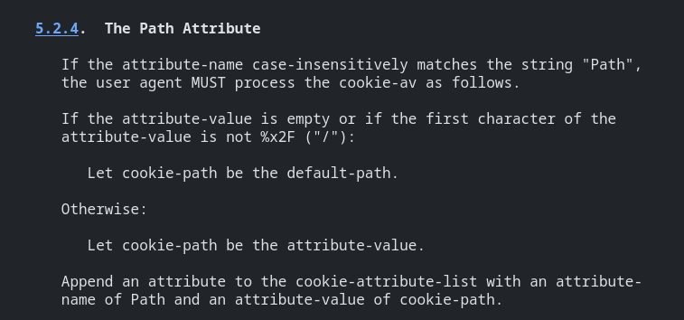
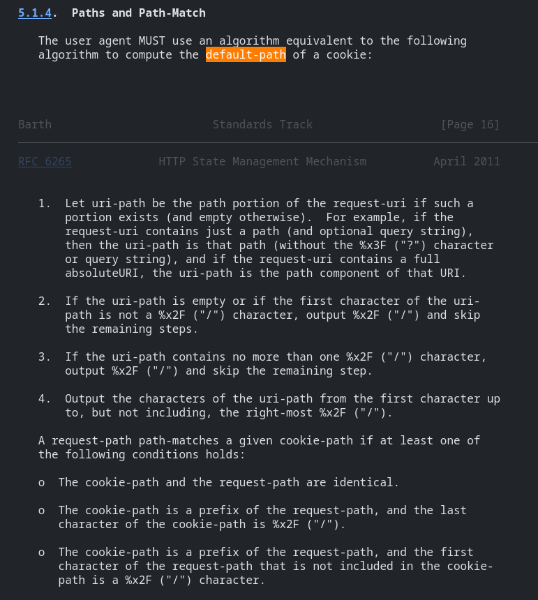
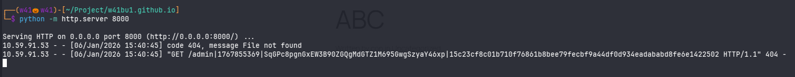

# CVE-2025-7654 Analysis & POC


<!--more-->

## CVE & Basic Info

Multiple **FunnelKit** plugins across different versions contain a **sensitive information disclosure** vulnerability that can lead to **privilege escalation** via the **WooFunnels** library.
This vulnerability allows **authenticated users with Contributor privileges or higher** to access and abuse a function in the WooFunnels library to **extract sensitive information**, including **authentication cookies** of other users.

* **CVE ID**: [CVE-2025-7654](https://www.cve.org/CVERecord?id=CVE-2025-7654)
* **Vulnerability Type**: Privilege Escalation
* **Affected Versions**: <= 3.11.0.2
* **Patched Versions**: 3.11.1
* **CVSS severity**: Medium (8.8)
* **Required Privilege**: Contributor
* **Product**: [WordPress Funnel Builder by FunnelKit Plugin](https://wordpress.org/plugins/ultimate-post/)

## Requirements

* **Local WordPress & Debugging**

  * [Virtual Machine](https://w41bu1.github.io/posts/2025-08-21-wordpress-local-and-debugging/)
  * [Docker](https://w41bu1.github.io/posts/2025-10-22-wordpress-local-and-debugging-docker/)
* **Plugin Version** – **Funnel Builder by FunnelKit**:

  * `3.11.0.2` – **vulnerable**
  * `3.12.0` – **patched**
* **WooCommerce Plugin** → [**WooCommerce**](https://wordpress.org/plugins/woocommerce/)
* **Diff Tool (diff)** → [**Meld**](https://meldmerge.org/) or any diff tool.

> [!NOTE]
>
> * Although the CVE disclosure states that the issue was fixed in version `3.11.1`, in practice the fix was only fully applied starting from version `3.12.0`.
> * The plugin **requires WooCommerce to operate**, as it is **directly integrated with and dependent on WooCommerce**; it can only be activated when **WooCommerce** is installed and activated.

## Analysis

The plugin registers the following shortcodes:

```php {title="class-bwf-data-tags.php v3.11.0.2" hl_lines=[2,8] data-open=true}
public $shortcodes = array(
    'get_cookie',
    'get_url_parameter',
);

public function __construct() {
    foreach ( $this->shortcodes as $code ) {
        add_shortcode( 'wf_' . $code, array( $this, $code ) );
    }
}
```
With this configuration, the plugin creates two shortcodes mapped to two callback functions:

* Shortcode `wf_get_cookie` → callback `get_cookie`
* Shortcode `wf_get_url_parameter` → callback `get_url_parameter`

Among these, the `wf_get_cookie` shortcode is directly related to the security issue.

When this shortcode is embedded into a post or page, the `get_cookie` callback is invoked:

```php {title="class-bwf-data-tags.php v3.11.0.2" hl_lines=[2,8] data-open=true}
public function get_cookie( $attr ) {
    $attr = shortcode_atts( array(
        'key' => '',
    ), $attr );

    if ( empty( $attr['key'] ) ) {
        return '';
    }

    $data = isset( $_COOKIE[ $attr['key'] ] ) ? bwf_clean( $_COOKIE[ $attr['key'] ] ) : '';

    /*** read cookie when drop cookie on page **/
    if ( empty( $data ) ) {
        $key  = str_replace( 'bwf_', '', $attr['key'] );
        $data = isset( $_GET[ $key ] ) ? bwf_clean( $_GET[ $key ] ) : '';
    }

    return $data;
}
```

The `get_cookie` function allows direct reading of cookie values from the global `$_COOKIE` variable and assigns them to `$data`. **If `$data` is not empty**, the function completely skips the `$_GET` branch and **returns the cookie value directly**.

For example, when the following shortcode is embedded in a post:

```text
[wf_get_cookie key='wordpress_logged_in_86a9106ae65537651a8e456835b316ab']
```

When a **logged-in user** visits this post, the shortcode is processed server-side and the value of the cookie `wordpress_logged_in_86a9106ae65537651a8e456835b316ab` belonging to **the visiting user** is rendered directly into the post content.


At first glance, this may appear “harmless”, since each user only sees **their own** cookie. However, the problem is that shortcodes are not limited to rendering text; they can also be embedded inside **HTML attributes**.

An attacker with **Contributor** privileges can inject the shortcode into the `src` attribute of an `` tag as follows:

```html

```

When an **administrator** logs in and opens this post, the shortcode is processed and the admin’s login cookie is directly injected into the image URL. The browser then sends a request to the attacker’s server, unintentionally carrying the **admin authentication cookie** within the URL.

👉 At this point, the cookie is no longer “only visible to the viewer”, but has been **exfiltrated externally**, enabling account takeover and privilege escalation.

However, it is important to identify which cookie is actually valuable for exploitation.


When a user successfully logs into WordPress, the system sets two main authentication cookies:

* `wordpress_86a9106ae65537651a8e456835b316ab`: applies to `/wp-content/plugins` and `/wp-admin`
* `wordpress_logged_in_86a9106ae65537651a8e456835b316ab`: applies to `/`

The string `86a9106ae65537651a8e456835b316ab` is a **hash derived from the site URL**, specifically `md5('http://localhost')`.

---

According to [RFC 6265](https://datatracker.ietf.org/doc/html/rfc6265#section-5.2.4), section **5.2.4 – Path Attribute**, this standard defines how browsers handle the `Path` attribute of cookies:



This means:

* The `Path` attribute defines the **URL path scope** for which a cookie will be included in HTTP requests.
* **Path attribute recognition**: If the attribute name (case-insensitive) is `Path`, the browser must process it according to the following rules.

  * **If `Path` is empty or invalid** (does not start with `/`):
    The browser assigns the cookie-path to the **default-path**, derived from the URL that created the cookie.

    

    According to section **5.1.4 – Paths and Path-Match** of RFC 6265, the `default-path` is computed as follows:

    * `uri-path`: the path component of the request URI (excluding the query string).
    * If `uri-path` is empty or does not start with `/`, the default-path is `/`.
    * If `uri-path` contains only `/`, the default-path is `/`.
    * Otherwise, the default-path is the substring of `uri-path` up to, but not including, the rightmost `/`.

  * **If `Path` is valid** (starts with `/`):
    The browser uses this value directly as the cookie’s scope.
* After determining the cookie-path, the browser stores the cookie with the corresponding `Path` attribute and only sends it with requests whose URL paths match.

---

The attack scenario for this vulnerability can occur in two cases:

* The administrator accesses an **unpublished post** via the endpoint `/?p=354&preview=true`.
* The administrator accesses a **published post** via the endpoint `/post-slug`.

In both cases, **only the `wordpress_logged_in_86a9106ae65537651a8e456835b316ab` cookie is sent with the request**, because this cookie is set with `Path=/` and applies to the entire website.

Therefore, the attacker does not obtain the `wordpress_86a9106ae65537651a8e456835b316ab` cookie required for direct access to `/wp-admin`.

However, the attacker can still abuse the `wordpress_logged_in_86a9106ae65537651a8e456835b316ab` cookie to gain admin access through another path.

When **FunnelKit** is set up together with **WooCommerce**, the endpoint `/my-account/edit-account/` is used as a frontend page that allows **logged-in users** to edit their account information. On this page, the `wordpress_logged_in_*` cookie is always included in requests due to `Path=/`.


Notably, when changing the account email address, the system **does not require password re-entry or additional verification**. This can be abused to **change the admin’s email address to one controlled by the attacker**. The attacker can then use the **forgot password** function to reset the password and log in as an administrator.

---

The patch in **v3.12.0** mitigates the issue by **restricting access to sensitive cookies through the `wf_get_cookie` shortcode**.

Specifically, the plugin introduces a list of blocked cookie patterns via the variable:

```php
public $restricted_cookie_pattern = "/^(wordpress_.*|_fk_contact_uid|wp-settings-.*|PHPSESSID|wordpress_logged_in_.*|wp_woocommerce_session_.*)$/";
```

Inside the `get_cookie` function, before reading from `$_COOKIE`, the plugin performs a check:

```php
if (preg_match($this->restricted_cookie_pattern, $attr['key'])) {
    return '';
}
```

This means that if the cookie key matches sensitive patterns such as:

* `wordpress_*`
* `wordpress_logged_in_*`
* `wp-settings-*`
* `PHPSESSID`
* `wp_woocommerce_session_*`

the function **returns an empty value** and **does not allow the cookie to be read**.

As a result, the `wf_get_cookie` shortcode can no longer access WordPress or WooCommerce authentication cookies, **completely preventing cookie leakage and privilege escalation scenarios** exploited in previous versions.

## Flow


flowchart TD
A["Attacker (Contributor)"]
--> B["Create / Edit Post"]

B --> C["Insert shortcode wf_get_cookie into HTML attribute (img src)"]
C --> D["Post saved (draft or published)"]

D --> E["Admin visits post (preview or published URL)"]
E --> F["WordPress processes shortcode server-side"]

F --> G["wf_get_cookie reads wordpress_logged_in_* from $_COOKIE"]
G --> H["Cookie value rendered into HTML output"]

H --> I["Browser loads external resource (attacker.com)"]
I --> J["Admin authentication cookie leaked via URL"]

J --> K["Attacker captures wordpress_logged_in_* cookie"]
K --> L["Attacker sets stolen cookie in browser"]

L --> M["Access /my-account/edit-account/ as Admin"]
M --> N["Change admin email without re-authentication"]

N --> O["Trigger forgot password flow"]
O --> P["Reset password via attacker-controlled email"]

P --> Q["Full admin account takeover"]


## Proof of Concept (PoC)

1. Log in with a **Contributor** account and create a new post with the following content:

   ```
   
   ```

2. When an administrator visits this post, the browser sends a request to `attacker.com` containing the cookie value rendered in the URL. The attacker captures this cookie from the request.



3. The attacker accesses the endpoint `/my-account/edit-account/` and replaces their own `wordpress_logged_in_*` cookie with the stolen admin cookie.

4. Change the account email address to one controlled by the attacker.

5. Use the **forgot password** function to set a new password.

6. Log in again with **admin** privileges using the new password.

## Conclusion

CVE-2025-7654 originates from the `wf_get_cookie` shortcode allowing unrestricted access to authentication cookies, leading to leakage of `wordpress_logged_in_*` and enabling privilege escalation. Embedding shortcodes in HTML attributes turns data rendering into an exfiltration channel. The v3.12.0 patch mitigates this by blocking sensitive cookie patterns.

## Key Takeaways

* Shortcodes that read cookies are inherently dangerous.
* HTML attribute injection can lead to authentication data leakage.
* Contributors can still be effective privilege escalation vectors.
* The `wordpress_logged_in_*` cookie is sufficient for indirect account takeover.
* Always verify actual code changes rather than relying solely on patch announcements.

## References

[Privilege Escalation](https://patchstack.com/academy/wordpress/vulnerabilities/privilege-escalation/)

[WordPress Funnel Builder by FunnelKit Plugin <= 3.11.0.2 is vulnerable to a medium priority Privilege Escalation](https://patchstack.com/database/wordpress/plugin/funnel-builder/vulnerability/wordpress-funnelkit-plugin-3-11-0-2-privilege-escalation-vulnerability)


---

> Author: [Bui Van Y](github.com/w41bu1)  
> URL: http://localhost:1313/posts/2026-01-06-cve-2025-7654/  

