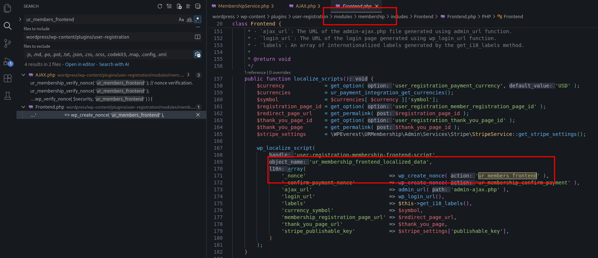

# CVE-2025-2563 Analysis & POC


<!--more-->

## CVE & Basic Info

The WordPress **User Registration & Membership** plugin **prior to version 4.1.2** **does not prevent users from setting their own account role** when the **Membership Addon is enabled**, leading to a **privilege escalation vulnerability** that allows **unauthenticated users** to gain **administrator privileges**.

* **CVE ID**: [CVE-2025-2563](https://www.cve.org/CVERecord?id=CVE-2025-2563)
* **Vulnerability Type**: Privilege Escalation
* **Affected Versions**: <= 4.1.1
* **Patched Versions**: 4.1.2
* **CVSS severity**: High (9.8)
* **Required Privilege**: Unauthenticated
* **Product**: [WordPress User Registration Plugin](https://wordpress.org/plugins/user-registration/)

## Requirements

* **Local WordPress & Debugging**

  * [Virtual Machine](https://w41bu1.github.io/posts/2025-08-21-wordpress-local-and-debugging/)
  * [Docker](https://w41bu1.github.io/posts/2025-10-22-wordpress-local-and-debugging-docker/)
* **Plugin Version – User Registration**

  * `4.1.1` – **vulnerable**
  * `4.1.2` – **patched**
* **Diff Tool (diff)** → **Meld** or any diff tool.

## Analysis

The plugin registers multiple AJAX action hooks.

```php {title="AJAX.php v4.1.1" data-open=true hl_lines=[12,23,26]}
public static function add_ajax_events() {
    $ajax_events = array(
        'create_membership'          => false,
        'update_membership'          => false,
        'delete_memberships'         => false,
        'update_membership_status'   => false,
        'create_member'              => false,
        'update_member'              => false,
        'delete_members'             => false,
        'confirm_payment'            => true,
        'create_stripe_subscription' => true,
        'register_member'            => true,
        'validate_coupon'            => true,
        'cancel_subscription'        => false,
        'get_group_memberships'      => false,
        'create_membership_group'    => false,
        'delete_membership_groups'   => false,
        'verify_pages'               => false,
        'validate_pg'                => false,
    );
    foreach ( $ajax_events as $ajax_event => $nopriv ) {
        add_action( 'wp_ajax_user_registration_membership_' . $ajax_event, array( __CLASS__, $ajax_event ) );
        if ( $nopriv ) {

            add_action(
                'wp_ajax_nopriv_user_registration_membership_' . $ajax_event,
                array(
                    __CLASS__,
                    $ajax_event,
                )
            );
        }
    }
}
```

In the `$ajax_events` list, the **`register_member`** action is marked as `true`:

```php
'register_member' => true,
```

This means the plugin registers both:

```php
wp_ajax_user_registration_membership_register_member
wp_ajax_nopriv_user_registration_membership_register_member
```

* `wp_ajax_*` → for authenticated users
* `wp_ajax_nopriv_*` → for **unauthenticated users**

Therefore, **anyone can send requests to this endpoint**, including unauthenticated attackers.

When a request is sent to `/wp-admin/admin-ajax.php` with the parameter `action=user_registration_membership_register_member`, the callback `register_member()` is executed.

```php {title="AJAX.php v4.1.1" data-open=true hl_lines=[2,11,22]}
public static function register_member() {
    ur_membership_verify_nonce( 'ur_members_frontend' ); // nonce verification.
    if ( ! isset( $_POST['members_data'] ) ) {
        wp_send_json_error(
            array(
                'message' => __( 'Field members data is required.', 'user-registration' ),
            )
        );
    }

    $data = apply_filters( 'user_registration_membership_before_register_member', isset( $_POST['members_data'] ) ? (array) json_decode( wp_unslash( $_POST['members_data'] ), true ) : array() );

    if ( ! isset( $data['username'] ) ) {
        wp_send_json_error(
            array(
                'message' => __( 'Field username is required.', 'user-registration' ),
            )
        );
    }

    $membership_service      = new MembershipService();
    $response                = $membership_service->create_membership_order_and_subscription( $data );
    ...
}
```

The `register_member()` function verifies the **nonce** by calling:

```php
ur_membership_verify_nonce( 'ur_members_frontend' );
```

By searching for the keyword `ur_members_frontend`, it can be seen that the **nonce is generated with the key `_nonce`** in the object **`ur_membership_frontend_localized_data`**.



The key and value are included in the **response when accessing the endpoint `/membership-registration/`**.


> [!NOTE]
> By default, the **`/membership-registration/`** endpoint only supports user registration and **cannot register memberships** unless the **Membership** module is enabled.
> To enable it, navigate to **`/wp-admin/admin.php?page=user-registration-dashboard#/features`** and activate the **Membership** module.

After nonce verification, the function retrieves data from **`$_POST['members_data']`**, performs **`json_decode`**, converts it into an array, and assigns it to the variable **`$data`**.

```php
$data = apply_filters(
    'user_registration_membership_before_register_member',
    isset( $_POST['members_data'] )
        ? (array) json_decode( wp_unslash( $_POST['members_data'] ), true )
        : array()
);
```

If **`$data['username']`** exists, the function continues by calling **`create_membership_order_and_subscription()`**.

```php {title="MembershipService.php v4.1.1" data-open=true hl_lines=[4,8]}
public function create_membership_order_and_subscription( $data ) {
    try {
        $this->members_repository->wpdb()->query( 'START TRANSACTION' ); // Start the transaction.
        $members_data = $this->members_service->prepare_members_data( $data );
        $member       = get_user_by( 'login', $data['username'] );

        //update user source and add membership_role
        $this->members_service->update_user_meta( $members_data, $member->ID );
        ...
    } catch ( Exception $e ) {
        ...
    }
}
```

Inside `create_membership_order_and_subscription()`, user data is processed by calling `prepare_members_data( $data )`.

```php {title="MembersService.php v4.1.1" data-open=true hl_lines=[7,32]}
public function prepare_members_data( $data ) {
    if ( ! isset( $data['role'] ) ) {
        $membership_details = $this->membership_repository->get_single_membership_by_ID( absint( $data['membership'] ) );
        $membership_meta    = json_decode( $membership_details['meta_value'], true );
        $data['role']       = $membership_meta['role'] ?? 'subscriber';
    }
    $role = $data['role'] ?? 'subscriber';

    $coupon_details = array();
    if ( isset( $data['coupon'] ) && ! empty( $data['coupon'] ) && ur_check_module_activation( 'coupon' ) ) {
        $coupon_details = ur_get_coupon_details( sanitize_text_field( $data['coupon'] ) );
    }

    $user_data = array(
        'user_login'    => !empty( $data['username']) ? sanitize_text_field( $data['username'] ) : '',
        'user_email'    => !empty($data['email']) ?  sanitize_email( $data['email'] ) : '',
        'user_pass'     => !empty($data['password']) ? $data['password'] : '',
        'user_nicename' => (!empty($data['firstname']) && !empty($data['lastname'])) ? sanitize_text_field( $data['firstname'] ) . ' ' . sanitize_text_field( $data['lastname'] ) : '',
        'display_name'  => !empty($data['username']) ? sanitize_text_field( $data['username'] ) : '',
        'first_name'    => !empty($data['firstname']) ? sanitize_text_field( $data['firstname'] ) : '',
        'last_name'     => !empty($data['lastname']) ? sanitize_text_field( $data['lastname'] ) : '',
        'user_status'   => isset( $data['member_status'] ) ? absint( $data['member_status'] ) : 1,
    );

    $membership_data = array(
        'membership'     => absint( $data['membership'] ),
        'start_date'     => date( 'Y-m-d', strtotime( $data['start_date'] ) ),
        'payment_method' => sanitize_text_field( $data['payment_method'] ?? '' ),
    );

    return array(
        'role'            => sanitize_text_field( $role ),
        'membership_data' => $membership_data,
        'coupon_data'     => $coupon_details,
        'user_data'       => $user_data
    );
}
```

If **`$data['role']`** does not exist, the system retrieves the role from the **membership metadata**.

```php
$data['role'] = $membership_meta['role'] ?? 'subscriber';
```

If **`$data['role']`** is provided in the request, that value is used directly.

```php
$role = $data['role'] ?? 'subscriber';
```

The role is then included in the returned data.

```php
return array(
    'role' => sanitize_text_field( $role ),
    ...
);
```

This means that **an attacker can inject the `role` parameter in the request and override the default role**, allowing them to assign a higher-privileged role such as **administrator**.

Next, the system retrieves the user object and calls `update_user_meta()` to update the user metadata and role.

```php {title="MembersService.php v4.1.1" data-open=true hl_lines=[4]}
public function update_user_meta( $data, $new_user_id ) {
    $user = new \WP_User( $new_user_id );
    update_user_meta( $new_user_id, 'ur_registration_source', 'membership' );
    $user->set_role( $data['role'] );
    if ( ! empty( $data['coupon_data'] ) ) {
        update_user_meta( $new_user_id, 'ur_coupon_discount_type', $data['coupon_data']['coupon_discount_type'] );
        update_user_meta( $new_user_id, 'ur_coupon_discount', $data['coupon_data']['coupon_discount'] );
    }

    return $user;
}
```

The `update_user_meta()` function assigns the role directly using:

```php
$user->set_role( $data['role'] );
```

There is **no validation, restriction, or whitelist** applied to the role value, which results in a **Privilege Escalation** vulnerability.

> **Note:** When submitting the membership registration form from `/membership-registration/`:
>
> * The first request creates the user account with the action `user_registration_user_form_submit`.
> * The second request with the action `user_registration_membership_register_member` registers the membership.

The patch **completely removes the ability to read the role from user-supplied input**.

In the updated `prepare_members_data()` function, the role is derived **only from the membership metadata stored in the database**.

```php
$membership_details = $this->membership_repository->get_single_membership_by_ID( absint( $data['membership'] ) );
$membership_meta    = json_decode( $membership_details['meta_value'], true );
$role               = isset( $membership_meta['role'] ) ? $membership_meta['role'] : 'subscriber';
```

The role is no longer taken from `$data['role']`, preventing attackers from overriding it.

The function that retrieves membership data queries the database directly, ensuring the role is obtained from a **trusted server-side source**.

As a result, **the privilege escalation vulnerability is fully mitigated**.

## Flow


flowchart TD
A["Attacker (Unauthenticated)"]
--> B["Access /membership-registration/ to obtain nonce"]

B --> C["Nonce (_nonce) returned in ur_membership_frontend_localized_data"]

C --> D["Submit registration form"]
D --> E["Request sent to /wp-admin/admin-ajax.php action=user_registration_user_form_submit"]
E --> F["User account created"]

F --> G["Second request sent to /wp-admin/admin-ajax.php action=user_registration_membership_register_member"]

G --> H["Attacker intercepts request and injects role=administrator into members_data"]

H --> I["register_member() verifies nonce only"]

I --> J["prepare_members_data() trusts client-supplied role"]

J --> K["update_user_meta() calls WP_User::set_role(role)"]

K --> L["New account is assigned Administrator role"]

L --> M["Attacker logs in with newly created account"]

M --> N["Full administrative privileges obtained"]


## Proof of Concept (PoC)

1. Access the membership registration endpoint (`/membership-registration/`) and start a registration while enabling **Burp Intercept**.
2. Forward the requests until reaching the request with the action **`user_registration_membership_register_member`**, then modify the **`members_data`** parameter by adding **`"role":"administrator"`**:

```json
{"membership":"406","total":"0","payment_method":"free","start_date":"2026-1-7","username":"hacker","role":"administrator"}
```

3. Forward the modified request.
4. Log in with the newly created account and verify the privileges.

## Conclusion

CVE-2025-2563 arises because the plugin exposes a public AJAX endpoint for membership registration and **directly trusts client-supplied input**, especially the `role` parameter. Without validation or a whitelist, an unauthenticated attacker can inject `administrator` and have the system assign elevated privileges via `WP_User::set_role()`.
Version 4.1.2 fully addresses the issue by **removing any reliance on client-provided role values** and deriving the role exclusively from trusted server-side membership metadata, effectively preventing privilege escalation.

## Key Takeaways

* Never trust client input for sensitive attributes such as **roles or privileges**.
* Public endpoints (`wp_ajax_nopriv_*`) must be carefully reviewed for **access control and impact scope**.
* Nonce mechanisms only protect against CSRF and **do not replace authorization or input validation**.
* Always enforce **server-side validation and whitelisting** for security-critical fields.
* Diffing patched versions is an effective way to identify **root causes and remediation strategies**.

## References

[Privilege Escalation](https://patchstack.com/academy/wordpress/vulnerabilities/privilege-escalation/)

[WordPress User Registration Plugin < 4.1.2 is vulnerable to a high priority Privilege Escalation](https://patchstack.com/database/wordpress/plugin/user-registration/vulnerability/wordpress-user-registration-membership-plugin-4-1-2-unauthenticated-privilege-escalation-vulnerability)

---

> Author: [Bui Van Y](github.com/w41bu1)  
> URL: http://localhost:1313/posts/2026-01-07-cve-2025-2563/  

